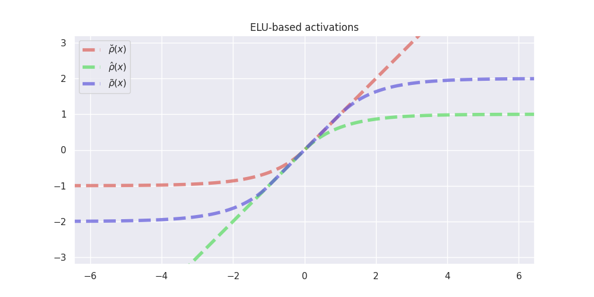
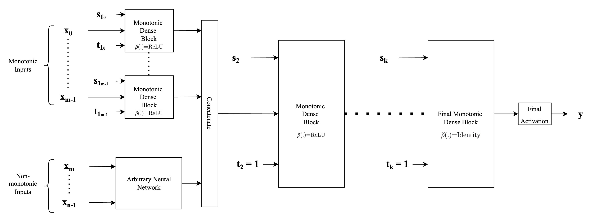

In-depth explanation
================

<!-- WARNING: THIS FILE WAS AUTOGENERATED! DO NOT EDIT! -->

## Introduction

The simplest method to achieve monotonicity by construc- tion is to
constrain the weights of the fully connected neural network to have only
non-negative (for non-decreasing vari- ables) or only non-positive
values (for non-ascending) vari- ables when used in conjunction with a
monotonic activation function, a technique known for 30 years (Archer &
Wang, 1993). When used in conjunction with saturated (bounded)
activation functions such as the sigmoid and hyperbolic tan- gent, these
models are difficult to train, i.e. they do not converge to a good
solution. On the other hand, when used with non-saturated (unbounded)
convex activation functions such as ReLU (Nair & Hinton, 2010), the
resulting models are always convex (Liu et al., 2020), severely limiting
the applicability of the method in practice.

Our main contribution is a modification of the method above which, in
conjunction with non-saturated activation func- tions, is capable of
approximating non-convex functions as well: when the original activation
function is used with additional two monotonic activation functions
constructed from it in a neural network with constrained weights, it can
approximate any monotone continuous functions. The resulting model is
guaranteed to be monotonic, can be used in conjunction with popular
convex monotonic non- saturated activation function, doesn’t have any
additional parameters compared to a non-monotonic fully-connected
network for the same task, and can be trained without any additional
requirements on the learning procedure. Experi- mental results show it
is exceeding the performance of all other state-of-the-art methods, all
while being both simpler (in the number of parameters) and easier to
train. Our contributions can be summarized as follows:

1.  A modification to an existing constrained neural net- work layer
    enabling it to model arbitrary monotonic function when used with
    non-saturated monotone con- vex activation functions such as ReLU,
    ELU, SELU, and alike.

2.  Experimental comparisons with other recent works showing that the
    proposed architecture can yield equal or better results than the
    previous state-of-the-art and with significantly fewer parameters.

3.  A proof showing that the proposed architecture can approximate any
    monotone continuous function on a compact subset of Rn for a large
    class of non-saturated activation functions.

## The problem

Most of the commonly used activation functions such as ReLU, ELU, SELU,
etc. are monotonically increasing zero-centred, convex, lower-bounded
non-polynomial functions. When used in a fully-connected, feed-forward
neural network with at least one hidden layer and with unconstrained
weights, they can approximate any continuous function on a compact
subset. The simplest way to construct a monotonic neural network is to
constrain its weights when used in conjunction with a monotone
activation function. However, when the activation function is convex as
well, the constrained neural network is not able to approximate
non-convex functions.

To better illustrate this, and to propose a simple solution in this
particular example, we refer the readers to plots below where the goal
is to approximate the simple cubic function $x^3$ using a neural network
with a single hidden layer with either $2$ or $32$ neurons and with ReLU
activation. A cubic function is apt for our illustration since it is
concave in the considered interval $[-1, 0]$ and convex in the interval
$[0, 1]$.

``` python
# # | hide

# kind = "Unconstrained ReLU"
# units = 2
# model = create_model(kind, units=units)
# model.summary()
# train_model(model, lr=0.3)
# models[(kind, units)] = model
```

<table>
<tr>
<td style="width:60%">

</td>
<td style="vertical-align:middle">

The plot to the left shows two fully-connected neural networks with one
hidden layer with 2 and 32 neurons and ReLU activations approximating
the qubic function on the interval \[-1, 1\].

An unconstrained ReLU network with n neurons can approximate both
concave and convex segments of the cubic function using at most n + 1
piecewise linear segments. Increasing the number of neurons will pro-
vide a better fit with the function being approximated. Notice that even
though the cubic function is mono- tone, there is no guarantee that the
trained model will be monotone as well.

</td>
</tr>
<tr>
<td>


</td>
<td style="vertical-align:middle">

If we constrain the weights of the network to be non- negative while
still employing ReLU activation, the resulting model is monotone and
convex. We can no longer approximate non-convex segments such as the
cubic function on \[−1, 0\] in the figure, and increasing the number of
neurons from 2 to 32 does not yield any significant improvement in the
approximation.

</td>
</tr>
<tr>
<td>


</td>
<td style="vertical-align:middle">

Our proposed solution uses a combination of three activation functions
in the hidden layer in order to gain the ability to model non-convex,
monotone continuous functions. Notice that increasing the number of neu-
rons increases the number of piecewise linear segments to approximate
the cubic function. The resulting net- work is monotone by construction
even when trained on noisy data.

</td>
</tr>
</table>

### Actvation Functions

Our construction is based on generating two additional activation
functions from a typical non-saturated activation function such as ReLU,
ELU and SELU.

We use $\breve{\mathcal{A}}$ to denote the set of all zero-centred,
monotonically increasing, convex, lower-bounded functions. Let
$\breve{\rho} \in \breve{\mathcal{A}}$. Then

$$
\hat{\rho}(x) = -\breve{\rho}(-x)
$$

$$
\tilde{\rho}(x) = \begin{cases}
      \breve{\rho}(x+1)-\breve{\rho}(1) & \text{if }x < 0\\
      \hat{\rho}(x-1)+\breve{\rho}(1) & \text{otherwise}
    \end{cases} 
$$

An example of such activation functions are given in figures below:




### Monotonicity indicator

Our construction is preconditioned on a priori knowledge of (partial)
monotonicity of a multivariate, multidimensional function $f$. Let
$f: K \mapsto \mathbb{R}^m$ be defined on a compact segment
$K \subseteq \mathbb{R}^n$. Then we define its $n$-dimensional
*monotonicity indicator vector* $\mathbf{t} = [t_1, \dots, t_n]$
element-wise as follows:

$$
    t_j= \begin{cases}
      1 & \text{if }\cfrac{\partial f(\mathbf{x})_i} {\partial x_j} \geq 0 \ 
    \text{ for each } i \in \{1, \dots , m\}\\
      -1 & \text{if }\cfrac{\partial f(\mathbf{x})_i} {\partial x_j} \leq 0 \ 
    \text{ for each } i \in \{1, \dots , m\}\\
      0 & \text{otherwise}
    \end{cases} 
    \: 
$$

Given an $(m \times n)$-dimensional matrix $\mathbf{M}$ and
$n$-dimensional monotonicity indicator vector $\mathbf{t}$, we define
the operation $|.|_{t}$ assigning an $(m \times n)$-dimensional matrix
$\mathbf{M'} = |\mathbf{M}|_{t}$ to $\mathbf{M}$ element-wise as
follows:

$$
    m'_{j,i}= \begin{cases}
      |m_{j,i}| & \text{if }t_i=1\\
      -|m_{j,i}| & \text{if }t_i=-1\\
      m_{j,i} & \text{otherwise}
    \end{cases}
$$

Below is an example of a kernel $W\in \mathbb{R}^{9 × 12}$ with 12 units
and 9 inputs before and after applying the monotonicity indicator
$t =(-1, -1, -1, 0, 0, 0, 1, 1, 1)$:


_T__after_applying_monotonicity_indicator__t=(-1,_-1,_-1,_0,_0,_0,_1,_1,_1)_.png)

### Monotonic Dense Layer

Monotonic Dense Unit
([`MonoDense`](api/airt/keras/layers/MonoDense/#airt.keras.layers.MonoDense)
class) uses weight constrains and activation functions constructed as
explained above to construct partially monotonic neural networks. The
below is the figure from the paper for reference.

In the constructor of
[`MonoDense`](api/airt/keras/layers/MonoDense/#airt.keras.layers.MonoDense)
class:

- the parameter `monotonicity_indicator` corresponds to **t** in the
  figure below, and

- parameters `is_convex`, `is_concave` and `activation_weights` are used
  to calculate the activation selector **s** as follows:

  - if `is_convex` or `is_concave` is **True**, then the activation
    selector **s** will be (`units`, 0, 0) and (0, `units`, 0),
    respecively.

  - if both `is_convex` or `is_concave` is **False**, then the
    `activation_weights` represent ratios between $\breve{s}$, $\hat{s}$
    and $\tilde{s}$, respecively. E.g. if
    `activation_weights = (2, 2, 1)` and `units = 10`, then

$$
(\breve{s}, \hat{s}, \tilde{s}) = (4, 4, 2)
$$


Bellow is an example of a batched input to `MoneDense` layer with batch
size 9 and 12 inputs features.


The figure below is an example of a kernel with 18 units and 12 input
features.

_T__in__mathbb_R___12_x_18___after_applying__t=%5B1,_1,_1,_1,_0,_0,_0,_0,_-1,_-1,_-1,_-1%5D__in__mathbb_R___12__.png)

The input $x$ is multiplied with kernel
$(|W^T|_t)^T \in \mathbb{R}^{12 × 18}$ after applying monotonicity
indicator $t \in \mathbb{R}^{12}$ to it and then the bias $b$ (initially
set to 0) is added to it:


## Architecture types

The main advantage of our proposed monotonic dense unit is its
simplicity. We can build deep neural nets with different architectures
by plugging in our monotonic dense blocks. We have two functions for
building neural networks using
[`MonoDense`](api/airt/keras/layers/MonoDense/#airt.keras.layers.MonoDense)
layer.

### Type-1 architecture

The first example shown in the figure below corresponds to the standard
MLP type of neural network architecture used in general, where each of
the input features is concatenated to form one single input feature
vector $\mathbf{x}$ and fed into the network, with the only difference
being that instead of standard fully connected or dense layers, we
employ monotonic dense units throughout. For the first (or input layer)
layer, the indicator vector $\mathbf{t}$, is used to identify the
monotonicity property of the input feature with respect to the output.
Specifically, $\mathbf{t}$ is set to $1$ for those components in the
input feature vector that are monotonically increasing and is set to
$-1$ for those components that are monotonically decreasing and set to
$0$ if the feature is non-monotonic. For the subsequent hidden layers,
monotonic dense units with the indicator vector $\mathbf{t}$ always
being set to $1$ are used in order to preserve monotonicity. Finally,
depending on whether the problem at hand is a regression problem or a
classification problem (or even a multi-task problem), an appropriate
activation function (such as linear activation or sigmoid or softmax) to
obtain the final output.


``` python
inputs = {name: Input(name=name, shape=(1,)) for name in list("abcd")}

outputs = MonoDense.create_type_1(
    inputs=inputs,
    units=64,
    final_units=10,
    activation="elu",
    n_layers=3,
    final_activation="softmax",
    monotonicity_indicator=dict(a=1, b=0, c=-1, d=0),
    dropout=0.1,
)

model = Model(inputs=inputs, outputs=outputs)
model.summary()
```

    Model: "model_6"
    __________________________________________________________________________________________________
     Layer (type)                   Output Shape         Param #     Connected to                     
    ==================================================================================================
     a (InputLayer)                 [(None, 1)]          0           []                               
                                                                                                      
     b (InputLayer)                 [(None, 1)]          0           []                               
                                                                                                      
     c (InputLayer)                 [(None, 1)]          0           []                               
                                                                                                      
     d (InputLayer)                 [(None, 1)]          0           []                               
                                                                                                      
     concatenate (Concatenate)      (None, 4)            0           ['a[0][0]',                      
                                                                      'b[0][0]',                      
                                                                      'c[0][0]',                      
                                                                      'd[0][0]']                      
                                                                                                      
     mono_dense_0 (MonoDense)       (None, 64)           320         ['concatenate[0][0]']            
                                                                                                      
     dropout (Dropout)              (None, 64)           0           ['mono_dense_0[0][0]']           
                                                                                                      
     mono_dense_1_increasing (MonoD  (None, 64)          4160        ['dropout[0][0]']                
     ense)                                                                                            
                                                                                                      
     dropout_1 (Dropout)            (None, 64)           0           ['mono_dense_1_increasing[0][0]']
                                                                                                      
     mono_dense_2_increasing (MonoD  (None, 10)          650         ['dropout_1[0][0]']              
     ense)                                                                                            
                                                                                                      
     tf.nn.softmax (TFOpLambda)     (None, 10)           0           ['mono_dense_2_increasing[0][0]']
                                                                                                      
    ==================================================================================================
    Total params: 5,130
    Trainable params: 5,130
    Non-trainable params: 0
    __________________________________________________________________________________________________

### Type-2 architecture

The figure below shows another example of a neural network architecture
that can be built employing proposed monotonic dense blocks. The
difference when compared to the architecture described above lies in the
way input features are fed into the hidden layers of neural network
architecture. Instead of concatenating the features directly, this
architecture provides flexibility to employ any form of complex feature
extractors for the non-monotonic features and use the extracted feature
vectors as inputs. Another difference is that each monotonic input is
passed through separate monotonic dense units. This provides an
advantage since depending on whether the input is completely concave or
convex or both, we can adjust the activation selection vector
$\mathbf{s}$ appropriately along with an appropriate value for the
indicator vector $\mathbf{t}$. Thus, each of the monotonic input
features has a separate monotonic dense layer associated with it. Thus
as the major difference to the above-mentioned architecture, we
concatenate the feature vectors instead of concatenating the inputs
directly. The subsequent parts of the network are similar to the
architecture described above wherein for the rest of the hidden
monotonic dense units, the indicator vector $\mathbf{t}$ is always set
to $1$ to preserve monotonicity.



``` python
inputs = {name: Input(name=name, shape=(1,)) for name in list("abcd")}
outputs = MonoDense.create_type_2(
    inputs,
    units=32,
    final_units=10,
    activation="elu",
    final_activation="softmax",
    n_layers=3,
    dropout=0.2,
    monotonicity_indicator=dict(a=1, b=0, c=-1, d=0),
    is_convex=dict(a=True, b=False, c=False, d=False),
)
model = Model(inputs=inputs, outputs=outputs)
model.summary()
```

    Model: "model_7"
    __________________________________________________________________________________________________
     Layer (type)                   Output Shape         Param #     Connected to                     
    ==================================================================================================
     a (InputLayer)                 [(None, 1)]          0           []                               
                                                                                                      
     b (InputLayer)                 [(None, 1)]          0           []                               
                                                                                                      
     c (InputLayer)                 [(None, 1)]          0           []                               
                                                                                                      
     d (InputLayer)                 [(None, 1)]          0           []                               
                                                                                                      
     mono_dense_a_increasing_convex  (None, 8)           16          ['a[0][0]']                      
      (MonoDense)                                                                                     
                                                                                                      
     dense_b (Dense)                (None, 8)            16          ['b[0][0]']                      
                                                                                                      
     mono_dense_c_decreasing (MonoD  (None, 8)           16          ['c[0][0]']                      
     ense)                                                                                            
                                                                                                      
     dense_d (Dense)                (None, 8)            16          ['d[0][0]']                      
                                                                                                      
     preprocessed_features (Concate  (None, 32)          0           ['mono_dense_a_increasing_convex[
     nate)                                                           0][0]',                          
                                                                      'dense_b[0][0]',                
                                                                      'mono_dense_c_decreasing[0][0]',
                                                                      'dense_d[0][0]']                
                                                                                                      
     mono_dense_0_convex (MonoDense  (None, 32)          1056        ['preprocessed_features[0][0]']  
     )                                                                                                
                                                                                                      
     dropout_2 (Dropout)            (None, 32)           0           ['mono_dense_0_convex[0][0]']    
                                                                                                      
     mono_dense_1_increasing_convex  (None, 32)          1056        ['dropout_2[0][0]']              
      (MonoDense)                                                                                     
                                                                                                      
     dropout_3 (Dropout)            (None, 32)           0           ['mono_dense_1_increasing_convex[
                                                                     0][0]']                          
                                                                                                      
     mono_dense_2_increasing_convex  (None, 10)          330         ['dropout_3[0][0]']              
      (MonoDense)                                                                                     
                                                                                                      
     tf.nn.softmax_1 (TFOpLambda)   (None, 10)           0           ['mono_dense_2_increasing_convex[
                                                                     0][0]']                          
                                                                                                      
    ==================================================================================================
    Total params: 2,506
    Trainable params: 2,506
    Non-trainable params: 0
    __________________________________________________________________________________________________
