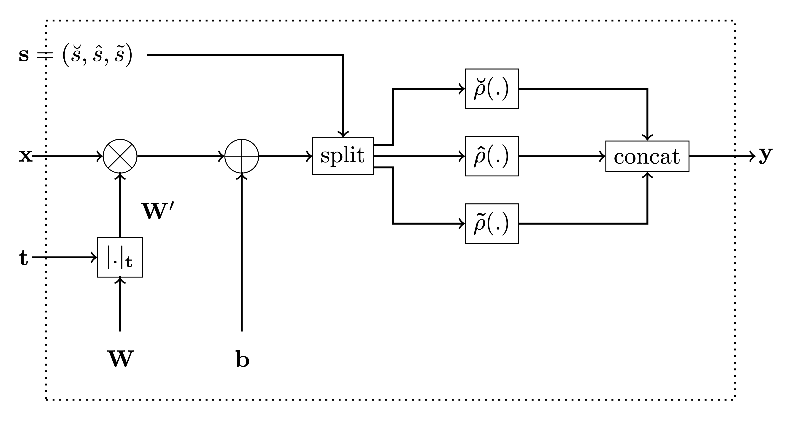

Monotonic dense layer
================

<!-- WARNING: THIS FILE WAS AUTOGENERATED! DO NOT EDIT! -->

## Imports

``` python
from os import environ
from pathlib import Path

import matplotlib
import matplotlib.pyplot as plt
import pandas as pd
import pytest
import seaborn as sns
from tensorflow.keras import Model
from tensorflow.keras.layers import Input
```

``` python
environ["TF_FORCE_GPU_ALLOW_GROWTH"] = "true"
```

## Monotonic Dense Layer

### Actvation Functions

We use $\breve{\mathcal{A}}$ to denote the set of all zero-centred,
monotonically increasing, convex, lower-bounded functions.

Let $\breve{\rho} \in \breve{\mathcal{A}}$. Then

In the code below, the following names are used for denotation of the
above functions:

- `convex_activation` denotes $\breve{\rho}$,

- `concave_activation` denotes $\hat{\rho}$, and

- `saturated_activation` denotes $\tilde{\rho}$.

------------------------------------------------------------------------

<a
href="https://github.com/airtai/monotonic-nn/blob/main/airt/_components/mono_dense_layer.py#L48"
target="_blank" style="float:right; font-size:smaller">source</a>

### get_activation_functions

>      get_activation_functions (activation:Union[str,Callable[[Union[tensorflow
>                                .python.types.core.Tensor,tensorflow.python.typ
>                                es.core.TensorProtocol,int,float,bool,str,bytes
>                                ,complex,tuple,list,numpy.ndarray,numpy.generic
>                                ]],Union[tensorflow.python.types.core.Tensor,te
>                                nsorflow.python.types.core.TensorProtocol,int,f
>                                loat,bool,str,bytes,complex,tuple,list,numpy.nd
>                                array,numpy.generic]],NoneType]=None)

------------------------------------------------------------------------

<a
href="https://github.com/airtai/monotonic-nn/blob/main/airt/_components/mono_dense_layer.py#L22"
target="_blank" style="float:right; font-size:smaller">source</a>

### get_saturated_activation

>      get_saturated_activation (convex_activation:Callable[[Union[tensorflow.py
>                                thon.types.core.Tensor,tensorflow.python.types.
>                                core.TensorProtocol,int,float,bool,str,bytes,co
>                                mplex,tuple,list,numpy.ndarray,numpy.generic]],
>                                Union[tensorflow.python.types.core.Tensor,tenso
>                                rflow.python.types.core.TensorProtocol,int,floa
>                                t,bool,str,bytes,complex,tuple,list,numpy.ndarr
>                                ay,numpy.generic]], concave_activation:Callable
>                                [[Union[tensorflow.python.types.core.Tensor,ten
>                                sorflow.python.types.core.TensorProtocol,int,fl
>                                oat,bool,str,bytes,complex,tuple,list,numpy.nda
>                                rray,numpy.generic]],Union[tensorflow.python.ty
>                                pes.core.Tensor,tensorflow.python.types.core.Te
>                                nsorProtocol,int,float,bool,str,bytes,complex,t
>                                uple,list,numpy.ndarray,numpy.generic]],
>                                a:float=1.0, c:float=1.0)

------------------------------------------------------------------------

<a
href="https://github.com/airtai/monotonic-nn/blob/main/airt/_components/mono_dense_layer.py#L70"
target="_blank" style="float:right; font-size:smaller">source</a>

### apply_activations

>      apply_activations (x:Union[tensorflow.python.types.core.Tensor,tensorflow
>                         .python.types.core.TensorProtocol,int,float,bool,str,b
>                         ytes,complex,tuple,list,numpy.ndarray,numpy.generic],
>                         units:int, convex_activation:Callable[[Union[tensorflo
>                         w.python.types.core.Tensor,tensorflow.python.types.cor
>                         e.TensorProtocol,int,float,bool,str,bytes,complex,tupl
>                         e,list,numpy.ndarray,numpy.generic]],Union[tensorflow.
>                         python.types.core.Tensor,tensorflow.python.types.core.
>                         TensorProtocol,int,float,bool,str,bytes,complex,tuple,
>                         list,numpy.ndarray,numpy.generic]], concave_activation
>                         :Callable[[Union[tensorflow.python.types.core.Tensor,t
>                         ensorflow.python.types.core.TensorProtocol,int,float,b
>                         ool,str,bytes,complex,tuple,list,numpy.ndarray,numpy.g
>                         eneric]],Union[tensorflow.python.types.core.Tensor,ten
>                         sorflow.python.types.core.TensorProtocol,int,float,boo
>                         l,str,bytes,complex,tuple,list,numpy.ndarray,numpy.gen
>                         eric]], saturated_activation:Callable[[Union[tensorflo
>                         w.python.types.core.Tensor,tensorflow.python.types.cor
>                         e.TensorProtocol,int,float,bool,str,bytes,complex,tupl
>                         e,list,numpy.ndarray,numpy.generic]],Union[tensorflow.
>                         python.types.core.Tensor,tensorflow.python.types.core.
>                         TensorProtocol,int,float,bool,str,bytes,complex,tuple,
>                         list,numpy.ndarray,numpy.generic]],
>                         is_convex:bool=False, is_concave:bool=False,
>                         activation_weights:Tuple[float,float,float]=(7.0, 7.0,
>                         2.0))

``` python
def plot_applied_activation(
    activation: str = "relu",
    *,
    save_pdf: bool = False,
    save_path: Union[Path, str] = "plots",
    font_size: int = 20,
    linestyle="--",
    alpha=0.7,
    linewidth=2.0,
):
    font = {"size": font_size}
    matplotlib.rc("font", **font)
    plt.rcParams["figure.figsize"] = (18, 3)

    x = np.arange(-1.5, 1.5, step=3 / 256)
    h = 3 * np.sin(2 * np.pi * x)

    (
        convex_activation,
        concave_activation,
        saturated_activation,
    ) = get_activation_functions(activation)

    y = apply_activations(
        h,
        convex_activation=convex_activation,
        concave_activation=concave_activation,
        saturated_activation=saturated_activation,
        units=x.shape[0],
        activation_weights=(1.0, 1.0, 1.0),
    )

    plot_kwargs = dict(linestyle=linestyle, alpha=alpha, linewidth=linewidth)

    plt.plot(np.arange(x.shape[0]), h, label="$h$", **plot_kwargs)
    plt.plot(np.arange(x.shape[0]), y, label=r"${\rho}(h)$", **plot_kwargs)
    title = (
        "Applying "
        + (activation.__name__ if hasattr(activation, "__name__") else activation)
        + f"-based activations to {x.shape[0]}-dimensional vector"
        + r" $h$"
    )
    plt.title(title)

    plt.legend()

    if save_pdf:
        path = Path(save_path) / (title.replace(" ", "_") + ".pdf")
        path.parent.mkdir(exist_ok=True, parents=True)
        plt.savefig(path, format="pdf")
    #         print(f"Saved figure to: {path}")

    plt.show()
```

``` python
for activation in ["linear", "ReLU", "ELU", "SELU"]:
    plot_applied_activation(activation, save_pdf=True)
```


### Monotonicity indicator

------------------------------------------------------------------------

<a
href="https://github.com/airtai/monotonic-nn/blob/main/airt/_components/mono_dense_layer.py#L114"
target="_blank" style="float:right; font-size:smaller">source</a>

### get_monotonicity_indicator

>      get_monotonicity_indicator (monotonicity_indicator:Union[numpy.__array_li
>                                  ke._SupportsArray[numpy.dtype],numpy.__nested
>                                  _sequence._NestedSequence[numpy.__array_like.
>                                  _SupportsArray[numpy.dtype]],bool,int,float,c
>                                  omplex,str,bytes,numpy.__nested_sequence._Nes
>                                  tedSequence[Union[bool,int,float,complex,str,
>                                  bytes]]], input_shape:Tuple[int,...],
>                                  units:int)

``` python
input_shape = (13, 2)
units = 3

layer = Dense(units=units)
layer.build(input_shape=input_shape)

for monotonicity_indicator in [
    1,
    [1],
    [1, 1],
    np.ones((2,)),
    np.ones((2, 1)),
    np.ones((2, 3)),
]:
    expected = np.ones((2, 3))
    actual = get_monotonicity_indicator(
        monotonicity_indicator, input_shape=(13, 2), units=3
    )

    # rank is 2
    assert len(actual.shape) == 2
    # it is broadcastable to the kernel shape of (input_shape[-1], units)
    np.testing.assert_array_equal(np.broadcast_to(actual, (2, 3)), expected)
```

``` python
expected = [[1], [0], [-1]]
actual = get_monotonicity_indicator([1, 0, -1], input_shape=(13, 3), units=4)
np.testing.assert_array_equal(actual, expected)
```

``` python
with pytest.raises(ValueError) as e:
    get_monotonicity_indicator([0, 1, -1], input_shape=(13, 2), units=3)
assert e.value.args == (
    "operands could not be broadcast together with remapped shapes [original->remapped]: (3,1)  and requested shape (2,3)",
)
```

------------------------------------------------------------------------

<a
href="https://github.com/airtai/monotonic-nn/blob/main/airt/_components/mono_dense_layer.py#L166"
target="_blank" style="float:right; font-size:smaller">source</a>

### replace_kernel_using_monotonicity_indicator

>      replace_kernel_using_monotonicity_indicator
>                                                   (layer:keras.layers.core.den
>                                                   se.Dense, monotonicity_indic
>                                                   ator:Union[tensorflow.python
>                                                   .types.core.Tensor,tensorflo
>                                                   w.python.types.core.TensorPr
>                                                   otocol,int,float,bool,str,by
>                                                   tes,complex,tuple,list,numpy
>                                                   .ndarray,numpy.generic])

------------------------------------------------------------------------

<a
href="https://github.com/airtai/monotonic-nn/blob/main/airt/_components/mono_dense_layer.py#L144"
target="_blank" style="float:right; font-size:smaller">source</a>

### apply_monotonicity_indicator_to_kernel

>      apply_monotonicity_indicator_to_kernel
>                                              (kernel:tensorflow.python.ops.var
>                                              iables.Variable, monotonicity_ind
>                                              icator:Union[numpy.__array_like._
>                                              SupportsArray[numpy.dtype],numpy.
>                                              __nested_sequence._NestedSequence
>                                              [numpy.__array_like._SupportsArra
>                                              y[numpy.dtype]],bool,int,float,co
>                                              mplex,str,bytes,numpy.__nested_se
>                                              quence._NestedSequence[Union[bool
>                                              ,int,float,complex,str,bytes]]])

``` python
def display_kernel(kernel: Union[tf.Variable, np.typing.NDArray[float]]) -> None:
    cm = sns.color_palette("coolwarm_r", as_cmap=True)

    df = pd.DataFrame(kernel)

    display(
        df.style.format("{:.2f}").background_gradient(cmap=cm, vmin=-1e-8, vmax=1e-8)
    )
```

``` python
tf.keras.utils.set_random_seed(42)

units = 18
input_len = 7

layer = tf.keras.layers.Dense(units=units)

input_shape = (input_len,)
layer.build(input_shape=input_shape)

print("Original kernel:")
display_kernel(layer.kernel)

print("Kernel after applying monotocity indicator 1 for all values:")
monotonicity_indicator = get_monotonicity_indicator(
    1, input_shape=input_shape, units=units
)
with replace_kernel_using_monotonicity_indicator(layer, monotonicity_indicator):
    display_kernel(layer.kernel)
```

    Original kernel:

<style type="text/css">
#T_c11c4_row0_col0, #T_c11c4_row0_col1, #T_c11c4_row0_col3, #T_c11c4_row0_col5, #T_c11c4_row0_col6, #T_c11c4_row0_col8, #T_c11c4_row0_col9, #T_c11c4_row0_col12, #T_c11c4_row0_col14, #T_c11c4_row0_col15, #T_c11c4_row1_col0, #T_c11c4_row1_col3, #T_c11c4_row1_col4, #T_c11c4_row1_col6, #T_c11c4_row1_col9, #T_c11c4_row1_col10, #T_c11c4_row1_col13, #T_c11c4_row2_col0, #T_c11c4_row2_col2, #T_c11c4_row2_col3, #T_c11c4_row2_col5, #T_c11c4_row2_col8, #T_c11c4_row2_col10, #T_c11c4_row2_col13, #T_c11c4_row2_col14, #T_c11c4_row2_col15, #T_c11c4_row3_col0, #T_c11c4_row3_col1, #T_c11c4_row3_col6, #T_c11c4_row3_col7, #T_c11c4_row3_col9, #T_c11c4_row3_col11, #T_c11c4_row3_col14, #T_c11c4_row3_col15, #T_c11c4_row3_col16, #T_c11c4_row3_col17, #T_c11c4_row4_col0, #T_c11c4_row4_col2, #T_c11c4_row4_col4, #T_c11c4_row4_col5, #T_c11c4_row4_col6, #T_c11c4_row4_col9, #T_c11c4_row4_col14, #T_c11c4_row4_col15, #T_c11c4_row4_col16, #T_c11c4_row4_col17, #T_c11c4_row5_col0, #T_c11c4_row5_col1, #T_c11c4_row5_col4, #T_c11c4_row5_col6, #T_c11c4_row5_col7, #T_c11c4_row5_col10, #T_c11c4_row5_col11, #T_c11c4_row5_col12, #T_c11c4_row5_col15, #T_c11c4_row6_col0, #T_c11c4_row6_col3, #T_c11c4_row6_col5, #T_c11c4_row6_col8, #T_c11c4_row6_col12, #T_c11c4_row6_col15, #T_c11c4_row6_col16 {
  background-color: #3b4cc0;
  color: #f1f1f1;
}
#T_c11c4_row0_col2, #T_c11c4_row0_col4, #T_c11c4_row0_col7, #T_c11c4_row0_col10, #T_c11c4_row0_col11, #T_c11c4_row0_col13, #T_c11c4_row0_col16, #T_c11c4_row0_col17, #T_c11c4_row1_col1, #T_c11c4_row1_col2, #T_c11c4_row1_col5, #T_c11c4_row1_col7, #T_c11c4_row1_col8, #T_c11c4_row1_col11, #T_c11c4_row1_col12, #T_c11c4_row1_col14, #T_c11c4_row1_col15, #T_c11c4_row1_col16, #T_c11c4_row1_col17, #T_c11c4_row2_col1, #T_c11c4_row2_col4, #T_c11c4_row2_col6, #T_c11c4_row2_col7, #T_c11c4_row2_col9, #T_c11c4_row2_col11, #T_c11c4_row2_col12, #T_c11c4_row2_col16, #T_c11c4_row2_col17, #T_c11c4_row3_col2, #T_c11c4_row3_col3, #T_c11c4_row3_col4, #T_c11c4_row3_col5, #T_c11c4_row3_col8, #T_c11c4_row3_col10, #T_c11c4_row3_col12, #T_c11c4_row3_col13, #T_c11c4_row4_col1, #T_c11c4_row4_col3, #T_c11c4_row4_col7, #T_c11c4_row4_col8, #T_c11c4_row4_col10, #T_c11c4_row4_col11, #T_c11c4_row4_col12, #T_c11c4_row4_col13, #T_c11c4_row5_col2, #T_c11c4_row5_col3, #T_c11c4_row5_col5, #T_c11c4_row5_col8, #T_c11c4_row5_col9, #T_c11c4_row5_col13, #T_c11c4_row5_col14, #T_c11c4_row5_col16, #T_c11c4_row5_col17, #T_c11c4_row6_col1, #T_c11c4_row6_col2, #T_c11c4_row6_col4, #T_c11c4_row6_col6, #T_c11c4_row6_col7, #T_c11c4_row6_col9, #T_c11c4_row6_col10, #T_c11c4_row6_col11, #T_c11c4_row6_col13, #T_c11c4_row6_col14, #T_c11c4_row6_col17 {
  background-color: #b40426;
  color: #f1f1f1;
}
</style>
<table id="T_c11c4">
  <thead>
    <tr>
      <th class="blank level0" >&nbsp;</th>
      <th id="T_c11c4_level0_col0" class="col_heading level0 col0" >0</th>
      <th id="T_c11c4_level0_col1" class="col_heading level0 col1" >1</th>
      <th id="T_c11c4_level0_col2" class="col_heading level0 col2" >2</th>
      <th id="T_c11c4_level0_col3" class="col_heading level0 col3" >3</th>
      <th id="T_c11c4_level0_col4" class="col_heading level0 col4" >4</th>
      <th id="T_c11c4_level0_col5" class="col_heading level0 col5" >5</th>
      <th id="T_c11c4_level0_col6" class="col_heading level0 col6" >6</th>
      <th id="T_c11c4_level0_col7" class="col_heading level0 col7" >7</th>
      <th id="T_c11c4_level0_col8" class="col_heading level0 col8" >8</th>
      <th id="T_c11c4_level0_col9" class="col_heading level0 col9" >9</th>
      <th id="T_c11c4_level0_col10" class="col_heading level0 col10" >10</th>
      <th id="T_c11c4_level0_col11" class="col_heading level0 col11" >11</th>
      <th id="T_c11c4_level0_col12" class="col_heading level0 col12" >12</th>
      <th id="T_c11c4_level0_col13" class="col_heading level0 col13" >13</th>
      <th id="T_c11c4_level0_col14" class="col_heading level0 col14" >14</th>
      <th id="T_c11c4_level0_col15" class="col_heading level0 col15" >15</th>
      <th id="T_c11c4_level0_col16" class="col_heading level0 col16" >16</th>
      <th id="T_c11c4_level0_col17" class="col_heading level0 col17" >17</th>
    </tr>
  </thead>
  <tbody>
    <tr>
      <th id="T_c11c4_level0_row0" class="row_heading level0 row0" >0</th>
      <td id="T_c11c4_row0_col0" class="data row0 col0" >0.35</td>
      <td id="T_c11c4_row0_col1" class="data row0 col1" >0.16</td>
      <td id="T_c11c4_row0_col2" class="data row0 col2" >-0.14</td>
      <td id="T_c11c4_row0_col3" class="data row0 col3" >0.44</td>
      <td id="T_c11c4_row0_col4" class="data row0 col4" >-0.41</td>
      <td id="T_c11c4_row0_col5" class="data row0 col5" >0.15</td>
      <td id="T_c11c4_row0_col6" class="data row0 col6" >0.46</td>
      <td id="T_c11c4_row0_col7" class="data row0 col7" >-0.33</td>
      <td id="T_c11c4_row0_col8" class="data row0 col8" >0.02</td>
      <td id="T_c11c4_row0_col9" class="data row0 col9" >0.13</td>
      <td id="T_c11c4_row0_col10" class="data row0 col10" >-0.41</td>
      <td id="T_c11c4_row0_col11" class="data row0 col11" >-0.05</td>
      <td id="T_c11c4_row0_col12" class="data row0 col12" >0.46</td>
      <td id="T_c11c4_row0_col13" class="data row0 col13" >-0.03</td>
      <td id="T_c11c4_row0_col14" class="data row0 col14" >0.00</td>
      <td id="T_c11c4_row0_col15" class="data row0 col15" >0.26</td>
      <td id="T_c11c4_row0_col16" class="data row0 col16" >-0.47</td>
      <td id="T_c11c4_row0_col17" class="data row0 col17" >-0.30</td>
    </tr>
    <tr>
      <th id="T_c11c4_level0_row1" class="row_heading level0 row1" >1</th>
      <td id="T_c11c4_row1_col0" class="data row1 col0" >0.01</td>
      <td id="T_c11c4_row1_col1" class="data row1 col1" >-0.42</td>
      <td id="T_c11c4_row1_col2" class="data row1 col2" >-0.45</td>
      <td id="T_c11c4_row1_col3" class="data row1 col3" >0.34</td>
      <td id="T_c11c4_row1_col4" class="data row1 col4" >0.41</td>
      <td id="T_c11c4_row1_col5" class="data row1 col5" >-0.23</td>
      <td id="T_c11c4_row1_col6" class="data row1 col6" >0.35</td>
      <td id="T_c11c4_row1_col7" class="data row1 col7" >-0.36</td>
      <td id="T_c11c4_row1_col8" class="data row1 col8" >-0.04</td>
      <td id="T_c11c4_row1_col9" class="data row1 col9" >0.06</td>
      <td id="T_c11c4_row1_col10" class="data row1 col10" >0.07</td>
      <td id="T_c11c4_row1_col11" class="data row1 col11" >-0.29</td>
      <td id="T_c11c4_row1_col12" class="data row1 col12" >-0.28</td>
      <td id="T_c11c4_row1_col13" class="data row1 col13" >0.48</td>
      <td id="T_c11c4_row1_col14" class="data row1 col14" >-0.38</td>
      <td id="T_c11c4_row1_col15" class="data row1 col15" >-0.06</td>
      <td id="T_c11c4_row1_col16" class="data row1 col16" >-0.23</td>
      <td id="T_c11c4_row1_col17" class="data row1 col17" >-0.37</td>
    </tr>
    <tr>
      <th id="T_c11c4_level0_row2" class="row_heading level0 row2" >2</th>
      <td id="T_c11c4_row2_col0" class="data row2 col0" >0.23</td>
      <td id="T_c11c4_row2_col1" class="data row2 col1" >-0.31</td>
      <td id="T_c11c4_row2_col2" class="data row2 col2" >0.18</td>
      <td id="T_c11c4_row2_col3" class="data row2 col3" >0.15</td>
      <td id="T_c11c4_row2_col4" class="data row2 col4" >-0.45</td>
      <td id="T_c11c4_row2_col5" class="data row2 col5" >0.06</td>
      <td id="T_c11c4_row2_col6" class="data row2 col6" >-0.16</td>
      <td id="T_c11c4_row2_col7" class="data row2 col7" >-0.11</td>
      <td id="T_c11c4_row2_col8" class="data row2 col8" >0.45</td>
      <td id="T_c11c4_row2_col9" class="data row2 col9" >-0.09</td>
      <td id="T_c11c4_row2_col10" class="data row2 col10" >0.03</td>
      <td id="T_c11c4_row2_col11" class="data row2 col11" >-0.24</td>
      <td id="T_c11c4_row2_col12" class="data row2 col12" >-0.37</td>
      <td id="T_c11c4_row2_col13" class="data row2 col13" >0.21</td>
      <td id="T_c11c4_row2_col14" class="data row2 col14" >0.11</td>
      <td id="T_c11c4_row2_col15" class="data row2 col15" >0.01</td>
      <td id="T_c11c4_row2_col16" class="data row2 col16" >-0.46</td>
      <td id="T_c11c4_row2_col17" class="data row2 col17" >-0.37</td>
    </tr>
    <tr>
      <th id="T_c11c4_level0_row3" class="row_heading level0 row3" >3</th>
      <td id="T_c11c4_row3_col0" class="data row3 col0" >0.29</td>
      <td id="T_c11c4_row3_col1" class="data row3 col1" >0.36</td>
      <td id="T_c11c4_row3_col2" class="data row3 col2" >-0.07</td>
      <td id="T_c11c4_row3_col3" class="data row3 col3" >-0.18</td>
      <td id="T_c11c4_row3_col4" class="data row3 col4" >-0.46</td>
      <td id="T_c11c4_row3_col5" class="data row3 col5" >-0.45</td>
      <td id="T_c11c4_row3_col6" class="data row3 col6" >0.25</td>
      <td id="T_c11c4_row3_col7" class="data row3 col7" >0.32</td>
      <td id="T_c11c4_row3_col8" class="data row3 col8" >-0.12</td>
      <td id="T_c11c4_row3_col9" class="data row3 col9" >0.22</td>
      <td id="T_c11c4_row3_col10" class="data row3 col10" >-0.18</td>
      <td id="T_c11c4_row3_col11" class="data row3 col11" >0.27</td>
      <td id="T_c11c4_row3_col12" class="data row3 col12" >-0.18</td>
      <td id="T_c11c4_row3_col13" class="data row3 col13" >-0.07</td>
      <td id="T_c11c4_row3_col14" class="data row3 col14" >0.35</td>
      <td id="T_c11c4_row3_col15" class="data row3 col15" >0.32</td>
      <td id="T_c11c4_row3_col16" class="data row3 col16" >0.18</td>
      <td id="T_c11c4_row3_col17" class="data row3 col17" >0.39</td>
    </tr>
    <tr>
      <th id="T_c11c4_level0_row4" class="row_heading level0 row4" >4</th>
      <td id="T_c11c4_row4_col0" class="data row4 col0" >0.35</td>
      <td id="T_c11c4_row4_col1" class="data row4 col1" >-0.27</td>
      <td id="T_c11c4_row4_col2" class="data row4 col2" >0.13</td>
      <td id="T_c11c4_row4_col3" class="data row4 col3" >-0.40</td>
      <td id="T_c11c4_row4_col4" class="data row4 col4" >0.44</td>
      <td id="T_c11c4_row4_col5" class="data row4 col5" >0.21</td>
      <td id="T_c11c4_row4_col6" class="data row4 col6" >0.06</td>
      <td id="T_c11c4_row4_col7" class="data row4 col7" >-0.31</td>
      <td id="T_c11c4_row4_col8" class="data row4 col8" >-0.30</td>
      <td id="T_c11c4_row4_col9" class="data row4 col9" >0.46</td>
      <td id="T_c11c4_row4_col10" class="data row4 col10" >-0.44</td>
      <td id="T_c11c4_row4_col11" class="data row4 col11" >-0.18</td>
      <td id="T_c11c4_row4_col12" class="data row4 col12" >-0.26</td>
      <td id="T_c11c4_row4_col13" class="data row4 col13" >-0.34</td>
      <td id="T_c11c4_row4_col14" class="data row4 col14" >0.36</td>
      <td id="T_c11c4_row4_col15" class="data row4 col15" >0.33</td>
      <td id="T_c11c4_row4_col16" class="data row4 col16" >0.12</td>
      <td id="T_c11c4_row4_col17" class="data row4 col17" >0.04</td>
    </tr>
    <tr>
      <th id="T_c11c4_level0_row5" class="row_heading level0 row5" >5</th>
      <td id="T_c11c4_row5_col0" class="data row5 col0" >0.04</td>
      <td id="T_c11c4_row5_col1" class="data row5 col1" >0.21</td>
      <td id="T_c11c4_row5_col2" class="data row5 col2" >-0.02</td>
      <td id="T_c11c4_row5_col3" class="data row5 col3" >-0.36</td>
      <td id="T_c11c4_row5_col4" class="data row5 col4" >0.39</td>
      <td id="T_c11c4_row5_col5" class="data row5 col5" >-0.13</td>
      <td id="T_c11c4_row5_col6" class="data row5 col6" >0.30</td>
      <td id="T_c11c4_row5_col7" class="data row5 col7" >0.35</td>
      <td id="T_c11c4_row5_col8" class="data row5 col8" >-0.12</td>
      <td id="T_c11c4_row5_col9" class="data row5 col9" >-0.43</td>
      <td id="T_c11c4_row5_col10" class="data row5 col10" >0.44</td>
      <td id="T_c11c4_row5_col11" class="data row5 col11" >0.32</td>
      <td id="T_c11c4_row5_col12" class="data row5 col12" >0.06</td>
      <td id="T_c11c4_row5_col13" class="data row5 col13" >-0.30</td>
      <td id="T_c11c4_row5_col14" class="data row5 col14" >-0.29</td>
      <td id="T_c11c4_row5_col15" class="data row5 col15" >0.24</td>
      <td id="T_c11c4_row5_col16" class="data row5 col16" >-0.44</td>
      <td id="T_c11c4_row5_col17" class="data row5 col17" >-0.13</td>
    </tr>
    <tr>
      <th id="T_c11c4_level0_row6" class="row_heading level0 row6" >6</th>
      <td id="T_c11c4_row6_col0" class="data row6 col0" >0.38</td>
      <td id="T_c11c4_row6_col1" class="data row6 col1" >-0.04</td>
      <td id="T_c11c4_row6_col2" class="data row6 col2" >-0.30</td>
      <td id="T_c11c4_row6_col3" class="data row6 col3" >0.17</td>
      <td id="T_c11c4_row6_col4" class="data row6 col4" >-0.03</td>
      <td id="T_c11c4_row6_col5" class="data row6 col5" >0.37</td>
      <td id="T_c11c4_row6_col6" class="data row6 col6" >-0.03</td>
      <td id="T_c11c4_row6_col7" class="data row6 col7" >-0.18</td>
      <td id="T_c11c4_row6_col8" class="data row6 col8" >0.42</td>
      <td id="T_c11c4_row6_col9" class="data row6 col9" >-0.39</td>
      <td id="T_c11c4_row6_col10" class="data row6 col10" >-0.33</td>
      <td id="T_c11c4_row6_col11" class="data row6 col11" >-0.19</td>
      <td id="T_c11c4_row6_col12" class="data row6 col12" >0.02</td>
      <td id="T_c11c4_row6_col13" class="data row6 col13" >-0.41</td>
      <td id="T_c11c4_row6_col14" class="data row6 col14" >-0.44</td>
      <td id="T_c11c4_row6_col15" class="data row6 col15" >0.42</td>
      <td id="T_c11c4_row6_col16" class="data row6 col16" >0.38</td>
      <td id="T_c11c4_row6_col17" class="data row6 col17" >-0.21</td>
    </tr>
  </tbody>
</table>

    Kernel after applying monotocity indicator 1 for all values:

<style type="text/css">
#T_a8e0b_row0_col0, #T_a8e0b_row0_col1, #T_a8e0b_row0_col2, #T_a8e0b_row0_col3, #T_a8e0b_row0_col4, #T_a8e0b_row0_col5, #T_a8e0b_row0_col6, #T_a8e0b_row0_col7, #T_a8e0b_row0_col8, #T_a8e0b_row0_col9, #T_a8e0b_row0_col10, #T_a8e0b_row0_col11, #T_a8e0b_row0_col12, #T_a8e0b_row0_col13, #T_a8e0b_row0_col14, #T_a8e0b_row0_col15, #T_a8e0b_row0_col16, #T_a8e0b_row0_col17, #T_a8e0b_row1_col0, #T_a8e0b_row1_col1, #T_a8e0b_row1_col2, #T_a8e0b_row1_col3, #T_a8e0b_row1_col4, #T_a8e0b_row1_col5, #T_a8e0b_row1_col6, #T_a8e0b_row1_col7, #T_a8e0b_row1_col8, #T_a8e0b_row1_col9, #T_a8e0b_row1_col10, #T_a8e0b_row1_col11, #T_a8e0b_row1_col12, #T_a8e0b_row1_col13, #T_a8e0b_row1_col14, #T_a8e0b_row1_col15, #T_a8e0b_row1_col16, #T_a8e0b_row1_col17, #T_a8e0b_row2_col0, #T_a8e0b_row2_col1, #T_a8e0b_row2_col2, #T_a8e0b_row2_col3, #T_a8e0b_row2_col4, #T_a8e0b_row2_col5, #T_a8e0b_row2_col6, #T_a8e0b_row2_col7, #T_a8e0b_row2_col8, #T_a8e0b_row2_col9, #T_a8e0b_row2_col10, #T_a8e0b_row2_col11, #T_a8e0b_row2_col12, #T_a8e0b_row2_col13, #T_a8e0b_row2_col14, #T_a8e0b_row2_col15, #T_a8e0b_row2_col16, #T_a8e0b_row2_col17, #T_a8e0b_row3_col0, #T_a8e0b_row3_col1, #T_a8e0b_row3_col2, #T_a8e0b_row3_col3, #T_a8e0b_row3_col4, #T_a8e0b_row3_col5, #T_a8e0b_row3_col6, #T_a8e0b_row3_col7, #T_a8e0b_row3_col8, #T_a8e0b_row3_col9, #T_a8e0b_row3_col10, #T_a8e0b_row3_col11, #T_a8e0b_row3_col12, #T_a8e0b_row3_col13, #T_a8e0b_row3_col14, #T_a8e0b_row3_col15, #T_a8e0b_row3_col16, #T_a8e0b_row3_col17, #T_a8e0b_row4_col0, #T_a8e0b_row4_col1, #T_a8e0b_row4_col2, #T_a8e0b_row4_col3, #T_a8e0b_row4_col4, #T_a8e0b_row4_col5, #T_a8e0b_row4_col6, #T_a8e0b_row4_col7, #T_a8e0b_row4_col8, #T_a8e0b_row4_col9, #T_a8e0b_row4_col10, #T_a8e0b_row4_col11, #T_a8e0b_row4_col12, #T_a8e0b_row4_col13, #T_a8e0b_row4_col14, #T_a8e0b_row4_col15, #T_a8e0b_row4_col16, #T_a8e0b_row4_col17, #T_a8e0b_row5_col0, #T_a8e0b_row5_col1, #T_a8e0b_row5_col2, #T_a8e0b_row5_col3, #T_a8e0b_row5_col4, #T_a8e0b_row5_col5, #T_a8e0b_row5_col6, #T_a8e0b_row5_col7, #T_a8e0b_row5_col8, #T_a8e0b_row5_col9, #T_a8e0b_row5_col10, #T_a8e0b_row5_col11, #T_a8e0b_row5_col12, #T_a8e0b_row5_col13, #T_a8e0b_row5_col14, #T_a8e0b_row5_col15, #T_a8e0b_row5_col16, #T_a8e0b_row5_col17, #T_a8e0b_row6_col0, #T_a8e0b_row6_col1, #T_a8e0b_row6_col2, #T_a8e0b_row6_col3, #T_a8e0b_row6_col4, #T_a8e0b_row6_col5, #T_a8e0b_row6_col6, #T_a8e0b_row6_col7, #T_a8e0b_row6_col8, #T_a8e0b_row6_col9, #T_a8e0b_row6_col10, #T_a8e0b_row6_col11, #T_a8e0b_row6_col12, #T_a8e0b_row6_col13, #T_a8e0b_row6_col14, #T_a8e0b_row6_col15, #T_a8e0b_row6_col16, #T_a8e0b_row6_col17 {
  background-color: #3b4cc0;
  color: #f1f1f1;
}
</style>
<table id="T_a8e0b">
  <thead>
    <tr>
      <th class="blank level0" >&nbsp;</th>
      <th id="T_a8e0b_level0_col0" class="col_heading level0 col0" >0</th>
      <th id="T_a8e0b_level0_col1" class="col_heading level0 col1" >1</th>
      <th id="T_a8e0b_level0_col2" class="col_heading level0 col2" >2</th>
      <th id="T_a8e0b_level0_col3" class="col_heading level0 col3" >3</th>
      <th id="T_a8e0b_level0_col4" class="col_heading level0 col4" >4</th>
      <th id="T_a8e0b_level0_col5" class="col_heading level0 col5" >5</th>
      <th id="T_a8e0b_level0_col6" class="col_heading level0 col6" >6</th>
      <th id="T_a8e0b_level0_col7" class="col_heading level0 col7" >7</th>
      <th id="T_a8e0b_level0_col8" class="col_heading level0 col8" >8</th>
      <th id="T_a8e0b_level0_col9" class="col_heading level0 col9" >9</th>
      <th id="T_a8e0b_level0_col10" class="col_heading level0 col10" >10</th>
      <th id="T_a8e0b_level0_col11" class="col_heading level0 col11" >11</th>
      <th id="T_a8e0b_level0_col12" class="col_heading level0 col12" >12</th>
      <th id="T_a8e0b_level0_col13" class="col_heading level0 col13" >13</th>
      <th id="T_a8e0b_level0_col14" class="col_heading level0 col14" >14</th>
      <th id="T_a8e0b_level0_col15" class="col_heading level0 col15" >15</th>
      <th id="T_a8e0b_level0_col16" class="col_heading level0 col16" >16</th>
      <th id="T_a8e0b_level0_col17" class="col_heading level0 col17" >17</th>
    </tr>
  </thead>
  <tbody>
    <tr>
      <th id="T_a8e0b_level0_row0" class="row_heading level0 row0" >0</th>
      <td id="T_a8e0b_row0_col0" class="data row0 col0" >0.35</td>
      <td id="T_a8e0b_row0_col1" class="data row0 col1" >0.16</td>
      <td id="T_a8e0b_row0_col2" class="data row0 col2" >0.14</td>
      <td id="T_a8e0b_row0_col3" class="data row0 col3" >0.44</td>
      <td id="T_a8e0b_row0_col4" class="data row0 col4" >0.41</td>
      <td id="T_a8e0b_row0_col5" class="data row0 col5" >0.15</td>
      <td id="T_a8e0b_row0_col6" class="data row0 col6" >0.46</td>
      <td id="T_a8e0b_row0_col7" class="data row0 col7" >0.33</td>
      <td id="T_a8e0b_row0_col8" class="data row0 col8" >0.02</td>
      <td id="T_a8e0b_row0_col9" class="data row0 col9" >0.13</td>
      <td id="T_a8e0b_row0_col10" class="data row0 col10" >0.41</td>
      <td id="T_a8e0b_row0_col11" class="data row0 col11" >0.05</td>
      <td id="T_a8e0b_row0_col12" class="data row0 col12" >0.46</td>
      <td id="T_a8e0b_row0_col13" class="data row0 col13" >0.03</td>
      <td id="T_a8e0b_row0_col14" class="data row0 col14" >0.00</td>
      <td id="T_a8e0b_row0_col15" class="data row0 col15" >0.26</td>
      <td id="T_a8e0b_row0_col16" class="data row0 col16" >0.47</td>
      <td id="T_a8e0b_row0_col17" class="data row0 col17" >0.30</td>
    </tr>
    <tr>
      <th id="T_a8e0b_level0_row1" class="row_heading level0 row1" >1</th>
      <td id="T_a8e0b_row1_col0" class="data row1 col0" >0.01</td>
      <td id="T_a8e0b_row1_col1" class="data row1 col1" >0.42</td>
      <td id="T_a8e0b_row1_col2" class="data row1 col2" >0.45</td>
      <td id="T_a8e0b_row1_col3" class="data row1 col3" >0.34</td>
      <td id="T_a8e0b_row1_col4" class="data row1 col4" >0.41</td>
      <td id="T_a8e0b_row1_col5" class="data row1 col5" >0.23</td>
      <td id="T_a8e0b_row1_col6" class="data row1 col6" >0.35</td>
      <td id="T_a8e0b_row1_col7" class="data row1 col7" >0.36</td>
      <td id="T_a8e0b_row1_col8" class="data row1 col8" >0.04</td>
      <td id="T_a8e0b_row1_col9" class="data row1 col9" >0.06</td>
      <td id="T_a8e0b_row1_col10" class="data row1 col10" >0.07</td>
      <td id="T_a8e0b_row1_col11" class="data row1 col11" >0.29</td>
      <td id="T_a8e0b_row1_col12" class="data row1 col12" >0.28</td>
      <td id="T_a8e0b_row1_col13" class="data row1 col13" >0.48</td>
      <td id="T_a8e0b_row1_col14" class="data row1 col14" >0.38</td>
      <td id="T_a8e0b_row1_col15" class="data row1 col15" >0.06</td>
      <td id="T_a8e0b_row1_col16" class="data row1 col16" >0.23</td>
      <td id="T_a8e0b_row1_col17" class="data row1 col17" >0.37</td>
    </tr>
    <tr>
      <th id="T_a8e0b_level0_row2" class="row_heading level0 row2" >2</th>
      <td id="T_a8e0b_row2_col0" class="data row2 col0" >0.23</td>
      <td id="T_a8e0b_row2_col1" class="data row2 col1" >0.31</td>
      <td id="T_a8e0b_row2_col2" class="data row2 col2" >0.18</td>
      <td id="T_a8e0b_row2_col3" class="data row2 col3" >0.15</td>
      <td id="T_a8e0b_row2_col4" class="data row2 col4" >0.45</td>
      <td id="T_a8e0b_row2_col5" class="data row2 col5" >0.06</td>
      <td id="T_a8e0b_row2_col6" class="data row2 col6" >0.16</td>
      <td id="T_a8e0b_row2_col7" class="data row2 col7" >0.11</td>
      <td id="T_a8e0b_row2_col8" class="data row2 col8" >0.45</td>
      <td id="T_a8e0b_row2_col9" class="data row2 col9" >0.09</td>
      <td id="T_a8e0b_row2_col10" class="data row2 col10" >0.03</td>
      <td id="T_a8e0b_row2_col11" class="data row2 col11" >0.24</td>
      <td id="T_a8e0b_row2_col12" class="data row2 col12" >0.37</td>
      <td id="T_a8e0b_row2_col13" class="data row2 col13" >0.21</td>
      <td id="T_a8e0b_row2_col14" class="data row2 col14" >0.11</td>
      <td id="T_a8e0b_row2_col15" class="data row2 col15" >0.01</td>
      <td id="T_a8e0b_row2_col16" class="data row2 col16" >0.46</td>
      <td id="T_a8e0b_row2_col17" class="data row2 col17" >0.37</td>
    </tr>
    <tr>
      <th id="T_a8e0b_level0_row3" class="row_heading level0 row3" >3</th>
      <td id="T_a8e0b_row3_col0" class="data row3 col0" >0.29</td>
      <td id="T_a8e0b_row3_col1" class="data row3 col1" >0.36</td>
      <td id="T_a8e0b_row3_col2" class="data row3 col2" >0.07</td>
      <td id="T_a8e0b_row3_col3" class="data row3 col3" >0.18</td>
      <td id="T_a8e0b_row3_col4" class="data row3 col4" >0.46</td>
      <td id="T_a8e0b_row3_col5" class="data row3 col5" >0.45</td>
      <td id="T_a8e0b_row3_col6" class="data row3 col6" >0.25</td>
      <td id="T_a8e0b_row3_col7" class="data row3 col7" >0.32</td>
      <td id="T_a8e0b_row3_col8" class="data row3 col8" >0.12</td>
      <td id="T_a8e0b_row3_col9" class="data row3 col9" >0.22</td>
      <td id="T_a8e0b_row3_col10" class="data row3 col10" >0.18</td>
      <td id="T_a8e0b_row3_col11" class="data row3 col11" >0.27</td>
      <td id="T_a8e0b_row3_col12" class="data row3 col12" >0.18</td>
      <td id="T_a8e0b_row3_col13" class="data row3 col13" >0.07</td>
      <td id="T_a8e0b_row3_col14" class="data row3 col14" >0.35</td>
      <td id="T_a8e0b_row3_col15" class="data row3 col15" >0.32</td>
      <td id="T_a8e0b_row3_col16" class="data row3 col16" >0.18</td>
      <td id="T_a8e0b_row3_col17" class="data row3 col17" >0.39</td>
    </tr>
    <tr>
      <th id="T_a8e0b_level0_row4" class="row_heading level0 row4" >4</th>
      <td id="T_a8e0b_row4_col0" class="data row4 col0" >0.35</td>
      <td id="T_a8e0b_row4_col1" class="data row4 col1" >0.27</td>
      <td id="T_a8e0b_row4_col2" class="data row4 col2" >0.13</td>
      <td id="T_a8e0b_row4_col3" class="data row4 col3" >0.40</td>
      <td id="T_a8e0b_row4_col4" class="data row4 col4" >0.44</td>
      <td id="T_a8e0b_row4_col5" class="data row4 col5" >0.21</td>
      <td id="T_a8e0b_row4_col6" class="data row4 col6" >0.06</td>
      <td id="T_a8e0b_row4_col7" class="data row4 col7" >0.31</td>
      <td id="T_a8e0b_row4_col8" class="data row4 col8" >0.30</td>
      <td id="T_a8e0b_row4_col9" class="data row4 col9" >0.46</td>
      <td id="T_a8e0b_row4_col10" class="data row4 col10" >0.44</td>
      <td id="T_a8e0b_row4_col11" class="data row4 col11" >0.18</td>
      <td id="T_a8e0b_row4_col12" class="data row4 col12" >0.26</td>
      <td id="T_a8e0b_row4_col13" class="data row4 col13" >0.34</td>
      <td id="T_a8e0b_row4_col14" class="data row4 col14" >0.36</td>
      <td id="T_a8e0b_row4_col15" class="data row4 col15" >0.33</td>
      <td id="T_a8e0b_row4_col16" class="data row4 col16" >0.12</td>
      <td id="T_a8e0b_row4_col17" class="data row4 col17" >0.04</td>
    </tr>
    <tr>
      <th id="T_a8e0b_level0_row5" class="row_heading level0 row5" >5</th>
      <td id="T_a8e0b_row5_col0" class="data row5 col0" >0.04</td>
      <td id="T_a8e0b_row5_col1" class="data row5 col1" >0.21</td>
      <td id="T_a8e0b_row5_col2" class="data row5 col2" >0.02</td>
      <td id="T_a8e0b_row5_col3" class="data row5 col3" >0.36</td>
      <td id="T_a8e0b_row5_col4" class="data row5 col4" >0.39</td>
      <td id="T_a8e0b_row5_col5" class="data row5 col5" >0.13</td>
      <td id="T_a8e0b_row5_col6" class="data row5 col6" >0.30</td>
      <td id="T_a8e0b_row5_col7" class="data row5 col7" >0.35</td>
      <td id="T_a8e0b_row5_col8" class="data row5 col8" >0.12</td>
      <td id="T_a8e0b_row5_col9" class="data row5 col9" >0.43</td>
      <td id="T_a8e0b_row5_col10" class="data row5 col10" >0.44</td>
      <td id="T_a8e0b_row5_col11" class="data row5 col11" >0.32</td>
      <td id="T_a8e0b_row5_col12" class="data row5 col12" >0.06</td>
      <td id="T_a8e0b_row5_col13" class="data row5 col13" >0.30</td>
      <td id="T_a8e0b_row5_col14" class="data row5 col14" >0.29</td>
      <td id="T_a8e0b_row5_col15" class="data row5 col15" >0.24</td>
      <td id="T_a8e0b_row5_col16" class="data row5 col16" >0.44</td>
      <td id="T_a8e0b_row5_col17" class="data row5 col17" >0.13</td>
    </tr>
    <tr>
      <th id="T_a8e0b_level0_row6" class="row_heading level0 row6" >6</th>
      <td id="T_a8e0b_row6_col0" class="data row6 col0" >0.38</td>
      <td id="T_a8e0b_row6_col1" class="data row6 col1" >0.04</td>
      <td id="T_a8e0b_row6_col2" class="data row6 col2" >0.30</td>
      <td id="T_a8e0b_row6_col3" class="data row6 col3" >0.17</td>
      <td id="T_a8e0b_row6_col4" class="data row6 col4" >0.03</td>
      <td id="T_a8e0b_row6_col5" class="data row6 col5" >0.37</td>
      <td id="T_a8e0b_row6_col6" class="data row6 col6" >0.03</td>
      <td id="T_a8e0b_row6_col7" class="data row6 col7" >0.18</td>
      <td id="T_a8e0b_row6_col8" class="data row6 col8" >0.42</td>
      <td id="T_a8e0b_row6_col9" class="data row6 col9" >0.39</td>
      <td id="T_a8e0b_row6_col10" class="data row6 col10" >0.33</td>
      <td id="T_a8e0b_row6_col11" class="data row6 col11" >0.19</td>
      <td id="T_a8e0b_row6_col12" class="data row6 col12" >0.02</td>
      <td id="T_a8e0b_row6_col13" class="data row6 col13" >0.41</td>
      <td id="T_a8e0b_row6_col14" class="data row6 col14" >0.44</td>
      <td id="T_a8e0b_row6_col15" class="data row6 col15" >0.42</td>
      <td id="T_a8e0b_row6_col16" class="data row6 col16" >0.38</td>
      <td id="T_a8e0b_row6_col17" class="data row6 col17" >0.21</td>
    </tr>
  </tbody>
</table>

``` python
monotonicity_indicator = [1] * 2 + [-1] * 2 + [0] * (input_shape[0] - 4)
monotonicity_indicator = get_monotonicity_indicator(
    monotonicity_indicator, input_shape=input_shape, units=units
)

print("Monotocity indicator:")
display_kernel(monotonicity_indicator)

print("Kernel after applying the monotocity indicator:")
with replace_kernel_using_monotonicity_indicator(layer, monotonicity_indicator):
    display_kernel(layer.kernel)
```

    Monotocity indicator:

<style type="text/css">
#T_04258_row0_col0, #T_04258_row1_col0 {
  background-color: #3b4cc0;
  color: #f1f1f1;
}
#T_04258_row2_col0, #T_04258_row3_col0 {
  background-color: #b40426;
  color: #f1f1f1;
}
#T_04258_row4_col0, #T_04258_row5_col0, #T_04258_row6_col0 {
  background-color: #dcdddd;
  color: #000000;
}
</style>
<table id="T_04258">
  <thead>
    <tr>
      <th class="blank level0" >&nbsp;</th>
      <th id="T_04258_level0_col0" class="col_heading level0 col0" >0</th>
    </tr>
  </thead>
  <tbody>
    <tr>
      <th id="T_04258_level0_row0" class="row_heading level0 row0" >0</th>
      <td id="T_04258_row0_col0" class="data row0 col0" >1.00</td>
    </tr>
    <tr>
      <th id="T_04258_level0_row1" class="row_heading level0 row1" >1</th>
      <td id="T_04258_row1_col0" class="data row1 col0" >1.00</td>
    </tr>
    <tr>
      <th id="T_04258_level0_row2" class="row_heading level0 row2" >2</th>
      <td id="T_04258_row2_col0" class="data row2 col0" >-1.00</td>
    </tr>
    <tr>
      <th id="T_04258_level0_row3" class="row_heading level0 row3" >3</th>
      <td id="T_04258_row3_col0" class="data row3 col0" >-1.00</td>
    </tr>
    <tr>
      <th id="T_04258_level0_row4" class="row_heading level0 row4" >4</th>
      <td id="T_04258_row4_col0" class="data row4 col0" >0.00</td>
    </tr>
    <tr>
      <th id="T_04258_level0_row5" class="row_heading level0 row5" >5</th>
      <td id="T_04258_row5_col0" class="data row5 col0" >0.00</td>
    </tr>
    <tr>
      <th id="T_04258_level0_row6" class="row_heading level0 row6" >6</th>
      <td id="T_04258_row6_col0" class="data row6 col0" >0.00</td>
    </tr>
  </tbody>
</table>

    Kernel after applying the monotocity indicator:

<style type="text/css">
#T_92e97_row0_col0, #T_92e97_row0_col1, #T_92e97_row0_col2, #T_92e97_row0_col3, #T_92e97_row0_col4, #T_92e97_row0_col5, #T_92e97_row0_col6, #T_92e97_row0_col7, #T_92e97_row0_col8, #T_92e97_row0_col9, #T_92e97_row0_col10, #T_92e97_row0_col11, #T_92e97_row0_col12, #T_92e97_row0_col13, #T_92e97_row0_col14, #T_92e97_row0_col15, #T_92e97_row0_col16, #T_92e97_row0_col17, #T_92e97_row1_col0, #T_92e97_row1_col1, #T_92e97_row1_col2, #T_92e97_row1_col3, #T_92e97_row1_col4, #T_92e97_row1_col5, #T_92e97_row1_col6, #T_92e97_row1_col7, #T_92e97_row1_col8, #T_92e97_row1_col9, #T_92e97_row1_col10, #T_92e97_row1_col11, #T_92e97_row1_col12, #T_92e97_row1_col13, #T_92e97_row1_col14, #T_92e97_row1_col15, #T_92e97_row1_col16, #T_92e97_row1_col17, #T_92e97_row4_col0, #T_92e97_row4_col2, #T_92e97_row4_col4, #T_92e97_row4_col5, #T_92e97_row4_col6, #T_92e97_row4_col9, #T_92e97_row4_col14, #T_92e97_row4_col15, #T_92e97_row4_col16, #T_92e97_row4_col17, #T_92e97_row5_col0, #T_92e97_row5_col1, #T_92e97_row5_col4, #T_92e97_row5_col6, #T_92e97_row5_col7, #T_92e97_row5_col10, #T_92e97_row5_col11, #T_92e97_row5_col12, #T_92e97_row5_col15, #T_92e97_row6_col0, #T_92e97_row6_col3, #T_92e97_row6_col5, #T_92e97_row6_col8, #T_92e97_row6_col12, #T_92e97_row6_col15, #T_92e97_row6_col16 {
  background-color: #3b4cc0;
  color: #f1f1f1;
}
#T_92e97_row2_col0, #T_92e97_row2_col1, #T_92e97_row2_col2, #T_92e97_row2_col3, #T_92e97_row2_col4, #T_92e97_row2_col5, #T_92e97_row2_col6, #T_92e97_row2_col7, #T_92e97_row2_col8, #T_92e97_row2_col9, #T_92e97_row2_col10, #T_92e97_row2_col11, #T_92e97_row2_col12, #T_92e97_row2_col13, #T_92e97_row2_col14, #T_92e97_row2_col15, #T_92e97_row2_col16, #T_92e97_row2_col17, #T_92e97_row3_col0, #T_92e97_row3_col1, #T_92e97_row3_col2, #T_92e97_row3_col3, #T_92e97_row3_col4, #T_92e97_row3_col5, #T_92e97_row3_col6, #T_92e97_row3_col7, #T_92e97_row3_col8, #T_92e97_row3_col9, #T_92e97_row3_col10, #T_92e97_row3_col11, #T_92e97_row3_col12, #T_92e97_row3_col13, #T_92e97_row3_col14, #T_92e97_row3_col15, #T_92e97_row3_col16, #T_92e97_row3_col17, #T_92e97_row4_col1, #T_92e97_row4_col3, #T_92e97_row4_col7, #T_92e97_row4_col8, #T_92e97_row4_col10, #T_92e97_row4_col11, #T_92e97_row4_col12, #T_92e97_row4_col13, #T_92e97_row5_col2, #T_92e97_row5_col3, #T_92e97_row5_col5, #T_92e97_row5_col8, #T_92e97_row5_col9, #T_92e97_row5_col13, #T_92e97_row5_col14, #T_92e97_row5_col16, #T_92e97_row5_col17, #T_92e97_row6_col1, #T_92e97_row6_col2, #T_92e97_row6_col4, #T_92e97_row6_col6, #T_92e97_row6_col7, #T_92e97_row6_col9, #T_92e97_row6_col10, #T_92e97_row6_col11, #T_92e97_row6_col13, #T_92e97_row6_col14, #T_92e97_row6_col17 {
  background-color: #b40426;
  color: #f1f1f1;
}
</style>
<table id="T_92e97">
  <thead>
    <tr>
      <th class="blank level0" >&nbsp;</th>
      <th id="T_92e97_level0_col0" class="col_heading level0 col0" >0</th>
      <th id="T_92e97_level0_col1" class="col_heading level0 col1" >1</th>
      <th id="T_92e97_level0_col2" class="col_heading level0 col2" >2</th>
      <th id="T_92e97_level0_col3" class="col_heading level0 col3" >3</th>
      <th id="T_92e97_level0_col4" class="col_heading level0 col4" >4</th>
      <th id="T_92e97_level0_col5" class="col_heading level0 col5" >5</th>
      <th id="T_92e97_level0_col6" class="col_heading level0 col6" >6</th>
      <th id="T_92e97_level0_col7" class="col_heading level0 col7" >7</th>
      <th id="T_92e97_level0_col8" class="col_heading level0 col8" >8</th>
      <th id="T_92e97_level0_col9" class="col_heading level0 col9" >9</th>
      <th id="T_92e97_level0_col10" class="col_heading level0 col10" >10</th>
      <th id="T_92e97_level0_col11" class="col_heading level0 col11" >11</th>
      <th id="T_92e97_level0_col12" class="col_heading level0 col12" >12</th>
      <th id="T_92e97_level0_col13" class="col_heading level0 col13" >13</th>
      <th id="T_92e97_level0_col14" class="col_heading level0 col14" >14</th>
      <th id="T_92e97_level0_col15" class="col_heading level0 col15" >15</th>
      <th id="T_92e97_level0_col16" class="col_heading level0 col16" >16</th>
      <th id="T_92e97_level0_col17" class="col_heading level0 col17" >17</th>
    </tr>
  </thead>
  <tbody>
    <tr>
      <th id="T_92e97_level0_row0" class="row_heading level0 row0" >0</th>
      <td id="T_92e97_row0_col0" class="data row0 col0" >0.35</td>
      <td id="T_92e97_row0_col1" class="data row0 col1" >0.16</td>
      <td id="T_92e97_row0_col2" class="data row0 col2" >0.14</td>
      <td id="T_92e97_row0_col3" class="data row0 col3" >0.44</td>
      <td id="T_92e97_row0_col4" class="data row0 col4" >0.41</td>
      <td id="T_92e97_row0_col5" class="data row0 col5" >0.15</td>
      <td id="T_92e97_row0_col6" class="data row0 col6" >0.46</td>
      <td id="T_92e97_row0_col7" class="data row0 col7" >0.33</td>
      <td id="T_92e97_row0_col8" class="data row0 col8" >0.02</td>
      <td id="T_92e97_row0_col9" class="data row0 col9" >0.13</td>
      <td id="T_92e97_row0_col10" class="data row0 col10" >0.41</td>
      <td id="T_92e97_row0_col11" class="data row0 col11" >0.05</td>
      <td id="T_92e97_row0_col12" class="data row0 col12" >0.46</td>
      <td id="T_92e97_row0_col13" class="data row0 col13" >0.03</td>
      <td id="T_92e97_row0_col14" class="data row0 col14" >0.00</td>
      <td id="T_92e97_row0_col15" class="data row0 col15" >0.26</td>
      <td id="T_92e97_row0_col16" class="data row0 col16" >0.47</td>
      <td id="T_92e97_row0_col17" class="data row0 col17" >0.30</td>
    </tr>
    <tr>
      <th id="T_92e97_level0_row1" class="row_heading level0 row1" >1</th>
      <td id="T_92e97_row1_col0" class="data row1 col0" >0.01</td>
      <td id="T_92e97_row1_col1" class="data row1 col1" >0.42</td>
      <td id="T_92e97_row1_col2" class="data row1 col2" >0.45</td>
      <td id="T_92e97_row1_col3" class="data row1 col3" >0.34</td>
      <td id="T_92e97_row1_col4" class="data row1 col4" >0.41</td>
      <td id="T_92e97_row1_col5" class="data row1 col5" >0.23</td>
      <td id="T_92e97_row1_col6" class="data row1 col6" >0.35</td>
      <td id="T_92e97_row1_col7" class="data row1 col7" >0.36</td>
      <td id="T_92e97_row1_col8" class="data row1 col8" >0.04</td>
      <td id="T_92e97_row1_col9" class="data row1 col9" >0.06</td>
      <td id="T_92e97_row1_col10" class="data row1 col10" >0.07</td>
      <td id="T_92e97_row1_col11" class="data row1 col11" >0.29</td>
      <td id="T_92e97_row1_col12" class="data row1 col12" >0.28</td>
      <td id="T_92e97_row1_col13" class="data row1 col13" >0.48</td>
      <td id="T_92e97_row1_col14" class="data row1 col14" >0.38</td>
      <td id="T_92e97_row1_col15" class="data row1 col15" >0.06</td>
      <td id="T_92e97_row1_col16" class="data row1 col16" >0.23</td>
      <td id="T_92e97_row1_col17" class="data row1 col17" >0.37</td>
    </tr>
    <tr>
      <th id="T_92e97_level0_row2" class="row_heading level0 row2" >2</th>
      <td id="T_92e97_row2_col0" class="data row2 col0" >-0.23</td>
      <td id="T_92e97_row2_col1" class="data row2 col1" >-0.31</td>
      <td id="T_92e97_row2_col2" class="data row2 col2" >-0.18</td>
      <td id="T_92e97_row2_col3" class="data row2 col3" >-0.15</td>
      <td id="T_92e97_row2_col4" class="data row2 col4" >-0.45</td>
      <td id="T_92e97_row2_col5" class="data row2 col5" >-0.06</td>
      <td id="T_92e97_row2_col6" class="data row2 col6" >-0.16</td>
      <td id="T_92e97_row2_col7" class="data row2 col7" >-0.11</td>
      <td id="T_92e97_row2_col8" class="data row2 col8" >-0.45</td>
      <td id="T_92e97_row2_col9" class="data row2 col9" >-0.09</td>
      <td id="T_92e97_row2_col10" class="data row2 col10" >-0.03</td>
      <td id="T_92e97_row2_col11" class="data row2 col11" >-0.24</td>
      <td id="T_92e97_row2_col12" class="data row2 col12" >-0.37</td>
      <td id="T_92e97_row2_col13" class="data row2 col13" >-0.21</td>
      <td id="T_92e97_row2_col14" class="data row2 col14" >-0.11</td>
      <td id="T_92e97_row2_col15" class="data row2 col15" >-0.01</td>
      <td id="T_92e97_row2_col16" class="data row2 col16" >-0.46</td>
      <td id="T_92e97_row2_col17" class="data row2 col17" >-0.37</td>
    </tr>
    <tr>
      <th id="T_92e97_level0_row3" class="row_heading level0 row3" >3</th>
      <td id="T_92e97_row3_col0" class="data row3 col0" >-0.29</td>
      <td id="T_92e97_row3_col1" class="data row3 col1" >-0.36</td>
      <td id="T_92e97_row3_col2" class="data row3 col2" >-0.07</td>
      <td id="T_92e97_row3_col3" class="data row3 col3" >-0.18</td>
      <td id="T_92e97_row3_col4" class="data row3 col4" >-0.46</td>
      <td id="T_92e97_row3_col5" class="data row3 col5" >-0.45</td>
      <td id="T_92e97_row3_col6" class="data row3 col6" >-0.25</td>
      <td id="T_92e97_row3_col7" class="data row3 col7" >-0.32</td>
      <td id="T_92e97_row3_col8" class="data row3 col8" >-0.12</td>
      <td id="T_92e97_row3_col9" class="data row3 col9" >-0.22</td>
      <td id="T_92e97_row3_col10" class="data row3 col10" >-0.18</td>
      <td id="T_92e97_row3_col11" class="data row3 col11" >-0.27</td>
      <td id="T_92e97_row3_col12" class="data row3 col12" >-0.18</td>
      <td id="T_92e97_row3_col13" class="data row3 col13" >-0.07</td>
      <td id="T_92e97_row3_col14" class="data row3 col14" >-0.35</td>
      <td id="T_92e97_row3_col15" class="data row3 col15" >-0.32</td>
      <td id="T_92e97_row3_col16" class="data row3 col16" >-0.18</td>
      <td id="T_92e97_row3_col17" class="data row3 col17" >-0.39</td>
    </tr>
    <tr>
      <th id="T_92e97_level0_row4" class="row_heading level0 row4" >4</th>
      <td id="T_92e97_row4_col0" class="data row4 col0" >0.35</td>
      <td id="T_92e97_row4_col1" class="data row4 col1" >-0.27</td>
      <td id="T_92e97_row4_col2" class="data row4 col2" >0.13</td>
      <td id="T_92e97_row4_col3" class="data row4 col3" >-0.40</td>
      <td id="T_92e97_row4_col4" class="data row4 col4" >0.44</td>
      <td id="T_92e97_row4_col5" class="data row4 col5" >0.21</td>
      <td id="T_92e97_row4_col6" class="data row4 col6" >0.06</td>
      <td id="T_92e97_row4_col7" class="data row4 col7" >-0.31</td>
      <td id="T_92e97_row4_col8" class="data row4 col8" >-0.30</td>
      <td id="T_92e97_row4_col9" class="data row4 col9" >0.46</td>
      <td id="T_92e97_row4_col10" class="data row4 col10" >-0.44</td>
      <td id="T_92e97_row4_col11" class="data row4 col11" >-0.18</td>
      <td id="T_92e97_row4_col12" class="data row4 col12" >-0.26</td>
      <td id="T_92e97_row4_col13" class="data row4 col13" >-0.34</td>
      <td id="T_92e97_row4_col14" class="data row4 col14" >0.36</td>
      <td id="T_92e97_row4_col15" class="data row4 col15" >0.33</td>
      <td id="T_92e97_row4_col16" class="data row4 col16" >0.12</td>
      <td id="T_92e97_row4_col17" class="data row4 col17" >0.04</td>
    </tr>
    <tr>
      <th id="T_92e97_level0_row5" class="row_heading level0 row5" >5</th>
      <td id="T_92e97_row5_col0" class="data row5 col0" >0.04</td>
      <td id="T_92e97_row5_col1" class="data row5 col1" >0.21</td>
      <td id="T_92e97_row5_col2" class="data row5 col2" >-0.02</td>
      <td id="T_92e97_row5_col3" class="data row5 col3" >-0.36</td>
      <td id="T_92e97_row5_col4" class="data row5 col4" >0.39</td>
      <td id="T_92e97_row5_col5" class="data row5 col5" >-0.13</td>
      <td id="T_92e97_row5_col6" class="data row5 col6" >0.30</td>
      <td id="T_92e97_row5_col7" class="data row5 col7" >0.35</td>
      <td id="T_92e97_row5_col8" class="data row5 col8" >-0.12</td>
      <td id="T_92e97_row5_col9" class="data row5 col9" >-0.43</td>
      <td id="T_92e97_row5_col10" class="data row5 col10" >0.44</td>
      <td id="T_92e97_row5_col11" class="data row5 col11" >0.32</td>
      <td id="T_92e97_row5_col12" class="data row5 col12" >0.06</td>
      <td id="T_92e97_row5_col13" class="data row5 col13" >-0.30</td>
      <td id="T_92e97_row5_col14" class="data row5 col14" >-0.29</td>
      <td id="T_92e97_row5_col15" class="data row5 col15" >0.24</td>
      <td id="T_92e97_row5_col16" class="data row5 col16" >-0.44</td>
      <td id="T_92e97_row5_col17" class="data row5 col17" >-0.13</td>
    </tr>
    <tr>
      <th id="T_92e97_level0_row6" class="row_heading level0 row6" >6</th>
      <td id="T_92e97_row6_col0" class="data row6 col0" >0.38</td>
      <td id="T_92e97_row6_col1" class="data row6 col1" >-0.04</td>
      <td id="T_92e97_row6_col2" class="data row6 col2" >-0.30</td>
      <td id="T_92e97_row6_col3" class="data row6 col3" >0.17</td>
      <td id="T_92e97_row6_col4" class="data row6 col4" >-0.03</td>
      <td id="T_92e97_row6_col5" class="data row6 col5" >0.37</td>
      <td id="T_92e97_row6_col6" class="data row6 col6" >-0.03</td>
      <td id="T_92e97_row6_col7" class="data row6 col7" >-0.18</td>
      <td id="T_92e97_row6_col8" class="data row6 col8" >0.42</td>
      <td id="T_92e97_row6_col9" class="data row6 col9" >-0.39</td>
      <td id="T_92e97_row6_col10" class="data row6 col10" >-0.33</td>
      <td id="T_92e97_row6_col11" class="data row6 col11" >-0.19</td>
      <td id="T_92e97_row6_col12" class="data row6 col12" >0.02</td>
      <td id="T_92e97_row6_col13" class="data row6 col13" >-0.41</td>
      <td id="T_92e97_row6_col14" class="data row6 col14" >-0.44</td>
      <td id="T_92e97_row6_col15" class="data row6 col15" >0.42</td>
      <td id="T_92e97_row6_col16" class="data row6 col16" >0.38</td>
      <td id="T_92e97_row6_col17" class="data row6 col17" >-0.21</td>
    </tr>
  </tbody>
</table>

### Monotonic Dense Layer

This is an implementation of our Monotonic Dense Unit or Constrained
Monotone Fully Connected Layer. The below is the figure from the paper
for reference.

In the code, the variable `monotonicity_indicator` corresponds to **t**
in the figure and the variable `activation_selector` corresponds to
**s**.

Parameters `convexity_indicator` and `epsilon` are used to calculate
`activation_selector` as follows: - if `convexity_indicator` is -1 or 1,
then `activation_selector` will have all elements 0 or 1, respecively. -
if `convexity_indicator` is `None`, then `epsilon` must have a value
between 0 and 1 and corresponds to the percentage of elements of
`activation_selector` set to 1.



------------------------------------------------------------------------

### MonoDense

>      MonoDense (*args, **kwargs)

Monotonic counterpart of the regular Dense Layer of tf.keras

This is an implementation of our Monotonic Dense Unit or Constrained
Monotone Fully Connected Layer. The below is the figure from the paper
for reference.

- the parameter `monotonicity_indicator` corresponds to **t** in the
  figure below, and

- parameters `is_convex`, `is_concave` and `activation_weights` are used
  to calculate the activation selector **s** as follows:

  - if `is_convex` or `is_concave` is **True**, then the activation
    selector **s** will be (`units`, 0, 0) and (0, `units`, 0),
    respecively.

  - if both `is_convex` or `is_concave` is **False**, then the
    `activation_weights` represent ratios between $\breve{s}$, $\hat{s}$
    and $\tilde{s}$, respecively. E.g. if
    `activation_weights = (2, 2, 1)` and `units = 10`, then

$$
(\breve{s}, \hat{s}, \tilde{s}) = (4, 4, 2)
$$


``` python
units = 18
activation = "relu"
batch_size = 9
x_len = 11

x = np.random.default_rng(42).normal(size=(batch_size, x_len))

tf.keras.utils.set_random_seed(42)

for monotonicity_indicator in [
    [1] * 4 + [0] * 4 + [-1] * 3,
    1,
    np.ones((x_len,)),
    -1,
    -np.ones((x_len,)),
]:
    print("*" * 120)
    mono_layer = MonoDense(
        units=units,
        activation=activation,
        monotonicity_indicator=monotonicity_indicator,
        activation_weights=(7, 7, 4),
    )
    print("input:")
    display_kernel(x)

    y = mono_layer(x)
    print(f"monotonicity_indicator = {monotonicity_indicator}")
    display_kernel(mono_layer.monotonicity_indicator)

    print("kernel:")
    with replace_kernel_using_monotonicity_indicator(
        mono_layer, mono_layer.monotonicity_indicator
    ):
        display_kernel(mono_layer.kernel)

    print("output:")
    display_kernel(y)
print("ok")
```

    ************************************************************************************************************************
    input:

<style type="text/css">
#T_85f78_row0_col0, #T_85f78_row0_col2, #T_85f78_row0_col3, #T_85f78_row0_col6, #T_85f78_row0_col10, #T_85f78_row1_col0, #T_85f78_row1_col1, #T_85f78_row1_col2, #T_85f78_row1_col3, #T_85f78_row1_col5, #T_85f78_row1_col7, #T_85f78_row2_col0, #T_85f78_row2_col4, #T_85f78_row2_col5, #T_85f78_row2_col6, #T_85f78_row2_col7, #T_85f78_row2_col8, #T_85f78_row3_col1, #T_85f78_row3_col2, #T_85f78_row3_col6, #T_85f78_row3_col7, #T_85f78_row3_col8, #T_85f78_row3_col10, #T_85f78_row4_col0, #T_85f78_row4_col1, #T_85f78_row4_col2, #T_85f78_row4_col3, #T_85f78_row4_col4, #T_85f78_row4_col5, #T_85f78_row4_col6, #T_85f78_row4_col7, #T_85f78_row5_col2, #T_85f78_row5_col4, #T_85f78_row5_col7, #T_85f78_row5_col8, #T_85f78_row5_col9, #T_85f78_row5_col10, #T_85f78_row6_col2, #T_85f78_row6_col7, #T_85f78_row6_col8, #T_85f78_row6_col9, #T_85f78_row7_col0, #T_85f78_row7_col1, #T_85f78_row7_col3, #T_85f78_row7_col8, #T_85f78_row7_col10, #T_85f78_row8_col0, #T_85f78_row8_col1, #T_85f78_row8_col2, #T_85f78_row8_col10 {
  background-color: #3b4cc0;
  color: #f1f1f1;
}
#T_85f78_row0_col1, #T_85f78_row0_col4, #T_85f78_row0_col5, #T_85f78_row0_col7, #T_85f78_row0_col8, #T_85f78_row0_col9, #T_85f78_row1_col4, #T_85f78_row1_col6, #T_85f78_row1_col8, #T_85f78_row1_col9, #T_85f78_row1_col10, #T_85f78_row2_col1, #T_85f78_row2_col2, #T_85f78_row2_col3, #T_85f78_row2_col9, #T_85f78_row2_col10, #T_85f78_row3_col0, #T_85f78_row3_col3, #T_85f78_row3_col4, #T_85f78_row3_col5, #T_85f78_row3_col9, #T_85f78_row4_col8, #T_85f78_row4_col9, #T_85f78_row4_col10, #T_85f78_row5_col0, #T_85f78_row5_col1, #T_85f78_row5_col3, #T_85f78_row5_col5, #T_85f78_row5_col6, #T_85f78_row6_col0, #T_85f78_row6_col1, #T_85f78_row6_col3, #T_85f78_row6_col4, #T_85f78_row6_col5, #T_85f78_row6_col6, #T_85f78_row6_col10, #T_85f78_row7_col2, #T_85f78_row7_col4, #T_85f78_row7_col5, #T_85f78_row7_col6, #T_85f78_row7_col7, #T_85f78_row7_col9, #T_85f78_row8_col3, #T_85f78_row8_col4, #T_85f78_row8_col5, #T_85f78_row8_col6, #T_85f78_row8_col7, #T_85f78_row8_col8, #T_85f78_row8_col9 {
  background-color: #b40426;
  color: #f1f1f1;
}
</style>
<table id="T_85f78">
  <thead>
    <tr>
      <th class="blank level0" >&nbsp;</th>
      <th id="T_85f78_level0_col0" class="col_heading level0 col0" >0</th>
      <th id="T_85f78_level0_col1" class="col_heading level0 col1" >1</th>
      <th id="T_85f78_level0_col2" class="col_heading level0 col2" >2</th>
      <th id="T_85f78_level0_col3" class="col_heading level0 col3" >3</th>
      <th id="T_85f78_level0_col4" class="col_heading level0 col4" >4</th>
      <th id="T_85f78_level0_col5" class="col_heading level0 col5" >5</th>
      <th id="T_85f78_level0_col6" class="col_heading level0 col6" >6</th>
      <th id="T_85f78_level0_col7" class="col_heading level0 col7" >7</th>
      <th id="T_85f78_level0_col8" class="col_heading level0 col8" >8</th>
      <th id="T_85f78_level0_col9" class="col_heading level0 col9" >9</th>
      <th id="T_85f78_level0_col10" class="col_heading level0 col10" >10</th>
    </tr>
  </thead>
  <tbody>
    <tr>
      <th id="T_85f78_level0_row0" class="row_heading level0 row0" >0</th>
      <td id="T_85f78_row0_col0" class="data row0 col0" >0.30</td>
      <td id="T_85f78_row0_col1" class="data row0 col1" >-1.04</td>
      <td id="T_85f78_row0_col2" class="data row0 col2" >0.75</td>
      <td id="T_85f78_row0_col3" class="data row0 col3" >0.94</td>
      <td id="T_85f78_row0_col4" class="data row0 col4" >-1.95</td>
      <td id="T_85f78_row0_col5" class="data row0 col5" >-1.30</td>
      <td id="T_85f78_row0_col6" class="data row0 col6" >0.13</td>
      <td id="T_85f78_row0_col7" class="data row0 col7" >-0.32</td>
      <td id="T_85f78_row0_col8" class="data row0 col8" >-0.02</td>
      <td id="T_85f78_row0_col9" class="data row0 col9" >-0.85</td>
      <td id="T_85f78_row0_col10" class="data row0 col10" >0.88</td>
    </tr>
    <tr>
      <th id="T_85f78_level0_row1" class="row_heading level0 row1" >1</th>
      <td id="T_85f78_row1_col0" class="data row1 col0" >0.78</td>
      <td id="T_85f78_row1_col1" class="data row1 col1" >0.07</td>
      <td id="T_85f78_row1_col2" class="data row1 col2" >1.13</td>
      <td id="T_85f78_row1_col3" class="data row1 col3" >0.47</td>
      <td id="T_85f78_row1_col4" class="data row1 col4" >-0.86</td>
      <td id="T_85f78_row1_col5" class="data row1 col5" >0.37</td>
      <td id="T_85f78_row1_col6" class="data row1 col6" >-0.96</td>
      <td id="T_85f78_row1_col7" class="data row1 col7" >0.88</td>
      <td id="T_85f78_row1_col8" class="data row1 col8" >-0.05</td>
      <td id="T_85f78_row1_col9" class="data row1 col9" >-0.18</td>
      <td id="T_85f78_row1_col10" class="data row1 col10" >-0.68</td>
    </tr>
    <tr>
      <th id="T_85f78_level0_row2" class="row_heading level0 row2" >2</th>
      <td id="T_85f78_row2_col0" class="data row2 col0" >1.22</td>
      <td id="T_85f78_row2_col1" class="data row2 col1" >-0.15</td>
      <td id="T_85f78_row2_col2" class="data row2 col2" >-0.43</td>
      <td id="T_85f78_row2_col3" class="data row2 col3" >-0.35</td>
      <td id="T_85f78_row2_col4" class="data row2 col4" >0.53</td>
      <td id="T_85f78_row2_col5" class="data row2 col5" >0.37</td>
      <td id="T_85f78_row2_col6" class="data row2 col6" >0.41</td>
      <td id="T_85f78_row2_col7" class="data row2 col7" >0.43</td>
      <td id="T_85f78_row2_col8" class="data row2 col8" >2.14</td>
      <td id="T_85f78_row2_col9" class="data row2 col9" >-0.41</td>
      <td id="T_85f78_row2_col10" class="data row2 col10" >-0.51</td>
    </tr>
    <tr>
      <th id="T_85f78_level0_row3" class="row_heading level0 row3" >3</th>
      <td id="T_85f78_row3_col0" class="data row3 col0" >-0.81</td>
      <td id="T_85f78_row3_col1" class="data row3 col1" >0.62</td>
      <td id="T_85f78_row3_col2" class="data row3 col2" >1.13</td>
      <td id="T_85f78_row3_col3" class="data row3 col3" >-0.11</td>
      <td id="T_85f78_row3_col4" class="data row3 col4" >-0.84</td>
      <td id="T_85f78_row3_col5" class="data row3 col5" >-0.82</td>
      <td id="T_85f78_row3_col6" class="data row3 col6" >0.65</td>
      <td id="T_85f78_row3_col7" class="data row3 col7" >0.74</td>
      <td id="T_85f78_row3_col8" class="data row3 col8" >0.54</td>
      <td id="T_85f78_row3_col9" class="data row3 col9" >-0.67</td>
      <td id="T_85f78_row3_col10" class="data row3 col10" >0.23</td>
    </tr>
    <tr>
      <th id="T_85f78_level0_row4" class="row_heading level0 row4" >4</th>
      <td id="T_85f78_row4_col0" class="data row4 col0" >0.12</td>
      <td id="T_85f78_row4_col1" class="data row4 col1" >0.22</td>
      <td id="T_85f78_row4_col2" class="data row4 col2" >0.87</td>
      <td id="T_85f78_row4_col3" class="data row4 col3" >0.22</td>
      <td id="T_85f78_row4_col4" class="data row4 col4" >0.68</td>
      <td id="T_85f78_row4_col5" class="data row4 col5" >0.07</td>
      <td id="T_85f78_row4_col6" class="data row4 col6" >0.29</td>
      <td id="T_85f78_row4_col7" class="data row4 col7" >0.63</td>
      <td id="T_85f78_row4_col8" class="data row4 col8" >-1.46</td>
      <td id="T_85f78_row4_col9" class="data row4 col9" >-0.32</td>
      <td id="T_85f78_row4_col10" class="data row4 col10" >-0.47</td>
    </tr>
    <tr>
      <th id="T_85f78_level0_row5" class="row_heading level0 row5" >5</th>
      <td id="T_85f78_row5_col0" class="data row5 col0" >-0.64</td>
      <td id="T_85f78_row5_col1" class="data row5 col1" >-0.28</td>
      <td id="T_85f78_row5_col2" class="data row5 col2" >1.49</td>
      <td id="T_85f78_row5_col3" class="data row5 col3" >-0.87</td>
      <td id="T_85f78_row5_col4" class="data row5 col4" >0.97</td>
      <td id="T_85f78_row5_col5" class="data row5 col5" >-1.68</td>
      <td id="T_85f78_row5_col6" class="data row5 col6" >-0.33</td>
      <td id="T_85f78_row5_col7" class="data row5 col7" >0.16</td>
      <td id="T_85f78_row5_col8" class="data row5 col8" >0.59</td>
      <td id="T_85f78_row5_col9" class="data row5 col9" >0.71</td>
      <td id="T_85f78_row5_col10" class="data row5 col10" >0.79</td>
    </tr>
    <tr>
      <th id="T_85f78_level0_row6" class="row_heading level0 row6" >6</th>
      <td id="T_85f78_row6_col0" class="data row6 col0" >-0.35</td>
      <td id="T_85f78_row6_col1" class="data row6 col1" >-0.46</td>
      <td id="T_85f78_row6_col2" class="data row6 col2" >0.86</td>
      <td id="T_85f78_row6_col3" class="data row6 col3" >-0.19</td>
      <td id="T_85f78_row6_col4" class="data row6 col4" >-1.28</td>
      <td id="T_85f78_row6_col5" class="data row6 col5" >-1.13</td>
      <td id="T_85f78_row6_col6" class="data row6 col6" >-0.92</td>
      <td id="T_85f78_row6_col7" class="data row6 col7" >0.50</td>
      <td id="T_85f78_row6_col8" class="data row6 col8" >0.14</td>
      <td id="T_85f78_row6_col9" class="data row6 col9" >0.69</td>
      <td id="T_85f78_row6_col10" class="data row6 col10" >-0.43</td>
    </tr>
    <tr>
      <th id="T_85f78_level0_row7" class="row_heading level0 row7" >7</th>
      <td id="T_85f78_row7_col0" class="data row7 col0" >0.16</td>
      <td id="T_85f78_row7_col1" class="data row7 col1" >0.63</td>
      <td id="T_85f78_row7_col2" class="data row7 col2" >-0.31</td>
      <td id="T_85f78_row7_col3" class="data row7 col3" >0.46</td>
      <td id="T_85f78_row7_col4" class="data row7 col4" >-0.66</td>
      <td id="T_85f78_row7_col5" class="data row7 col5" >-0.36</td>
      <td id="T_85f78_row7_col6" class="data row7 col6" >-0.38</td>
      <td id="T_85f78_row7_col7" class="data row7 col7" >-1.20</td>
      <td id="T_85f78_row7_col8" class="data row7 col8" >0.49</td>
      <td id="T_85f78_row7_col9" class="data row7 col9" >-0.47</td>
      <td id="T_85f78_row7_col10" class="data row7 col10" >0.01</td>
    </tr>
    <tr>
      <th id="T_85f78_level0_row8" class="row_heading level0 row8" >8</th>
      <td id="T_85f78_row8_col0" class="data row8 col0" >0.48</td>
      <td id="T_85f78_row8_col1" class="data row8 col1" >0.45</td>
      <td id="T_85f78_row8_col2" class="data row8 col2" >0.67</td>
      <td id="T_85f78_row8_col3" class="data row8 col3" >-0.10</td>
      <td id="T_85f78_row8_col4" class="data row8 col4" >-0.42</td>
      <td id="T_85f78_row8_col5" class="data row8 col5" >-0.08</td>
      <td id="T_85f78_row8_col6" class="data row8 col6" >-1.69</td>
      <td id="T_85f78_row8_col7" class="data row8 col7" >-1.45</td>
      <td id="T_85f78_row8_col8" class="data row8 col8" >-1.32</td>
      <td id="T_85f78_row8_col9" class="data row8 col9" >-1.00</td>
      <td id="T_85f78_row8_col10" class="data row8 col10" >0.40</td>
    </tr>
  </tbody>
</table>

    WARNING:tensorflow:5 out of the last 5 calls to <function apply_activations> triggered tf.function retracing. Tracing is expensive and the excessive number of tracings could be due to (1) creating @tf.function repeatedly in a loop, (2) passing tensors with different shapes, (3) passing Python objects instead of tensors. For (1), please define your @tf.function outside of the loop. For (2), @tf.function has reduce_retracing=True option that can avoid unnecessary retracing. For (3), please refer to https://www.tensorflow.org/guide/function#controlling_retracing and https://www.tensorflow.org/api_docs/python/tf/function for  more details.
    monotonicity_indicator = [1, 1, 1, 1, 0, 0, 0, 0, -1, -1, -1]

<style type="text/css">
#T_53ba8_row0_col0, #T_53ba8_row1_col0, #T_53ba8_row2_col0, #T_53ba8_row3_col0 {
  background-color: #3b4cc0;
  color: #f1f1f1;
}
#T_53ba8_row4_col0, #T_53ba8_row5_col0, #T_53ba8_row6_col0, #T_53ba8_row7_col0 {
  background-color: #dcdddd;
  color: #000000;
}
#T_53ba8_row8_col0, #T_53ba8_row9_col0, #T_53ba8_row10_col0 {
  background-color: #b40426;
  color: #f1f1f1;
}
</style>
<table id="T_53ba8">
  <thead>
    <tr>
      <th class="blank level0" >&nbsp;</th>
      <th id="T_53ba8_level0_col0" class="col_heading level0 col0" >0</th>
    </tr>
  </thead>
  <tbody>
    <tr>
      <th id="T_53ba8_level0_row0" class="row_heading level0 row0" >0</th>
      <td id="T_53ba8_row0_col0" class="data row0 col0" >1.00</td>
    </tr>
    <tr>
      <th id="T_53ba8_level0_row1" class="row_heading level0 row1" >1</th>
      <td id="T_53ba8_row1_col0" class="data row1 col0" >1.00</td>
    </tr>
    <tr>
      <th id="T_53ba8_level0_row2" class="row_heading level0 row2" >2</th>
      <td id="T_53ba8_row2_col0" class="data row2 col0" >1.00</td>
    </tr>
    <tr>
      <th id="T_53ba8_level0_row3" class="row_heading level0 row3" >3</th>
      <td id="T_53ba8_row3_col0" class="data row3 col0" >1.00</td>
    </tr>
    <tr>
      <th id="T_53ba8_level0_row4" class="row_heading level0 row4" >4</th>
      <td id="T_53ba8_row4_col0" class="data row4 col0" >0.00</td>
    </tr>
    <tr>
      <th id="T_53ba8_level0_row5" class="row_heading level0 row5" >5</th>
      <td id="T_53ba8_row5_col0" class="data row5 col0" >0.00</td>
    </tr>
    <tr>
      <th id="T_53ba8_level0_row6" class="row_heading level0 row6" >6</th>
      <td id="T_53ba8_row6_col0" class="data row6 col0" >0.00</td>
    </tr>
    <tr>
      <th id="T_53ba8_level0_row7" class="row_heading level0 row7" >7</th>
      <td id="T_53ba8_row7_col0" class="data row7 col0" >0.00</td>
    </tr>
    <tr>
      <th id="T_53ba8_level0_row8" class="row_heading level0 row8" >8</th>
      <td id="T_53ba8_row8_col0" class="data row8 col0" >-1.00</td>
    </tr>
    <tr>
      <th id="T_53ba8_level0_row9" class="row_heading level0 row9" >9</th>
      <td id="T_53ba8_row9_col0" class="data row9 col0" >-1.00</td>
    </tr>
    <tr>
      <th id="T_53ba8_level0_row10" class="row_heading level0 row10" >10</th>
      <td id="T_53ba8_row10_col0" class="data row10 col0" >-1.00</td>
    </tr>
  </tbody>
</table>

    kernel:

<style type="text/css">
#T_33c94_row0_col0, #T_33c94_row0_col1, #T_33c94_row0_col2, #T_33c94_row0_col3, #T_33c94_row0_col4, #T_33c94_row0_col5, #T_33c94_row0_col6, #T_33c94_row0_col7, #T_33c94_row0_col8, #T_33c94_row0_col9, #T_33c94_row0_col10, #T_33c94_row0_col11, #T_33c94_row0_col12, #T_33c94_row0_col13, #T_33c94_row0_col14, #T_33c94_row0_col15, #T_33c94_row0_col16, #T_33c94_row0_col17, #T_33c94_row1_col0, #T_33c94_row1_col1, #T_33c94_row1_col2, #T_33c94_row1_col3, #T_33c94_row1_col4, #T_33c94_row1_col5, #T_33c94_row1_col6, #T_33c94_row1_col7, #T_33c94_row1_col8, #T_33c94_row1_col9, #T_33c94_row1_col10, #T_33c94_row1_col11, #T_33c94_row1_col12, #T_33c94_row1_col13, #T_33c94_row1_col14, #T_33c94_row1_col15, #T_33c94_row1_col16, #T_33c94_row1_col17, #T_33c94_row2_col0, #T_33c94_row2_col1, #T_33c94_row2_col2, #T_33c94_row2_col3, #T_33c94_row2_col4, #T_33c94_row2_col5, #T_33c94_row2_col6, #T_33c94_row2_col7, #T_33c94_row2_col8, #T_33c94_row2_col9, #T_33c94_row2_col10, #T_33c94_row2_col11, #T_33c94_row2_col12, #T_33c94_row2_col13, #T_33c94_row2_col14, #T_33c94_row2_col15, #T_33c94_row2_col16, #T_33c94_row2_col17, #T_33c94_row3_col0, #T_33c94_row3_col1, #T_33c94_row3_col2, #T_33c94_row3_col3, #T_33c94_row3_col4, #T_33c94_row3_col5, #T_33c94_row3_col6, #T_33c94_row3_col7, #T_33c94_row3_col8, #T_33c94_row3_col9, #T_33c94_row3_col10, #T_33c94_row3_col11, #T_33c94_row3_col12, #T_33c94_row3_col13, #T_33c94_row3_col14, #T_33c94_row3_col15, #T_33c94_row3_col16, #T_33c94_row3_col17, #T_33c94_row4_col0, #T_33c94_row4_col2, #T_33c94_row4_col4, #T_33c94_row4_col5, #T_33c94_row4_col6, #T_33c94_row4_col9, #T_33c94_row4_col14, #T_33c94_row4_col15, #T_33c94_row4_col16, #T_33c94_row4_col17, #T_33c94_row5_col0, #T_33c94_row5_col1, #T_33c94_row5_col4, #T_33c94_row5_col6, #T_33c94_row5_col7, #T_33c94_row5_col10, #T_33c94_row5_col11, #T_33c94_row5_col12, #T_33c94_row5_col15, #T_33c94_row6_col0, #T_33c94_row6_col3, #T_33c94_row6_col5, #T_33c94_row6_col8, #T_33c94_row6_col12, #T_33c94_row6_col15, #T_33c94_row6_col16, #T_33c94_row7_col0, #T_33c94_row7_col2, #T_33c94_row7_col4, #T_33c94_row7_col6, #T_33c94_row7_col7, #T_33c94_row7_col10, #T_33c94_row7_col11, #T_33c94_row7_col12, #T_33c94_row7_col16, #T_33c94_row7_col17 {
  background-color: #3b4cc0;
  color: #f1f1f1;
}
#T_33c94_row4_col1, #T_33c94_row4_col3, #T_33c94_row4_col7, #T_33c94_row4_col8, #T_33c94_row4_col10, #T_33c94_row4_col11, #T_33c94_row4_col12, #T_33c94_row4_col13, #T_33c94_row5_col2, #T_33c94_row5_col3, #T_33c94_row5_col5, #T_33c94_row5_col8, #T_33c94_row5_col9, #T_33c94_row5_col13, #T_33c94_row5_col14, #T_33c94_row5_col16, #T_33c94_row5_col17, #T_33c94_row6_col1, #T_33c94_row6_col2, #T_33c94_row6_col4, #T_33c94_row6_col6, #T_33c94_row6_col7, #T_33c94_row6_col9, #T_33c94_row6_col10, #T_33c94_row6_col11, #T_33c94_row6_col13, #T_33c94_row6_col14, #T_33c94_row6_col17, #T_33c94_row7_col1, #T_33c94_row7_col3, #T_33c94_row7_col5, #T_33c94_row7_col8, #T_33c94_row7_col9, #T_33c94_row7_col13, #T_33c94_row7_col14, #T_33c94_row7_col15, #T_33c94_row8_col0, #T_33c94_row8_col1, #T_33c94_row8_col2, #T_33c94_row8_col3, #T_33c94_row8_col4, #T_33c94_row8_col5, #T_33c94_row8_col6, #T_33c94_row8_col7, #T_33c94_row8_col8, #T_33c94_row8_col9, #T_33c94_row8_col10, #T_33c94_row8_col11, #T_33c94_row8_col12, #T_33c94_row8_col13, #T_33c94_row8_col14, #T_33c94_row8_col15, #T_33c94_row8_col16, #T_33c94_row8_col17, #T_33c94_row9_col0, #T_33c94_row9_col1, #T_33c94_row9_col2, #T_33c94_row9_col3, #T_33c94_row9_col4, #T_33c94_row9_col5, #T_33c94_row9_col6, #T_33c94_row9_col7, #T_33c94_row9_col8, #T_33c94_row9_col9, #T_33c94_row9_col10, #T_33c94_row9_col11, #T_33c94_row9_col12, #T_33c94_row9_col13, #T_33c94_row9_col14, #T_33c94_row9_col15, #T_33c94_row9_col16, #T_33c94_row9_col17, #T_33c94_row10_col0, #T_33c94_row10_col1, #T_33c94_row10_col2, #T_33c94_row10_col3, #T_33c94_row10_col4, #T_33c94_row10_col5, #T_33c94_row10_col6, #T_33c94_row10_col7, #T_33c94_row10_col8, #T_33c94_row10_col9, #T_33c94_row10_col10, #T_33c94_row10_col11, #T_33c94_row10_col12, #T_33c94_row10_col13, #T_33c94_row10_col14, #T_33c94_row10_col15, #T_33c94_row10_col16, #T_33c94_row10_col17 {
  background-color: #b40426;
  color: #f1f1f1;
}
</style>
<table id="T_33c94">
  <thead>
    <tr>
      <th class="blank level0" >&nbsp;</th>
      <th id="T_33c94_level0_col0" class="col_heading level0 col0" >0</th>
      <th id="T_33c94_level0_col1" class="col_heading level0 col1" >1</th>
      <th id="T_33c94_level0_col2" class="col_heading level0 col2" >2</th>
      <th id="T_33c94_level0_col3" class="col_heading level0 col3" >3</th>
      <th id="T_33c94_level0_col4" class="col_heading level0 col4" >4</th>
      <th id="T_33c94_level0_col5" class="col_heading level0 col5" >5</th>
      <th id="T_33c94_level0_col6" class="col_heading level0 col6" >6</th>
      <th id="T_33c94_level0_col7" class="col_heading level0 col7" >7</th>
      <th id="T_33c94_level0_col8" class="col_heading level0 col8" >8</th>
      <th id="T_33c94_level0_col9" class="col_heading level0 col9" >9</th>
      <th id="T_33c94_level0_col10" class="col_heading level0 col10" >10</th>
      <th id="T_33c94_level0_col11" class="col_heading level0 col11" >11</th>
      <th id="T_33c94_level0_col12" class="col_heading level0 col12" >12</th>
      <th id="T_33c94_level0_col13" class="col_heading level0 col13" >13</th>
      <th id="T_33c94_level0_col14" class="col_heading level0 col14" >14</th>
      <th id="T_33c94_level0_col15" class="col_heading level0 col15" >15</th>
      <th id="T_33c94_level0_col16" class="col_heading level0 col16" >16</th>
      <th id="T_33c94_level0_col17" class="col_heading level0 col17" >17</th>
    </tr>
  </thead>
  <tbody>
    <tr>
      <th id="T_33c94_level0_row0" class="row_heading level0 row0" >0</th>
      <td id="T_33c94_row0_col0" class="data row0 col0" >0.33</td>
      <td id="T_33c94_row0_col1" class="data row0 col1" >0.15</td>
      <td id="T_33c94_row0_col2" class="data row0 col2" >0.13</td>
      <td id="T_33c94_row0_col3" class="data row0 col3" >0.41</td>
      <td id="T_33c94_row0_col4" class="data row0 col4" >0.38</td>
      <td id="T_33c94_row0_col5" class="data row0 col5" >0.14</td>
      <td id="T_33c94_row0_col6" class="data row0 col6" >0.43</td>
      <td id="T_33c94_row0_col7" class="data row0 col7" >0.30</td>
      <td id="T_33c94_row0_col8" class="data row0 col8" >0.02</td>
      <td id="T_33c94_row0_col9" class="data row0 col9" >0.12</td>
      <td id="T_33c94_row0_col10" class="data row0 col10" >0.38</td>
      <td id="T_33c94_row0_col11" class="data row0 col11" >0.05</td>
      <td id="T_33c94_row0_col12" class="data row0 col12" >0.42</td>
      <td id="T_33c94_row0_col13" class="data row0 col13" >0.03</td>
      <td id="T_33c94_row0_col14" class="data row0 col14" >0.00</td>
      <td id="T_33c94_row0_col15" class="data row0 col15" >0.24</td>
      <td id="T_33c94_row0_col16" class="data row0 col16" >0.44</td>
      <td id="T_33c94_row0_col17" class="data row0 col17" >0.28</td>
    </tr>
    <tr>
      <th id="T_33c94_level0_row1" class="row_heading level0 row1" >1</th>
      <td id="T_33c94_row1_col0" class="data row1 col0" >0.01</td>
      <td id="T_33c94_row1_col1" class="data row1 col1" >0.39</td>
      <td id="T_33c94_row1_col2" class="data row1 col2" >0.42</td>
      <td id="T_33c94_row1_col3" class="data row1 col3" >0.32</td>
      <td id="T_33c94_row1_col4" class="data row1 col4" >0.38</td>
      <td id="T_33c94_row1_col5" class="data row1 col5" >0.22</td>
      <td id="T_33c94_row1_col6" class="data row1 col6" >0.33</td>
      <td id="T_33c94_row1_col7" class="data row1 col7" >0.34</td>
      <td id="T_33c94_row1_col8" class="data row1 col8" >0.03</td>
      <td id="T_33c94_row1_col9" class="data row1 col9" >0.06</td>
      <td id="T_33c94_row1_col10" class="data row1 col10" >0.06</td>
      <td id="T_33c94_row1_col11" class="data row1 col11" >0.27</td>
      <td id="T_33c94_row1_col12" class="data row1 col12" >0.26</td>
      <td id="T_33c94_row1_col13" class="data row1 col13" >0.45</td>
      <td id="T_33c94_row1_col14" class="data row1 col14" >0.35</td>
      <td id="T_33c94_row1_col15" class="data row1 col15" >0.05</td>
      <td id="T_33c94_row1_col16" class="data row1 col16" >0.21</td>
      <td id="T_33c94_row1_col17" class="data row1 col17" >0.34</td>
    </tr>
    <tr>
      <th id="T_33c94_level0_row2" class="row_heading level0 row2" >2</th>
      <td id="T_33c94_row2_col0" class="data row2 col0" >0.21</td>
      <td id="T_33c94_row2_col1" class="data row2 col1" >0.29</td>
      <td id="T_33c94_row2_col2" class="data row2 col2" >0.16</td>
      <td id="T_33c94_row2_col3" class="data row2 col3" >0.14</td>
      <td id="T_33c94_row2_col4" class="data row2 col4" >0.42</td>
      <td id="T_33c94_row2_col5" class="data row2 col5" >0.06</td>
      <td id="T_33c94_row2_col6" class="data row2 col6" >0.15</td>
      <td id="T_33c94_row2_col7" class="data row2 col7" >0.10</td>
      <td id="T_33c94_row2_col8" class="data row2 col8" >0.41</td>
      <td id="T_33c94_row2_col9" class="data row2 col9" >0.08</td>
      <td id="T_33c94_row2_col10" class="data row2 col10" >0.03</td>
      <td id="T_33c94_row2_col11" class="data row2 col11" >0.22</td>
      <td id="T_33c94_row2_col12" class="data row2 col12" >0.34</td>
      <td id="T_33c94_row2_col13" class="data row2 col13" >0.20</td>
      <td id="T_33c94_row2_col14" class="data row2 col14" >0.11</td>
      <td id="T_33c94_row2_col15" class="data row2 col15" >0.01</td>
      <td id="T_33c94_row2_col16" class="data row2 col16" >0.43</td>
      <td id="T_33c94_row2_col17" class="data row2 col17" >0.35</td>
    </tr>
    <tr>
      <th id="T_33c94_level0_row3" class="row_heading level0 row3" >3</th>
      <td id="T_33c94_row3_col0" class="data row3 col0" >0.27</td>
      <td id="T_33c94_row3_col1" class="data row3 col1" >0.33</td>
      <td id="T_33c94_row3_col2" class="data row3 col2" >0.06</td>
      <td id="T_33c94_row3_col3" class="data row3 col3" >0.17</td>
      <td id="T_33c94_row3_col4" class="data row3 col4" >0.42</td>
      <td id="T_33c94_row3_col5" class="data row3 col5" >0.42</td>
      <td id="T_33c94_row3_col6" class="data row3 col6" >0.24</td>
      <td id="T_33c94_row3_col7" class="data row3 col7" >0.30</td>
      <td id="T_33c94_row3_col8" class="data row3 col8" >0.11</td>
      <td id="T_33c94_row3_col9" class="data row3 col9" >0.20</td>
      <td id="T_33c94_row3_col10" class="data row3 col10" >0.17</td>
      <td id="T_33c94_row3_col11" class="data row3 col11" >0.25</td>
      <td id="T_33c94_row3_col12" class="data row3 col12" >0.17</td>
      <td id="T_33c94_row3_col13" class="data row3 col13" >0.07</td>
      <td id="T_33c94_row3_col14" class="data row3 col14" >0.32</td>
      <td id="T_33c94_row3_col15" class="data row3 col15" >0.30</td>
      <td id="T_33c94_row3_col16" class="data row3 col16" >0.17</td>
      <td id="T_33c94_row3_col17" class="data row3 col17" >0.36</td>
    </tr>
    <tr>
      <th id="T_33c94_level0_row4" class="row_heading level0 row4" >4</th>
      <td id="T_33c94_row4_col0" class="data row4 col0" >0.32</td>
      <td id="T_33c94_row4_col1" class="data row4 col1" >-0.25</td>
      <td id="T_33c94_row4_col2" class="data row4 col2" >0.12</td>
      <td id="T_33c94_row4_col3" class="data row4 col3" >-0.37</td>
      <td id="T_33c94_row4_col4" class="data row4 col4" >0.41</td>
      <td id="T_33c94_row4_col5" class="data row4 col5" >0.20</td>
      <td id="T_33c94_row4_col6" class="data row4 col6" >0.06</td>
      <td id="T_33c94_row4_col7" class="data row4 col7" >-0.28</td>
      <td id="T_33c94_row4_col8" class="data row4 col8" >-0.27</td>
      <td id="T_33c94_row4_col9" class="data row4 col9" >0.43</td>
      <td id="T_33c94_row4_col10" class="data row4 col10" >-0.41</td>
      <td id="T_33c94_row4_col11" class="data row4 col11" >-0.17</td>
      <td id="T_33c94_row4_col12" class="data row4 col12" >-0.24</td>
      <td id="T_33c94_row4_col13" class="data row4 col13" >-0.31</td>
      <td id="T_33c94_row4_col14" class="data row4 col14" >0.33</td>
      <td id="T_33c94_row4_col15" class="data row4 col15" >0.31</td>
      <td id="T_33c94_row4_col16" class="data row4 col16" >0.11</td>
      <td id="T_33c94_row4_col17" class="data row4 col17" >0.03</td>
    </tr>
    <tr>
      <th id="T_33c94_level0_row5" class="row_heading level0 row5" >5</th>
      <td id="T_33c94_row5_col0" class="data row5 col0" >0.04</td>
      <td id="T_33c94_row5_col1" class="data row5 col1" >0.19</td>
      <td id="T_33c94_row5_col2" class="data row5 col2" >-0.02</td>
      <td id="T_33c94_row5_col3" class="data row5 col3" >-0.34</td>
      <td id="T_33c94_row5_col4" class="data row5 col4" >0.36</td>
      <td id="T_33c94_row5_col5" class="data row5 col5" >-0.12</td>
      <td id="T_33c94_row5_col6" class="data row5 col6" >0.28</td>
      <td id="T_33c94_row5_col7" class="data row5 col7" >0.32</td>
      <td id="T_33c94_row5_col8" class="data row5 col8" >-0.11</td>
      <td id="T_33c94_row5_col9" class="data row5 col9" >-0.40</td>
      <td id="T_33c94_row5_col10" class="data row5 col10" >0.41</td>
      <td id="T_33c94_row5_col11" class="data row5 col11" >0.30</td>
      <td id="T_33c94_row5_col12" class="data row5 col12" >0.06</td>
      <td id="T_33c94_row5_col13" class="data row5 col13" >-0.28</td>
      <td id="T_33c94_row5_col14" class="data row5 col14" >-0.27</td>
      <td id="T_33c94_row5_col15" class="data row5 col15" >0.23</td>
      <td id="T_33c94_row5_col16" class="data row5 col16" >-0.41</td>
      <td id="T_33c94_row5_col17" class="data row5 col17" >-0.12</td>
    </tr>
    <tr>
      <th id="T_33c94_level0_row6" class="row_heading level0 row6" >6</th>
      <td id="T_33c94_row6_col0" class="data row6 col0" >0.35</td>
      <td id="T_33c94_row6_col1" class="data row6 col1" >-0.04</td>
      <td id="T_33c94_row6_col2" class="data row6 col2" >-0.28</td>
      <td id="T_33c94_row6_col3" class="data row6 col3" >0.16</td>
      <td id="T_33c94_row6_col4" class="data row6 col4" >-0.03</td>
      <td id="T_33c94_row6_col5" class="data row6 col5" >0.35</td>
      <td id="T_33c94_row6_col6" class="data row6 col6" >-0.03</td>
      <td id="T_33c94_row6_col7" class="data row6 col7" >-0.16</td>
      <td id="T_33c94_row6_col8" class="data row6 col8" >0.39</td>
      <td id="T_33c94_row6_col9" class="data row6 col9" >-0.36</td>
      <td id="T_33c94_row6_col10" class="data row6 col10" >-0.31</td>
      <td id="T_33c94_row6_col11" class="data row6 col11" >-0.18</td>
      <td id="T_33c94_row6_col12" class="data row6 col12" >0.02</td>
      <td id="T_33c94_row6_col13" class="data row6 col13" >-0.38</td>
      <td id="T_33c94_row6_col14" class="data row6 col14" >-0.40</td>
      <td id="T_33c94_row6_col15" class="data row6 col15" >0.39</td>
      <td id="T_33c94_row6_col16" class="data row6 col16" >0.35</td>
      <td id="T_33c94_row6_col17" class="data row6 col17" >-0.19</td>
    </tr>
    <tr>
      <th id="T_33c94_level0_row7" class="row_heading level0 row7" >7</th>
      <td id="T_33c94_row7_col0" class="data row7 col0" >0.33</td>
      <td id="T_33c94_row7_col1" class="data row7 col1" >-0.34</td>
      <td id="T_33c94_row7_col2" class="data row7 col2" >0.11</td>
      <td id="T_33c94_row7_col3" class="data row7 col3" >-0.29</td>
      <td id="T_33c94_row7_col4" class="data row7 col4" >0.25</td>
      <td id="T_33c94_row7_col5" class="data row7 col5" >-0.21</td>
      <td id="T_33c94_row7_col6" class="data row7 col6" >0.11</td>
      <td id="T_33c94_row7_col7" class="data row7 col7" >0.08</td>
      <td id="T_33c94_row7_col8" class="data row7 col8" >-0.19</td>
      <td id="T_33c94_row7_col9" class="data row7 col9" >-0.39</td>
      <td id="T_33c94_row7_col10" class="data row7 col10" >0.01</td>
      <td id="T_33c94_row7_col11" class="data row7 col11" >0.10</td>
      <td id="T_33c94_row7_col12" class="data row7 col12" >0.39</td>
      <td id="T_33c94_row7_col13" class="data row7 col13" >-0.25</td>
      <td id="T_33c94_row7_col14" class="data row7 col14" >-0.37</td>
      <td id="T_33c94_row7_col15" class="data row7 col15" >-0.27</td>
      <td id="T_33c94_row7_col16" class="data row7 col16" >0.04</td>
      <td id="T_33c94_row7_col17" class="data row7 col17" >0.34</td>
    </tr>
    <tr>
      <th id="T_33c94_level0_row8" class="row_heading level0 row8" >8</th>
      <td id="T_33c94_row8_col0" class="data row8 col0" >-0.27</td>
      <td id="T_33c94_row8_col1" class="data row8 col1" >-0.09</td>
      <td id="T_33c94_row8_col2" class="data row8 col2" >-0.02</td>
      <td id="T_33c94_row8_col3" class="data row8 col3" >-0.45</td>
      <td id="T_33c94_row8_col4" class="data row8 col4" >-0.16</td>
      <td id="T_33c94_row8_col5" class="data row8 col5" >-0.12</td>
      <td id="T_33c94_row8_col6" class="data row8 col6" >-0.09</td>
      <td id="T_33c94_row8_col7" class="data row8 col7" >-0.43</td>
      <td id="T_33c94_row8_col8" class="data row8 col8" >-0.36</td>
      <td id="T_33c94_row8_col9" class="data row8 col9" >-0.09</td>
      <td id="T_33c94_row8_col10" class="data row8 col10" >-0.23</td>
      <td id="T_33c94_row8_col11" class="data row8 col11" >-0.42</td>
      <td id="T_33c94_row8_col12" class="data row8 col12" >-0.28</td>
      <td id="T_33c94_row8_col13" class="data row8 col13" >-0.24</td>
      <td id="T_33c94_row8_col14" class="data row8 col14" >-0.30</td>
      <td id="T_33c94_row8_col15" class="data row8 col15" >-0.31</td>
      <td id="T_33c94_row8_col16" class="data row8 col16" >-0.07</td>
      <td id="T_33c94_row8_col17" class="data row8 col17" >-0.07</td>
    </tr>
    <tr>
      <th id="T_33c94_level0_row9" class="row_heading level0 row9" >9</th>
      <td id="T_33c94_row9_col0" class="data row9 col0" >-0.38</td>
      <td id="T_33c94_row9_col1" class="data row9 col1" >-0.34</td>
      <td id="T_33c94_row9_col2" class="data row9 col2" >-0.44</td>
      <td id="T_33c94_row9_col3" class="data row9 col3" >-0.42</td>
      <td id="T_33c94_row9_col4" class="data row9 col4" >-0.32</td>
      <td id="T_33c94_row9_col5" class="data row9 col5" >-0.06</td>
      <td id="T_33c94_row9_col6" class="data row9 col6" >-0.27</td>
      <td id="T_33c94_row9_col7" class="data row9 col7" >-0.28</td>
      <td id="T_33c94_row9_col8" class="data row9 col8" >-0.22</td>
      <td id="T_33c94_row9_col9" class="data row9 col9" >-0.05</td>
      <td id="T_33c94_row9_col10" class="data row9 col10" >-0.08</td>
      <td id="T_33c94_row9_col11" class="data row9 col11" >-0.07</td>
      <td id="T_33c94_row9_col12" class="data row9 col12" >-0.21</td>
      <td id="T_33c94_row9_col13" class="data row9 col13" >-0.39</td>
      <td id="T_33c94_row9_col14" class="data row9 col14" >-0.01</td>
      <td id="T_33c94_row9_col15" class="data row9 col15" >-0.26</td>
      <td id="T_33c94_row9_col16" class="data row9 col16" >-0.24</td>
      <td id="T_33c94_row9_col17" class="data row9 col17" >-0.42</td>
    </tr>
    <tr>
      <th id="T_33c94_level0_row10" class="row_heading level0 row10" >10</th>
      <td id="T_33c94_row10_col0" class="data row10 col0" >-0.09</td>
      <td id="T_33c94_row10_col1" class="data row10 col1" >-0.45</td>
      <td id="T_33c94_row10_col2" class="data row10 col2" >-0.41</td>
      <td id="T_33c94_row10_col3" class="data row10 col3" >-0.36</td>
      <td id="T_33c94_row10_col4" class="data row10 col4" >-0.19</td>
      <td id="T_33c94_row10_col5" class="data row10 col5" >-0.09</td>
      <td id="T_33c94_row10_col6" class="data row10 col6" >-0.00</td>
      <td id="T_33c94_row10_col7" class="data row10 col7" >-0.34</td>
      <td id="T_33c94_row10_col8" class="data row10 col8" >-0.17</td>
      <td id="T_33c94_row10_col9" class="data row10 col9" >-0.18</td>
      <td id="T_33c94_row10_col10" class="data row10 col10" >-0.05</td>
      <td id="T_33c94_row10_col11" class="data row10 col11" >-0.39</td>
      <td id="T_33c94_row10_col12" class="data row10 col12" >-0.06</td>
      <td id="T_33c94_row10_col13" class="data row10 col13" >-0.20</td>
      <td id="T_33c94_row10_col14" class="data row10 col14" >-0.40</td>
      <td id="T_33c94_row10_col15" class="data row10 col15" >-0.33</td>
      <td id="T_33c94_row10_col16" class="data row10 col16" >-0.18</td>
      <td id="T_33c94_row10_col17" class="data row10 col17" >-0.01</td>
    </tr>
  </tbody>
</table>

    output:

<style type="text/css">
#T_fbfd5_row0_col0, #T_fbfd5_row0_col1, #T_fbfd5_row0_col3, #T_fbfd5_row0_col5, #T_fbfd5_row0_col16, #T_fbfd5_row0_col17, #T_fbfd5_row1_col0, #T_fbfd5_row1_col1, #T_fbfd5_row1_col2, #T_fbfd5_row1_col3, #T_fbfd5_row1_col4, #T_fbfd5_row1_col6, #T_fbfd5_row1_col14, #T_fbfd5_row1_col16, #T_fbfd5_row1_col17, #T_fbfd5_row2_col0, #T_fbfd5_row2_col2, #T_fbfd5_row2_col4, #T_fbfd5_row2_col6, #T_fbfd5_row2_col15, #T_fbfd5_row2_col16, #T_fbfd5_row2_col17, #T_fbfd5_row3_col0, #T_fbfd5_row3_col1, #T_fbfd5_row3_col2, #T_fbfd5_row3_col3, #T_fbfd5_row3_col16, #T_fbfd5_row3_col17, #T_fbfd5_row4_col0, #T_fbfd5_row4_col1, #T_fbfd5_row4_col2, #T_fbfd5_row4_col3, #T_fbfd5_row4_col4, #T_fbfd5_row4_col5, #T_fbfd5_row4_col6, #T_fbfd5_row4_col14, #T_fbfd5_row4_col15, #T_fbfd5_row4_col16, #T_fbfd5_row4_col17, #T_fbfd5_row5_col14, #T_fbfd5_row5_col16, #T_fbfd5_row6_col3, #T_fbfd5_row6_col14, #T_fbfd5_row6_col16, #T_fbfd5_row6_col17, #T_fbfd5_row7_col1, #T_fbfd5_row7_col2, #T_fbfd5_row7_col3, #T_fbfd5_row7_col5, #T_fbfd5_row7_col6, #T_fbfd5_row7_col14, #T_fbfd5_row7_col15, #T_fbfd5_row7_col16, #T_fbfd5_row7_col17, #T_fbfd5_row8_col1, #T_fbfd5_row8_col2, #T_fbfd5_row8_col3, #T_fbfd5_row8_col4, #T_fbfd5_row8_col6, #T_fbfd5_row8_col14, #T_fbfd5_row8_col15, #T_fbfd5_row8_col16, #T_fbfd5_row8_col17 {
  background-color: #3b4cc0;
  color: #f1f1f1;
}
#T_fbfd5_row0_col2, #T_fbfd5_row0_col4, #T_fbfd5_row0_col6, #T_fbfd5_row0_col7, #T_fbfd5_row0_col8, #T_fbfd5_row0_col10, #T_fbfd5_row0_col12, #T_fbfd5_row0_col13, #T_fbfd5_row1_col5, #T_fbfd5_row1_col7, #T_fbfd5_row1_col8, #T_fbfd5_row1_col10, #T_fbfd5_row1_col11, #T_fbfd5_row1_col12, #T_fbfd5_row1_col13, #T_fbfd5_row2_col1, #T_fbfd5_row2_col3, #T_fbfd5_row2_col5, #T_fbfd5_row3_col4, #T_fbfd5_row3_col5, #T_fbfd5_row3_col6, #T_fbfd5_row3_col8, #T_fbfd5_row3_col12, #T_fbfd5_row3_col13, #T_fbfd5_row4_col7, #T_fbfd5_row4_col8, #T_fbfd5_row4_col9, #T_fbfd5_row4_col10, #T_fbfd5_row4_col11, #T_fbfd5_row4_col12, #T_fbfd5_row4_col13, #T_fbfd5_row5_col0, #T_fbfd5_row5_col1, #T_fbfd5_row5_col2, #T_fbfd5_row5_col3, #T_fbfd5_row5_col4, #T_fbfd5_row5_col5, #T_fbfd5_row5_col6, #T_fbfd5_row5_col9, #T_fbfd5_row6_col0, #T_fbfd5_row6_col1, #T_fbfd5_row6_col2, #T_fbfd5_row6_col4, #T_fbfd5_row6_col5, #T_fbfd5_row6_col6, #T_fbfd5_row6_col8, #T_fbfd5_row6_col9, #T_fbfd5_row6_col10, #T_fbfd5_row6_col11, #T_fbfd5_row6_col12, #T_fbfd5_row6_col13, #T_fbfd5_row7_col0, #T_fbfd5_row7_col4, #T_fbfd5_row7_col7, #T_fbfd5_row7_col8, #T_fbfd5_row7_col9, #T_fbfd5_row7_col10, #T_fbfd5_row7_col13, #T_fbfd5_row8_col0, #T_fbfd5_row8_col5, #T_fbfd5_row8_col7, #T_fbfd5_row8_col8, #T_fbfd5_row8_col9, #T_fbfd5_row8_col10, #T_fbfd5_row8_col11, #T_fbfd5_row8_col12, #T_fbfd5_row8_col13 {
  background-color: #dcdddd;
  color: #000000;
}
#T_fbfd5_row0_col9, #T_fbfd5_row0_col11, #T_fbfd5_row0_col14, #T_fbfd5_row0_col15, #T_fbfd5_row1_col9, #T_fbfd5_row1_col15, #T_fbfd5_row2_col7, #T_fbfd5_row2_col8, #T_fbfd5_row2_col9, #T_fbfd5_row2_col10, #T_fbfd5_row2_col11, #T_fbfd5_row2_col12, #T_fbfd5_row2_col13, #T_fbfd5_row2_col14, #T_fbfd5_row3_col7, #T_fbfd5_row3_col9, #T_fbfd5_row3_col10, #T_fbfd5_row3_col11, #T_fbfd5_row3_col14, #T_fbfd5_row3_col15, #T_fbfd5_row5_col7, #T_fbfd5_row5_col8, #T_fbfd5_row5_col10, #T_fbfd5_row5_col11, #T_fbfd5_row5_col12, #T_fbfd5_row5_col13, #T_fbfd5_row5_col15, #T_fbfd5_row5_col17, #T_fbfd5_row6_col7, #T_fbfd5_row6_col15, #T_fbfd5_row7_col11, #T_fbfd5_row7_col12 {
  background-color: #b40426;
  color: #f1f1f1;
}
</style>
<table id="T_fbfd5">
  <thead>
    <tr>
      <th class="blank level0" >&nbsp;</th>
      <th id="T_fbfd5_level0_col0" class="col_heading level0 col0" >0</th>
      <th id="T_fbfd5_level0_col1" class="col_heading level0 col1" >1</th>
      <th id="T_fbfd5_level0_col2" class="col_heading level0 col2" >2</th>
      <th id="T_fbfd5_level0_col3" class="col_heading level0 col3" >3</th>
      <th id="T_fbfd5_level0_col4" class="col_heading level0 col4" >4</th>
      <th id="T_fbfd5_level0_col5" class="col_heading level0 col5" >5</th>
      <th id="T_fbfd5_level0_col6" class="col_heading level0 col6" >6</th>
      <th id="T_fbfd5_level0_col7" class="col_heading level0 col7" >7</th>
      <th id="T_fbfd5_level0_col8" class="col_heading level0 col8" >8</th>
      <th id="T_fbfd5_level0_col9" class="col_heading level0 col9" >9</th>
      <th id="T_fbfd5_level0_col10" class="col_heading level0 col10" >10</th>
      <th id="T_fbfd5_level0_col11" class="col_heading level0 col11" >11</th>
      <th id="T_fbfd5_level0_col12" class="col_heading level0 col12" >12</th>
      <th id="T_fbfd5_level0_col13" class="col_heading level0 col13" >13</th>
      <th id="T_fbfd5_level0_col14" class="col_heading level0 col14" >14</th>
      <th id="T_fbfd5_level0_col15" class="col_heading level0 col15" >15</th>
      <th id="T_fbfd5_level0_col16" class="col_heading level0 col16" >16</th>
      <th id="T_fbfd5_level0_col17" class="col_heading level0 col17" >17</th>
    </tr>
  </thead>
  <tbody>
    <tr>
      <th id="T_fbfd5_level0_row0" class="row_heading level0 row0" >0</th>
      <td id="T_fbfd5_row0_col0" class="data row0 col0" >0.01</td>
      <td id="T_fbfd5_row0_col1" class="data row0 col1" >0.40</td>
      <td id="T_fbfd5_row0_col2" class="data row0 col2" >0.00</td>
      <td id="T_fbfd5_row0_col3" class="data row0 col3" >1.38</td>
      <td id="T_fbfd5_row0_col4" class="data row0 col4" >0.00</td>
      <td id="T_fbfd5_row0_col5" class="data row0 col5" >0.10</td>
      <td id="T_fbfd5_row0_col6" class="data row0 col6" >0.00</td>
      <td id="T_fbfd5_row0_col7" class="data row0 col7" >-0.00</td>
      <td id="T_fbfd5_row0_col8" class="data row0 col8" >-0.00</td>
      <td id="T_fbfd5_row0_col9" class="data row0 col9" >-0.13</td>
      <td id="T_fbfd5_row0_col10" class="data row0 col10" >-0.00</td>
      <td id="T_fbfd5_row0_col11" class="data row0 col11" >-0.26</td>
      <td id="T_fbfd5_row0_col12" class="data row0 col12" >-0.00</td>
      <td id="T_fbfd5_row0_col13" class="data row0 col13" >-0.00</td>
      <td id="T_fbfd5_row0_col14" class="data row0 col14" >-0.55</td>
      <td id="T_fbfd5_row0_col15" class="data row0 col15" >-0.52</td>
      <td id="T_fbfd5_row0_col16" class="data row0 col16" >0.79</td>
      <td id="T_fbfd5_row0_col17" class="data row0 col17" >0.64</td>
    </tr>
    <tr>
      <th id="T_fbfd5_level0_row1" class="row_heading level0 row1" >1</th>
      <td id="T_fbfd5_row1_col0" class="data row1 col0" >0.45</td>
      <td id="T_fbfd5_row1_col1" class="data row1 col1" >1.02</td>
      <td id="T_fbfd5_row1_col2" class="data row1 col2" >0.96</td>
      <td id="T_fbfd5_row1_col3" class="data row1 col3" >0.71</td>
      <td id="T_fbfd5_row1_col4" class="data row1 col4" >1.22</td>
      <td id="T_fbfd5_row1_col5" class="data row1 col5" >0.00</td>
      <td id="T_fbfd5_row1_col6" class="data row1 col6" >0.86</td>
      <td id="T_fbfd5_row1_col7" class="data row1 col7" >-0.00</td>
      <td id="T_fbfd5_row1_col8" class="data row1 col8" >-0.00</td>
      <td id="T_fbfd5_row1_col9" class="data row1 col9" >-0.09</td>
      <td id="T_fbfd5_row1_col10" class="data row1 col10" >-0.00</td>
      <td id="T_fbfd5_row1_col11" class="data row1 col11" >-0.00</td>
      <td id="T_fbfd5_row1_col12" class="data row1 col12" >-0.00</td>
      <td id="T_fbfd5_row1_col13" class="data row1 col13" >-0.00</td>
      <td id="T_fbfd5_row1_col14" class="data row1 col14" >0.26</td>
      <td id="T_fbfd5_row1_col15" class="data row1 col15" >-0.17</td>
      <td id="T_fbfd5_row1_col16" class="data row1 col16" >0.54</td>
      <td id="T_fbfd5_row1_col17" class="data row1 col17" >1.00</td>
    </tr>
    <tr>
      <th id="T_fbfd5_level0_row2" class="row_heading level0 row2" >2</th>
      <td id="T_fbfd5_row2_col0" class="data row2 col0" >0.30</td>
      <td id="T_fbfd5_row2_col1" class="data row2 col1" >0.00</td>
      <td id="T_fbfd5_row2_col2" class="data row2 col2" >0.33</td>
      <td id="T_fbfd5_row2_col3" class="data row2 col3" >0.00</td>
      <td id="T_fbfd5_row2_col4" class="data row2 col4" >0.41</td>
      <td id="T_fbfd5_row2_col5" class="data row2 col5" >0.00</td>
      <td id="T_fbfd5_row2_col6" class="data row2 col6" >0.42</td>
      <td id="T_fbfd5_row2_col7" class="data row2 col7" >-0.53</td>
      <td id="T_fbfd5_row2_col8" class="data row2 col8" >-0.89</td>
      <td id="T_fbfd5_row2_col9" class="data row2 col9" >-0.29</td>
      <td id="T_fbfd5_row2_col10" class="data row2 col10" >-0.23</td>
      <td id="T_fbfd5_row2_col11" class="data row2 col11" >-0.84</td>
      <td id="T_fbfd5_row2_col12" class="data row2 col12" >-0.16</td>
      <td id="T_fbfd5_row2_col13" class="data row2 col13" >-0.93</td>
      <td id="T_fbfd5_row2_col14" class="data row2 col14" >-0.90</td>
      <td id="T_fbfd5_row2_col15" class="data row2 col15" >0.08</td>
      <td id="T_fbfd5_row2_col16" class="data row2 col16" >0.37</td>
      <td id="T_fbfd5_row2_col17" class="data row2 col17" >0.08</td>
    </tr>
    <tr>
      <th id="T_fbfd5_level0_row3" class="row_heading level0 row3" >3</th>
      <td id="T_fbfd5_row3_col0" class="data row3 col0" >0.21</td>
      <td id="T_fbfd5_row3_col1" class="data row3 col1" >0.26</td>
      <td id="T_fbfd5_row3_col2" class="data row3 col2" >0.33</td>
      <td id="T_fbfd5_row3_col3" class="data row3 col3" >0.42</td>
      <td id="T_fbfd5_row3_col4" class="data row3 col4" >0.00</td>
      <td id="T_fbfd5_row3_col5" class="data row3 col5" >0.00</td>
      <td id="T_fbfd5_row3_col6" class="data row3 col6" >0.00</td>
      <td id="T_fbfd5_row3_col7" class="data row3 col7" >-0.16</td>
      <td id="T_fbfd5_row3_col8" class="data row3 col8" >-0.00</td>
      <td id="T_fbfd5_row3_col9" class="data row3 col9" >-0.61</td>
      <td id="T_fbfd5_row3_col10" class="data row3 col10" >-0.53</td>
      <td id="T_fbfd5_row3_col11" class="data row3 col11" >-0.07</td>
      <td id="T_fbfd5_row3_col12" class="data row3 col12" >-0.00</td>
      <td id="T_fbfd5_row3_col13" class="data row3 col13" >-0.00</td>
      <td id="T_fbfd5_row3_col14" class="data row3 col14" >-0.55</td>
      <td id="T_fbfd5_row3_col15" class="data row3 col15" >-0.66</td>
      <td id="T_fbfd5_row3_col16" class="data row3 col16" >0.83</td>
      <td id="T_fbfd5_row3_col17" class="data row3 col17" >0.78</td>
    </tr>
    <tr>
      <th id="T_fbfd5_level0_row4" class="row_heading level0 row4" >4</th>
      <td id="T_fbfd5_row4_col0" class="data row4 col0" >1.38</td>
      <td id="T_fbfd5_row4_col1" class="data row4 col1" >0.49</td>
      <td id="T_fbfd5_row4_col2" class="data row4 col2" >0.70</td>
      <td id="T_fbfd5_row4_col3" class="data row4 col3" >0.82</td>
      <td id="T_fbfd5_row4_col4" class="data row4 col4" >1.47</td>
      <td id="T_fbfd5_row4_col5" class="data row4 col5" >0.54</td>
      <td id="T_fbfd5_row4_col6" class="data row4 col6" >0.63</td>
      <td id="T_fbfd5_row4_col7" class="data row4 col7" >-0.00</td>
      <td id="T_fbfd5_row4_col8" class="data row4 col8" >-0.00</td>
      <td id="T_fbfd5_row4_col9" class="data row4 col9" >-0.00</td>
      <td id="T_fbfd5_row4_col10" class="data row4 col10" >-0.00</td>
      <td id="T_fbfd5_row4_col11" class="data row4 col11" >-0.00</td>
      <td id="T_fbfd5_row4_col12" class="data row4 col12" >-0.00</td>
      <td id="T_fbfd5_row4_col13" class="data row4 col13" >-0.00</td>
      <td id="T_fbfd5_row4_col14" class="data row4 col14" >0.73</td>
      <td id="T_fbfd5_row4_col15" class="data row4 col15" >0.97</td>
      <td id="T_fbfd5_row4_col16" class="data row4 col16" >0.94</td>
      <td id="T_fbfd5_row4_col17" class="data row4 col17" >0.91</td>
    </tr>
    <tr>
      <th id="T_fbfd5_level0_row5" class="row_heading level0 row5" >5</th>
      <td id="T_fbfd5_row5_col0" class="data row5 col0" >0.00</td>
      <td id="T_fbfd5_row5_col1" class="data row5 col1" >0.00</td>
      <td id="T_fbfd5_row5_col2" class="data row5 col2" >0.00</td>
      <td id="T_fbfd5_row5_col3" class="data row5 col3" >0.00</td>
      <td id="T_fbfd5_row5_col4" class="data row5 col4" >0.00</td>
      <td id="T_fbfd5_row5_col5" class="data row5 col5" >0.00</td>
      <td id="T_fbfd5_row5_col6" class="data row5 col6" >0.00</td>
      <td id="T_fbfd5_row5_col7" class="data row5 col7" >-1.86</td>
      <td id="T_fbfd5_row5_col8" class="data row5 col8" >-0.25</td>
      <td id="T_fbfd5_row5_col9" class="data row5 col9" >-0.00</td>
      <td id="T_fbfd5_row5_col10" class="data row5 col10" >-1.57</td>
      <td id="T_fbfd5_row5_col11" class="data row5 col11" >-1.19</td>
      <td id="T_fbfd5_row5_col12" class="data row5 col12" >-0.61</td>
      <td id="T_fbfd5_row5_col13" class="data row5 col13" >-0.23</td>
      <td id="T_fbfd5_row5_col14" class="data row5 col14" >0.13</td>
      <td id="T_fbfd5_row5_col15" class="data row5 col15" >-1.00</td>
      <td id="T_fbfd5_row5_col16" class="data row5 col16" >0.50</td>
      <td id="T_fbfd5_row5_col17" class="data row5 col17" >-0.06</td>
    </tr>
    <tr>
      <th id="T_fbfd5_level0_row6" class="row_heading level0 row6" >6</th>
      <td id="T_fbfd5_row6_col0" class="data row6 col0" >0.00</td>
      <td id="T_fbfd5_row6_col1" class="data row6 col1" >0.00</td>
      <td id="T_fbfd5_row6_col2" class="data row6 col2" >0.00</td>
      <td id="T_fbfd5_row6_col3" class="data row6 col3" >0.17</td>
      <td id="T_fbfd5_row6_col4" class="data row6 col4" >0.00</td>
      <td id="T_fbfd5_row6_col5" class="data row6 col5" >0.00</td>
      <td id="T_fbfd5_row6_col6" class="data row6 col6" >0.00</td>
      <td id="T_fbfd5_row6_col7" class="data row6 col7" >-0.15</td>
      <td id="T_fbfd5_row6_col8" class="data row6 col8" >-0.00</td>
      <td id="T_fbfd5_row6_col9" class="data row6 col9" >-0.00</td>
      <td id="T_fbfd5_row6_col10" class="data row6 col10" >-0.00</td>
      <td id="T_fbfd5_row6_col11" class="data row6 col11" >-0.00</td>
      <td id="T_fbfd5_row6_col12" class="data row6 col12" >-0.00</td>
      <td id="T_fbfd5_row6_col13" class="data row6 col13" >-0.00</td>
      <td id="T_fbfd5_row6_col14" class="data row6 col14" >0.06</td>
      <td id="T_fbfd5_row6_col15" class="data row6 col15" >-1.00</td>
      <td id="T_fbfd5_row6_col16" class="data row6 col16" >0.00</td>
      <td id="T_fbfd5_row6_col17" class="data row6 col17" >0.12</td>
    </tr>
    <tr>
      <th id="T_fbfd5_level0_row7" class="row_heading level0 row7" >7</th>
      <td id="T_fbfd5_row7_col0" class="data row7 col0" >0.00</td>
      <td id="T_fbfd5_row7_col1" class="data row7 col1" >0.96</td>
      <td id="T_fbfd5_row7_col2" class="data row7 col2" >0.35</td>
      <td id="T_fbfd5_row7_col3" class="data row7 col3" >0.93</td>
      <td id="T_fbfd5_row7_col4" class="data row7 col4" >0.00</td>
      <td id="T_fbfd5_row7_col5" class="data row7 col5" >0.32</td>
      <td id="T_fbfd5_row7_col6" class="data row7 col6" >0.17</td>
      <td id="T_fbfd5_row7_col7" class="data row7 col7" >-0.00</td>
      <td id="T_fbfd5_row7_col8" class="data row7 col8" >-0.00</td>
      <td id="T_fbfd5_row7_col9" class="data row7 col9" >-0.00</td>
      <td id="T_fbfd5_row7_col10" class="data row7 col10" >-0.00</td>
      <td id="T_fbfd5_row7_col11" class="data row7 col11" >-0.00</td>
      <td id="T_fbfd5_row7_col12" class="data row7 col12" >-0.17</td>
      <td id="T_fbfd5_row7_col13" class="data row7 col13" >-0.00</td>
      <td id="T_fbfd5_row7_col14" class="data row7 col14" >0.67</td>
      <td id="T_fbfd5_row7_col15" class="data row7 col15" >0.06</td>
      <td id="T_fbfd5_row7_col16" class="data row7 col16" >0.12</td>
      <td id="T_fbfd5_row7_col17" class="data row7 col17" >0.17</td>
    </tr>
    <tr>
      <th id="T_fbfd5_level0_row8" class="row_heading level0 row8" >8</th>
      <td id="T_fbfd5_row8_col0" class="data row8 col0" >0.00</td>
      <td id="T_fbfd5_row8_col1" class="data row8 col1" >1.33</td>
      <td id="T_fbfd5_row8_col2" class="data row8 col2" >0.92</td>
      <td id="T_fbfd5_row8_col3" class="data row8 col3" >1.63</td>
      <td id="T_fbfd5_row8_col4" class="data row8 col4" >0.52</td>
      <td id="T_fbfd5_row8_col5" class="data row8 col5" >0.00</td>
      <td id="T_fbfd5_row8_col6" class="data row8 col6" >0.66</td>
      <td id="T_fbfd5_row8_col7" class="data row8 col7" >-0.00</td>
      <td id="T_fbfd5_row8_col8" class="data row8 col8" >-0.00</td>
      <td id="T_fbfd5_row8_col9" class="data row8 col9" >-0.00</td>
      <td id="T_fbfd5_row8_col10" class="data row8 col10" >-0.00</td>
      <td id="T_fbfd5_row8_col11" class="data row8 col11" >-0.00</td>
      <td id="T_fbfd5_row8_col12" class="data row8 col12" >-0.00</td>
      <td id="T_fbfd5_row8_col13" class="data row8 col13" >-0.00</td>
      <td id="T_fbfd5_row8_col14" class="data row8 col14" >1.00</td>
      <td id="T_fbfd5_row8_col15" class="data row8 col15" >0.23</td>
      <td id="T_fbfd5_row8_col16" class="data row8 col16" >0.18</td>
      <td id="T_fbfd5_row8_col17" class="data row8 col17" >0.81</td>
    </tr>
  </tbody>
</table>

    ************************************************************************************************************************
    input:

<style type="text/css">
#T_46cf0_row0_col0, #T_46cf0_row0_col2, #T_46cf0_row0_col3, #T_46cf0_row0_col6, #T_46cf0_row0_col10, #T_46cf0_row1_col0, #T_46cf0_row1_col1, #T_46cf0_row1_col2, #T_46cf0_row1_col3, #T_46cf0_row1_col5, #T_46cf0_row1_col7, #T_46cf0_row2_col0, #T_46cf0_row2_col4, #T_46cf0_row2_col5, #T_46cf0_row2_col6, #T_46cf0_row2_col7, #T_46cf0_row2_col8, #T_46cf0_row3_col1, #T_46cf0_row3_col2, #T_46cf0_row3_col6, #T_46cf0_row3_col7, #T_46cf0_row3_col8, #T_46cf0_row3_col10, #T_46cf0_row4_col0, #T_46cf0_row4_col1, #T_46cf0_row4_col2, #T_46cf0_row4_col3, #T_46cf0_row4_col4, #T_46cf0_row4_col5, #T_46cf0_row4_col6, #T_46cf0_row4_col7, #T_46cf0_row5_col2, #T_46cf0_row5_col4, #T_46cf0_row5_col7, #T_46cf0_row5_col8, #T_46cf0_row5_col9, #T_46cf0_row5_col10, #T_46cf0_row6_col2, #T_46cf0_row6_col7, #T_46cf0_row6_col8, #T_46cf0_row6_col9, #T_46cf0_row7_col0, #T_46cf0_row7_col1, #T_46cf0_row7_col3, #T_46cf0_row7_col8, #T_46cf0_row7_col10, #T_46cf0_row8_col0, #T_46cf0_row8_col1, #T_46cf0_row8_col2, #T_46cf0_row8_col10 {
  background-color: #3b4cc0;
  color: #f1f1f1;
}
#T_46cf0_row0_col1, #T_46cf0_row0_col4, #T_46cf0_row0_col5, #T_46cf0_row0_col7, #T_46cf0_row0_col8, #T_46cf0_row0_col9, #T_46cf0_row1_col4, #T_46cf0_row1_col6, #T_46cf0_row1_col8, #T_46cf0_row1_col9, #T_46cf0_row1_col10, #T_46cf0_row2_col1, #T_46cf0_row2_col2, #T_46cf0_row2_col3, #T_46cf0_row2_col9, #T_46cf0_row2_col10, #T_46cf0_row3_col0, #T_46cf0_row3_col3, #T_46cf0_row3_col4, #T_46cf0_row3_col5, #T_46cf0_row3_col9, #T_46cf0_row4_col8, #T_46cf0_row4_col9, #T_46cf0_row4_col10, #T_46cf0_row5_col0, #T_46cf0_row5_col1, #T_46cf0_row5_col3, #T_46cf0_row5_col5, #T_46cf0_row5_col6, #T_46cf0_row6_col0, #T_46cf0_row6_col1, #T_46cf0_row6_col3, #T_46cf0_row6_col4, #T_46cf0_row6_col5, #T_46cf0_row6_col6, #T_46cf0_row6_col10, #T_46cf0_row7_col2, #T_46cf0_row7_col4, #T_46cf0_row7_col5, #T_46cf0_row7_col6, #T_46cf0_row7_col7, #T_46cf0_row7_col9, #T_46cf0_row8_col3, #T_46cf0_row8_col4, #T_46cf0_row8_col5, #T_46cf0_row8_col6, #T_46cf0_row8_col7, #T_46cf0_row8_col8, #T_46cf0_row8_col9 {
  background-color: #b40426;
  color: #f1f1f1;
}
</style>
<table id="T_46cf0">
  <thead>
    <tr>
      <th class="blank level0" >&nbsp;</th>
      <th id="T_46cf0_level0_col0" class="col_heading level0 col0" >0</th>
      <th id="T_46cf0_level0_col1" class="col_heading level0 col1" >1</th>
      <th id="T_46cf0_level0_col2" class="col_heading level0 col2" >2</th>
      <th id="T_46cf0_level0_col3" class="col_heading level0 col3" >3</th>
      <th id="T_46cf0_level0_col4" class="col_heading level0 col4" >4</th>
      <th id="T_46cf0_level0_col5" class="col_heading level0 col5" >5</th>
      <th id="T_46cf0_level0_col6" class="col_heading level0 col6" >6</th>
      <th id="T_46cf0_level0_col7" class="col_heading level0 col7" >7</th>
      <th id="T_46cf0_level0_col8" class="col_heading level0 col8" >8</th>
      <th id="T_46cf0_level0_col9" class="col_heading level0 col9" >9</th>
      <th id="T_46cf0_level0_col10" class="col_heading level0 col10" >10</th>
    </tr>
  </thead>
  <tbody>
    <tr>
      <th id="T_46cf0_level0_row0" class="row_heading level0 row0" >0</th>
      <td id="T_46cf0_row0_col0" class="data row0 col0" >0.30</td>
      <td id="T_46cf0_row0_col1" class="data row0 col1" >-1.04</td>
      <td id="T_46cf0_row0_col2" class="data row0 col2" >0.75</td>
      <td id="T_46cf0_row0_col3" class="data row0 col3" >0.94</td>
      <td id="T_46cf0_row0_col4" class="data row0 col4" >-1.95</td>
      <td id="T_46cf0_row0_col5" class="data row0 col5" >-1.30</td>
      <td id="T_46cf0_row0_col6" class="data row0 col6" >0.13</td>
      <td id="T_46cf0_row0_col7" class="data row0 col7" >-0.32</td>
      <td id="T_46cf0_row0_col8" class="data row0 col8" >-0.02</td>
      <td id="T_46cf0_row0_col9" class="data row0 col9" >-0.85</td>
      <td id="T_46cf0_row0_col10" class="data row0 col10" >0.88</td>
    </tr>
    <tr>
      <th id="T_46cf0_level0_row1" class="row_heading level0 row1" >1</th>
      <td id="T_46cf0_row1_col0" class="data row1 col0" >0.78</td>
      <td id="T_46cf0_row1_col1" class="data row1 col1" >0.07</td>
      <td id="T_46cf0_row1_col2" class="data row1 col2" >1.13</td>
      <td id="T_46cf0_row1_col3" class="data row1 col3" >0.47</td>
      <td id="T_46cf0_row1_col4" class="data row1 col4" >-0.86</td>
      <td id="T_46cf0_row1_col5" class="data row1 col5" >0.37</td>
      <td id="T_46cf0_row1_col6" class="data row1 col6" >-0.96</td>
      <td id="T_46cf0_row1_col7" class="data row1 col7" >0.88</td>
      <td id="T_46cf0_row1_col8" class="data row1 col8" >-0.05</td>
      <td id="T_46cf0_row1_col9" class="data row1 col9" >-0.18</td>
      <td id="T_46cf0_row1_col10" class="data row1 col10" >-0.68</td>
    </tr>
    <tr>
      <th id="T_46cf0_level0_row2" class="row_heading level0 row2" >2</th>
      <td id="T_46cf0_row2_col0" class="data row2 col0" >1.22</td>
      <td id="T_46cf0_row2_col1" class="data row2 col1" >-0.15</td>
      <td id="T_46cf0_row2_col2" class="data row2 col2" >-0.43</td>
      <td id="T_46cf0_row2_col3" class="data row2 col3" >-0.35</td>
      <td id="T_46cf0_row2_col4" class="data row2 col4" >0.53</td>
      <td id="T_46cf0_row2_col5" class="data row2 col5" >0.37</td>
      <td id="T_46cf0_row2_col6" class="data row2 col6" >0.41</td>
      <td id="T_46cf0_row2_col7" class="data row2 col7" >0.43</td>
      <td id="T_46cf0_row2_col8" class="data row2 col8" >2.14</td>
      <td id="T_46cf0_row2_col9" class="data row2 col9" >-0.41</td>
      <td id="T_46cf0_row2_col10" class="data row2 col10" >-0.51</td>
    </tr>
    <tr>
      <th id="T_46cf0_level0_row3" class="row_heading level0 row3" >3</th>
      <td id="T_46cf0_row3_col0" class="data row3 col0" >-0.81</td>
      <td id="T_46cf0_row3_col1" class="data row3 col1" >0.62</td>
      <td id="T_46cf0_row3_col2" class="data row3 col2" >1.13</td>
      <td id="T_46cf0_row3_col3" class="data row3 col3" >-0.11</td>
      <td id="T_46cf0_row3_col4" class="data row3 col4" >-0.84</td>
      <td id="T_46cf0_row3_col5" class="data row3 col5" >-0.82</td>
      <td id="T_46cf0_row3_col6" class="data row3 col6" >0.65</td>
      <td id="T_46cf0_row3_col7" class="data row3 col7" >0.74</td>
      <td id="T_46cf0_row3_col8" class="data row3 col8" >0.54</td>
      <td id="T_46cf0_row3_col9" class="data row3 col9" >-0.67</td>
      <td id="T_46cf0_row3_col10" class="data row3 col10" >0.23</td>
    </tr>
    <tr>
      <th id="T_46cf0_level0_row4" class="row_heading level0 row4" >4</th>
      <td id="T_46cf0_row4_col0" class="data row4 col0" >0.12</td>
      <td id="T_46cf0_row4_col1" class="data row4 col1" >0.22</td>
      <td id="T_46cf0_row4_col2" class="data row4 col2" >0.87</td>
      <td id="T_46cf0_row4_col3" class="data row4 col3" >0.22</td>
      <td id="T_46cf0_row4_col4" class="data row4 col4" >0.68</td>
      <td id="T_46cf0_row4_col5" class="data row4 col5" >0.07</td>
      <td id="T_46cf0_row4_col6" class="data row4 col6" >0.29</td>
      <td id="T_46cf0_row4_col7" class="data row4 col7" >0.63</td>
      <td id="T_46cf0_row4_col8" class="data row4 col8" >-1.46</td>
      <td id="T_46cf0_row4_col9" class="data row4 col9" >-0.32</td>
      <td id="T_46cf0_row4_col10" class="data row4 col10" >-0.47</td>
    </tr>
    <tr>
      <th id="T_46cf0_level0_row5" class="row_heading level0 row5" >5</th>
      <td id="T_46cf0_row5_col0" class="data row5 col0" >-0.64</td>
      <td id="T_46cf0_row5_col1" class="data row5 col1" >-0.28</td>
      <td id="T_46cf0_row5_col2" class="data row5 col2" >1.49</td>
      <td id="T_46cf0_row5_col3" class="data row5 col3" >-0.87</td>
      <td id="T_46cf0_row5_col4" class="data row5 col4" >0.97</td>
      <td id="T_46cf0_row5_col5" class="data row5 col5" >-1.68</td>
      <td id="T_46cf0_row5_col6" class="data row5 col6" >-0.33</td>
      <td id="T_46cf0_row5_col7" class="data row5 col7" >0.16</td>
      <td id="T_46cf0_row5_col8" class="data row5 col8" >0.59</td>
      <td id="T_46cf0_row5_col9" class="data row5 col9" >0.71</td>
      <td id="T_46cf0_row5_col10" class="data row5 col10" >0.79</td>
    </tr>
    <tr>
      <th id="T_46cf0_level0_row6" class="row_heading level0 row6" >6</th>
      <td id="T_46cf0_row6_col0" class="data row6 col0" >-0.35</td>
      <td id="T_46cf0_row6_col1" class="data row6 col1" >-0.46</td>
      <td id="T_46cf0_row6_col2" class="data row6 col2" >0.86</td>
      <td id="T_46cf0_row6_col3" class="data row6 col3" >-0.19</td>
      <td id="T_46cf0_row6_col4" class="data row6 col4" >-1.28</td>
      <td id="T_46cf0_row6_col5" class="data row6 col5" >-1.13</td>
      <td id="T_46cf0_row6_col6" class="data row6 col6" >-0.92</td>
      <td id="T_46cf0_row6_col7" class="data row6 col7" >0.50</td>
      <td id="T_46cf0_row6_col8" class="data row6 col8" >0.14</td>
      <td id="T_46cf0_row6_col9" class="data row6 col9" >0.69</td>
      <td id="T_46cf0_row6_col10" class="data row6 col10" >-0.43</td>
    </tr>
    <tr>
      <th id="T_46cf0_level0_row7" class="row_heading level0 row7" >7</th>
      <td id="T_46cf0_row7_col0" class="data row7 col0" >0.16</td>
      <td id="T_46cf0_row7_col1" class="data row7 col1" >0.63</td>
      <td id="T_46cf0_row7_col2" class="data row7 col2" >-0.31</td>
      <td id="T_46cf0_row7_col3" class="data row7 col3" >0.46</td>
      <td id="T_46cf0_row7_col4" class="data row7 col4" >-0.66</td>
      <td id="T_46cf0_row7_col5" class="data row7 col5" >-0.36</td>
      <td id="T_46cf0_row7_col6" class="data row7 col6" >-0.38</td>
      <td id="T_46cf0_row7_col7" class="data row7 col7" >-1.20</td>
      <td id="T_46cf0_row7_col8" class="data row7 col8" >0.49</td>
      <td id="T_46cf0_row7_col9" class="data row7 col9" >-0.47</td>
      <td id="T_46cf0_row7_col10" class="data row7 col10" >0.01</td>
    </tr>
    <tr>
      <th id="T_46cf0_level0_row8" class="row_heading level0 row8" >8</th>
      <td id="T_46cf0_row8_col0" class="data row8 col0" >0.48</td>
      <td id="T_46cf0_row8_col1" class="data row8 col1" >0.45</td>
      <td id="T_46cf0_row8_col2" class="data row8 col2" >0.67</td>
      <td id="T_46cf0_row8_col3" class="data row8 col3" >-0.10</td>
      <td id="T_46cf0_row8_col4" class="data row8 col4" >-0.42</td>
      <td id="T_46cf0_row8_col5" class="data row8 col5" >-0.08</td>
      <td id="T_46cf0_row8_col6" class="data row8 col6" >-1.69</td>
      <td id="T_46cf0_row8_col7" class="data row8 col7" >-1.45</td>
      <td id="T_46cf0_row8_col8" class="data row8 col8" >-1.32</td>
      <td id="T_46cf0_row8_col9" class="data row8 col9" >-1.00</td>
      <td id="T_46cf0_row8_col10" class="data row8 col10" >0.40</td>
    </tr>
  </tbody>
</table>

    monotonicity_indicator = 1

<style type="text/css">
#T_929e0_row0_col0 {
  background-color: #3b4cc0;
  color: #f1f1f1;
}
</style>
<table id="T_929e0">
  <thead>
    <tr>
      <th class="blank level0" >&nbsp;</th>
      <th id="T_929e0_level0_col0" class="col_heading level0 col0" >0</th>
    </tr>
  </thead>
  <tbody>
    <tr>
      <th id="T_929e0_level0_row0" class="row_heading level0 row0" >0</th>
      <td id="T_929e0_row0_col0" class="data row0 col0" >1.00</td>
    </tr>
  </tbody>
</table>

    kernel:

<style type="text/css">
#T_23a60_row0_col0, #T_23a60_row0_col1, #T_23a60_row0_col2, #T_23a60_row0_col3, #T_23a60_row0_col4, #T_23a60_row0_col5, #T_23a60_row0_col6, #T_23a60_row0_col7, #T_23a60_row0_col8, #T_23a60_row0_col9, #T_23a60_row0_col10, #T_23a60_row0_col11, #T_23a60_row0_col12, #T_23a60_row0_col13, #T_23a60_row0_col14, #T_23a60_row0_col15, #T_23a60_row0_col16, #T_23a60_row0_col17, #T_23a60_row1_col0, #T_23a60_row1_col1, #T_23a60_row1_col2, #T_23a60_row1_col3, #T_23a60_row1_col4, #T_23a60_row1_col5, #T_23a60_row1_col6, #T_23a60_row1_col7, #T_23a60_row1_col8, #T_23a60_row1_col9, #T_23a60_row1_col10, #T_23a60_row1_col11, #T_23a60_row1_col12, #T_23a60_row1_col13, #T_23a60_row1_col14, #T_23a60_row1_col15, #T_23a60_row1_col16, #T_23a60_row1_col17, #T_23a60_row2_col0, #T_23a60_row2_col1, #T_23a60_row2_col2, #T_23a60_row2_col3, #T_23a60_row2_col4, #T_23a60_row2_col5, #T_23a60_row2_col6, #T_23a60_row2_col7, #T_23a60_row2_col8, #T_23a60_row2_col9, #T_23a60_row2_col10, #T_23a60_row2_col11, #T_23a60_row2_col12, #T_23a60_row2_col13, #T_23a60_row2_col14, #T_23a60_row2_col15, #T_23a60_row2_col16, #T_23a60_row2_col17, #T_23a60_row3_col0, #T_23a60_row3_col1, #T_23a60_row3_col2, #T_23a60_row3_col3, #T_23a60_row3_col4, #T_23a60_row3_col5, #T_23a60_row3_col6, #T_23a60_row3_col7, #T_23a60_row3_col8, #T_23a60_row3_col9, #T_23a60_row3_col10, #T_23a60_row3_col11, #T_23a60_row3_col12, #T_23a60_row3_col13, #T_23a60_row3_col14, #T_23a60_row3_col15, #T_23a60_row3_col16, #T_23a60_row3_col17, #T_23a60_row4_col0, #T_23a60_row4_col1, #T_23a60_row4_col2, #T_23a60_row4_col3, #T_23a60_row4_col4, #T_23a60_row4_col5, #T_23a60_row4_col6, #T_23a60_row4_col7, #T_23a60_row4_col8, #T_23a60_row4_col9, #T_23a60_row4_col10, #T_23a60_row4_col11, #T_23a60_row4_col12, #T_23a60_row4_col13, #T_23a60_row4_col14, #T_23a60_row4_col15, #T_23a60_row4_col16, #T_23a60_row4_col17, #T_23a60_row5_col0, #T_23a60_row5_col1, #T_23a60_row5_col2, #T_23a60_row5_col3, #T_23a60_row5_col4, #T_23a60_row5_col5, #T_23a60_row5_col6, #T_23a60_row5_col7, #T_23a60_row5_col8, #T_23a60_row5_col9, #T_23a60_row5_col10, #T_23a60_row5_col11, #T_23a60_row5_col12, #T_23a60_row5_col13, #T_23a60_row5_col14, #T_23a60_row5_col15, #T_23a60_row5_col16, #T_23a60_row5_col17, #T_23a60_row6_col0, #T_23a60_row6_col1, #T_23a60_row6_col2, #T_23a60_row6_col3, #T_23a60_row6_col4, #T_23a60_row6_col5, #T_23a60_row6_col6, #T_23a60_row6_col7, #T_23a60_row6_col8, #T_23a60_row6_col9, #T_23a60_row6_col10, #T_23a60_row6_col11, #T_23a60_row6_col12, #T_23a60_row6_col13, #T_23a60_row6_col14, #T_23a60_row6_col15, #T_23a60_row6_col16, #T_23a60_row6_col17, #T_23a60_row7_col0, #T_23a60_row7_col1, #T_23a60_row7_col2, #T_23a60_row7_col3, #T_23a60_row7_col4, #T_23a60_row7_col5, #T_23a60_row7_col6, #T_23a60_row7_col7, #T_23a60_row7_col8, #T_23a60_row7_col9, #T_23a60_row7_col10, #T_23a60_row7_col11, #T_23a60_row7_col12, #T_23a60_row7_col13, #T_23a60_row7_col14, #T_23a60_row7_col15, #T_23a60_row7_col16, #T_23a60_row7_col17, #T_23a60_row8_col0, #T_23a60_row8_col1, #T_23a60_row8_col2, #T_23a60_row8_col3, #T_23a60_row8_col4, #T_23a60_row8_col5, #T_23a60_row8_col6, #T_23a60_row8_col7, #T_23a60_row8_col8, #T_23a60_row8_col9, #T_23a60_row8_col10, #T_23a60_row8_col11, #T_23a60_row8_col12, #T_23a60_row8_col13, #T_23a60_row8_col14, #T_23a60_row8_col15, #T_23a60_row8_col16, #T_23a60_row8_col17, #T_23a60_row9_col0, #T_23a60_row9_col1, #T_23a60_row9_col2, #T_23a60_row9_col3, #T_23a60_row9_col4, #T_23a60_row9_col5, #T_23a60_row9_col6, #T_23a60_row9_col7, #T_23a60_row9_col8, #T_23a60_row9_col9, #T_23a60_row9_col10, #T_23a60_row9_col11, #T_23a60_row9_col12, #T_23a60_row9_col13, #T_23a60_row9_col14, #T_23a60_row9_col15, #T_23a60_row9_col16, #T_23a60_row9_col17, #T_23a60_row10_col0, #T_23a60_row10_col1, #T_23a60_row10_col2, #T_23a60_row10_col3, #T_23a60_row10_col4, #T_23a60_row10_col5, #T_23a60_row10_col6, #T_23a60_row10_col7, #T_23a60_row10_col8, #T_23a60_row10_col9, #T_23a60_row10_col10, #T_23a60_row10_col11, #T_23a60_row10_col12, #T_23a60_row10_col13, #T_23a60_row10_col14, #T_23a60_row10_col15, #T_23a60_row10_col16, #T_23a60_row10_col17 {
  background-color: #3b4cc0;
  color: #f1f1f1;
}
</style>
<table id="T_23a60">
  <thead>
    <tr>
      <th class="blank level0" >&nbsp;</th>
      <th id="T_23a60_level0_col0" class="col_heading level0 col0" >0</th>
      <th id="T_23a60_level0_col1" class="col_heading level0 col1" >1</th>
      <th id="T_23a60_level0_col2" class="col_heading level0 col2" >2</th>
      <th id="T_23a60_level0_col3" class="col_heading level0 col3" >3</th>
      <th id="T_23a60_level0_col4" class="col_heading level0 col4" >4</th>
      <th id="T_23a60_level0_col5" class="col_heading level0 col5" >5</th>
      <th id="T_23a60_level0_col6" class="col_heading level0 col6" >6</th>
      <th id="T_23a60_level0_col7" class="col_heading level0 col7" >7</th>
      <th id="T_23a60_level0_col8" class="col_heading level0 col8" >8</th>
      <th id="T_23a60_level0_col9" class="col_heading level0 col9" >9</th>
      <th id="T_23a60_level0_col10" class="col_heading level0 col10" >10</th>
      <th id="T_23a60_level0_col11" class="col_heading level0 col11" >11</th>
      <th id="T_23a60_level0_col12" class="col_heading level0 col12" >12</th>
      <th id="T_23a60_level0_col13" class="col_heading level0 col13" >13</th>
      <th id="T_23a60_level0_col14" class="col_heading level0 col14" >14</th>
      <th id="T_23a60_level0_col15" class="col_heading level0 col15" >15</th>
      <th id="T_23a60_level0_col16" class="col_heading level0 col16" >16</th>
      <th id="T_23a60_level0_col17" class="col_heading level0 col17" >17</th>
    </tr>
  </thead>
  <tbody>
    <tr>
      <th id="T_23a60_level0_row0" class="row_heading level0 row0" >0</th>
      <td id="T_23a60_row0_col0" class="data row0 col0" >0.44</td>
      <td id="T_23a60_row0_col1" class="data row0 col1" >0.02</td>
      <td id="T_23a60_row0_col2" class="data row0 col2" >0.24</td>
      <td id="T_23a60_row0_col3" class="data row0 col3" >0.22</td>
      <td id="T_23a60_row0_col4" class="data row0 col4" >0.29</td>
      <td id="T_23a60_row0_col5" class="data row0 col5" >0.35</td>
      <td id="T_23a60_row0_col6" class="data row0 col6" >0.18</td>
      <td id="T_23a60_row0_col7" class="data row0 col7" >0.03</td>
      <td id="T_23a60_row0_col8" class="data row0 col8" >0.39</td>
      <td id="T_23a60_row0_col9" class="data row0 col9" >0.17</td>
      <td id="T_23a60_row0_col10" class="data row0 col10" >0.25</td>
      <td id="T_23a60_row0_col11" class="data row0 col11" >0.02</td>
      <td id="T_23a60_row0_col12" class="data row0 col12" >0.10</td>
      <td id="T_23a60_row0_col13" class="data row0 col13" >0.13</td>
      <td id="T_23a60_row0_col14" class="data row0 col14" >0.00</td>
      <td id="T_23a60_row0_col15" class="data row0 col15" >0.42</td>
      <td id="T_23a60_row0_col16" class="data row0 col16" >0.21</td>
      <td id="T_23a60_row0_col17" class="data row0 col17" >0.31</td>
    </tr>
    <tr>
      <th id="T_23a60_level0_row1" class="row_heading level0 row1" >1</th>
      <td id="T_23a60_row1_col0" class="data row1 col0" >0.35</td>
      <td id="T_23a60_row1_col1" class="data row1 col1" >0.06</td>
      <td id="T_23a60_row1_col2" class="data row1 col2" >0.26</td>
      <td id="T_23a60_row1_col3" class="data row1 col3" >0.42</td>
      <td id="T_23a60_row1_col4" class="data row1 col4" >0.05</td>
      <td id="T_23a60_row1_col5" class="data row1 col5" >0.41</td>
      <td id="T_23a60_row1_col6" class="data row1 col6" >0.16</td>
      <td id="T_23a60_row1_col7" class="data row1 col7" >0.33</td>
      <td id="T_23a60_row1_col8" class="data row1 col8" >0.03</td>
      <td id="T_23a60_row1_col9" class="data row1 col9" >0.26</td>
      <td id="T_23a60_row1_col10" class="data row1 col10" >0.11</td>
      <td id="T_23a60_row1_col11" class="data row1 col11" >0.03</td>
      <td id="T_23a60_row1_col12" class="data row1 col12" >0.23</td>
      <td id="T_23a60_row1_col13" class="data row1 col13" >0.04</td>
      <td id="T_23a60_row1_col14" class="data row1 col14" >0.37</td>
      <td id="T_23a60_row1_col15" class="data row1 col15" >0.27</td>
      <td id="T_23a60_row1_col16" class="data row1 col16" >0.32</td>
      <td id="T_23a60_row1_col17" class="data row1 col17" >0.40</td>
    </tr>
    <tr>
      <th id="T_23a60_level0_row2" class="row_heading level0 row2" >2</th>
      <td id="T_23a60_row2_col0" class="data row2 col0" >0.37</td>
      <td id="T_23a60_row2_col1" class="data row2 col1" >0.30</td>
      <td id="T_23a60_row2_col2" class="data row2 col2" >0.36</td>
      <td id="T_23a60_row2_col3" class="data row2 col3" >0.14</td>
      <td id="T_23a60_row2_col4" class="data row2 col4" >0.21</td>
      <td id="T_23a60_row2_col5" class="data row2 col5" >0.40</td>
      <td id="T_23a60_row2_col6" class="data row2 col6" >0.01</td>
      <td id="T_23a60_row2_col7" class="data row2 col7" >0.28</td>
      <td id="T_23a60_row2_col8" class="data row2 col8" >0.16</td>
      <td id="T_23a60_row2_col9" class="data row2 col9" >0.44</td>
      <td id="T_23a60_row2_col10" class="data row2 col10" >0.43</td>
      <td id="T_23a60_row2_col11" class="data row2 col11" >0.23</td>
      <td id="T_23a60_row2_col12" class="data row2 col12" >0.27</td>
      <td id="T_23a60_row2_col13" class="data row2 col13" >0.22</td>
      <td id="T_23a60_row2_col14" class="data row2 col14" >0.23</td>
      <td id="T_23a60_row2_col15" class="data row2 col15" >0.25</td>
      <td id="T_23a60_row2_col16" class="data row2 col16" >0.43</td>
      <td id="T_23a60_row2_col17" class="data row2 col17" >0.05</td>
    </tr>
    <tr>
      <th id="T_23a60_level0_row3" class="row_heading level0 row3" >3</th>
      <td id="T_23a60_row3_col0" class="data row3 col0" >0.32</td>
      <td id="T_23a60_row3_col1" class="data row3 col1" >0.25</td>
      <td id="T_23a60_row3_col2" class="data row3 col2" >0.05</td>
      <td id="T_23a60_row3_col3" class="data row3 col3" >0.45</td>
      <td id="T_23a60_row3_col4" class="data row3 col4" >0.08</td>
      <td id="T_23a60_row3_col5" class="data row3 col5" >0.18</td>
      <td id="T_23a60_row3_col6" class="data row3 col6" >0.26</td>
      <td id="T_23a60_row3_col7" class="data row3 col7" >0.24</td>
      <td id="T_23a60_row3_col8" class="data row3 col8" >0.34</td>
      <td id="T_23a60_row3_col9" class="data row3 col9" >0.07</td>
      <td id="T_23a60_row3_col10" class="data row3 col10" >0.07</td>
      <td id="T_23a60_row3_col11" class="data row3 col11" >0.14</td>
      <td id="T_23a60_row3_col12" class="data row3 col12" >0.04</td>
      <td id="T_23a60_row3_col13" class="data row3 col13" >0.19</td>
      <td id="T_23a60_row3_col14" class="data row3 col14" >0.29</td>
      <td id="T_23a60_row3_col15" class="data row3 col15" >0.23</td>
      <td id="T_23a60_row3_col16" class="data row3 col16" >0.43</td>
      <td id="T_23a60_row3_col17" class="data row3 col17" >0.09</td>
    </tr>
    <tr>
      <th id="T_23a60_level0_row4" class="row_heading level0 row4" >4</th>
      <td id="T_23a60_row4_col0" class="data row4 col0" >0.36</td>
      <td id="T_23a60_row4_col1" class="data row4 col1" >0.05</td>
      <td id="T_23a60_row4_col2" class="data row4 col2" >0.20</td>
      <td id="T_23a60_row4_col3" class="data row4 col3" >0.41</td>
      <td id="T_23a60_row4_col4" class="data row4 col4" >0.38</td>
      <td id="T_23a60_row4_col5" class="data row4 col5" >0.29</td>
      <td id="T_23a60_row4_col6" class="data row4 col6" >0.01</td>
      <td id="T_23a60_row4_col7" class="data row4 col7" >0.44</td>
      <td id="T_23a60_row4_col8" class="data row4 col8" >0.17</td>
      <td id="T_23a60_row4_col9" class="data row4 col9" >0.04</td>
      <td id="T_23a60_row4_col10" class="data row4 col10" >0.31</td>
      <td id="T_23a60_row4_col11" class="data row4 col11" >0.34</td>
      <td id="T_23a60_row4_col12" class="data row4 col12" >0.29</td>
      <td id="T_23a60_row4_col13" class="data row4 col13" >0.16</td>
      <td id="T_23a60_row4_col14" class="data row4 col14" >0.25</td>
      <td id="T_23a60_row4_col15" class="data row4 col15" >0.18</td>
      <td id="T_23a60_row4_col16" class="data row4 col16" >0.01</td>
      <td id="T_23a60_row4_col17" class="data row4 col17" >0.28</td>
    </tr>
    <tr>
      <th id="T_23a60_level0_row5" class="row_heading level0 row5" >5</th>
      <td id="T_23a60_row5_col0" class="data row5 col0" >0.34</td>
      <td id="T_23a60_row5_col1" class="data row5 col1" >0.31</td>
      <td id="T_23a60_row5_col2" class="data row5 col2" >0.38</td>
      <td id="T_23a60_row5_col3" class="data row5 col3" >0.34</td>
      <td id="T_23a60_row5_col4" class="data row5 col4" >0.08</td>
      <td id="T_23a60_row5_col5" class="data row5 col5" >0.40</td>
      <td id="T_23a60_row5_col6" class="data row5 col6" >0.15</td>
      <td id="T_23a60_row5_col7" class="data row5 col7" >0.16</td>
      <td id="T_23a60_row5_col8" class="data row5 col8" >0.14</td>
      <td id="T_23a60_row5_col9" class="data row5 col9" >0.25</td>
      <td id="T_23a60_row5_col10" class="data row5 col10" >0.15</td>
      <td id="T_23a60_row5_col11" class="data row5 col11" >0.20</td>
      <td id="T_23a60_row5_col12" class="data row5 col12" >0.10</td>
      <td id="T_23a60_row5_col13" class="data row5 col13" >0.06</td>
      <td id="T_23a60_row5_col14" class="data row5 col14" >0.44</td>
      <td id="T_23a60_row5_col15" class="data row5 col15" >0.19</td>
      <td id="T_23a60_row5_col16" class="data row5 col16" >0.42</td>
      <td id="T_23a60_row5_col17" class="data row5 col17" >0.21</td>
    </tr>
    <tr>
      <th id="T_23a60_level0_row6" class="row_heading level0 row6" >6</th>
      <td id="T_23a60_row6_col0" class="data row6 col0" >0.01</td>
      <td id="T_23a60_row6_col1" class="data row6 col1" >0.38</td>
      <td id="T_23a60_row6_col2" class="data row6 col2" >0.43</td>
      <td id="T_23a60_row6_col3" class="data row6 col3" >0.18</td>
      <td id="T_23a60_row6_col4" class="data row6 col4" >0.00</td>
      <td id="T_23a60_row6_col5" class="data row6 col5" >0.43</td>
      <td id="T_23a60_row6_col6" class="data row6 col6" >0.45</td>
      <td id="T_23a60_row6_col7" class="data row6 col7" >0.28</td>
      <td id="T_23a60_row6_col8" class="data row6 col8" >0.25</td>
      <td id="T_23a60_row6_col9" class="data row6 col9" >0.18</td>
      <td id="T_23a60_row6_col10" class="data row6 col10" >0.03</td>
      <td id="T_23a60_row6_col11" class="data row6 col11" >0.26</td>
      <td id="T_23a60_row6_col12" class="data row6 col12" >0.22</td>
      <td id="T_23a60_row6_col13" class="data row6 col13" >0.26</td>
      <td id="T_23a60_row6_col14" class="data row6 col14" >0.08</td>
      <td id="T_23a60_row6_col15" class="data row6 col15" >0.23</td>
      <td id="T_23a60_row6_col16" class="data row6 col16" >0.45</td>
      <td id="T_23a60_row6_col17" class="data row6 col17" >0.42</td>
    </tr>
    <tr>
      <th id="T_23a60_level0_row7" class="row_heading level0 row7" >7</th>
      <td id="T_23a60_row7_col0" class="data row7 col0" >0.04</td>
      <td id="T_23a60_row7_col1" class="data row7 col1" >0.12</td>
      <td id="T_23a60_row7_col2" class="data row7 col2" >0.28</td>
      <td id="T_23a60_row7_col3" class="data row7 col3" >0.17</td>
      <td id="T_23a60_row7_col4" class="data row7 col4" >0.11</td>
      <td id="T_23a60_row7_col5" class="data row7 col5" >0.00</td>
      <td id="T_23a60_row7_col6" class="data row7 col6" >0.15</td>
      <td id="T_23a60_row7_col7" class="data row7 col7" >0.24</td>
      <td id="T_23a60_row7_col8" class="data row7 col8" >0.05</td>
      <td id="T_23a60_row7_col9" class="data row7 col9" >0.05</td>
      <td id="T_23a60_row7_col10" class="data row7 col10" >0.27</td>
      <td id="T_23a60_row7_col11" class="data row7 col11" >0.32</td>
      <td id="T_23a60_row7_col12" class="data row7 col12" >0.33</td>
      <td id="T_23a60_row7_col13" class="data row7 col13" >0.11</td>
      <td id="T_23a60_row7_col14" class="data row7 col14" >0.09</td>
      <td id="T_23a60_row7_col15" class="data row7 col15" >0.40</td>
      <td id="T_23a60_row7_col16" class="data row7 col16" >0.19</td>
      <td id="T_23a60_row7_col17" class="data row7 col17" >0.06</td>
    </tr>
    <tr>
      <th id="T_23a60_level0_row8" class="row_heading level0 row8" >8</th>
      <td id="T_23a60_row8_col0" class="data row8 col0" >0.30</td>
      <td id="T_23a60_row8_col1" class="data row8 col1" >0.17</td>
      <td id="T_23a60_row8_col2" class="data row8 col2" >0.21</td>
      <td id="T_23a60_row8_col3" class="data row8 col3" >0.42</td>
      <td id="T_23a60_row8_col4" class="data row8 col4" >0.21</td>
      <td id="T_23a60_row8_col5" class="data row8 col5" >0.29</td>
      <td id="T_23a60_row8_col6" class="data row8 col6" >0.19</td>
      <td id="T_23a60_row8_col7" class="data row8 col7" >0.38</td>
      <td id="T_23a60_row8_col8" class="data row8 col8" >0.03</td>
      <td id="T_23a60_row8_col9" class="data row8 col9" >0.34</td>
      <td id="T_23a60_row8_col10" class="data row8 col10" >0.32</td>
      <td id="T_23a60_row8_col11" class="data row8 col11" >0.30</td>
      <td id="T_23a60_row8_col12" class="data row8 col12" >0.34</td>
      <td id="T_23a60_row8_col13" class="data row8 col13" >0.15</td>
      <td id="T_23a60_row8_col14" class="data row8 col14" >0.28</td>
      <td id="T_23a60_row8_col15" class="data row8 col15" >0.11</td>
      <td id="T_23a60_row8_col16" class="data row8 col16" >0.44</td>
      <td id="T_23a60_row8_col17" class="data row8 col17" >0.19</td>
    </tr>
    <tr>
      <th id="T_23a60_level0_row9" class="row_heading level0 row9" >9</th>
      <td id="T_23a60_row9_col0" class="data row9 col0" >0.10</td>
      <td id="T_23a60_row9_col1" class="data row9 col1" >0.10</td>
      <td id="T_23a60_row9_col2" class="data row9 col2" >0.35</td>
      <td id="T_23a60_row9_col3" class="data row9 col3" >0.32</td>
      <td id="T_23a60_row9_col4" class="data row9 col4" >0.24</td>
      <td id="T_23a60_row9_col5" class="data row9 col5" >0.28</td>
      <td id="T_23a60_row9_col6" class="data row9 col6" >0.30</td>
      <td id="T_23a60_row9_col7" class="data row9 col7" >0.28</td>
      <td id="T_23a60_row9_col8" class="data row9 col8" >0.10</td>
      <td id="T_23a60_row9_col9" class="data row9 col9" >0.12</td>
      <td id="T_23a60_row9_col10" class="data row9 col10" >0.30</td>
      <td id="T_23a60_row9_col11" class="data row9 col11" >0.41</td>
      <td id="T_23a60_row9_col12" class="data row9 col12" >0.15</td>
      <td id="T_23a60_row9_col13" class="data row9 col13" >0.00</td>
      <td id="T_23a60_row9_col14" class="data row9 col14" >0.10</td>
      <td id="T_23a60_row9_col15" class="data row9 col15" >0.40</td>
      <td id="T_23a60_row9_col16" class="data row9 col16" >0.18</td>
      <td id="T_23a60_row9_col17" class="data row9 col17" >0.24</td>
    </tr>
    <tr>
      <th id="T_23a60_level0_row10" class="row_heading level0 row10" >10</th>
      <td id="T_23a60_row10_col0" class="data row10 col0" >0.00</td>
      <td id="T_23a60_row10_col1" class="data row10 col1" >0.22</td>
      <td id="T_23a60_row10_col2" class="data row10 col2" >0.21</td>
      <td id="T_23a60_row10_col3" class="data row10 col3" >0.09</td>
      <td id="T_23a60_row10_col4" class="data row10 col4" >0.10</td>
      <td id="T_23a60_row10_col5" class="data row10 col5" >0.13</td>
      <td id="T_23a60_row10_col6" class="data row10 col6" >0.18</td>
      <td id="T_23a60_row10_col7" class="data row10 col7" >0.37</td>
      <td id="T_23a60_row10_col8" class="data row10 col8" >0.24</td>
      <td id="T_23a60_row10_col9" class="data row10 col9" >0.29</td>
      <td id="T_23a60_row10_col10" class="data row10 col10" >0.25</td>
      <td id="T_23a60_row10_col11" class="data row10 col11" >0.23</td>
      <td id="T_23a60_row10_col12" class="data row10 col12" >0.32</td>
      <td id="T_23a60_row10_col13" class="data row10 col13" >0.14</td>
      <td id="T_23a60_row10_col14" class="data row10 col14" >0.27</td>
      <td id="T_23a60_row10_col15" class="data row10 col15" >0.34</td>
      <td id="T_23a60_row10_col16" class="data row10 col16" >0.25</td>
      <td id="T_23a60_row10_col17" class="data row10 col17" >0.10</td>
    </tr>
  </tbody>
</table>

    output:

<style type="text/css">
#T_39761_row0_col0, #T_39761_row0_col2, #T_39761_row0_col3, #T_39761_row0_col4, #T_39761_row0_col5, #T_39761_row0_col6, #T_39761_row0_col8, #T_39761_row0_col13, #T_39761_row1_col6, #T_39761_row1_col8, #T_39761_row1_col9, #T_39761_row1_col10, #T_39761_row1_col12, #T_39761_row1_col13, #T_39761_row2_col7, #T_39761_row2_col8, #T_39761_row2_col9, #T_39761_row2_col10, #T_39761_row2_col11, #T_39761_row2_col12, #T_39761_row2_col13, #T_39761_row3_col0, #T_39761_row3_col3, #T_39761_row3_col4, #T_39761_row3_col7, #T_39761_row3_col9, #T_39761_row3_col10, #T_39761_row3_col11, #T_39761_row3_col12, #T_39761_row3_col13, #T_39761_row4_col6, #T_39761_row4_col7, #T_39761_row4_col8, #T_39761_row4_col10, #T_39761_row4_col11, #T_39761_row4_col12, #T_39761_row4_col13, #T_39761_row5_col0, #T_39761_row5_col1, #T_39761_row5_col3, #T_39761_row5_col6, #T_39761_row5_col7, #T_39761_row5_col9, #T_39761_row5_col10, #T_39761_row5_col11, #T_39761_row5_col12, #T_39761_row5_col13, #T_39761_row6_col0, #T_39761_row6_col1, #T_39761_row6_col2, #T_39761_row6_col3, #T_39761_row6_col4, #T_39761_row6_col5, #T_39761_row6_col6, #T_39761_row7_col1, #T_39761_row7_col2, #T_39761_row7_col3, #T_39761_row7_col4, #T_39761_row7_col5, #T_39761_row7_col6, #T_39761_row8_col0, #T_39761_row8_col1, #T_39761_row8_col2, #T_39761_row8_col3, #T_39761_row8_col4, #T_39761_row8_col5, #T_39761_row8_col6 {
  background-color: #dcdddd;
  color: #000000;
}
#T_39761_row0_col1, #T_39761_row1_col0, #T_39761_row1_col1, #T_39761_row1_col2, #T_39761_row1_col3, #T_39761_row1_col4, #T_39761_row1_col5, #T_39761_row1_col14, #T_39761_row1_col15, #T_39761_row1_col16, #T_39761_row2_col0, #T_39761_row2_col1, #T_39761_row2_col2, #T_39761_row2_col3, #T_39761_row2_col4, #T_39761_row2_col5, #T_39761_row2_col6, #T_39761_row2_col14, #T_39761_row2_col15, #T_39761_row2_col16, #T_39761_row2_col17, #T_39761_row3_col1, #T_39761_row3_col2, #T_39761_row3_col5, #T_39761_row3_col6, #T_39761_row3_col14, #T_39761_row3_col15, #T_39761_row3_col16, #T_39761_row4_col0, #T_39761_row4_col1, #T_39761_row4_col2, #T_39761_row4_col3, #T_39761_row4_col4, #T_39761_row4_col5, #T_39761_row4_col14, #T_39761_row4_col15, #T_39761_row4_col16, #T_39761_row4_col17, #T_39761_row5_col2, #T_39761_row5_col4, #T_39761_row5_col5, #T_39761_row5_col15, #T_39761_row7_col0 {
  background-color: #3b4cc0;
  color: #f1f1f1;
}
#T_39761_row0_col7, #T_39761_row0_col9, #T_39761_row0_col10, #T_39761_row0_col11, #T_39761_row0_col12, #T_39761_row0_col14, #T_39761_row0_col15, #T_39761_row0_col16, #T_39761_row0_col17, #T_39761_row1_col7, #T_39761_row1_col11, #T_39761_row1_col17, #T_39761_row3_col8, #T_39761_row3_col17, #T_39761_row4_col9, #T_39761_row5_col8, #T_39761_row5_col14, #T_39761_row5_col16, #T_39761_row5_col17, #T_39761_row6_col7, #T_39761_row6_col8, #T_39761_row6_col9, #T_39761_row6_col10, #T_39761_row6_col11, #T_39761_row6_col12, #T_39761_row6_col13, #T_39761_row6_col14, #T_39761_row6_col15, #T_39761_row6_col16, #T_39761_row6_col17, #T_39761_row7_col7, #T_39761_row7_col8, #T_39761_row7_col9, #T_39761_row7_col10, #T_39761_row7_col11, #T_39761_row7_col12, #T_39761_row7_col13, #T_39761_row7_col14, #T_39761_row7_col15, #T_39761_row7_col16, #T_39761_row7_col17, #T_39761_row8_col7, #T_39761_row8_col8, #T_39761_row8_col9, #T_39761_row8_col10, #T_39761_row8_col11, #T_39761_row8_col12, #T_39761_row8_col13, #T_39761_row8_col14, #T_39761_row8_col15, #T_39761_row8_col16, #T_39761_row8_col17 {
  background-color: #b40426;
  color: #f1f1f1;
}
</style>
<table id="T_39761">
  <thead>
    <tr>
      <th class="blank level0" >&nbsp;</th>
      <th id="T_39761_level0_col0" class="col_heading level0 col0" >0</th>
      <th id="T_39761_level0_col1" class="col_heading level0 col1" >1</th>
      <th id="T_39761_level0_col2" class="col_heading level0 col2" >2</th>
      <th id="T_39761_level0_col3" class="col_heading level0 col3" >3</th>
      <th id="T_39761_level0_col4" class="col_heading level0 col4" >4</th>
      <th id="T_39761_level0_col5" class="col_heading level0 col5" >5</th>
      <th id="T_39761_level0_col6" class="col_heading level0 col6" >6</th>
      <th id="T_39761_level0_col7" class="col_heading level0 col7" >7</th>
      <th id="T_39761_level0_col8" class="col_heading level0 col8" >8</th>
      <th id="T_39761_level0_col9" class="col_heading level0 col9" >9</th>
      <th id="T_39761_level0_col10" class="col_heading level0 col10" >10</th>
      <th id="T_39761_level0_col11" class="col_heading level0 col11" >11</th>
      <th id="T_39761_level0_col12" class="col_heading level0 col12" >12</th>
      <th id="T_39761_level0_col13" class="col_heading level0 col13" >13</th>
      <th id="T_39761_level0_col14" class="col_heading level0 col14" >14</th>
      <th id="T_39761_level0_col15" class="col_heading level0 col15" >15</th>
      <th id="T_39761_level0_col16" class="col_heading level0 col16" >16</th>
      <th id="T_39761_level0_col17" class="col_heading level0 col17" >17</th>
    </tr>
  </thead>
  <tbody>
    <tr>
      <th id="T_39761_level0_row0" class="row_heading level0 row0" >0</th>
      <td id="T_39761_row0_col0" class="data row0 col0" >0.00</td>
      <td id="T_39761_row0_col1" class="data row0 col1" >0.01</td>
      <td id="T_39761_row0_col2" class="data row0 col2" >0.00</td>
      <td id="T_39761_row0_col3" class="data row0 col3" >0.00</td>
      <td id="T_39761_row0_col4" class="data row0 col4" >0.00</td>
      <td id="T_39761_row0_col5" class="data row0 col5" >0.00</td>
      <td id="T_39761_row0_col6" class="data row0 col6" >0.00</td>
      <td id="T_39761_row0_col7" class="data row0 col7" >-0.93</td>
      <td id="T_39761_row0_col8" class="data row0 col8" >-0.00</td>
      <td id="T_39761_row0_col9" class="data row0 col9" >-0.07</td>
      <td id="T_39761_row0_col10" class="data row0 col10" >-0.58</td>
      <td id="T_39761_row0_col11" class="data row0 col11" >-0.88</td>
      <td id="T_39761_row0_col12" class="data row0 col12" >-0.58</td>
      <td id="T_39761_row0_col13" class="data row0 col13" >-0.00</td>
      <td id="T_39761_row0_col14" class="data row0 col14" >-0.87</td>
      <td id="T_39761_row0_col15" class="data row0 col15" >-0.49</td>
      <td id="T_39761_row0_col16" class="data row0 col16" >-0.05</td>
      <td id="T_39761_row0_col17" class="data row0 col17" >-1.00</td>
    </tr>
    <tr>
      <th id="T_39761_level0_row1" class="row_heading level0 row1" >1</th>
      <td id="T_39761_row1_col0" class="data row1 col0" >0.73</td>
      <td id="T_39761_row1_col1" class="data row1 col1" >0.10</td>
      <td id="T_39761_row1_col2" class="data row1 col2" >0.22</td>
      <td id="T_39761_row1_col3" class="data row1 col3" >0.18</td>
      <td id="T_39761_row1_col4" class="data row1 col4" >0.18</td>
      <td id="T_39761_row1_col5" class="data row1 col5" >0.16</td>
      <td id="T_39761_row1_col6" class="data row1 col6" >0.00</td>
      <td id="T_39761_row1_col7" class="data row1 col7" >-0.23</td>
      <td id="T_39761_row1_col8" class="data row1 col8" >-0.00</td>
      <td id="T_39761_row1_col9" class="data row1 col9" >-0.00</td>
      <td id="T_39761_row1_col10" class="data row1 col10" >-0.00</td>
      <td id="T_39761_row1_col11" class="data row1 col11" >-0.09</td>
      <td id="T_39761_row1_col12" class="data row1 col12" >-0.00</td>
      <td id="T_39761_row1_col13" class="data row1 col13" >-0.00</td>
      <td id="T_39761_row1_col14" class="data row1 col14" >0.16</td>
      <td id="T_39761_row1_col15" class="data row1 col15" >0.47</td>
      <td id="T_39761_row1_col16" class="data row1 col16" >0.53</td>
      <td id="T_39761_row1_col17" class="data row1 col17" >-0.27</td>
    </tr>
    <tr>
      <th id="T_39761_level0_row2" class="row_heading level0 row2" >2</th>
      <td id="T_39761_row2_col0" class="data row2 col0" >1.15</td>
      <td id="T_39761_row2_col1" class="data row2 col1" >0.36</td>
      <td id="T_39761_row2_col2" class="data row2 col2" >0.82</td>
      <td id="T_39761_row2_col3" class="data row2 col3" >1.20</td>
      <td id="T_39761_row2_col4" class="data row2 col4" >0.80</td>
      <td id="T_39761_row2_col5" class="data row2 col5" >1.06</td>
      <td id="T_39761_row2_col6" class="data row2 col6" >0.61</td>
      <td id="T_39761_row2_col7" class="data row2 col7" >-0.00</td>
      <td id="T_39761_row2_col8" class="data row2 col8" >-0.00</td>
      <td id="T_39761_row2_col9" class="data row2 col9" >-0.00</td>
      <td id="T_39761_row2_col10" class="data row2 col10" >-0.00</td>
      <td id="T_39761_row2_col11" class="data row2 col11" >-0.00</td>
      <td id="T_39761_row2_col12" class="data row2 col12" >-0.00</td>
      <td id="T_39761_row2_col13" class="data row2 col13" >-0.00</td>
      <td id="T_39761_row2_col14" class="data row2 col14" >0.53</td>
      <td id="T_39761_row2_col15" class="data row2 col15" >0.61</td>
      <td id="T_39761_row2_col16" class="data row2 col16" >1.00</td>
      <td id="T_39761_row2_col17" class="data row2 col17" >0.94</td>
    </tr>
    <tr>
      <th id="T_39761_level0_row3" class="row_heading level0 row3" >3</th>
      <td id="T_39761_row3_col0" class="data row3 col0" >0.00</td>
      <td id="T_39761_row3_col1" class="data row3 col1" >0.45</td>
      <td id="T_39761_row3_col2" class="data row3 col2" >0.28</td>
      <td id="T_39761_row3_col3" class="data row3 col3" >0.00</td>
      <td id="T_39761_row3_col4" class="data row3 col4" >0.00</td>
      <td id="T_39761_row3_col5" class="data row3 col5" >0.11</td>
      <td id="T_39761_row3_col6" class="data row3 col6" >0.14</td>
      <td id="T_39761_row3_col7" class="data row3 col7" >-0.00</td>
      <td id="T_39761_row3_col8" class="data row3 col8" >-0.21</td>
      <td id="T_39761_row3_col9" class="data row3 col9" >-0.00</td>
      <td id="T_39761_row3_col10" class="data row3 col10" >-0.00</td>
      <td id="T_39761_row3_col11" class="data row3 col11" >-0.00</td>
      <td id="T_39761_row3_col12" class="data row3 col12" >-0.00</td>
      <td id="T_39761_row3_col13" class="data row3 col13" >-0.00</td>
      <td id="T_39761_row3_col14" class="data row3 col14" >0.15</td>
      <td id="T_39761_row3_col15" class="data row3 col15" >0.08</td>
      <td id="T_39761_row3_col16" class="data row3 col16" >0.72</td>
      <td id="T_39761_row3_col17" class="data row3 col17" >-0.08</td>
    </tr>
    <tr>
      <th id="T_39761_level0_row4" class="row_heading level0 row4" >4</th>
      <td id="T_39761_row4_col0" class="data row4 col0" >0.34</td>
      <td id="T_39761_row4_col1" class="data row4 col1" >0.19</td>
      <td id="T_39761_row4_col2" class="data row4 col2" >0.36</td>
      <td id="T_39761_row4_col3" class="data row4 col3" >0.05</td>
      <td id="T_39761_row4_col4" class="data row4 col4" >0.15</td>
      <td id="T_39761_row4_col5" class="data row4 col5" >0.30</td>
      <td id="T_39761_row4_col6" class="data row4 col6" >0.00</td>
      <td id="T_39761_row4_col7" class="data row4 col7" >-0.00</td>
      <td id="T_39761_row4_col8" class="data row4 col8" >-0.00</td>
      <td id="T_39761_row4_col9" class="data row4 col9" >-0.08</td>
      <td id="T_39761_row4_col10" class="data row4 col10" >-0.00</td>
      <td id="T_39761_row4_col11" class="data row4 col11" >-0.00</td>
      <td id="T_39761_row4_col12" class="data row4 col12" >-0.00</td>
      <td id="T_39761_row4_col13" class="data row4 col13" >-0.00</td>
      <td id="T_39761_row4_col14" class="data row4 col14" >0.06</td>
      <td id="T_39761_row4_col15" class="data row4 col15" >0.38</td>
      <td id="T_39761_row4_col16" class="data row4 col16" >0.04</td>
      <td id="T_39761_row4_col17" class="data row4 col17" >0.14</td>
    </tr>
    <tr>
      <th id="T_39761_level0_row5" class="row_heading level0 row5" >5</th>
      <td id="T_39761_row5_col0" class="data row5 col0" >0.00</td>
      <td id="T_39761_row5_col1" class="data row5 col1" >0.00</td>
      <td id="T_39761_row5_col2" class="data row5 col2" >0.26</td>
      <td id="T_39761_row5_col3" class="data row5 col3" >0.00</td>
      <td id="T_39761_row5_col4" class="data row5 col4" >0.67</td>
      <td id="T_39761_row5_col5" class="data row5 col5" >0.05</td>
      <td id="T_39761_row5_col6" class="data row5 col6" >0.00</td>
      <td id="T_39761_row5_col7" class="data row5 col7" >-0.00</td>
      <td id="T_39761_row5_col8" class="data row5 col8" >-0.16</td>
      <td id="T_39761_row5_col9" class="data row5 col9" >-0.00</td>
      <td id="T_39761_row5_col10" class="data row5 col10" >-0.00</td>
      <td id="T_39761_row5_col11" class="data row5 col11" >-0.00</td>
      <td id="T_39761_row5_col12" class="data row5 col12" >-0.00</td>
      <td id="T_39761_row5_col13" class="data row5 col13" >-0.00</td>
      <td id="T_39761_row5_col14" class="data row5 col14" >-0.08</td>
      <td id="T_39761_row5_col15" class="data row5 col15" >0.30</td>
      <td id="T_39761_row5_col16" class="data row5 col16" >-0.17</td>
      <td id="T_39761_row5_col17" class="data row5 col17" >-0.17</td>
    </tr>
    <tr>
      <th id="T_39761_level0_row6" class="row_heading level0 row6" >6</th>
      <td id="T_39761_row6_col0" class="data row6 col0" >0.00</td>
      <td id="T_39761_row6_col1" class="data row6 col1" >0.00</td>
      <td id="T_39761_row6_col2" class="data row6 col2" >0.00</td>
      <td id="T_39761_row6_col3" class="data row6 col3" >0.00</td>
      <td id="T_39761_row6_col4" class="data row6 col4" >0.00</td>
      <td id="T_39761_row6_col5" class="data row6 col5" >0.00</td>
      <td id="T_39761_row6_col6" class="data row6 col6" >0.00</td>
      <td id="T_39761_row6_col7" class="data row6 col7" >-0.76</td>
      <td id="T_39761_row6_col8" class="data row6 col8" >-0.68</td>
      <td id="T_39761_row6_col9" class="data row6 col9" >-0.28</td>
      <td id="T_39761_row6_col10" class="data row6 col10" >-0.11</td>
      <td id="T_39761_row6_col11" class="data row6 col11" >-0.37</td>
      <td id="T_39761_row6_col12" class="data row6 col12" >-0.42</td>
      <td id="T_39761_row6_col13" class="data row6 col13" >-0.40</td>
      <td id="T_39761_row6_col14" class="data row6 col14" >-0.88</td>
      <td id="T_39761_row6_col15" class="data row6 col15" >-0.41</td>
      <td id="T_39761_row6_col16" class="data row6 col16" >-0.67</td>
      <td id="T_39761_row6_col17" class="data row6 col17" >-1.00</td>
    </tr>
    <tr>
      <th id="T_39761_level0_row7" class="row_heading level0 row7" >7</th>
      <td id="T_39761_row7_col0" class="data row7 col0" >0.01</td>
      <td id="T_39761_row7_col1" class="data row7 col1" >0.00</td>
      <td id="T_39761_row7_col2" class="data row7 col2" >0.00</td>
      <td id="T_39761_row7_col3" class="data row7 col3" >0.00</td>
      <td id="T_39761_row7_col4" class="data row7 col4" >0.00</td>
      <td id="T_39761_row7_col5" class="data row7 col5" >0.00</td>
      <td id="T_39761_row7_col6" class="data row7 col6" >0.00</td>
      <td id="T_39761_row7_col7" class="data row7 col7" >-0.45</td>
      <td id="T_39761_row7_col8" class="data row7 col8" >-0.17</td>
      <td id="T_39761_row7_col9" class="data row7 col9" >-0.04</td>
      <td id="T_39761_row7_col10" class="data row7 col10" >-0.57</td>
      <td id="T_39761_row7_col11" class="data row7 col11" >-0.82</td>
      <td id="T_39761_row7_col12" class="data row7 col12" >-0.50</td>
      <td id="T_39761_row7_col13" class="data row7 col13" >-0.22</td>
      <td id="T_39761_row7_col14" class="data row7 col14" >-0.07</td>
      <td id="T_39761_row7_col15" class="data row7 col15" >-0.62</td>
      <td id="T_39761_row7_col16" class="data row7 col16" >-0.13</td>
      <td id="T_39761_row7_col17" class="data row7 col17" >-0.18</td>
    </tr>
    <tr>
      <th id="T_39761_level0_row8" class="row_heading level0 row8" >8</th>
      <td id="T_39761_row8_col0" class="data row8 col0" >0.00</td>
      <td id="T_39761_row8_col1" class="data row8 col1" >0.00</td>
      <td id="T_39761_row8_col2" class="data row8 col2" >0.00</td>
      <td id="T_39761_row8_col3" class="data row8 col3" >0.00</td>
      <td id="T_39761_row8_col4" class="data row8 col4" >0.00</td>
      <td id="T_39761_row8_col5" class="data row8 col5" >0.00</td>
      <td id="T_39761_row8_col6" class="data row8 col6" >0.00</td>
      <td id="T_39761_row8_col7" class="data row8 col7" >-1.32</td>
      <td id="T_39761_row8_col8" class="data row8 col8" >-0.35</td>
      <td id="T_39761_row8_col9" class="data row8 col9" >-0.39</td>
      <td id="T_39761_row8_col10" class="data row8 col10" >-0.77</td>
      <td id="T_39761_row8_col11" class="data row8 col11" >-1.63</td>
      <td id="T_39761_row8_col12" class="data row8 col12" >-1.12</td>
      <td id="T_39761_row8_col13" class="data row8 col13" >-0.60</td>
      <td id="T_39761_row8_col14" class="data row8 col14" >-0.47</td>
      <td id="T_39761_row8_col15" class="data row8 col15" >-0.99</td>
      <td id="T_39761_row8_col16" class="data row8 col16" >-1.00</td>
      <td id="T_39761_row8_col17" class="data row8 col17" >-1.00</td>
    </tr>
  </tbody>
</table>

    ************************************************************************************************************************
    input:

<style type="text/css">
#T_0fd63_row0_col0, #T_0fd63_row0_col2, #T_0fd63_row0_col3, #T_0fd63_row0_col6, #T_0fd63_row0_col10, #T_0fd63_row1_col0, #T_0fd63_row1_col1, #T_0fd63_row1_col2, #T_0fd63_row1_col3, #T_0fd63_row1_col5, #T_0fd63_row1_col7, #T_0fd63_row2_col0, #T_0fd63_row2_col4, #T_0fd63_row2_col5, #T_0fd63_row2_col6, #T_0fd63_row2_col7, #T_0fd63_row2_col8, #T_0fd63_row3_col1, #T_0fd63_row3_col2, #T_0fd63_row3_col6, #T_0fd63_row3_col7, #T_0fd63_row3_col8, #T_0fd63_row3_col10, #T_0fd63_row4_col0, #T_0fd63_row4_col1, #T_0fd63_row4_col2, #T_0fd63_row4_col3, #T_0fd63_row4_col4, #T_0fd63_row4_col5, #T_0fd63_row4_col6, #T_0fd63_row4_col7, #T_0fd63_row5_col2, #T_0fd63_row5_col4, #T_0fd63_row5_col7, #T_0fd63_row5_col8, #T_0fd63_row5_col9, #T_0fd63_row5_col10, #T_0fd63_row6_col2, #T_0fd63_row6_col7, #T_0fd63_row6_col8, #T_0fd63_row6_col9, #T_0fd63_row7_col0, #T_0fd63_row7_col1, #T_0fd63_row7_col3, #T_0fd63_row7_col8, #T_0fd63_row7_col10, #T_0fd63_row8_col0, #T_0fd63_row8_col1, #T_0fd63_row8_col2, #T_0fd63_row8_col10 {
  background-color: #3b4cc0;
  color: #f1f1f1;
}
#T_0fd63_row0_col1, #T_0fd63_row0_col4, #T_0fd63_row0_col5, #T_0fd63_row0_col7, #T_0fd63_row0_col8, #T_0fd63_row0_col9, #T_0fd63_row1_col4, #T_0fd63_row1_col6, #T_0fd63_row1_col8, #T_0fd63_row1_col9, #T_0fd63_row1_col10, #T_0fd63_row2_col1, #T_0fd63_row2_col2, #T_0fd63_row2_col3, #T_0fd63_row2_col9, #T_0fd63_row2_col10, #T_0fd63_row3_col0, #T_0fd63_row3_col3, #T_0fd63_row3_col4, #T_0fd63_row3_col5, #T_0fd63_row3_col9, #T_0fd63_row4_col8, #T_0fd63_row4_col9, #T_0fd63_row4_col10, #T_0fd63_row5_col0, #T_0fd63_row5_col1, #T_0fd63_row5_col3, #T_0fd63_row5_col5, #T_0fd63_row5_col6, #T_0fd63_row6_col0, #T_0fd63_row6_col1, #T_0fd63_row6_col3, #T_0fd63_row6_col4, #T_0fd63_row6_col5, #T_0fd63_row6_col6, #T_0fd63_row6_col10, #T_0fd63_row7_col2, #T_0fd63_row7_col4, #T_0fd63_row7_col5, #T_0fd63_row7_col6, #T_0fd63_row7_col7, #T_0fd63_row7_col9, #T_0fd63_row8_col3, #T_0fd63_row8_col4, #T_0fd63_row8_col5, #T_0fd63_row8_col6, #T_0fd63_row8_col7, #T_0fd63_row8_col8, #T_0fd63_row8_col9 {
  background-color: #b40426;
  color: #f1f1f1;
}
</style>
<table id="T_0fd63">
  <thead>
    <tr>
      <th class="blank level0" >&nbsp;</th>
      <th id="T_0fd63_level0_col0" class="col_heading level0 col0" >0</th>
      <th id="T_0fd63_level0_col1" class="col_heading level0 col1" >1</th>
      <th id="T_0fd63_level0_col2" class="col_heading level0 col2" >2</th>
      <th id="T_0fd63_level0_col3" class="col_heading level0 col3" >3</th>
      <th id="T_0fd63_level0_col4" class="col_heading level0 col4" >4</th>
      <th id="T_0fd63_level0_col5" class="col_heading level0 col5" >5</th>
      <th id="T_0fd63_level0_col6" class="col_heading level0 col6" >6</th>
      <th id="T_0fd63_level0_col7" class="col_heading level0 col7" >7</th>
      <th id="T_0fd63_level0_col8" class="col_heading level0 col8" >8</th>
      <th id="T_0fd63_level0_col9" class="col_heading level0 col9" >9</th>
      <th id="T_0fd63_level0_col10" class="col_heading level0 col10" >10</th>
    </tr>
  </thead>
  <tbody>
    <tr>
      <th id="T_0fd63_level0_row0" class="row_heading level0 row0" >0</th>
      <td id="T_0fd63_row0_col0" class="data row0 col0" >0.30</td>
      <td id="T_0fd63_row0_col1" class="data row0 col1" >-1.04</td>
      <td id="T_0fd63_row0_col2" class="data row0 col2" >0.75</td>
      <td id="T_0fd63_row0_col3" class="data row0 col3" >0.94</td>
      <td id="T_0fd63_row0_col4" class="data row0 col4" >-1.95</td>
      <td id="T_0fd63_row0_col5" class="data row0 col5" >-1.30</td>
      <td id="T_0fd63_row0_col6" class="data row0 col6" >0.13</td>
      <td id="T_0fd63_row0_col7" class="data row0 col7" >-0.32</td>
      <td id="T_0fd63_row0_col8" class="data row0 col8" >-0.02</td>
      <td id="T_0fd63_row0_col9" class="data row0 col9" >-0.85</td>
      <td id="T_0fd63_row0_col10" class="data row0 col10" >0.88</td>
    </tr>
    <tr>
      <th id="T_0fd63_level0_row1" class="row_heading level0 row1" >1</th>
      <td id="T_0fd63_row1_col0" class="data row1 col0" >0.78</td>
      <td id="T_0fd63_row1_col1" class="data row1 col1" >0.07</td>
      <td id="T_0fd63_row1_col2" class="data row1 col2" >1.13</td>
      <td id="T_0fd63_row1_col3" class="data row1 col3" >0.47</td>
      <td id="T_0fd63_row1_col4" class="data row1 col4" >-0.86</td>
      <td id="T_0fd63_row1_col5" class="data row1 col5" >0.37</td>
      <td id="T_0fd63_row1_col6" class="data row1 col6" >-0.96</td>
      <td id="T_0fd63_row1_col7" class="data row1 col7" >0.88</td>
      <td id="T_0fd63_row1_col8" class="data row1 col8" >-0.05</td>
      <td id="T_0fd63_row1_col9" class="data row1 col9" >-0.18</td>
      <td id="T_0fd63_row1_col10" class="data row1 col10" >-0.68</td>
    </tr>
    <tr>
      <th id="T_0fd63_level0_row2" class="row_heading level0 row2" >2</th>
      <td id="T_0fd63_row2_col0" class="data row2 col0" >1.22</td>
      <td id="T_0fd63_row2_col1" class="data row2 col1" >-0.15</td>
      <td id="T_0fd63_row2_col2" class="data row2 col2" >-0.43</td>
      <td id="T_0fd63_row2_col3" class="data row2 col3" >-0.35</td>
      <td id="T_0fd63_row2_col4" class="data row2 col4" >0.53</td>
      <td id="T_0fd63_row2_col5" class="data row2 col5" >0.37</td>
      <td id="T_0fd63_row2_col6" class="data row2 col6" >0.41</td>
      <td id="T_0fd63_row2_col7" class="data row2 col7" >0.43</td>
      <td id="T_0fd63_row2_col8" class="data row2 col8" >2.14</td>
      <td id="T_0fd63_row2_col9" class="data row2 col9" >-0.41</td>
      <td id="T_0fd63_row2_col10" class="data row2 col10" >-0.51</td>
    </tr>
    <tr>
      <th id="T_0fd63_level0_row3" class="row_heading level0 row3" >3</th>
      <td id="T_0fd63_row3_col0" class="data row3 col0" >-0.81</td>
      <td id="T_0fd63_row3_col1" class="data row3 col1" >0.62</td>
      <td id="T_0fd63_row3_col2" class="data row3 col2" >1.13</td>
      <td id="T_0fd63_row3_col3" class="data row3 col3" >-0.11</td>
      <td id="T_0fd63_row3_col4" class="data row3 col4" >-0.84</td>
      <td id="T_0fd63_row3_col5" class="data row3 col5" >-0.82</td>
      <td id="T_0fd63_row3_col6" class="data row3 col6" >0.65</td>
      <td id="T_0fd63_row3_col7" class="data row3 col7" >0.74</td>
      <td id="T_0fd63_row3_col8" class="data row3 col8" >0.54</td>
      <td id="T_0fd63_row3_col9" class="data row3 col9" >-0.67</td>
      <td id="T_0fd63_row3_col10" class="data row3 col10" >0.23</td>
    </tr>
    <tr>
      <th id="T_0fd63_level0_row4" class="row_heading level0 row4" >4</th>
      <td id="T_0fd63_row4_col0" class="data row4 col0" >0.12</td>
      <td id="T_0fd63_row4_col1" class="data row4 col1" >0.22</td>
      <td id="T_0fd63_row4_col2" class="data row4 col2" >0.87</td>
      <td id="T_0fd63_row4_col3" class="data row4 col3" >0.22</td>
      <td id="T_0fd63_row4_col4" class="data row4 col4" >0.68</td>
      <td id="T_0fd63_row4_col5" class="data row4 col5" >0.07</td>
      <td id="T_0fd63_row4_col6" class="data row4 col6" >0.29</td>
      <td id="T_0fd63_row4_col7" class="data row4 col7" >0.63</td>
      <td id="T_0fd63_row4_col8" class="data row4 col8" >-1.46</td>
      <td id="T_0fd63_row4_col9" class="data row4 col9" >-0.32</td>
      <td id="T_0fd63_row4_col10" class="data row4 col10" >-0.47</td>
    </tr>
    <tr>
      <th id="T_0fd63_level0_row5" class="row_heading level0 row5" >5</th>
      <td id="T_0fd63_row5_col0" class="data row5 col0" >-0.64</td>
      <td id="T_0fd63_row5_col1" class="data row5 col1" >-0.28</td>
      <td id="T_0fd63_row5_col2" class="data row5 col2" >1.49</td>
      <td id="T_0fd63_row5_col3" class="data row5 col3" >-0.87</td>
      <td id="T_0fd63_row5_col4" class="data row5 col4" >0.97</td>
      <td id="T_0fd63_row5_col5" class="data row5 col5" >-1.68</td>
      <td id="T_0fd63_row5_col6" class="data row5 col6" >-0.33</td>
      <td id="T_0fd63_row5_col7" class="data row5 col7" >0.16</td>
      <td id="T_0fd63_row5_col8" class="data row5 col8" >0.59</td>
      <td id="T_0fd63_row5_col9" class="data row5 col9" >0.71</td>
      <td id="T_0fd63_row5_col10" class="data row5 col10" >0.79</td>
    </tr>
    <tr>
      <th id="T_0fd63_level0_row6" class="row_heading level0 row6" >6</th>
      <td id="T_0fd63_row6_col0" class="data row6 col0" >-0.35</td>
      <td id="T_0fd63_row6_col1" class="data row6 col1" >-0.46</td>
      <td id="T_0fd63_row6_col2" class="data row6 col2" >0.86</td>
      <td id="T_0fd63_row6_col3" class="data row6 col3" >-0.19</td>
      <td id="T_0fd63_row6_col4" class="data row6 col4" >-1.28</td>
      <td id="T_0fd63_row6_col5" class="data row6 col5" >-1.13</td>
      <td id="T_0fd63_row6_col6" class="data row6 col6" >-0.92</td>
      <td id="T_0fd63_row6_col7" class="data row6 col7" >0.50</td>
      <td id="T_0fd63_row6_col8" class="data row6 col8" >0.14</td>
      <td id="T_0fd63_row6_col9" class="data row6 col9" >0.69</td>
      <td id="T_0fd63_row6_col10" class="data row6 col10" >-0.43</td>
    </tr>
    <tr>
      <th id="T_0fd63_level0_row7" class="row_heading level0 row7" >7</th>
      <td id="T_0fd63_row7_col0" class="data row7 col0" >0.16</td>
      <td id="T_0fd63_row7_col1" class="data row7 col1" >0.63</td>
      <td id="T_0fd63_row7_col2" class="data row7 col2" >-0.31</td>
      <td id="T_0fd63_row7_col3" class="data row7 col3" >0.46</td>
      <td id="T_0fd63_row7_col4" class="data row7 col4" >-0.66</td>
      <td id="T_0fd63_row7_col5" class="data row7 col5" >-0.36</td>
      <td id="T_0fd63_row7_col6" class="data row7 col6" >-0.38</td>
      <td id="T_0fd63_row7_col7" class="data row7 col7" >-1.20</td>
      <td id="T_0fd63_row7_col8" class="data row7 col8" >0.49</td>
      <td id="T_0fd63_row7_col9" class="data row7 col9" >-0.47</td>
      <td id="T_0fd63_row7_col10" class="data row7 col10" >0.01</td>
    </tr>
    <tr>
      <th id="T_0fd63_level0_row8" class="row_heading level0 row8" >8</th>
      <td id="T_0fd63_row8_col0" class="data row8 col0" >0.48</td>
      <td id="T_0fd63_row8_col1" class="data row8 col1" >0.45</td>
      <td id="T_0fd63_row8_col2" class="data row8 col2" >0.67</td>
      <td id="T_0fd63_row8_col3" class="data row8 col3" >-0.10</td>
      <td id="T_0fd63_row8_col4" class="data row8 col4" >-0.42</td>
      <td id="T_0fd63_row8_col5" class="data row8 col5" >-0.08</td>
      <td id="T_0fd63_row8_col6" class="data row8 col6" >-1.69</td>
      <td id="T_0fd63_row8_col7" class="data row8 col7" >-1.45</td>
      <td id="T_0fd63_row8_col8" class="data row8 col8" >-1.32</td>
      <td id="T_0fd63_row8_col9" class="data row8 col9" >-1.00</td>
      <td id="T_0fd63_row8_col10" class="data row8 col10" >0.40</td>
    </tr>
  </tbody>
</table>

    monotonicity_indicator = [1. 1. 1. 1. 1. 1. 1. 1. 1. 1. 1.]

<style type="text/css">
#T_1324b_row0_col0, #T_1324b_row1_col0, #T_1324b_row2_col0, #T_1324b_row3_col0, #T_1324b_row4_col0, #T_1324b_row5_col0, #T_1324b_row6_col0, #T_1324b_row7_col0, #T_1324b_row8_col0, #T_1324b_row9_col0, #T_1324b_row10_col0 {
  background-color: #3b4cc0;
  color: #f1f1f1;
}
</style>
<table id="T_1324b">
  <thead>
    <tr>
      <th class="blank level0" >&nbsp;</th>
      <th id="T_1324b_level0_col0" class="col_heading level0 col0" >0</th>
    </tr>
  </thead>
  <tbody>
    <tr>
      <th id="T_1324b_level0_row0" class="row_heading level0 row0" >0</th>
      <td id="T_1324b_row0_col0" class="data row0 col0" >1.00</td>
    </tr>
    <tr>
      <th id="T_1324b_level0_row1" class="row_heading level0 row1" >1</th>
      <td id="T_1324b_row1_col0" class="data row1 col0" >1.00</td>
    </tr>
    <tr>
      <th id="T_1324b_level0_row2" class="row_heading level0 row2" >2</th>
      <td id="T_1324b_row2_col0" class="data row2 col0" >1.00</td>
    </tr>
    <tr>
      <th id="T_1324b_level0_row3" class="row_heading level0 row3" >3</th>
      <td id="T_1324b_row3_col0" class="data row3 col0" >1.00</td>
    </tr>
    <tr>
      <th id="T_1324b_level0_row4" class="row_heading level0 row4" >4</th>
      <td id="T_1324b_row4_col0" class="data row4 col0" >1.00</td>
    </tr>
    <tr>
      <th id="T_1324b_level0_row5" class="row_heading level0 row5" >5</th>
      <td id="T_1324b_row5_col0" class="data row5 col0" >1.00</td>
    </tr>
    <tr>
      <th id="T_1324b_level0_row6" class="row_heading level0 row6" >6</th>
      <td id="T_1324b_row6_col0" class="data row6 col0" >1.00</td>
    </tr>
    <tr>
      <th id="T_1324b_level0_row7" class="row_heading level0 row7" >7</th>
      <td id="T_1324b_row7_col0" class="data row7 col0" >1.00</td>
    </tr>
    <tr>
      <th id="T_1324b_level0_row8" class="row_heading level0 row8" >8</th>
      <td id="T_1324b_row8_col0" class="data row8 col0" >1.00</td>
    </tr>
    <tr>
      <th id="T_1324b_level0_row9" class="row_heading level0 row9" >9</th>
      <td id="T_1324b_row9_col0" class="data row9 col0" >1.00</td>
    </tr>
    <tr>
      <th id="T_1324b_level0_row10" class="row_heading level0 row10" >10</th>
      <td id="T_1324b_row10_col0" class="data row10 col0" >1.00</td>
    </tr>
  </tbody>
</table>

    kernel:

<style type="text/css">
#T_bf77d_row0_col0, #T_bf77d_row0_col1, #T_bf77d_row0_col2, #T_bf77d_row0_col3, #T_bf77d_row0_col4, #T_bf77d_row0_col5, #T_bf77d_row0_col6, #T_bf77d_row0_col7, #T_bf77d_row0_col8, #T_bf77d_row0_col9, #T_bf77d_row0_col10, #T_bf77d_row0_col11, #T_bf77d_row0_col12, #T_bf77d_row0_col13, #T_bf77d_row0_col14, #T_bf77d_row0_col15, #T_bf77d_row0_col16, #T_bf77d_row0_col17, #T_bf77d_row1_col0, #T_bf77d_row1_col1, #T_bf77d_row1_col2, #T_bf77d_row1_col3, #T_bf77d_row1_col4, #T_bf77d_row1_col5, #T_bf77d_row1_col6, #T_bf77d_row1_col7, #T_bf77d_row1_col8, #T_bf77d_row1_col9, #T_bf77d_row1_col10, #T_bf77d_row1_col11, #T_bf77d_row1_col12, #T_bf77d_row1_col13, #T_bf77d_row1_col14, #T_bf77d_row1_col15, #T_bf77d_row1_col16, #T_bf77d_row1_col17, #T_bf77d_row2_col0, #T_bf77d_row2_col1, #T_bf77d_row2_col2, #T_bf77d_row2_col3, #T_bf77d_row2_col4, #T_bf77d_row2_col5, #T_bf77d_row2_col6, #T_bf77d_row2_col7, #T_bf77d_row2_col8, #T_bf77d_row2_col9, #T_bf77d_row2_col10, #T_bf77d_row2_col11, #T_bf77d_row2_col12, #T_bf77d_row2_col13, #T_bf77d_row2_col14, #T_bf77d_row2_col15, #T_bf77d_row2_col16, #T_bf77d_row2_col17, #T_bf77d_row3_col0, #T_bf77d_row3_col1, #T_bf77d_row3_col2, #T_bf77d_row3_col3, #T_bf77d_row3_col4, #T_bf77d_row3_col5, #T_bf77d_row3_col6, #T_bf77d_row3_col7, #T_bf77d_row3_col8, #T_bf77d_row3_col9, #T_bf77d_row3_col10, #T_bf77d_row3_col11, #T_bf77d_row3_col12, #T_bf77d_row3_col13, #T_bf77d_row3_col14, #T_bf77d_row3_col15, #T_bf77d_row3_col16, #T_bf77d_row3_col17, #T_bf77d_row4_col0, #T_bf77d_row4_col1, #T_bf77d_row4_col2, #T_bf77d_row4_col3, #T_bf77d_row4_col4, #T_bf77d_row4_col5, #T_bf77d_row4_col6, #T_bf77d_row4_col7, #T_bf77d_row4_col8, #T_bf77d_row4_col9, #T_bf77d_row4_col10, #T_bf77d_row4_col11, #T_bf77d_row4_col12, #T_bf77d_row4_col13, #T_bf77d_row4_col14, #T_bf77d_row4_col15, #T_bf77d_row4_col16, #T_bf77d_row4_col17, #T_bf77d_row5_col0, #T_bf77d_row5_col1, #T_bf77d_row5_col2, #T_bf77d_row5_col3, #T_bf77d_row5_col4, #T_bf77d_row5_col5, #T_bf77d_row5_col6, #T_bf77d_row5_col7, #T_bf77d_row5_col8, #T_bf77d_row5_col9, #T_bf77d_row5_col10, #T_bf77d_row5_col11, #T_bf77d_row5_col12, #T_bf77d_row5_col13, #T_bf77d_row5_col14, #T_bf77d_row5_col15, #T_bf77d_row5_col16, #T_bf77d_row5_col17, #T_bf77d_row6_col0, #T_bf77d_row6_col1, #T_bf77d_row6_col2, #T_bf77d_row6_col3, #T_bf77d_row6_col4, #T_bf77d_row6_col5, #T_bf77d_row6_col6, #T_bf77d_row6_col7, #T_bf77d_row6_col8, #T_bf77d_row6_col9, #T_bf77d_row6_col10, #T_bf77d_row6_col11, #T_bf77d_row6_col12, #T_bf77d_row6_col13, #T_bf77d_row6_col14, #T_bf77d_row6_col15, #T_bf77d_row6_col16, #T_bf77d_row6_col17, #T_bf77d_row7_col0, #T_bf77d_row7_col1, #T_bf77d_row7_col2, #T_bf77d_row7_col3, #T_bf77d_row7_col4, #T_bf77d_row7_col5, #T_bf77d_row7_col6, #T_bf77d_row7_col7, #T_bf77d_row7_col8, #T_bf77d_row7_col9, #T_bf77d_row7_col10, #T_bf77d_row7_col11, #T_bf77d_row7_col12, #T_bf77d_row7_col13, #T_bf77d_row7_col14, #T_bf77d_row7_col15, #T_bf77d_row7_col16, #T_bf77d_row7_col17, #T_bf77d_row8_col0, #T_bf77d_row8_col1, #T_bf77d_row8_col2, #T_bf77d_row8_col3, #T_bf77d_row8_col4, #T_bf77d_row8_col5, #T_bf77d_row8_col6, #T_bf77d_row8_col7, #T_bf77d_row8_col8, #T_bf77d_row8_col9, #T_bf77d_row8_col10, #T_bf77d_row8_col11, #T_bf77d_row8_col12, #T_bf77d_row8_col13, #T_bf77d_row8_col14, #T_bf77d_row8_col15, #T_bf77d_row8_col16, #T_bf77d_row8_col17, #T_bf77d_row9_col0, #T_bf77d_row9_col1, #T_bf77d_row9_col2, #T_bf77d_row9_col3, #T_bf77d_row9_col4, #T_bf77d_row9_col5, #T_bf77d_row9_col6, #T_bf77d_row9_col7, #T_bf77d_row9_col8, #T_bf77d_row9_col9, #T_bf77d_row9_col10, #T_bf77d_row9_col11, #T_bf77d_row9_col12, #T_bf77d_row9_col13, #T_bf77d_row9_col14, #T_bf77d_row9_col15, #T_bf77d_row9_col16, #T_bf77d_row9_col17, #T_bf77d_row10_col0, #T_bf77d_row10_col1, #T_bf77d_row10_col2, #T_bf77d_row10_col3, #T_bf77d_row10_col4, #T_bf77d_row10_col5, #T_bf77d_row10_col6, #T_bf77d_row10_col7, #T_bf77d_row10_col8, #T_bf77d_row10_col9, #T_bf77d_row10_col10, #T_bf77d_row10_col11, #T_bf77d_row10_col12, #T_bf77d_row10_col13, #T_bf77d_row10_col14, #T_bf77d_row10_col15, #T_bf77d_row10_col16, #T_bf77d_row10_col17 {
  background-color: #3b4cc0;
  color: #f1f1f1;
}
</style>
<table id="T_bf77d">
  <thead>
    <tr>
      <th class="blank level0" >&nbsp;</th>
      <th id="T_bf77d_level0_col0" class="col_heading level0 col0" >0</th>
      <th id="T_bf77d_level0_col1" class="col_heading level0 col1" >1</th>
      <th id="T_bf77d_level0_col2" class="col_heading level0 col2" >2</th>
      <th id="T_bf77d_level0_col3" class="col_heading level0 col3" >3</th>
      <th id="T_bf77d_level0_col4" class="col_heading level0 col4" >4</th>
      <th id="T_bf77d_level0_col5" class="col_heading level0 col5" >5</th>
      <th id="T_bf77d_level0_col6" class="col_heading level0 col6" >6</th>
      <th id="T_bf77d_level0_col7" class="col_heading level0 col7" >7</th>
      <th id="T_bf77d_level0_col8" class="col_heading level0 col8" >8</th>
      <th id="T_bf77d_level0_col9" class="col_heading level0 col9" >9</th>
      <th id="T_bf77d_level0_col10" class="col_heading level0 col10" >10</th>
      <th id="T_bf77d_level0_col11" class="col_heading level0 col11" >11</th>
      <th id="T_bf77d_level0_col12" class="col_heading level0 col12" >12</th>
      <th id="T_bf77d_level0_col13" class="col_heading level0 col13" >13</th>
      <th id="T_bf77d_level0_col14" class="col_heading level0 col14" >14</th>
      <th id="T_bf77d_level0_col15" class="col_heading level0 col15" >15</th>
      <th id="T_bf77d_level0_col16" class="col_heading level0 col16" >16</th>
      <th id="T_bf77d_level0_col17" class="col_heading level0 col17" >17</th>
    </tr>
  </thead>
  <tbody>
    <tr>
      <th id="T_bf77d_level0_row0" class="row_heading level0 row0" >0</th>
      <td id="T_bf77d_row0_col0" class="data row0 col0" >0.31</td>
      <td id="T_bf77d_row0_col1" class="data row0 col1" >0.02</td>
      <td id="T_bf77d_row0_col2" class="data row0 col2" >0.11</td>
      <td id="T_bf77d_row0_col3" class="data row0 col3" >0.29</td>
      <td id="T_bf77d_row0_col4" class="data row0 col4" >0.10</td>
      <td id="T_bf77d_row0_col5" class="data row0 col5" >0.33</td>
      <td id="T_bf77d_row0_col6" class="data row0 col6" >0.37</td>
      <td id="T_bf77d_row0_col7" class="data row0 col7" >0.06</td>
      <td id="T_bf77d_row0_col8" class="data row0 col8" >0.39</td>
      <td id="T_bf77d_row0_col9" class="data row0 col9" >0.35</td>
      <td id="T_bf77d_row0_col10" class="data row0 col10" >0.15</td>
      <td id="T_bf77d_row0_col11" class="data row0 col11" >0.13</td>
      <td id="T_bf77d_row0_col12" class="data row0 col12" >0.15</td>
      <td id="T_bf77d_row0_col13" class="data row0 col13" >0.45</td>
      <td id="T_bf77d_row0_col14" class="data row0 col14" >0.07</td>
      <td id="T_bf77d_row0_col15" class="data row0 col15" >0.19</td>
      <td id="T_bf77d_row0_col16" class="data row0 col16" >0.03</td>
      <td id="T_bf77d_row0_col17" class="data row0 col17" >0.06</td>
    </tr>
    <tr>
      <th id="T_bf77d_level0_row1" class="row_heading level0 row1" >1</th>
      <td id="T_bf77d_row1_col0" class="data row1 col0" >0.12</td>
      <td id="T_bf77d_row1_col1" class="data row1 col1" >0.02</td>
      <td id="T_bf77d_row1_col2" class="data row1 col2" >0.06</td>
      <td id="T_bf77d_row1_col3" class="data row1 col3" >0.41</td>
      <td id="T_bf77d_row1_col4" class="data row1 col4" >0.32</td>
      <td id="T_bf77d_row1_col5" class="data row1 col5" >0.24</td>
      <td id="T_bf77d_row1_col6" class="data row1 col6" >0.34</td>
      <td id="T_bf77d_row1_col7" class="data row1 col7" >0.28</td>
      <td id="T_bf77d_row1_col8" class="data row1 col8" >0.22</td>
      <td id="T_bf77d_row1_col9" class="data row1 col9" >0.06</td>
      <td id="T_bf77d_row1_col10" class="data row1 col10" >0.33</td>
      <td id="T_bf77d_row1_col11" class="data row1 col11" >0.27</td>
      <td id="T_bf77d_row1_col12" class="data row1 col12" >0.25</td>
      <td id="T_bf77d_row1_col13" class="data row1 col13" >0.23</td>
      <td id="T_bf77d_row1_col14" class="data row1 col14" >0.43</td>
      <td id="T_bf77d_row1_col15" class="data row1 col15" >0.09</td>
      <td id="T_bf77d_row1_col16" class="data row1 col16" >0.45</td>
      <td id="T_bf77d_row1_col17" class="data row1 col17" >0.27</td>
    </tr>
    <tr>
      <th id="T_bf77d_level0_row2" class="row_heading level0 row2" >2</th>
      <td id="T_bf77d_row2_col0" class="data row2 col0" >0.19</td>
      <td id="T_bf77d_row2_col1" class="data row2 col1" >0.11</td>
      <td id="T_bf77d_row2_col2" class="data row2 col2" >0.19</td>
      <td id="T_bf77d_row2_col3" class="data row2 col3" >0.25</td>
      <td id="T_bf77d_row2_col4" class="data row2 col4" >0.07</td>
      <td id="T_bf77d_row2_col5" class="data row2 col5" >0.42</td>
      <td id="T_bf77d_row2_col6" class="data row2 col6" >0.32</td>
      <td id="T_bf77d_row2_col7" class="data row2 col7" >0.35</td>
      <td id="T_bf77d_row2_col8" class="data row2 col8" >0.15</td>
      <td id="T_bf77d_row2_col9" class="data row2 col9" >0.05</td>
      <td id="T_bf77d_row2_col10" class="data row2 col10" >0.00</td>
      <td id="T_bf77d_row2_col11" class="data row2 col11" >0.24</td>
      <td id="T_bf77d_row2_col12" class="data row2 col12" >0.22</td>
      <td id="T_bf77d_row2_col13" class="data row2 col13" >0.39</td>
      <td id="T_bf77d_row2_col14" class="data row2 col14" >0.44</td>
      <td id="T_bf77d_row2_col15" class="data row2 col15" >0.11</td>
      <td id="T_bf77d_row2_col16" class="data row2 col16" >0.19</td>
      <td id="T_bf77d_row2_col17" class="data row2 col17" >0.10</td>
    </tr>
    <tr>
      <th id="T_bf77d_level0_row3" class="row_heading level0 row3" >3</th>
      <td id="T_bf77d_row3_col0" class="data row3 col0" >0.15</td>
      <td id="T_bf77d_row3_col1" class="data row3 col1" >0.37</td>
      <td id="T_bf77d_row3_col2" class="data row3 col2" >0.21</td>
      <td id="T_bf77d_row3_col3" class="data row3 col3" >0.41</td>
      <td id="T_bf77d_row3_col4" class="data row3 col4" >0.25</td>
      <td id="T_bf77d_row3_col5" class="data row3 col5" >0.04</td>
      <td id="T_bf77d_row3_col6" class="data row3 col6" >0.37</td>
      <td id="T_bf77d_row3_col7" class="data row3 col7" >0.04</td>
      <td id="T_bf77d_row3_col8" class="data row3 col8" >0.05</td>
      <td id="T_bf77d_row3_col9" class="data row3 col9" >0.22</td>
      <td id="T_bf77d_row3_col10" class="data row3 col10" >0.31</td>
      <td id="T_bf77d_row3_col11" class="data row3 col11" >0.35</td>
      <td id="T_bf77d_row3_col12" class="data row3 col12" >0.35</td>
      <td id="T_bf77d_row3_col13" class="data row3 col13" >0.08</td>
      <td id="T_bf77d_row3_col14" class="data row3 col14" >0.38</td>
      <td id="T_bf77d_row3_col15" class="data row3 col15" >0.01</td>
      <td id="T_bf77d_row3_col16" class="data row3 col16" >0.25</td>
      <td id="T_bf77d_row3_col17" class="data row3 col17" >0.29</td>
    </tr>
    <tr>
      <th id="T_bf77d_level0_row4" class="row_heading level0 row4" >4</th>
      <td id="T_bf77d_row4_col0" class="data row4 col0" >0.17</td>
      <td id="T_bf77d_row4_col1" class="data row4 col1" >0.45</td>
      <td id="T_bf77d_row4_col2" class="data row4 col2" >0.24</td>
      <td id="T_bf77d_row4_col3" class="data row4 col3" >0.32</td>
      <td id="T_bf77d_row4_col4" class="data row4 col4" >0.01</td>
      <td id="T_bf77d_row4_col5" class="data row4 col5" >0.00</td>
      <td id="T_bf77d_row4_col6" class="data row4 col6" >0.19</td>
      <td id="T_bf77d_row4_col7" class="data row4 col7" >0.34</td>
      <td id="T_bf77d_row4_col8" class="data row4 col8" >0.17</td>
      <td id="T_bf77d_row4_col9" class="data row4 col9" >0.19</td>
      <td id="T_bf77d_row4_col10" class="data row4 col10" >0.18</td>
      <td id="T_bf77d_row4_col11" class="data row4 col11" >0.34</td>
      <td id="T_bf77d_row4_col12" class="data row4 col12" >0.02</td>
      <td id="T_bf77d_row4_col13" class="data row4 col13" >0.24</td>
      <td id="T_bf77d_row4_col14" class="data row4 col14" >0.03</td>
      <td id="T_bf77d_row4_col15" class="data row4 col15" >0.41</td>
      <td id="T_bf77d_row4_col16" class="data row4 col16" >0.26</td>
      <td id="T_bf77d_row4_col17" class="data row4 col17" >0.00</td>
    </tr>
    <tr>
      <th id="T_bf77d_level0_row5" class="row_heading level0 row5" >5</th>
      <td id="T_bf77d_row5_col0" class="data row5 col0" >0.29</td>
      <td id="T_bf77d_row5_col1" class="data row5 col1" >0.10</td>
      <td id="T_bf77d_row5_col2" class="data row5 col2" >0.07</td>
      <td id="T_bf77d_row5_col3" class="data row5 col3" >0.34</td>
      <td id="T_bf77d_row5_col4" class="data row5 col4" >0.04</td>
      <td id="T_bf77d_row5_col5" class="data row5 col5" >0.30</td>
      <td id="T_bf77d_row5_col6" class="data row5 col6" >0.39</td>
      <td id="T_bf77d_row5_col7" class="data row5 col7" >0.27</td>
      <td id="T_bf77d_row5_col8" class="data row5 col8" >0.39</td>
      <td id="T_bf77d_row5_col9" class="data row5 col9" >0.16</td>
      <td id="T_bf77d_row5_col10" class="data row5 col10" >0.33</td>
      <td id="T_bf77d_row5_col11" class="data row5 col11" >0.45</td>
      <td id="T_bf77d_row5_col12" class="data row5 col12" >0.06</td>
      <td id="T_bf77d_row5_col13" class="data row5 col13" >0.19</td>
      <td id="T_bf77d_row5_col14" class="data row5 col14" >0.23</td>
      <td id="T_bf77d_row5_col15" class="data row5 col15" >0.04</td>
      <td id="T_bf77d_row5_col16" class="data row5 col16" >0.36</td>
      <td id="T_bf77d_row5_col17" class="data row5 col17" >0.04</td>
    </tr>
    <tr>
      <th id="T_bf77d_level0_row6" class="row_heading level0 row6" >6</th>
      <td id="T_bf77d_row6_col0" class="data row6 col0" >0.13</td>
      <td id="T_bf77d_row6_col1" class="data row6 col1" >0.15</td>
      <td id="T_bf77d_row6_col2" class="data row6 col2" >0.22</td>
      <td id="T_bf77d_row6_col3" class="data row6 col3" >0.40</td>
      <td id="T_bf77d_row6_col4" class="data row6 col4" >0.14</td>
      <td id="T_bf77d_row6_col5" class="data row6 col5" >0.30</td>
      <td id="T_bf77d_row6_col6" class="data row6 col6" >0.11</td>
      <td id="T_bf77d_row6_col7" class="data row6 col7" >0.45</td>
      <td id="T_bf77d_row6_col8" class="data row6 col8" >0.14</td>
      <td id="T_bf77d_row6_col9" class="data row6 col9" >0.17</td>
      <td id="T_bf77d_row6_col10" class="data row6 col10" >0.26</td>
      <td id="T_bf77d_row6_col11" class="data row6 col11" >0.16</td>
      <td id="T_bf77d_row6_col12" class="data row6 col12" >0.36</td>
      <td id="T_bf77d_row6_col13" class="data row6 col13" >0.10</td>
      <td id="T_bf77d_row6_col14" class="data row6 col14" >0.17</td>
      <td id="T_bf77d_row6_col15" class="data row6 col15" >0.32</td>
      <td id="T_bf77d_row6_col16" class="data row6 col16" >0.14</td>
      <td id="T_bf77d_row6_col17" class="data row6 col17" >0.08</td>
    </tr>
    <tr>
      <th id="T_bf77d_level0_row7" class="row_heading level0 row7" >7</th>
      <td id="T_bf77d_row7_col0" class="data row7 col0" >0.25</td>
      <td id="T_bf77d_row7_col1" class="data row7 col1" >0.25</td>
      <td id="T_bf77d_row7_col2" class="data row7 col2" >0.24</td>
      <td id="T_bf77d_row7_col3" class="data row7 col3" >0.45</td>
      <td id="T_bf77d_row7_col4" class="data row7 col4" >0.17</td>
      <td id="T_bf77d_row7_col5" class="data row7 col5" >0.45</td>
      <td id="T_bf77d_row7_col6" class="data row7 col6" >0.30</td>
      <td id="T_bf77d_row7_col7" class="data row7 col7" >0.35</td>
      <td id="T_bf77d_row7_col8" class="data row7 col8" >0.41</td>
      <td id="T_bf77d_row7_col9" class="data row7 col9" >0.40</td>
      <td id="T_bf77d_row7_col10" class="data row7 col10" >0.11</td>
      <td id="T_bf77d_row7_col11" class="data row7 col11" >0.26</td>
      <td id="T_bf77d_row7_col12" class="data row7 col12" >0.32</td>
      <td id="T_bf77d_row7_col13" class="data row7 col13" >0.08</td>
      <td id="T_bf77d_row7_col14" class="data row7 col14" >0.22</td>
      <td id="T_bf77d_row7_col15" class="data row7 col15" >0.34</td>
      <td id="T_bf77d_row7_col16" class="data row7 col16" >0.05</td>
      <td id="T_bf77d_row7_col17" class="data row7 col17" >0.09</td>
    </tr>
    <tr>
      <th id="T_bf77d_level0_row8" class="row_heading level0 row8" >8</th>
      <td id="T_bf77d_row8_col0" class="data row8 col0" >0.16</td>
      <td id="T_bf77d_row8_col1" class="data row8 col1" >0.27</td>
      <td id="T_bf77d_row8_col2" class="data row8 col2" >0.10</td>
      <td id="T_bf77d_row8_col3" class="data row8 col3" >0.23</td>
      <td id="T_bf77d_row8_col4" class="data row8 col4" >0.08</td>
      <td id="T_bf77d_row8_col5" class="data row8 col5" >0.21</td>
      <td id="T_bf77d_row8_col6" class="data row8 col6" >0.19</td>
      <td id="T_bf77d_row8_col7" class="data row8 col7" >0.16</td>
      <td id="T_bf77d_row8_col8" class="data row8 col8" >0.06</td>
      <td id="T_bf77d_row8_col9" class="data row8 col9" >0.04</td>
      <td id="T_bf77d_row8_col10" class="data row8 col10" >0.17</td>
      <td id="T_bf77d_row8_col11" class="data row8 col11" >0.05</td>
      <td id="T_bf77d_row8_col12" class="data row8 col12" >0.39</td>
      <td id="T_bf77d_row8_col13" class="data row8 col13" >0.11</td>
      <td id="T_bf77d_row8_col14" class="data row8 col14" >0.26</td>
      <td id="T_bf77d_row8_col15" class="data row8 col15" >0.25</td>
      <td id="T_bf77d_row8_col16" class="data row8 col16" >0.13</td>
      <td id="T_bf77d_row8_col17" class="data row8 col17" >0.05</td>
    </tr>
    <tr>
      <th id="T_bf77d_level0_row9" class="row_heading level0 row9" >9</th>
      <td id="T_bf77d_row9_col0" class="data row9 col0" >0.17</td>
      <td id="T_bf77d_row9_col1" class="data row9 col1" >0.17</td>
      <td id="T_bf77d_row9_col2" class="data row9 col2" >0.00</td>
      <td id="T_bf77d_row9_col3" class="data row9 col3" >0.13</td>
      <td id="T_bf77d_row9_col4" class="data row9 col4" >0.12</td>
      <td id="T_bf77d_row9_col5" class="data row9 col5" >0.03</td>
      <td id="T_bf77d_row9_col6" class="data row9 col6" >0.39</td>
      <td id="T_bf77d_row9_col7" class="data row9 col7" >0.11</td>
      <td id="T_bf77d_row9_col8" class="data row9 col8" >0.01</td>
      <td id="T_bf77d_row9_col9" class="data row9 col9" >0.29</td>
      <td id="T_bf77d_row9_col10" class="data row9 col10" >0.43</td>
      <td id="T_bf77d_row9_col11" class="data row9 col11" >0.20</td>
      <td id="T_bf77d_row9_col12" class="data row9 col12" >0.21</td>
      <td id="T_bf77d_row9_col13" class="data row9 col13" >0.43</td>
      <td id="T_bf77d_row9_col14" class="data row9 col14" >0.39</td>
      <td id="T_bf77d_row9_col15" class="data row9 col15" >0.18</td>
      <td id="T_bf77d_row9_col16" class="data row9 col16" >0.19</td>
      <td id="T_bf77d_row9_col17" class="data row9 col17" >0.27</td>
    </tr>
    <tr>
      <th id="T_bf77d_level0_row10" class="row_heading level0 row10" >10</th>
      <td id="T_bf77d_row10_col0" class="data row10 col0" >0.26</td>
      <td id="T_bf77d_row10_col1" class="data row10 col1" >0.23</td>
      <td id="T_bf77d_row10_col2" class="data row10 col2" >0.43</td>
      <td id="T_bf77d_row10_col3" class="data row10 col3" >0.04</td>
      <td id="T_bf77d_row10_col4" class="data row10 col4" >0.25</td>
      <td id="T_bf77d_row10_col5" class="data row10 col5" >0.36</td>
      <td id="T_bf77d_row10_col6" class="data row10 col6" >0.21</td>
      <td id="T_bf77d_row10_col7" class="data row10 col7" >0.36</td>
      <td id="T_bf77d_row10_col8" class="data row10 col8" >0.37</td>
      <td id="T_bf77d_row10_col9" class="data row10 col9" >0.36</td>
      <td id="T_bf77d_row10_col10" class="data row10 col10" >0.08</td>
      <td id="T_bf77d_row10_col11" class="data row10 col11" >0.14</td>
      <td id="T_bf77d_row10_col12" class="data row10 col12" >0.25</td>
      <td id="T_bf77d_row10_col13" class="data row10 col13" >0.24</td>
      <td id="T_bf77d_row10_col14" class="data row10 col14" >0.30</td>
      <td id="T_bf77d_row10_col15" class="data row10 col15" >0.33</td>
      <td id="T_bf77d_row10_col16" class="data row10 col16" >0.04</td>
      <td id="T_bf77d_row10_col17" class="data row10 col17" >0.07</td>
    </tr>
  </tbody>
</table>

    output:

<style type="text/css">
#T_db93f_row0_col0, #T_db93f_row0_col1, #T_db93f_row0_col3, #T_db93f_row0_col4, #T_db93f_row0_col5, #T_db93f_row0_col6, #T_db93f_row0_col12, #T_db93f_row1_col1, #T_db93f_row1_col2, #T_db93f_row1_col8, #T_db93f_row1_col9, #T_db93f_row1_col11, #T_db93f_row1_col12, #T_db93f_row1_col13, #T_db93f_row2_col7, #T_db93f_row2_col8, #T_db93f_row2_col9, #T_db93f_row2_col10, #T_db93f_row2_col11, #T_db93f_row2_col12, #T_db93f_row2_col13, #T_db93f_row3_col0, #T_db93f_row3_col1, #T_db93f_row3_col6, #T_db93f_row3_col7, #T_db93f_row3_col8, #T_db93f_row3_col12, #T_db93f_row4_col7, #T_db93f_row4_col8, #T_db93f_row4_col9, #T_db93f_row4_col10, #T_db93f_row4_col11, #T_db93f_row4_col13, #T_db93f_row5_col3, #T_db93f_row5_col4, #T_db93f_row5_col6, #T_db93f_row5_col7, #T_db93f_row5_col9, #T_db93f_row5_col12, #T_db93f_row5_col13, #T_db93f_row6_col0, #T_db93f_row6_col1, #T_db93f_row6_col2, #T_db93f_row6_col3, #T_db93f_row6_col4, #T_db93f_row6_col5, #T_db93f_row6_col6, #T_db93f_row7_col0, #T_db93f_row7_col1, #T_db93f_row7_col2, #T_db93f_row7_col3, #T_db93f_row7_col5, #T_db93f_row7_col6, #T_db93f_row8_col0, #T_db93f_row8_col1, #T_db93f_row8_col2, #T_db93f_row8_col3, #T_db93f_row8_col4, #T_db93f_row8_col5, #T_db93f_row8_col6 {
  background-color: #dcdddd;
  color: #000000;
}
#T_db93f_row0_col2, #T_db93f_row1_col0, #T_db93f_row1_col3, #T_db93f_row1_col4, #T_db93f_row1_col5, #T_db93f_row1_col6, #T_db93f_row1_col14, #T_db93f_row1_col16, #T_db93f_row1_col17, #T_db93f_row2_col0, #T_db93f_row2_col1, #T_db93f_row2_col2, #T_db93f_row2_col3, #T_db93f_row2_col4, #T_db93f_row2_col5, #T_db93f_row2_col6, #T_db93f_row2_col14, #T_db93f_row2_col15, #T_db93f_row2_col16, #T_db93f_row3_col2, #T_db93f_row3_col3, #T_db93f_row3_col4, #T_db93f_row3_col5, #T_db93f_row3_col14, #T_db93f_row3_col15, #T_db93f_row3_col17, #T_db93f_row4_col0, #T_db93f_row4_col1, #T_db93f_row4_col2, #T_db93f_row4_col3, #T_db93f_row4_col4, #T_db93f_row4_col5, #T_db93f_row4_col6, #T_db93f_row4_col14, #T_db93f_row4_col15, #T_db93f_row4_col16, #T_db93f_row4_col17, #T_db93f_row5_col0, #T_db93f_row5_col1, #T_db93f_row5_col2, #T_db93f_row5_col5, #T_db93f_row5_col14, #T_db93f_row5_col15, #T_db93f_row7_col4, #T_db93f_row7_col17 {
  background-color: #3b4cc0;
  color: #f1f1f1;
}
#T_db93f_row0_col7, #T_db93f_row0_col8, #T_db93f_row0_col9, #T_db93f_row0_col10, #T_db93f_row0_col11, #T_db93f_row0_col13, #T_db93f_row0_col14, #T_db93f_row0_col15, #T_db93f_row0_col16, #T_db93f_row0_col17, #T_db93f_row1_col7, #T_db93f_row1_col10, #T_db93f_row1_col15, #T_db93f_row2_col17, #T_db93f_row3_col9, #T_db93f_row3_col10, #T_db93f_row3_col11, #T_db93f_row3_col13, #T_db93f_row3_col16, #T_db93f_row4_col12, #T_db93f_row5_col8, #T_db93f_row5_col10, #T_db93f_row5_col11, #T_db93f_row5_col16, #T_db93f_row5_col17, #T_db93f_row6_col7, #T_db93f_row6_col8, #T_db93f_row6_col9, #T_db93f_row6_col10, #T_db93f_row6_col11, #T_db93f_row6_col12, #T_db93f_row6_col13, #T_db93f_row6_col14, #T_db93f_row6_col15, #T_db93f_row6_col16, #T_db93f_row6_col17, #T_db93f_row7_col7, #T_db93f_row7_col8, #T_db93f_row7_col9, #T_db93f_row7_col10, #T_db93f_row7_col11, #T_db93f_row7_col12, #T_db93f_row7_col13, #T_db93f_row7_col14, #T_db93f_row7_col15, #T_db93f_row7_col16, #T_db93f_row8_col7, #T_db93f_row8_col8, #T_db93f_row8_col9, #T_db93f_row8_col10, #T_db93f_row8_col11, #T_db93f_row8_col12, #T_db93f_row8_col13, #T_db93f_row8_col14, #T_db93f_row8_col15, #T_db93f_row8_col16, #T_db93f_row8_col17 {
  background-color: #b40426;
  color: #f1f1f1;
}
</style>
<table id="T_db93f">
  <thead>
    <tr>
      <th class="blank level0" >&nbsp;</th>
      <th id="T_db93f_level0_col0" class="col_heading level0 col0" >0</th>
      <th id="T_db93f_level0_col1" class="col_heading level0 col1" >1</th>
      <th id="T_db93f_level0_col2" class="col_heading level0 col2" >2</th>
      <th id="T_db93f_level0_col3" class="col_heading level0 col3" >3</th>
      <th id="T_db93f_level0_col4" class="col_heading level0 col4" >4</th>
      <th id="T_db93f_level0_col5" class="col_heading level0 col5" >5</th>
      <th id="T_db93f_level0_col6" class="col_heading level0 col6" >6</th>
      <th id="T_db93f_level0_col7" class="col_heading level0 col7" >7</th>
      <th id="T_db93f_level0_col8" class="col_heading level0 col8" >8</th>
      <th id="T_db93f_level0_col9" class="col_heading level0 col9" >9</th>
      <th id="T_db93f_level0_col10" class="col_heading level0 col10" >10</th>
      <th id="T_db93f_level0_col11" class="col_heading level0 col11" >11</th>
      <th id="T_db93f_level0_col12" class="col_heading level0 col12" >12</th>
      <th id="T_db93f_level0_col13" class="col_heading level0 col13" >13</th>
      <th id="T_db93f_level0_col14" class="col_heading level0 col14" >14</th>
      <th id="T_db93f_level0_col15" class="col_heading level0 col15" >15</th>
      <th id="T_db93f_level0_col16" class="col_heading level0 col16" >16</th>
      <th id="T_db93f_level0_col17" class="col_heading level0 col17" >17</th>
    </tr>
  </thead>
  <tbody>
    <tr>
      <th id="T_db93f_level0_row0" class="row_heading level0 row0" >0</th>
      <td id="T_db93f_row0_col0" class="data row0 col0" >0.00</td>
      <td id="T_db93f_row0_col1" class="data row0 col1" >0.00</td>
      <td id="T_db93f_row0_col2" class="data row0 col2" >0.08</td>
      <td id="T_db93f_row0_col3" class="data row0 col3" >0.00</td>
      <td id="T_db93f_row0_col4" class="data row0 col4" >0.00</td>
      <td id="T_db93f_row0_col5" class="data row0 col5" >0.00</td>
      <td id="T_db93f_row0_col6" class="data row0 col6" >0.00</td>
      <td id="T_db93f_row0_col7" class="data row0 col7" >-0.82</td>
      <td id="T_db93f_row0_col8" class="data row0 col8" >-0.58</td>
      <td id="T_db93f_row0_col9" class="data row0 col9" >-0.32</td>
      <td id="T_db93f_row0_col10" class="data row0 col10" >-1.07</td>
      <td id="T_db93f_row0_col11" class="data row0 col11" >-1.09</td>
      <td id="T_db93f_row0_col12" class="data row0 col12" >-0.00</td>
      <td id="T_db93f_row0_col13" class="data row0 col13" >-0.63</td>
      <td id="T_db93f_row0_col14" class="data row0 col14" >-0.21</td>
      <td id="T_db93f_row0_col15" class="data row0 col15" >-0.74</td>
      <td id="T_db93f_row0_col16" class="data row0 col16" >-1.00</td>
      <td id="T_db93f_row0_col17" class="data row0 col17" >-0.15</td>
    </tr>
    <tr>
      <th id="T_db93f_level0_row1" class="row_heading level0 row1" >1</th>
      <td id="T_db93f_row1_col0" class="data row1 col0" >0.36</td>
      <td id="T_db93f_row1_col1" class="data row1 col1" >0.00</td>
      <td id="T_db93f_row1_col2" class="data row1 col2" >0.00</td>
      <td id="T_db93f_row1_col3" class="data row1 col3" >0.51</td>
      <td id="T_db93f_row1_col4" class="data row1 col4" >0.11</td>
      <td id="T_db93f_row1_col5" class="data row1 col5" >0.72</td>
      <td id="T_db93f_row1_col6" class="data row1 col6" >0.76</td>
      <td id="T_db93f_row1_col7" class="data row1 col7" >-0.12</td>
      <td id="T_db93f_row1_col8" class="data row1 col8" >-0.00</td>
      <td id="T_db93f_row1_col9" class="data row1 col9" >-0.00</td>
      <td id="T_db93f_row1_col10" class="data row1 col10" >-0.05</td>
      <td id="T_db93f_row1_col11" class="data row1 col11" >-0.00</td>
      <td id="T_db93f_row1_col12" class="data row1 col12" >-0.00</td>
      <td id="T_db93f_row1_col13" class="data row1 col13" >-0.00</td>
      <td id="T_db93f_row1_col14" class="data row1 col14" >0.56</td>
      <td id="T_db93f_row1_col15" class="data row1 col15" >-0.34</td>
      <td id="T_db93f_row1_col16" class="data row1 col16" >0.13</td>
      <td id="T_db93f_row1_col17" class="data row1 col17" >0.22</td>
    </tr>
    <tr>
      <th id="T_db93f_level0_row2" class="row_heading level0 row2" >2</th>
      <td id="T_db93f_row2_col0" class="data row2 col0" >0.72</td>
      <td id="T_db93f_row2_col1" class="data row2 col1" >0.68</td>
      <td id="T_db93f_row2_col2" class="data row2 col2" >0.32</td>
      <td id="T_db93f_row2_col3" class="data row2 col3" >1.10</td>
      <td id="T_db93f_row2_col4" class="data row2 col4" >0.10</td>
      <td id="T_db93f_row2_col5" class="data row2 col5" >0.84</td>
      <td id="T_db93f_row2_col6" class="data row2 col6" >0.68</td>
      <td id="T_db93f_row2_col7" class="data row2 col7" >-0.00</td>
      <td id="T_db93f_row2_col8" class="data row2 col8" >-0.00</td>
      <td id="T_db93f_row2_col9" class="data row2 col9" >-0.00</td>
      <td id="T_db93f_row2_col10" class="data row2 col10" >-0.00</td>
      <td id="T_db93f_row2_col11" class="data row2 col11" >-0.00</td>
      <td id="T_db93f_row2_col12" class="data row2 col12" >-0.00</td>
      <td id="T_db93f_row2_col13" class="data row2 col13" >-0.00</td>
      <td id="T_db93f_row2_col14" class="data row2 col14" >0.20</td>
      <td id="T_db93f_row2_col15" class="data row2 col15" >0.97</td>
      <td id="T_db93f_row2_col16" class="data row2 col16" >0.33</td>
      <td id="T_db93f_row2_col17" class="data row2 col17" >-0.07</td>
    </tr>
    <tr>
      <th id="T_db93f_level0_row3" class="row_heading level0 row3" >3</th>
      <td id="T_db93f_row3_col0" class="data row3 col0" >0.00</td>
      <td id="T_db93f_row3_col1" class="data row3 col1" >0.00</td>
      <td id="T_db93f_row3_col2" class="data row3 col2" >0.36</td>
      <td id="T_db93f_row3_col3" class="data row3 col3" >0.35</td>
      <td id="T_db93f_row3_col4" class="data row3 col4" >0.36</td>
      <td id="T_db93f_row3_col5" class="data row3 col5" >0.82</td>
      <td id="T_db93f_row3_col6" class="data row3 col6" >0.00</td>
      <td id="T_db93f_row3_col7" class="data row3 col7" >-0.00</td>
      <td id="T_db93f_row3_col8" class="data row3 col8" >-0.00</td>
      <td id="T_db93f_row3_col9" class="data row3 col9" >-0.19</td>
      <td id="T_db93f_row3_col10" class="data row3 col10" >-0.29</td>
      <td id="T_db93f_row3_col11" class="data row3 col11" >-0.13</td>
      <td id="T_db93f_row3_col12" class="data row3 col12" >-0.00</td>
      <td id="T_db93f_row3_col13" class="data row3 col13" >-0.20</td>
      <td id="T_db93f_row3_col14" class="data row3 col14" >0.67</td>
      <td id="T_db93f_row3_col15" class="data row3 col15" >0.20</td>
      <td id="T_db93f_row3_col16" class="data row3 col16" >-0.00</td>
      <td id="T_db93f_row3_col17" class="data row3 col17" >0.14</td>
    </tr>
    <tr>
      <th id="T_db93f_level0_row4" class="row_heading level0 row4" >4</th>
      <td id="T_db93f_row4_col0" class="data row4 col0" >0.18</td>
      <td id="T_db93f_row4_col1" class="data row4 col1" >0.14</td>
      <td id="T_db93f_row4_col2" class="data row4 col2" >0.26</td>
      <td id="T_db93f_row4_col3" class="data row4 col3" >0.68</td>
      <td id="T_db93f_row4_col4" class="data row4 col4" >0.09</td>
      <td id="T_db93f_row4_col5" class="data row4 col5" >0.38</td>
      <td id="T_db93f_row4_col6" class="data row4 col6" >0.36</td>
      <td id="T_db93f_row4_col7" class="data row4 col7" >-0.00</td>
      <td id="T_db93f_row4_col8" class="data row4 col8" >-0.00</td>
      <td id="T_db93f_row4_col9" class="data row4 col9" >-0.00</td>
      <td id="T_db93f_row4_col10" class="data row4 col10" >-0.00</td>
      <td id="T_db93f_row4_col11" class="data row4 col11" >-0.00</td>
      <td id="T_db93f_row4_col12" class="data row4 col12" >-0.07</td>
      <td id="T_db93f_row4_col13" class="data row4 col13" >-0.00</td>
      <td id="T_db93f_row4_col14" class="data row4 col14" >0.14</td>
      <td id="T_db93f_row4_col15" class="data row4 col15" >0.15</td>
      <td id="T_db93f_row4_col16" class="data row4 col16" >0.33</td>
      <td id="T_db93f_row4_col17" class="data row4 col17" >0.10</td>
    </tr>
    <tr>
      <th id="T_db93f_level0_row5" class="row_heading level0 row5" >5</th>
      <td id="T_db93f_row5_col0" class="data row5 col0" >0.01</td>
      <td id="T_db93f_row5_col1" class="data row5 col1" >0.55</td>
      <td id="T_db93f_row5_col2" class="data row5 col2" >0.50</td>
      <td id="T_db93f_row5_col3" class="data row5 col3" >0.00</td>
      <td id="T_db93f_row5_col4" class="data row5 col4" >0.00</td>
      <td id="T_db93f_row5_col5" class="data row5 col5" >0.21</td>
      <td id="T_db93f_row5_col6" class="data row5 col6" >0.00</td>
      <td id="T_db93f_row5_col7" class="data row5 col7" >-0.00</td>
      <td id="T_db93f_row5_col8" class="data row5 col8" >-0.27</td>
      <td id="T_db93f_row5_col9" class="data row5 col9" >-0.00</td>
      <td id="T_db93f_row5_col10" class="data row5 col10" >-0.44</td>
      <td id="T_db93f_row5_col11" class="data row5 col11" >-0.25</td>
      <td id="T_db93f_row5_col12" class="data row5 col12" >-0.00</td>
      <td id="T_db93f_row5_col13" class="data row5 col13" >-0.00</td>
      <td id="T_db93f_row5_col14" class="data row5 col14" >0.44</td>
      <td id="T_db93f_row5_col15" class="data row5 col15" >0.83</td>
      <td id="T_db93f_row5_col16" class="data row5 col16" >-0.24</td>
      <td id="T_db93f_row5_col17" class="data row5 col17" >-0.01</td>
    </tr>
    <tr>
      <th id="T_db93f_level0_row6" class="row_heading level0 row6" >6</th>
      <td id="T_db93f_row6_col0" class="data row6 col0" >0.00</td>
      <td id="T_db93f_row6_col1" class="data row6 col1" >0.00</td>
      <td id="T_db93f_row6_col2" class="data row6 col2" >0.00</td>
      <td id="T_db93f_row6_col3" class="data row6 col3" >0.00</td>
      <td id="T_db93f_row6_col4" class="data row6 col4" >0.00</td>
      <td id="T_db93f_row6_col5" class="data row6 col5" >0.00</td>
      <td id="T_db93f_row6_col6" class="data row6 col6" >0.00</td>
      <td id="T_db93f_row6_col7" class="data row6 col7" >-0.89</td>
      <td id="T_db93f_row6_col8" class="data row6 col8" >-0.85</td>
      <td id="T_db93f_row6_col9" class="data row6 col9" >-0.48</td>
      <td id="T_db93f_row6_col10" class="data row6 col10" >-0.77</td>
      <td id="T_db93f_row6_col11" class="data row6 col11" >-0.90</td>
      <td id="T_db93f_row6_col12" class="data row6 col12" >-0.21</td>
      <td id="T_db93f_row6_col13" class="data row6 col13" >-0.30</td>
      <td id="T_db93f_row6_col14" class="data row6 col14" >-0.09</td>
      <td id="T_db93f_row6_col15" class="data row6 col15" >-0.69</td>
      <td id="T_db93f_row6_col16" class="data row6 col16" >-0.83</td>
      <td id="T_db93f_row6_col17" class="data row6 col17" >-0.03</td>
    </tr>
    <tr>
      <th id="T_db93f_level0_row7" class="row_heading level0 row7" >7</th>
      <td id="T_db93f_row7_col0" class="data row7 col0" >0.00</td>
      <td id="T_db93f_row7_col1" class="data row7 col1" >0.00</td>
      <td id="T_db93f_row7_col2" class="data row7 col2" >0.00</td>
      <td id="T_db93f_row7_col3" class="data row7 col3" >0.00</td>
      <td id="T_db93f_row7_col4" class="data row7 col4" >0.01</td>
      <td id="T_db93f_row7_col5" class="data row7 col5" >0.00</td>
      <td id="T_db93f_row7_col6" class="data row7 col6" >0.00</td>
      <td id="T_db93f_row7_col7" class="data row7 col7" >-0.79</td>
      <td id="T_db93f_row7_col8" class="data row7 col8" >-0.59</td>
      <td id="T_db93f_row7_col9" class="data row7 col9" >-0.65</td>
      <td id="T_db93f_row7_col10" class="data row7 col10" >-0.21</td>
      <td id="T_db93f_row7_col11" class="data row7 col11" >-0.55</td>
      <td id="T_db93f_row7_col12" class="data row7 col12" >-0.19</td>
      <td id="T_db93f_row7_col13" class="data row7 col13" >-0.37</td>
      <td id="T_db93f_row7_col14" class="data row7 col14" >-0.17</td>
      <td id="T_db93f_row7_col15" class="data row7 col15" >-0.71</td>
      <td id="T_db93f_row7_col16" class="data row7 col16" >-0.10</td>
      <td id="T_db93f_row7_col17" class="data row7 col17" >0.03</td>
    </tr>
    <tr>
      <th id="T_db93f_level0_row8" class="row_heading level0 row8" >8</th>
      <td id="T_db93f_row8_col0" class="data row8 col0" >0.00</td>
      <td id="T_db93f_row8_col1" class="data row8 col1" >0.00</td>
      <td id="T_db93f_row8_col2" class="data row8 col2" >0.00</td>
      <td id="T_db93f_row8_col3" class="data row8 col3" >0.00</td>
      <td id="T_db93f_row8_col4" class="data row8 col4" >0.00</td>
      <td id="T_db93f_row8_col5" class="data row8 col5" >0.00</td>
      <td id="T_db93f_row8_col6" class="data row8 col6" >0.00</td>
      <td id="T_db93f_row8_col7" class="data row8 col7" >-1.24</td>
      <td id="T_db93f_row8_col8" class="data row8 col8" >-0.48</td>
      <td id="T_db93f_row8_col9" class="data row8 col9" >-0.95</td>
      <td id="T_db93f_row8_col10" class="data row8 col10" >-1.13</td>
      <td id="T_db93f_row8_col11" class="data row8 col11" >-0.71</td>
      <td id="T_db93f_row8_col12" class="data row8 col12" >-1.40</td>
      <td id="T_db93f_row8_col13" class="data row8 col13" >-0.30</td>
      <td id="T_db93f_row8_col14" class="data row8 col14" >-0.76</td>
      <td id="T_db93f_row8_col15" class="data row8 col15" >-1.00</td>
      <td id="T_db93f_row8_col16" class="data row8 col16" >-0.47</td>
      <td id="T_db93f_row8_col17" class="data row8 col17" >-0.39</td>
    </tr>
  </tbody>
</table>

    ************************************************************************************************************************
    input:

<style type="text/css">
#T_68c6c_row0_col0, #T_68c6c_row0_col2, #T_68c6c_row0_col3, #T_68c6c_row0_col6, #T_68c6c_row0_col10, #T_68c6c_row1_col0, #T_68c6c_row1_col1, #T_68c6c_row1_col2, #T_68c6c_row1_col3, #T_68c6c_row1_col5, #T_68c6c_row1_col7, #T_68c6c_row2_col0, #T_68c6c_row2_col4, #T_68c6c_row2_col5, #T_68c6c_row2_col6, #T_68c6c_row2_col7, #T_68c6c_row2_col8, #T_68c6c_row3_col1, #T_68c6c_row3_col2, #T_68c6c_row3_col6, #T_68c6c_row3_col7, #T_68c6c_row3_col8, #T_68c6c_row3_col10, #T_68c6c_row4_col0, #T_68c6c_row4_col1, #T_68c6c_row4_col2, #T_68c6c_row4_col3, #T_68c6c_row4_col4, #T_68c6c_row4_col5, #T_68c6c_row4_col6, #T_68c6c_row4_col7, #T_68c6c_row5_col2, #T_68c6c_row5_col4, #T_68c6c_row5_col7, #T_68c6c_row5_col8, #T_68c6c_row5_col9, #T_68c6c_row5_col10, #T_68c6c_row6_col2, #T_68c6c_row6_col7, #T_68c6c_row6_col8, #T_68c6c_row6_col9, #T_68c6c_row7_col0, #T_68c6c_row7_col1, #T_68c6c_row7_col3, #T_68c6c_row7_col8, #T_68c6c_row7_col10, #T_68c6c_row8_col0, #T_68c6c_row8_col1, #T_68c6c_row8_col2, #T_68c6c_row8_col10 {
  background-color: #3b4cc0;
  color: #f1f1f1;
}
#T_68c6c_row0_col1, #T_68c6c_row0_col4, #T_68c6c_row0_col5, #T_68c6c_row0_col7, #T_68c6c_row0_col8, #T_68c6c_row0_col9, #T_68c6c_row1_col4, #T_68c6c_row1_col6, #T_68c6c_row1_col8, #T_68c6c_row1_col9, #T_68c6c_row1_col10, #T_68c6c_row2_col1, #T_68c6c_row2_col2, #T_68c6c_row2_col3, #T_68c6c_row2_col9, #T_68c6c_row2_col10, #T_68c6c_row3_col0, #T_68c6c_row3_col3, #T_68c6c_row3_col4, #T_68c6c_row3_col5, #T_68c6c_row3_col9, #T_68c6c_row4_col8, #T_68c6c_row4_col9, #T_68c6c_row4_col10, #T_68c6c_row5_col0, #T_68c6c_row5_col1, #T_68c6c_row5_col3, #T_68c6c_row5_col5, #T_68c6c_row5_col6, #T_68c6c_row6_col0, #T_68c6c_row6_col1, #T_68c6c_row6_col3, #T_68c6c_row6_col4, #T_68c6c_row6_col5, #T_68c6c_row6_col6, #T_68c6c_row6_col10, #T_68c6c_row7_col2, #T_68c6c_row7_col4, #T_68c6c_row7_col5, #T_68c6c_row7_col6, #T_68c6c_row7_col7, #T_68c6c_row7_col9, #T_68c6c_row8_col3, #T_68c6c_row8_col4, #T_68c6c_row8_col5, #T_68c6c_row8_col6, #T_68c6c_row8_col7, #T_68c6c_row8_col8, #T_68c6c_row8_col9 {
  background-color: #b40426;
  color: #f1f1f1;
}
</style>
<table id="T_68c6c">
  <thead>
    <tr>
      <th class="blank level0" >&nbsp;</th>
      <th id="T_68c6c_level0_col0" class="col_heading level0 col0" >0</th>
      <th id="T_68c6c_level0_col1" class="col_heading level0 col1" >1</th>
      <th id="T_68c6c_level0_col2" class="col_heading level0 col2" >2</th>
      <th id="T_68c6c_level0_col3" class="col_heading level0 col3" >3</th>
      <th id="T_68c6c_level0_col4" class="col_heading level0 col4" >4</th>
      <th id="T_68c6c_level0_col5" class="col_heading level0 col5" >5</th>
      <th id="T_68c6c_level0_col6" class="col_heading level0 col6" >6</th>
      <th id="T_68c6c_level0_col7" class="col_heading level0 col7" >7</th>
      <th id="T_68c6c_level0_col8" class="col_heading level0 col8" >8</th>
      <th id="T_68c6c_level0_col9" class="col_heading level0 col9" >9</th>
      <th id="T_68c6c_level0_col10" class="col_heading level0 col10" >10</th>
    </tr>
  </thead>
  <tbody>
    <tr>
      <th id="T_68c6c_level0_row0" class="row_heading level0 row0" >0</th>
      <td id="T_68c6c_row0_col0" class="data row0 col0" >0.30</td>
      <td id="T_68c6c_row0_col1" class="data row0 col1" >-1.04</td>
      <td id="T_68c6c_row0_col2" class="data row0 col2" >0.75</td>
      <td id="T_68c6c_row0_col3" class="data row0 col3" >0.94</td>
      <td id="T_68c6c_row0_col4" class="data row0 col4" >-1.95</td>
      <td id="T_68c6c_row0_col5" class="data row0 col5" >-1.30</td>
      <td id="T_68c6c_row0_col6" class="data row0 col6" >0.13</td>
      <td id="T_68c6c_row0_col7" class="data row0 col7" >-0.32</td>
      <td id="T_68c6c_row0_col8" class="data row0 col8" >-0.02</td>
      <td id="T_68c6c_row0_col9" class="data row0 col9" >-0.85</td>
      <td id="T_68c6c_row0_col10" class="data row0 col10" >0.88</td>
    </tr>
    <tr>
      <th id="T_68c6c_level0_row1" class="row_heading level0 row1" >1</th>
      <td id="T_68c6c_row1_col0" class="data row1 col0" >0.78</td>
      <td id="T_68c6c_row1_col1" class="data row1 col1" >0.07</td>
      <td id="T_68c6c_row1_col2" class="data row1 col2" >1.13</td>
      <td id="T_68c6c_row1_col3" class="data row1 col3" >0.47</td>
      <td id="T_68c6c_row1_col4" class="data row1 col4" >-0.86</td>
      <td id="T_68c6c_row1_col5" class="data row1 col5" >0.37</td>
      <td id="T_68c6c_row1_col6" class="data row1 col6" >-0.96</td>
      <td id="T_68c6c_row1_col7" class="data row1 col7" >0.88</td>
      <td id="T_68c6c_row1_col8" class="data row1 col8" >-0.05</td>
      <td id="T_68c6c_row1_col9" class="data row1 col9" >-0.18</td>
      <td id="T_68c6c_row1_col10" class="data row1 col10" >-0.68</td>
    </tr>
    <tr>
      <th id="T_68c6c_level0_row2" class="row_heading level0 row2" >2</th>
      <td id="T_68c6c_row2_col0" class="data row2 col0" >1.22</td>
      <td id="T_68c6c_row2_col1" class="data row2 col1" >-0.15</td>
      <td id="T_68c6c_row2_col2" class="data row2 col2" >-0.43</td>
      <td id="T_68c6c_row2_col3" class="data row2 col3" >-0.35</td>
      <td id="T_68c6c_row2_col4" class="data row2 col4" >0.53</td>
      <td id="T_68c6c_row2_col5" class="data row2 col5" >0.37</td>
      <td id="T_68c6c_row2_col6" class="data row2 col6" >0.41</td>
      <td id="T_68c6c_row2_col7" class="data row2 col7" >0.43</td>
      <td id="T_68c6c_row2_col8" class="data row2 col8" >2.14</td>
      <td id="T_68c6c_row2_col9" class="data row2 col9" >-0.41</td>
      <td id="T_68c6c_row2_col10" class="data row2 col10" >-0.51</td>
    </tr>
    <tr>
      <th id="T_68c6c_level0_row3" class="row_heading level0 row3" >3</th>
      <td id="T_68c6c_row3_col0" class="data row3 col0" >-0.81</td>
      <td id="T_68c6c_row3_col1" class="data row3 col1" >0.62</td>
      <td id="T_68c6c_row3_col2" class="data row3 col2" >1.13</td>
      <td id="T_68c6c_row3_col3" class="data row3 col3" >-0.11</td>
      <td id="T_68c6c_row3_col4" class="data row3 col4" >-0.84</td>
      <td id="T_68c6c_row3_col5" class="data row3 col5" >-0.82</td>
      <td id="T_68c6c_row3_col6" class="data row3 col6" >0.65</td>
      <td id="T_68c6c_row3_col7" class="data row3 col7" >0.74</td>
      <td id="T_68c6c_row3_col8" class="data row3 col8" >0.54</td>
      <td id="T_68c6c_row3_col9" class="data row3 col9" >-0.67</td>
      <td id="T_68c6c_row3_col10" class="data row3 col10" >0.23</td>
    </tr>
    <tr>
      <th id="T_68c6c_level0_row4" class="row_heading level0 row4" >4</th>
      <td id="T_68c6c_row4_col0" class="data row4 col0" >0.12</td>
      <td id="T_68c6c_row4_col1" class="data row4 col1" >0.22</td>
      <td id="T_68c6c_row4_col2" class="data row4 col2" >0.87</td>
      <td id="T_68c6c_row4_col3" class="data row4 col3" >0.22</td>
      <td id="T_68c6c_row4_col4" class="data row4 col4" >0.68</td>
      <td id="T_68c6c_row4_col5" class="data row4 col5" >0.07</td>
      <td id="T_68c6c_row4_col6" class="data row4 col6" >0.29</td>
      <td id="T_68c6c_row4_col7" class="data row4 col7" >0.63</td>
      <td id="T_68c6c_row4_col8" class="data row4 col8" >-1.46</td>
      <td id="T_68c6c_row4_col9" class="data row4 col9" >-0.32</td>
      <td id="T_68c6c_row4_col10" class="data row4 col10" >-0.47</td>
    </tr>
    <tr>
      <th id="T_68c6c_level0_row5" class="row_heading level0 row5" >5</th>
      <td id="T_68c6c_row5_col0" class="data row5 col0" >-0.64</td>
      <td id="T_68c6c_row5_col1" class="data row5 col1" >-0.28</td>
      <td id="T_68c6c_row5_col2" class="data row5 col2" >1.49</td>
      <td id="T_68c6c_row5_col3" class="data row5 col3" >-0.87</td>
      <td id="T_68c6c_row5_col4" class="data row5 col4" >0.97</td>
      <td id="T_68c6c_row5_col5" class="data row5 col5" >-1.68</td>
      <td id="T_68c6c_row5_col6" class="data row5 col6" >-0.33</td>
      <td id="T_68c6c_row5_col7" class="data row5 col7" >0.16</td>
      <td id="T_68c6c_row5_col8" class="data row5 col8" >0.59</td>
      <td id="T_68c6c_row5_col9" class="data row5 col9" >0.71</td>
      <td id="T_68c6c_row5_col10" class="data row5 col10" >0.79</td>
    </tr>
    <tr>
      <th id="T_68c6c_level0_row6" class="row_heading level0 row6" >6</th>
      <td id="T_68c6c_row6_col0" class="data row6 col0" >-0.35</td>
      <td id="T_68c6c_row6_col1" class="data row6 col1" >-0.46</td>
      <td id="T_68c6c_row6_col2" class="data row6 col2" >0.86</td>
      <td id="T_68c6c_row6_col3" class="data row6 col3" >-0.19</td>
      <td id="T_68c6c_row6_col4" class="data row6 col4" >-1.28</td>
      <td id="T_68c6c_row6_col5" class="data row6 col5" >-1.13</td>
      <td id="T_68c6c_row6_col6" class="data row6 col6" >-0.92</td>
      <td id="T_68c6c_row6_col7" class="data row6 col7" >0.50</td>
      <td id="T_68c6c_row6_col8" class="data row6 col8" >0.14</td>
      <td id="T_68c6c_row6_col9" class="data row6 col9" >0.69</td>
      <td id="T_68c6c_row6_col10" class="data row6 col10" >-0.43</td>
    </tr>
    <tr>
      <th id="T_68c6c_level0_row7" class="row_heading level0 row7" >7</th>
      <td id="T_68c6c_row7_col0" class="data row7 col0" >0.16</td>
      <td id="T_68c6c_row7_col1" class="data row7 col1" >0.63</td>
      <td id="T_68c6c_row7_col2" class="data row7 col2" >-0.31</td>
      <td id="T_68c6c_row7_col3" class="data row7 col3" >0.46</td>
      <td id="T_68c6c_row7_col4" class="data row7 col4" >-0.66</td>
      <td id="T_68c6c_row7_col5" class="data row7 col5" >-0.36</td>
      <td id="T_68c6c_row7_col6" class="data row7 col6" >-0.38</td>
      <td id="T_68c6c_row7_col7" class="data row7 col7" >-1.20</td>
      <td id="T_68c6c_row7_col8" class="data row7 col8" >0.49</td>
      <td id="T_68c6c_row7_col9" class="data row7 col9" >-0.47</td>
      <td id="T_68c6c_row7_col10" class="data row7 col10" >0.01</td>
    </tr>
    <tr>
      <th id="T_68c6c_level0_row8" class="row_heading level0 row8" >8</th>
      <td id="T_68c6c_row8_col0" class="data row8 col0" >0.48</td>
      <td id="T_68c6c_row8_col1" class="data row8 col1" >0.45</td>
      <td id="T_68c6c_row8_col2" class="data row8 col2" >0.67</td>
      <td id="T_68c6c_row8_col3" class="data row8 col3" >-0.10</td>
      <td id="T_68c6c_row8_col4" class="data row8 col4" >-0.42</td>
      <td id="T_68c6c_row8_col5" class="data row8 col5" >-0.08</td>
      <td id="T_68c6c_row8_col6" class="data row8 col6" >-1.69</td>
      <td id="T_68c6c_row8_col7" class="data row8 col7" >-1.45</td>
      <td id="T_68c6c_row8_col8" class="data row8 col8" >-1.32</td>
      <td id="T_68c6c_row8_col9" class="data row8 col9" >-1.00</td>
      <td id="T_68c6c_row8_col10" class="data row8 col10" >0.40</td>
    </tr>
  </tbody>
</table>

    monotonicity_indicator = -1

<style type="text/css">
#T_5e1f6_row0_col0 {
  background-color: #b40426;
  color: #f1f1f1;
}
</style>
<table id="T_5e1f6">
  <thead>
    <tr>
      <th class="blank level0" >&nbsp;</th>
      <th id="T_5e1f6_level0_col0" class="col_heading level0 col0" >0</th>
    </tr>
  </thead>
  <tbody>
    <tr>
      <th id="T_5e1f6_level0_row0" class="row_heading level0 row0" >0</th>
      <td id="T_5e1f6_row0_col0" class="data row0 col0" >-1.00</td>
    </tr>
  </tbody>
</table>

    kernel:

<style type="text/css">
#T_da53e_row0_col0, #T_da53e_row0_col1, #T_da53e_row0_col2, #T_da53e_row0_col3, #T_da53e_row0_col4, #T_da53e_row0_col5, #T_da53e_row0_col6, #T_da53e_row0_col7, #T_da53e_row0_col8, #T_da53e_row0_col9, #T_da53e_row0_col10, #T_da53e_row0_col11, #T_da53e_row0_col12, #T_da53e_row0_col13, #T_da53e_row0_col14, #T_da53e_row0_col15, #T_da53e_row0_col16, #T_da53e_row0_col17, #T_da53e_row1_col0, #T_da53e_row1_col1, #T_da53e_row1_col2, #T_da53e_row1_col3, #T_da53e_row1_col4, #T_da53e_row1_col5, #T_da53e_row1_col6, #T_da53e_row1_col7, #T_da53e_row1_col8, #T_da53e_row1_col9, #T_da53e_row1_col10, #T_da53e_row1_col11, #T_da53e_row1_col12, #T_da53e_row1_col13, #T_da53e_row1_col14, #T_da53e_row1_col15, #T_da53e_row1_col16, #T_da53e_row1_col17, #T_da53e_row2_col0, #T_da53e_row2_col1, #T_da53e_row2_col2, #T_da53e_row2_col3, #T_da53e_row2_col4, #T_da53e_row2_col5, #T_da53e_row2_col6, #T_da53e_row2_col7, #T_da53e_row2_col8, #T_da53e_row2_col9, #T_da53e_row2_col10, #T_da53e_row2_col11, #T_da53e_row2_col12, #T_da53e_row2_col13, #T_da53e_row2_col14, #T_da53e_row2_col15, #T_da53e_row2_col16, #T_da53e_row2_col17, #T_da53e_row3_col0, #T_da53e_row3_col1, #T_da53e_row3_col2, #T_da53e_row3_col3, #T_da53e_row3_col4, #T_da53e_row3_col5, #T_da53e_row3_col6, #T_da53e_row3_col7, #T_da53e_row3_col8, #T_da53e_row3_col9, #T_da53e_row3_col10, #T_da53e_row3_col11, #T_da53e_row3_col12, #T_da53e_row3_col13, #T_da53e_row3_col14, #T_da53e_row3_col15, #T_da53e_row3_col16, #T_da53e_row3_col17, #T_da53e_row4_col0, #T_da53e_row4_col1, #T_da53e_row4_col2, #T_da53e_row4_col3, #T_da53e_row4_col4, #T_da53e_row4_col5, #T_da53e_row4_col6, #T_da53e_row4_col7, #T_da53e_row4_col8, #T_da53e_row4_col9, #T_da53e_row4_col10, #T_da53e_row4_col11, #T_da53e_row4_col12, #T_da53e_row4_col13, #T_da53e_row4_col14, #T_da53e_row4_col15, #T_da53e_row4_col16, #T_da53e_row4_col17, #T_da53e_row5_col0, #T_da53e_row5_col1, #T_da53e_row5_col2, #T_da53e_row5_col3, #T_da53e_row5_col4, #T_da53e_row5_col5, #T_da53e_row5_col6, #T_da53e_row5_col7, #T_da53e_row5_col8, #T_da53e_row5_col9, #T_da53e_row5_col10, #T_da53e_row5_col11, #T_da53e_row5_col12, #T_da53e_row5_col13, #T_da53e_row5_col14, #T_da53e_row5_col15, #T_da53e_row5_col16, #T_da53e_row5_col17, #T_da53e_row6_col0, #T_da53e_row6_col1, #T_da53e_row6_col2, #T_da53e_row6_col3, #T_da53e_row6_col4, #T_da53e_row6_col5, #T_da53e_row6_col6, #T_da53e_row6_col7, #T_da53e_row6_col8, #T_da53e_row6_col9, #T_da53e_row6_col10, #T_da53e_row6_col11, #T_da53e_row6_col12, #T_da53e_row6_col13, #T_da53e_row6_col14, #T_da53e_row6_col15, #T_da53e_row6_col16, #T_da53e_row6_col17, #T_da53e_row7_col0, #T_da53e_row7_col1, #T_da53e_row7_col2, #T_da53e_row7_col3, #T_da53e_row7_col4, #T_da53e_row7_col5, #T_da53e_row7_col6, #T_da53e_row7_col7, #T_da53e_row7_col8, #T_da53e_row7_col9, #T_da53e_row7_col10, #T_da53e_row7_col11, #T_da53e_row7_col12, #T_da53e_row7_col13, #T_da53e_row7_col14, #T_da53e_row7_col15, #T_da53e_row7_col16, #T_da53e_row7_col17, #T_da53e_row8_col0, #T_da53e_row8_col1, #T_da53e_row8_col2, #T_da53e_row8_col3, #T_da53e_row8_col4, #T_da53e_row8_col5, #T_da53e_row8_col6, #T_da53e_row8_col7, #T_da53e_row8_col8, #T_da53e_row8_col9, #T_da53e_row8_col10, #T_da53e_row8_col11, #T_da53e_row8_col12, #T_da53e_row8_col13, #T_da53e_row8_col14, #T_da53e_row8_col15, #T_da53e_row8_col16, #T_da53e_row8_col17, #T_da53e_row9_col0, #T_da53e_row9_col1, #T_da53e_row9_col2, #T_da53e_row9_col3, #T_da53e_row9_col4, #T_da53e_row9_col5, #T_da53e_row9_col6, #T_da53e_row9_col7, #T_da53e_row9_col8, #T_da53e_row9_col9, #T_da53e_row9_col10, #T_da53e_row9_col11, #T_da53e_row9_col12, #T_da53e_row9_col13, #T_da53e_row9_col14, #T_da53e_row9_col15, #T_da53e_row9_col16, #T_da53e_row9_col17, #T_da53e_row10_col0, #T_da53e_row10_col1, #T_da53e_row10_col2, #T_da53e_row10_col3, #T_da53e_row10_col4, #T_da53e_row10_col5, #T_da53e_row10_col6, #T_da53e_row10_col7, #T_da53e_row10_col8, #T_da53e_row10_col9, #T_da53e_row10_col10, #T_da53e_row10_col11, #T_da53e_row10_col12, #T_da53e_row10_col13, #T_da53e_row10_col14, #T_da53e_row10_col15, #T_da53e_row10_col16, #T_da53e_row10_col17 {
  background-color: #b40426;
  color: #f1f1f1;
}
</style>
<table id="T_da53e">
  <thead>
    <tr>
      <th class="blank level0" >&nbsp;</th>
      <th id="T_da53e_level0_col0" class="col_heading level0 col0" >0</th>
      <th id="T_da53e_level0_col1" class="col_heading level0 col1" >1</th>
      <th id="T_da53e_level0_col2" class="col_heading level0 col2" >2</th>
      <th id="T_da53e_level0_col3" class="col_heading level0 col3" >3</th>
      <th id="T_da53e_level0_col4" class="col_heading level0 col4" >4</th>
      <th id="T_da53e_level0_col5" class="col_heading level0 col5" >5</th>
      <th id="T_da53e_level0_col6" class="col_heading level0 col6" >6</th>
      <th id="T_da53e_level0_col7" class="col_heading level0 col7" >7</th>
      <th id="T_da53e_level0_col8" class="col_heading level0 col8" >8</th>
      <th id="T_da53e_level0_col9" class="col_heading level0 col9" >9</th>
      <th id="T_da53e_level0_col10" class="col_heading level0 col10" >10</th>
      <th id="T_da53e_level0_col11" class="col_heading level0 col11" >11</th>
      <th id="T_da53e_level0_col12" class="col_heading level0 col12" >12</th>
      <th id="T_da53e_level0_col13" class="col_heading level0 col13" >13</th>
      <th id="T_da53e_level0_col14" class="col_heading level0 col14" >14</th>
      <th id="T_da53e_level0_col15" class="col_heading level0 col15" >15</th>
      <th id="T_da53e_level0_col16" class="col_heading level0 col16" >16</th>
      <th id="T_da53e_level0_col17" class="col_heading level0 col17" >17</th>
    </tr>
  </thead>
  <tbody>
    <tr>
      <th id="T_da53e_level0_row0" class="row_heading level0 row0" >0</th>
      <td id="T_da53e_row0_col0" class="data row0 col0" >-0.29</td>
      <td id="T_da53e_row0_col1" class="data row0 col1" >-0.12</td>
      <td id="T_da53e_row0_col2" class="data row0 col2" >-0.00</td>
      <td id="T_da53e_row0_col3" class="data row0 col3" >-0.17</td>
      <td id="T_da53e_row0_col4" class="data row0 col4" >-0.33</td>
      <td id="T_da53e_row0_col5" class="data row0 col5" >-0.17</td>
      <td id="T_da53e_row0_col6" class="data row0 col6" >-0.33</td>
      <td id="T_da53e_row0_col7" class="data row0 col7" >-0.36</td>
      <td id="T_da53e_row0_col8" class="data row0 col8" >-0.28</td>
      <td id="T_da53e_row0_col9" class="data row0 col9" >-0.16</td>
      <td id="T_da53e_row0_col10" class="data row0 col10" >-0.24</td>
      <td id="T_da53e_row0_col11" class="data row0 col11" >-0.22</td>
      <td id="T_da53e_row0_col12" class="data row0 col12" >-0.10</td>
      <td id="T_da53e_row0_col13" class="data row0 col13" >-0.13</td>
      <td id="T_da53e_row0_col14" class="data row0 col14" >-0.02</td>
      <td id="T_da53e_row0_col15" class="data row0 col15" >-0.38</td>
      <td id="T_da53e_row0_col16" class="data row0 col16" >-0.23</td>
      <td id="T_da53e_row0_col17" class="data row0 col17" >-0.02</td>
    </tr>
    <tr>
      <th id="T_da53e_level0_row1" class="row_heading level0 row1" >1</th>
      <td id="T_da53e_row1_col0" class="data row1 col0" >-0.36</td>
      <td id="T_da53e_row1_col1" class="data row1 col1" >-0.13</td>
      <td id="T_da53e_row1_col2" class="data row1 col2" >-0.05</td>
      <td id="T_da53e_row1_col3" class="data row1 col3" >-0.07</td>
      <td id="T_da53e_row1_col4" class="data row1 col4" >-0.41</td>
      <td id="T_da53e_row1_col5" class="data row1 col5" >-0.30</td>
      <td id="T_da53e_row1_col6" class="data row1 col6" >-0.38</td>
      <td id="T_da53e_row1_col7" class="data row1 col7" >-0.06</td>
      <td id="T_da53e_row1_col8" class="data row1 col8" >-0.40</td>
      <td id="T_da53e_row1_col9" class="data row1 col9" >-0.42</td>
      <td id="T_da53e_row1_col10" class="data row1 col10" >-0.44</td>
      <td id="T_da53e_row1_col11" class="data row1 col11" >-0.03</td>
      <td id="T_da53e_row1_col12" class="data row1 col12" >-0.27</td>
      <td id="T_da53e_row1_col13" class="data row1 col13" >-0.03</td>
      <td id="T_da53e_row1_col14" class="data row1 col14" >-0.32</td>
      <td id="T_da53e_row1_col15" class="data row1 col15" >-0.31</td>
      <td id="T_da53e_row1_col16" class="data row1 col16" >-0.35</td>
      <td id="T_da53e_row1_col17" class="data row1 col17" >-0.40</td>
    </tr>
    <tr>
      <th id="T_da53e_level0_row2" class="row_heading level0 row2" >2</th>
      <td id="T_da53e_row2_col0" class="data row2 col0" >-0.30</td>
      <td id="T_da53e_row2_col1" class="data row2 col1" >-0.07</td>
      <td id="T_da53e_row2_col2" class="data row2 col2" >-0.40</td>
      <td id="T_da53e_row2_col3" class="data row2 col3" >-0.06</td>
      <td id="T_da53e_row2_col4" class="data row2 col4" >-0.10</td>
      <td id="T_da53e_row2_col5" class="data row2 col5" >-0.21</td>
      <td id="T_da53e_row2_col6" class="data row2 col6" >-0.16</td>
      <td id="T_da53e_row2_col7" class="data row2 col7" >-0.22</td>
      <td id="T_da53e_row2_col8" class="data row2 col8" >-0.06</td>
      <td id="T_da53e_row2_col9" class="data row2 col9" >-0.36</td>
      <td id="T_da53e_row2_col10" class="data row2 col10" >-0.40</td>
      <td id="T_da53e_row2_col11" class="data row2 col11" >-0.42</td>
      <td id="T_da53e_row2_col12" class="data row2 col12" >-0.23</td>
      <td id="T_da53e_row2_col13" class="data row2 col13" >-0.22</td>
      <td id="T_da53e_row2_col14" class="data row2 col14" >-0.20</td>
      <td id="T_da53e_row2_col15" class="data row2 col15" >-0.33</td>
      <td id="T_da53e_row2_col16" class="data row2 col16" >-0.45</td>
      <td id="T_da53e_row2_col17" class="data row2 col17" >-0.06</td>
    </tr>
    <tr>
      <th id="T_da53e_level0_row3" class="row_heading level0 row3" >3</th>
      <td id="T_da53e_row3_col0" class="data row3 col0" >-0.05</td>
      <td id="T_da53e_row3_col1" class="data row3 col1" >-0.08</td>
      <td id="T_da53e_row3_col2" class="data row3 col2" >-0.07</td>
      <td id="T_da53e_row3_col3" class="data row3 col3" >-0.30</td>
      <td id="T_da53e_row3_col4" class="data row3 col4" >-0.44</td>
      <td id="T_da53e_row3_col5" class="data row3 col5" >-0.23</td>
      <td id="T_da53e_row3_col6" class="data row3 col6" >-0.40</td>
      <td id="T_da53e_row3_col7" class="data row3 col7" >-0.25</td>
      <td id="T_da53e_row3_col8" class="data row3 col8" >-0.13</td>
      <td id="T_da53e_row3_col9" class="data row3 col9" >-0.31</td>
      <td id="T_da53e_row3_col10" class="data row3 col10" >-0.11</td>
      <td id="T_da53e_row3_col11" class="data row3 col11" >-0.13</td>
      <td id="T_da53e_row3_col12" class="data row3 col12" >-0.13</td>
      <td id="T_da53e_row3_col13" class="data row3 col13" >-0.34</td>
      <td id="T_da53e_row3_col14" class="data row3 col14" >-0.15</td>
      <td id="T_da53e_row3_col15" class="data row3 col15" >-0.05</td>
      <td id="T_da53e_row3_col16" class="data row3 col16" >-0.36</td>
      <td id="T_da53e_row3_col17" class="data row3 col17" >-0.13</td>
    </tr>
    <tr>
      <th id="T_da53e_level0_row4" class="row_heading level0 row4" >4</th>
      <td id="T_da53e_row4_col0" class="data row4 col0" >-0.45</td>
      <td id="T_da53e_row4_col1" class="data row4 col1" >-0.34</td>
      <td id="T_da53e_row4_col2" class="data row4 col2" >-0.41</td>
      <td id="T_da53e_row4_col3" class="data row4 col3" >-0.39</td>
      <td id="T_da53e_row4_col4" class="data row4 col4" >-0.15</td>
      <td id="T_da53e_row4_col5" class="data row4 col5" >-0.10</td>
      <td id="T_da53e_row4_col6" class="data row4 col6" >-0.40</td>
      <td id="T_da53e_row4_col7" class="data row4 col7" >-0.32</td>
      <td id="T_da53e_row4_col8" class="data row4 col8" >-0.19</td>
      <td id="T_da53e_row4_col9" class="data row4 col9" >-0.13</td>
      <td id="T_da53e_row4_col10" class="data row4 col10" >-0.29</td>
      <td id="T_da53e_row4_col11" class="data row4 col11" >-0.39</td>
      <td id="T_da53e_row4_col12" class="data row4 col12" >-0.43</td>
      <td id="T_da53e_row4_col13" class="data row4 col13" >-0.29</td>
      <td id="T_da53e_row4_col14" class="data row4 col14" >-0.13</td>
      <td id="T_da53e_row4_col15" class="data row4 col15" >-0.05</td>
      <td id="T_da53e_row4_col16" class="data row4 col16" >-0.39</td>
      <td id="T_da53e_row4_col17" class="data row4 col17" >-0.01</td>
    </tr>
    <tr>
      <th id="T_da53e_level0_row5" class="row_heading level0 row5" >5</th>
      <td id="T_da53e_row5_col0" class="data row5 col0" >-0.09</td>
      <td id="T_da53e_row5_col1" class="data row5 col1" >-0.38</td>
      <td id="T_da53e_row5_col2" class="data row5 col2" >-0.00</td>
      <td id="T_da53e_row5_col3" class="data row5 col3" >-0.12</td>
      <td id="T_da53e_row5_col4" class="data row5 col4" >-0.07</td>
      <td id="T_da53e_row5_col5" class="data row5 col5" >-0.42</td>
      <td id="T_da53e_row5_col6" class="data row5 col6" >-0.01</td>
      <td id="T_da53e_row5_col7" class="data row5 col7" >-0.12</td>
      <td id="T_da53e_row5_col8" class="data row5 col8" >-0.26</td>
      <td id="T_da53e_row5_col9" class="data row5 col9" >-0.28</td>
      <td id="T_da53e_row5_col10" class="data row5 col10" >-0.16</td>
      <td id="T_da53e_row5_col11" class="data row5 col11" >-0.06</td>
      <td id="T_da53e_row5_col12" class="data row5 col12" >-0.08</td>
      <td id="T_da53e_row5_col13" class="data row5 col13" >-0.43</td>
      <td id="T_da53e_row5_col14" class="data row5 col14" >-0.23</td>
      <td id="T_da53e_row5_col15" class="data row5 col15" >-0.28</td>
      <td id="T_da53e_row5_col16" class="data row5 col16" >-0.28</td>
      <td id="T_da53e_row5_col17" class="data row5 col17" >-0.07</td>
    </tr>
    <tr>
      <th id="T_da53e_level0_row6" class="row_heading level0 row6" >6</th>
      <td id="T_da53e_row6_col0" class="data row6 col0" >-0.34</td>
      <td id="T_da53e_row6_col1" class="data row6 col1" >-0.38</td>
      <td id="T_da53e_row6_col2" class="data row6 col2" >-0.15</td>
      <td id="T_da53e_row6_col3" class="data row6 col3" >-0.44</td>
      <td id="T_da53e_row6_col4" class="data row6 col4" >-0.41</td>
      <td id="T_da53e_row6_col5" class="data row6 col5" >-0.19</td>
      <td id="T_da53e_row6_col6" class="data row6 col6" >-0.25</td>
      <td id="T_da53e_row6_col7" class="data row6 col7" >-0.41</td>
      <td id="T_da53e_row6_col8" class="data row6 col8" >-0.34</td>
      <td id="T_da53e_row6_col9" class="data row6 col9" >-0.22</td>
      <td id="T_da53e_row6_col10" class="data row6 col10" >-0.43</td>
      <td id="T_da53e_row6_col11" class="data row6 col11" >-0.36</td>
      <td id="T_da53e_row6_col12" class="data row6 col12" >-0.25</td>
      <td id="T_da53e_row6_col13" class="data row6 col13" >-0.28</td>
      <td id="T_da53e_row6_col14" class="data row6 col14" >-0.06</td>
      <td id="T_da53e_row6_col15" class="data row6 col15" >-0.12</td>
      <td id="T_da53e_row6_col16" class="data row6 col16" >-0.15</td>
      <td id="T_da53e_row6_col17" class="data row6 col17" >-0.16</td>
    </tr>
    <tr>
      <th id="T_da53e_level0_row7" class="row_heading level0 row7" >7</th>
      <td id="T_da53e_row7_col0" class="data row7 col0" >-0.17</td>
      <td id="T_da53e_row7_col1" class="data row7 col1" >-0.39</td>
      <td id="T_da53e_row7_col2" class="data row7 col2" >-0.40</td>
      <td id="T_da53e_row7_col3" class="data row7 col3" >-0.26</td>
      <td id="T_da53e_row7_col4" class="data row7 col4" >-0.40</td>
      <td id="T_da53e_row7_col5" class="data row7 col5" >-0.20</td>
      <td id="T_da53e_row7_col6" class="data row7 col6" >-0.10</td>
      <td id="T_da53e_row7_col7" class="data row7 col7" >-0.14</td>
      <td id="T_da53e_row7_col8" class="data row7 col8" >-0.42</td>
      <td id="T_da53e_row7_col9" class="data row7 col9" >-0.21</td>
      <td id="T_da53e_row7_col10" class="data row7 col10" >-0.18</td>
      <td id="T_da53e_row7_col11" class="data row7 col11" >-0.25</td>
      <td id="T_da53e_row7_col12" class="data row7 col12" >-0.15</td>
      <td id="T_da53e_row7_col13" class="data row7 col13" >-0.21</td>
      <td id="T_da53e_row7_col14" class="data row7 col14" >-0.13</td>
      <td id="T_da53e_row7_col15" class="data row7 col15" >-0.41</td>
      <td id="T_da53e_row7_col16" class="data row7 col16" >-0.14</td>
      <td id="T_da53e_row7_col17" class="data row7 col17" >-0.14</td>
    </tr>
    <tr>
      <th id="T_da53e_level0_row8" class="row_heading level0 row8" >8</th>
      <td id="T_da53e_row8_col0" class="data row8 col0" >-0.38</td>
      <td id="T_da53e_row8_col1" class="data row8 col1" >-0.03</td>
      <td id="T_da53e_row8_col2" class="data row8 col2" >-0.10</td>
      <td id="T_da53e_row8_col3" class="data row8 col3" >-0.21</td>
      <td id="T_da53e_row8_col4" class="data row8 col4" >-0.13</td>
      <td id="T_da53e_row8_col5" class="data row8 col5" >-0.04</td>
      <td id="T_da53e_row8_col6" class="data row8 col6" >-0.19</td>
      <td id="T_da53e_row8_col7" class="data row8 col7" >-0.00</td>
      <td id="T_da53e_row8_col8" class="data row8 col8" >-0.09</td>
      <td id="T_da53e_row8_col9" class="data row8 col9" >-0.38</td>
      <td id="T_da53e_row8_col10" class="data row8 col10" >-0.01</td>
      <td id="T_da53e_row8_col11" class="data row8 col11" >-0.27</td>
      <td id="T_da53e_row8_col12" class="data row8 col12" >-0.24</td>
      <td id="T_da53e_row8_col13" class="data row8 col13" >-0.24</td>
      <td id="T_da53e_row8_col14" class="data row8 col14" >-0.13</td>
      <td id="T_da53e_row8_col15" class="data row8 col15" >-0.18</td>
      <td id="T_da53e_row8_col16" class="data row8 col16" >-0.37</td>
      <td id="T_da53e_row8_col17" class="data row8 col17" >-0.21</td>
    </tr>
    <tr>
      <th id="T_da53e_level0_row9" class="row_heading level0 row9" >9</th>
      <td id="T_da53e_row9_col0" class="data row9 col0" >-0.43</td>
      <td id="T_da53e_row9_col1" class="data row9 col1" >-0.08</td>
      <td id="T_da53e_row9_col2" class="data row9 col2" >-0.20</td>
      <td id="T_da53e_row9_col3" class="data row9 col3" >-0.29</td>
      <td id="T_da53e_row9_col4" class="data row9 col4" >-0.10</td>
      <td id="T_da53e_row9_col5" class="data row9 col5" >-0.27</td>
      <td id="T_da53e_row9_col6" class="data row9 col6" >-0.08</td>
      <td id="T_da53e_row9_col7" class="data row9 col7" >-0.43</td>
      <td id="T_da53e_row9_col8" class="data row9 col8" >-0.22</td>
      <td id="T_da53e_row9_col9" class="data row9 col9" >-0.37</td>
      <td id="T_da53e_row9_col10" class="data row9 col10" >-0.27</td>
      <td id="T_da53e_row9_col11" class="data row9 col11" >-0.24</td>
      <td id="T_da53e_row9_col12" class="data row9 col12" >-0.15</td>
      <td id="T_da53e_row9_col13" class="data row9 col13" >-0.22</td>
      <td id="T_da53e_row9_col14" class="data row9 col14" >-0.01</td>
      <td id="T_da53e_row9_col15" class="data row9 col15" >-0.45</td>
      <td id="T_da53e_row9_col16" class="data row9 col16" >-0.35</td>
      <td id="T_da53e_row9_col17" class="data row9 col17" >-0.31</td>
    </tr>
    <tr>
      <th id="T_da53e_level0_row10" class="row_heading level0 row10" >10</th>
      <td id="T_da53e_row10_col0" class="data row10 col0" >-0.38</td>
      <td id="T_da53e_row10_col1" class="data row10 col1" >-0.44</td>
      <td id="T_da53e_row10_col2" class="data row10 col2" >-0.20</td>
      <td id="T_da53e_row10_col3" class="data row10 col3" >-0.31</td>
      <td id="T_da53e_row10_col4" class="data row10 col4" >-0.42</td>
      <td id="T_da53e_row10_col5" class="data row10 col5" >-0.23</td>
      <td id="T_da53e_row10_col6" class="data row10 col6" >-0.03</td>
      <td id="T_da53e_row10_col7" class="data row10 col7" >-0.31</td>
      <td id="T_da53e_row10_col8" class="data row10 col8" >-0.11</td>
      <td id="T_da53e_row10_col9" class="data row10 col9" >-0.35</td>
      <td id="T_da53e_row10_col10" class="data row10 col10" >-0.01</td>
      <td id="T_da53e_row10_col11" class="data row10 col11" >-0.00</td>
      <td id="T_da53e_row10_col12" class="data row10 col12" >-0.00</td>
      <td id="T_da53e_row10_col13" class="data row10 col13" >-0.39</td>
      <td id="T_da53e_row10_col14" class="data row10 col14" >-0.45</td>
      <td id="T_da53e_row10_col15" class="data row10 col15" >-0.14</td>
      <td id="T_da53e_row10_col16" class="data row10 col16" >-0.03</td>
      <td id="T_da53e_row10_col17" class="data row10 col17" >-0.10</td>
    </tr>
  </tbody>
</table>

    output:

<style type="text/css">
#T_f83eb_row0_col0, #T_f83eb_row0_col1, #T_f83eb_row0_col2, #T_f83eb_row0_col3, #T_f83eb_row0_col5, #T_f83eb_row0_col6, #T_f83eb_row0_col14, #T_f83eb_row0_col15, #T_f83eb_row0_col16, #T_f83eb_row0_col17, #T_f83eb_row1_col0, #T_f83eb_row1_col1, #T_f83eb_row1_col3, #T_f83eb_row3_col3, #T_f83eb_row3_col5, #T_f83eb_row4_col17, #T_f83eb_row5_col1, #T_f83eb_row5_col4, #T_f83eb_row5_col5, #T_f83eb_row6_col0, #T_f83eb_row6_col1, #T_f83eb_row6_col2, #T_f83eb_row6_col3, #T_f83eb_row6_col4, #T_f83eb_row6_col5, #T_f83eb_row6_col6, #T_f83eb_row6_col14, #T_f83eb_row6_col15, #T_f83eb_row6_col16, #T_f83eb_row6_col17, #T_f83eb_row7_col0, #T_f83eb_row7_col1, #T_f83eb_row7_col2, #T_f83eb_row7_col3, #T_f83eb_row7_col4, #T_f83eb_row7_col5, #T_f83eb_row7_col6, #T_f83eb_row7_col14, #T_f83eb_row7_col15, #T_f83eb_row7_col16, #T_f83eb_row7_col17, #T_f83eb_row8_col0, #T_f83eb_row8_col1, #T_f83eb_row8_col2, #T_f83eb_row8_col3, #T_f83eb_row8_col4, #T_f83eb_row8_col5, #T_f83eb_row8_col6, #T_f83eb_row8_col14, #T_f83eb_row8_col15, #T_f83eb_row8_col16, #T_f83eb_row8_col17 {
  background-color: #3b4cc0;
  color: #f1f1f1;
}
#T_f83eb_row0_col4, #T_f83eb_row0_col7, #T_f83eb_row0_col8, #T_f83eb_row0_col9, #T_f83eb_row0_col10, #T_f83eb_row0_col11, #T_f83eb_row0_col12, #T_f83eb_row0_col13, #T_f83eb_row1_col2, #T_f83eb_row1_col4, #T_f83eb_row1_col5, #T_f83eb_row1_col6, #T_f83eb_row1_col7, #T_f83eb_row1_col12, #T_f83eb_row2_col0, #T_f83eb_row2_col1, #T_f83eb_row2_col2, #T_f83eb_row2_col3, #T_f83eb_row2_col4, #T_f83eb_row2_col5, #T_f83eb_row2_col6, #T_f83eb_row3_col0, #T_f83eb_row3_col1, #T_f83eb_row3_col2, #T_f83eb_row3_col4, #T_f83eb_row3_col6, #T_f83eb_row3_col7, #T_f83eb_row3_col13, #T_f83eb_row4_col0, #T_f83eb_row4_col1, #T_f83eb_row4_col2, #T_f83eb_row4_col3, #T_f83eb_row4_col4, #T_f83eb_row4_col5, #T_f83eb_row4_col6, #T_f83eb_row4_col9, #T_f83eb_row5_col0, #T_f83eb_row5_col2, #T_f83eb_row5_col3, #T_f83eb_row5_col6, #T_f83eb_row5_col8, #T_f83eb_row6_col7, #T_f83eb_row6_col8, #T_f83eb_row6_col9, #T_f83eb_row6_col10, #T_f83eb_row6_col11, #T_f83eb_row6_col12, #T_f83eb_row6_col13, #T_f83eb_row7_col7, #T_f83eb_row7_col8, #T_f83eb_row7_col9, #T_f83eb_row7_col10, #T_f83eb_row7_col11, #T_f83eb_row7_col12, #T_f83eb_row7_col13, #T_f83eb_row8_col7, #T_f83eb_row8_col8, #T_f83eb_row8_col9, #T_f83eb_row8_col10, #T_f83eb_row8_col11, #T_f83eb_row8_col12, #T_f83eb_row8_col13 {
  background-color: #dcdddd;
  color: #000000;
}
#T_f83eb_row1_col8, #T_f83eb_row1_col9, #T_f83eb_row1_col10, #T_f83eb_row1_col11, #T_f83eb_row1_col13, #T_f83eb_row1_col14, #T_f83eb_row1_col15, #T_f83eb_row1_col16, #T_f83eb_row1_col17, #T_f83eb_row2_col7, #T_f83eb_row2_col8, #T_f83eb_row2_col9, #T_f83eb_row2_col10, #T_f83eb_row2_col11, #T_f83eb_row2_col12, #T_f83eb_row2_col13, #T_f83eb_row2_col14, #T_f83eb_row2_col15, #T_f83eb_row2_col16, #T_f83eb_row2_col17, #T_f83eb_row3_col8, #T_f83eb_row3_col9, #T_f83eb_row3_col10, #T_f83eb_row3_col11, #T_f83eb_row3_col12, #T_f83eb_row3_col14, #T_f83eb_row3_col15, #T_f83eb_row3_col16, #T_f83eb_row3_col17, #T_f83eb_row4_col7, #T_f83eb_row4_col8, #T_f83eb_row4_col10, #T_f83eb_row4_col11, #T_f83eb_row4_col12, #T_f83eb_row4_col13, #T_f83eb_row4_col14, #T_f83eb_row4_col15, #T_f83eb_row4_col16, #T_f83eb_row5_col7, #T_f83eb_row5_col9, #T_f83eb_row5_col10, #T_f83eb_row5_col11, #T_f83eb_row5_col12, #T_f83eb_row5_col13, #T_f83eb_row5_col14, #T_f83eb_row5_col15, #T_f83eb_row5_col16, #T_f83eb_row5_col17 {
  background-color: #b40426;
  color: #f1f1f1;
}
</style>
<table id="T_f83eb">
  <thead>
    <tr>
      <th class="blank level0" >&nbsp;</th>
      <th id="T_f83eb_level0_col0" class="col_heading level0 col0" >0</th>
      <th id="T_f83eb_level0_col1" class="col_heading level0 col1" >1</th>
      <th id="T_f83eb_level0_col2" class="col_heading level0 col2" >2</th>
      <th id="T_f83eb_level0_col3" class="col_heading level0 col3" >3</th>
      <th id="T_f83eb_level0_col4" class="col_heading level0 col4" >4</th>
      <th id="T_f83eb_level0_col5" class="col_heading level0 col5" >5</th>
      <th id="T_f83eb_level0_col6" class="col_heading level0 col6" >6</th>
      <th id="T_f83eb_level0_col7" class="col_heading level0 col7" >7</th>
      <th id="T_f83eb_level0_col8" class="col_heading level0 col8" >8</th>
      <th id="T_f83eb_level0_col9" class="col_heading level0 col9" >9</th>
      <th id="T_f83eb_level0_col10" class="col_heading level0 col10" >10</th>
      <th id="T_f83eb_level0_col11" class="col_heading level0 col11" >11</th>
      <th id="T_f83eb_level0_col12" class="col_heading level0 col12" >12</th>
      <th id="T_f83eb_level0_col13" class="col_heading level0 col13" >13</th>
      <th id="T_f83eb_level0_col14" class="col_heading level0 col14" >14</th>
      <th id="T_f83eb_level0_col15" class="col_heading level0 col15" >15</th>
      <th id="T_f83eb_level0_col16" class="col_heading level0 col16" >16</th>
      <th id="T_f83eb_level0_col17" class="col_heading level0 col17" >17</th>
    </tr>
  </thead>
  <tbody>
    <tr>
      <th id="T_f83eb_level0_row0" class="row_heading level0 row0" >0</th>
      <td id="T_f83eb_row0_col0" class="data row0 col0" >1.05</td>
      <td id="T_f83eb_row0_col1" class="data row0 col1" >0.88</td>
      <td id="T_f83eb_row0_col2" class="data row0 col2" >0.59</td>
      <td id="T_f83eb_row0_col3" class="data row0 col3" >0.61</td>
      <td id="T_f83eb_row0_col4" class="data row0 col4" >0.00</td>
      <td id="T_f83eb_row0_col5" class="data row0 col5" >0.70</td>
      <td id="T_f83eb_row0_col6" class="data row0 col6" >0.64</td>
      <td id="T_f83eb_row0_col7" class="data row0 col7" >-0.00</td>
      <td id="T_f83eb_row0_col8" class="data row0 col8" >-0.00</td>
      <td id="T_f83eb_row0_col9" class="data row0 col9" >-0.00</td>
      <td id="T_f83eb_row0_col10" class="data row0 col10" >-0.00</td>
      <td id="T_f83eb_row0_col11" class="data row0 col11" >-0.00</td>
      <td id="T_f83eb_row0_col12" class="data row0 col12" >-0.00</td>
      <td id="T_f83eb_row0_col13" class="data row0 col13" >-0.00</td>
      <td id="T_f83eb_row0_col14" class="data row0 col14" >0.24</td>
      <td id="T_f83eb_row0_col15" class="data row0 col15" >0.74</td>
      <td id="T_f83eb_row0_col16" class="data row0 col16" >1.00</td>
      <td id="T_f83eb_row0_col17" class="data row0 col17" >0.55</td>
    </tr>
    <tr>
      <th id="T_f83eb_level0_row1" class="row_heading level0 row1" >1</th>
      <td id="T_f83eb_row1_col0" class="data row1 col0" >0.27</td>
      <td id="T_f83eb_row1_col1" class="data row1 col1" >0.26</td>
      <td id="T_f83eb_row1_col2" class="data row1 col2" >0.00</td>
      <td id="T_f83eb_row1_col3" class="data row1 col3" >0.41</td>
      <td id="T_f83eb_row1_col4" class="data row1 col4" >0.00</td>
      <td id="T_f83eb_row1_col5" class="data row1 col5" >0.00</td>
      <td id="T_f83eb_row1_col6" class="data row1 col6" >0.00</td>
      <td id="T_f83eb_row1_col7" class="data row1 col7" >-0.00</td>
      <td id="T_f83eb_row1_col8" class="data row1 col8" >-0.23</td>
      <td id="T_f83eb_row1_col9" class="data row1 col9" >-0.33</td>
      <td id="T_f83eb_row1_col10" class="data row1 col10" >-0.21</td>
      <td id="T_f83eb_row1_col11" class="data row1 col11" >-0.20</td>
      <td id="T_f83eb_row1_col12" class="data row1 col12" >-0.00</td>
      <td id="T_f83eb_row1_col13" class="data row1 col13" >-0.02</td>
      <td id="T_f83eb_row1_col14" class="data row1 col14" >-0.04</td>
      <td id="T_f83eb_row1_col15" class="data row1 col15" >-0.82</td>
      <td id="T_f83eb_row1_col16" class="data row1 col16" >-0.52</td>
      <td id="T_f83eb_row1_col17" class="data row1 col17" >-0.02</td>
    </tr>
    <tr>
      <th id="T_f83eb_level0_row2" class="row_heading level0 row2" >2</th>
      <td id="T_f83eb_row2_col0" class="data row2 col0" >0.00</td>
      <td id="T_f83eb_row2_col1" class="data row2 col1" >0.00</td>
      <td id="T_f83eb_row2_col2" class="data row2 col2" >0.00</td>
      <td id="T_f83eb_row2_col3" class="data row2 col3" >0.00</td>
      <td id="T_f83eb_row2_col4" class="data row2 col4" >0.00</td>
      <td id="T_f83eb_row2_col5" class="data row2 col5" >0.00</td>
      <td id="T_f83eb_row2_col6" class="data row2 col6" >0.00</td>
      <td id="T_f83eb_row2_col7" class="data row2 col7" >-0.36</td>
      <td id="T_f83eb_row2_col8" class="data row2 col8" >-0.77</td>
      <td id="T_f83eb_row2_col9" class="data row2 col9" >-0.71</td>
      <td id="T_f83eb_row2_col10" class="data row2 col10" >-0.39</td>
      <td id="T_f83eb_row2_col11" class="data row2 col11" >-1.00</td>
      <td id="T_f83eb_row2_col12" class="data row2 col12" >-0.82</td>
      <td id="T_f83eb_row2_col13" class="data row2 col13" >-0.67</td>
      <td id="T_f83eb_row2_col14" class="data row2 col14" >-0.11</td>
      <td id="T_f83eb_row2_col15" class="data row2 col15" >-0.74</td>
      <td id="T_f83eb_row2_col16" class="data row2 col16" >-0.97</td>
      <td id="T_f83eb_row2_col17" class="data row2 col17" >-0.31</td>
    </tr>
    <tr>
      <th id="T_f83eb_level0_row3" class="row_heading level0 row3" >3</th>
      <td id="T_f83eb_row3_col0" class="data row3 col0" >0.00</td>
      <td id="T_f83eb_row3_col1" class="data row3 col1" >0.00</td>
      <td id="T_f83eb_row3_col2" class="data row3 col2" >0.00</td>
      <td id="T_f83eb_row3_col3" class="data row3 col3" >0.00</td>
      <td id="T_f83eb_row3_col4" class="data row3 col4" >0.00</td>
      <td id="T_f83eb_row3_col5" class="data row3 col5" >0.01</td>
      <td id="T_f83eb_row3_col6" class="data row3 col6" >0.00</td>
      <td id="T_f83eb_row3_col7" class="data row3 col7" >-0.00</td>
      <td id="T_f83eb_row3_col8" class="data row3 col8" >-0.15</td>
      <td id="T_f83eb_row3_col9" class="data row3 col9" >-0.50</td>
      <td id="T_f83eb_row3_col10" class="data row3 col10" >-0.38</td>
      <td id="T_f83eb_row3_col11" class="data row3 col11" >-0.33</td>
      <td id="T_f83eb_row3_col12" class="data row3 col12" >-0.20</td>
      <td id="T_f83eb_row3_col13" class="data row3 col13" >-0.00</td>
      <td id="T_f83eb_row3_col14" class="data row3 col14" >-0.39</td>
      <td id="T_f83eb_row3_col15" class="data row3 col15" >-0.20</td>
      <td id="T_f83eb_row3_col16" class="data row3 col16" >-0.12</td>
      <td id="T_f83eb_row3_col17" class="data row3 col17" >-0.36</td>
    </tr>
    <tr>
      <th id="T_f83eb_level0_row4" class="row_heading level0 row4" >4</th>
      <td id="T_f83eb_row4_col0" class="data row4 col0" >0.00</td>
      <td id="T_f83eb_row4_col1" class="data row4 col1" >0.00</td>
      <td id="T_f83eb_row4_col2" class="data row4 col2" >0.00</td>
      <td id="T_f83eb_row4_col3" class="data row4 col3" >0.00</td>
      <td id="T_f83eb_row4_col4" class="data row4 col4" >0.00</td>
      <td id="T_f83eb_row4_col5" class="data row4 col5" >0.00</td>
      <td id="T_f83eb_row4_col6" class="data row4 col6" >0.00</td>
      <td id="T_f83eb_row4_col7" class="data row4 col7" >-0.45</td>
      <td id="T_f83eb_row4_col8" class="data row4 col8" >-0.46</td>
      <td id="T_f83eb_row4_col9" class="data row4 col9" >-0.00</td>
      <td id="T_f83eb_row4_col10" class="data row4 col10" >-0.84</td>
      <td id="T_f83eb_row4_col11" class="data row4 col11" >-0.48</td>
      <td id="T_f83eb_row4_col12" class="data row4 col12" >-0.36</td>
      <td id="T_f83eb_row4_col13" class="data row4 col13" >-0.13</td>
      <td id="T_f83eb_row4_col14" class="data row4 col14" >-0.08</td>
      <td id="T_f83eb_row4_col15" class="data row4 col15" >-0.28</td>
      <td id="T_f83eb_row4_col16" class="data row4 col16" >-0.33</td>
      <td id="T_f83eb_row4_col17" class="data row4 col17" >0.13</td>
    </tr>
    <tr>
      <th id="T_f83eb_level0_row5" class="row_heading level0 row5" >5</th>
      <td id="T_f83eb_row5_col0" class="data row5 col0" >0.00</td>
      <td id="T_f83eb_row5_col1" class="data row5 col1" >0.02</td>
      <td id="T_f83eb_row5_col2" class="data row5 col2" >0.00</td>
      <td id="T_f83eb_row5_col3" class="data row5 col3" >0.00</td>
      <td id="T_f83eb_row5_col4" class="data row5 col4" >0.12</td>
      <td id="T_f83eb_row5_col5" class="data row5 col5" >0.33</td>
      <td id="T_f83eb_row5_col6" class="data row5 col6" >0.00</td>
      <td id="T_f83eb_row5_col7" class="data row5 col7" >-0.41</td>
      <td id="T_f83eb_row5_col8" class="data row5 col8" >-0.00</td>
      <td id="T_f83eb_row5_col9" class="data row5 col9" >-0.44</td>
      <td id="T_f83eb_row5_col10" class="data row5 col10" >-0.33</td>
      <td id="T_f83eb_row5_col11" class="data row5 col11" >-0.90</td>
      <td id="T_f83eb_row5_col12" class="data row5 col12" >-0.56</td>
      <td id="T_f83eb_row5_col13" class="data row5 col13" >-0.04</td>
      <td id="T_f83eb_row5_col14" class="data row5 col14" >-0.24</td>
      <td id="T_f83eb_row5_col15" class="data row5 col15" >-0.27</td>
      <td id="T_f83eb_row5_col16" class="data row5 col16" >-0.48</td>
      <td id="T_f83eb_row5_col17" class="data row5 col17" >-0.16</td>
    </tr>
    <tr>
      <th id="T_f83eb_level0_row6" class="row_heading level0 row6" >6</th>
      <td id="T_f83eb_row6_col0" class="data row6 col0" >0.74</td>
      <td id="T_f83eb_row6_col1" class="data row6 col1" >1.20</td>
      <td id="T_f83eb_row6_col2" class="data row6 col2" >0.11</td>
      <td id="T_f83eb_row6_col3" class="data row6 col3" >0.90</td>
      <td id="T_f83eb_row6_col4" class="data row6 col4" >0.84</td>
      <td id="T_f83eb_row6_col5" class="data row6 col5" >0.65</td>
      <td id="T_f83eb_row6_col6" class="data row6 col6" >0.87</td>
      <td id="T_f83eb_row6_col7" class="data row6 col7" >-0.00</td>
      <td id="T_f83eb_row6_col8" class="data row6 col8" >-0.00</td>
      <td id="T_f83eb_row6_col9" class="data row6 col9" >-0.00</td>
      <td id="T_f83eb_row6_col10" class="data row6 col10" >-0.00</td>
      <td id="T_f83eb_row6_col11" class="data row6 col11" >-0.00</td>
      <td id="T_f83eb_row6_col12" class="data row6 col12" >-0.00</td>
      <td id="T_f83eb_row6_col13" class="data row6 col13" >-0.00</td>
      <td id="T_f83eb_row6_col14" class="data row6 col14" >0.60</td>
      <td id="T_f83eb_row6_col15" class="data row6 col15" >0.01</td>
      <td id="T_f83eb_row6_col16" class="data row6 col16" >0.53</td>
      <td id="T_f83eb_row6_col17" class="data row6 col17" >0.12</td>
    </tr>
    <tr>
      <th id="T_f83eb_level0_row7" class="row_heading level0 row7" >7</th>
      <td id="T_f83eb_row7_col0" class="data row7 col0" >0.47</td>
      <td id="T_f83eb_row7_col1" class="data row7 col1" >0.89</td>
      <td id="T_f83eb_row7_col2" class="data row7 col2" >0.91</td>
      <td id="T_f83eb_row7_col3" class="data row7 col3" >0.62</td>
      <td id="T_f83eb_row7_col4" class="data row7 col4" >0.26</td>
      <td id="T_f83eb_row7_col5" class="data row7 col5" >0.37</td>
      <td id="T_f83eb_row7_col6" class="data row7 col6" >0.01</td>
      <td id="T_f83eb_row7_col7" class="data row7 col7" >-0.00</td>
      <td id="T_f83eb_row7_col8" class="data row7 col8" >-0.00</td>
      <td id="T_f83eb_row7_col9" class="data row7 col9" >-0.00</td>
      <td id="T_f83eb_row7_col10" class="data row7 col10" >-0.00</td>
      <td id="T_f83eb_row7_col11" class="data row7 col11" >-0.00</td>
      <td id="T_f83eb_row7_col12" class="data row7 col12" >-0.00</td>
      <td id="T_f83eb_row7_col13" class="data row7 col13" >-0.00</td>
      <td id="T_f83eb_row7_col14" class="data row7 col14" >0.07</td>
      <td id="T_f83eb_row7_col15" class="data row7 col15" >0.61</td>
      <td id="T_f83eb_row7_col16" class="data row7 col16" >0.29</td>
      <td id="T_f83eb_row7_col17" class="data row7 col17" >0.01</td>
    </tr>
    <tr>
      <th id="T_f83eb_level0_row8" class="row_heading level0 row8" >8</th>
      <td id="T_f83eb_row8_col0" class="data row8 col0" >1.30</td>
      <td id="T_f83eb_row8_col1" class="data row8 col1" >1.17</td>
      <td id="T_f83eb_row8_col2" class="data row8 col2" >0.98</td>
      <td id="T_f83eb_row8_col3" class="data row8 col3" >1.61</td>
      <td id="T_f83eb_row8_col4" class="data row8 col4" >1.09</td>
      <td id="T_f83eb_row8_col5" class="data row8 col5" >0.59</td>
      <td id="T_f83eb_row8_col6" class="data row8 col6" >0.65</td>
      <td id="T_f83eb_row8_col7" class="data row8 col7" >-0.00</td>
      <td id="T_f83eb_row8_col8" class="data row8 col8" >-0.00</td>
      <td id="T_f83eb_row8_col9" class="data row8 col9" >-0.00</td>
      <td id="T_f83eb_row8_col10" class="data row8 col10" >-0.00</td>
      <td id="T_f83eb_row8_col11" class="data row8 col11" >-0.00</td>
      <td id="T_f83eb_row8_col12" class="data row8 col12" >-0.00</td>
      <td id="T_f83eb_row8_col13" class="data row8 col13" >-0.00</td>
      <td id="T_f83eb_row8_col14" class="data row8 col14" >0.09</td>
      <td id="T_f83eb_row8_col15" class="data row8 col15" >0.93</td>
      <td id="T_f83eb_row8_col16" class="data row8 col16" >0.94</td>
      <td id="T_f83eb_row8_col17" class="data row8 col17" >0.81</td>
    </tr>
  </tbody>
</table>

    ************************************************************************************************************************
    input:

<style type="text/css">
#T_069cf_row0_col0, #T_069cf_row0_col2, #T_069cf_row0_col3, #T_069cf_row0_col6, #T_069cf_row0_col10, #T_069cf_row1_col0, #T_069cf_row1_col1, #T_069cf_row1_col2, #T_069cf_row1_col3, #T_069cf_row1_col5, #T_069cf_row1_col7, #T_069cf_row2_col0, #T_069cf_row2_col4, #T_069cf_row2_col5, #T_069cf_row2_col6, #T_069cf_row2_col7, #T_069cf_row2_col8, #T_069cf_row3_col1, #T_069cf_row3_col2, #T_069cf_row3_col6, #T_069cf_row3_col7, #T_069cf_row3_col8, #T_069cf_row3_col10, #T_069cf_row4_col0, #T_069cf_row4_col1, #T_069cf_row4_col2, #T_069cf_row4_col3, #T_069cf_row4_col4, #T_069cf_row4_col5, #T_069cf_row4_col6, #T_069cf_row4_col7, #T_069cf_row5_col2, #T_069cf_row5_col4, #T_069cf_row5_col7, #T_069cf_row5_col8, #T_069cf_row5_col9, #T_069cf_row5_col10, #T_069cf_row6_col2, #T_069cf_row6_col7, #T_069cf_row6_col8, #T_069cf_row6_col9, #T_069cf_row7_col0, #T_069cf_row7_col1, #T_069cf_row7_col3, #T_069cf_row7_col8, #T_069cf_row7_col10, #T_069cf_row8_col0, #T_069cf_row8_col1, #T_069cf_row8_col2, #T_069cf_row8_col10 {
  background-color: #3b4cc0;
  color: #f1f1f1;
}
#T_069cf_row0_col1, #T_069cf_row0_col4, #T_069cf_row0_col5, #T_069cf_row0_col7, #T_069cf_row0_col8, #T_069cf_row0_col9, #T_069cf_row1_col4, #T_069cf_row1_col6, #T_069cf_row1_col8, #T_069cf_row1_col9, #T_069cf_row1_col10, #T_069cf_row2_col1, #T_069cf_row2_col2, #T_069cf_row2_col3, #T_069cf_row2_col9, #T_069cf_row2_col10, #T_069cf_row3_col0, #T_069cf_row3_col3, #T_069cf_row3_col4, #T_069cf_row3_col5, #T_069cf_row3_col9, #T_069cf_row4_col8, #T_069cf_row4_col9, #T_069cf_row4_col10, #T_069cf_row5_col0, #T_069cf_row5_col1, #T_069cf_row5_col3, #T_069cf_row5_col5, #T_069cf_row5_col6, #T_069cf_row6_col0, #T_069cf_row6_col1, #T_069cf_row6_col3, #T_069cf_row6_col4, #T_069cf_row6_col5, #T_069cf_row6_col6, #T_069cf_row6_col10, #T_069cf_row7_col2, #T_069cf_row7_col4, #T_069cf_row7_col5, #T_069cf_row7_col6, #T_069cf_row7_col7, #T_069cf_row7_col9, #T_069cf_row8_col3, #T_069cf_row8_col4, #T_069cf_row8_col5, #T_069cf_row8_col6, #T_069cf_row8_col7, #T_069cf_row8_col8, #T_069cf_row8_col9 {
  background-color: #b40426;
  color: #f1f1f1;
}
</style>
<table id="T_069cf">
  <thead>
    <tr>
      <th class="blank level0" >&nbsp;</th>
      <th id="T_069cf_level0_col0" class="col_heading level0 col0" >0</th>
      <th id="T_069cf_level0_col1" class="col_heading level0 col1" >1</th>
      <th id="T_069cf_level0_col2" class="col_heading level0 col2" >2</th>
      <th id="T_069cf_level0_col3" class="col_heading level0 col3" >3</th>
      <th id="T_069cf_level0_col4" class="col_heading level0 col4" >4</th>
      <th id="T_069cf_level0_col5" class="col_heading level0 col5" >5</th>
      <th id="T_069cf_level0_col6" class="col_heading level0 col6" >6</th>
      <th id="T_069cf_level0_col7" class="col_heading level0 col7" >7</th>
      <th id="T_069cf_level0_col8" class="col_heading level0 col8" >8</th>
      <th id="T_069cf_level0_col9" class="col_heading level0 col9" >9</th>
      <th id="T_069cf_level0_col10" class="col_heading level0 col10" >10</th>
    </tr>
  </thead>
  <tbody>
    <tr>
      <th id="T_069cf_level0_row0" class="row_heading level0 row0" >0</th>
      <td id="T_069cf_row0_col0" class="data row0 col0" >0.30</td>
      <td id="T_069cf_row0_col1" class="data row0 col1" >-1.04</td>
      <td id="T_069cf_row0_col2" class="data row0 col2" >0.75</td>
      <td id="T_069cf_row0_col3" class="data row0 col3" >0.94</td>
      <td id="T_069cf_row0_col4" class="data row0 col4" >-1.95</td>
      <td id="T_069cf_row0_col5" class="data row0 col5" >-1.30</td>
      <td id="T_069cf_row0_col6" class="data row0 col6" >0.13</td>
      <td id="T_069cf_row0_col7" class="data row0 col7" >-0.32</td>
      <td id="T_069cf_row0_col8" class="data row0 col8" >-0.02</td>
      <td id="T_069cf_row0_col9" class="data row0 col9" >-0.85</td>
      <td id="T_069cf_row0_col10" class="data row0 col10" >0.88</td>
    </tr>
    <tr>
      <th id="T_069cf_level0_row1" class="row_heading level0 row1" >1</th>
      <td id="T_069cf_row1_col0" class="data row1 col0" >0.78</td>
      <td id="T_069cf_row1_col1" class="data row1 col1" >0.07</td>
      <td id="T_069cf_row1_col2" class="data row1 col2" >1.13</td>
      <td id="T_069cf_row1_col3" class="data row1 col3" >0.47</td>
      <td id="T_069cf_row1_col4" class="data row1 col4" >-0.86</td>
      <td id="T_069cf_row1_col5" class="data row1 col5" >0.37</td>
      <td id="T_069cf_row1_col6" class="data row1 col6" >-0.96</td>
      <td id="T_069cf_row1_col7" class="data row1 col7" >0.88</td>
      <td id="T_069cf_row1_col8" class="data row1 col8" >-0.05</td>
      <td id="T_069cf_row1_col9" class="data row1 col9" >-0.18</td>
      <td id="T_069cf_row1_col10" class="data row1 col10" >-0.68</td>
    </tr>
    <tr>
      <th id="T_069cf_level0_row2" class="row_heading level0 row2" >2</th>
      <td id="T_069cf_row2_col0" class="data row2 col0" >1.22</td>
      <td id="T_069cf_row2_col1" class="data row2 col1" >-0.15</td>
      <td id="T_069cf_row2_col2" class="data row2 col2" >-0.43</td>
      <td id="T_069cf_row2_col3" class="data row2 col3" >-0.35</td>
      <td id="T_069cf_row2_col4" class="data row2 col4" >0.53</td>
      <td id="T_069cf_row2_col5" class="data row2 col5" >0.37</td>
      <td id="T_069cf_row2_col6" class="data row2 col6" >0.41</td>
      <td id="T_069cf_row2_col7" class="data row2 col7" >0.43</td>
      <td id="T_069cf_row2_col8" class="data row2 col8" >2.14</td>
      <td id="T_069cf_row2_col9" class="data row2 col9" >-0.41</td>
      <td id="T_069cf_row2_col10" class="data row2 col10" >-0.51</td>
    </tr>
    <tr>
      <th id="T_069cf_level0_row3" class="row_heading level0 row3" >3</th>
      <td id="T_069cf_row3_col0" class="data row3 col0" >-0.81</td>
      <td id="T_069cf_row3_col1" class="data row3 col1" >0.62</td>
      <td id="T_069cf_row3_col2" class="data row3 col2" >1.13</td>
      <td id="T_069cf_row3_col3" class="data row3 col3" >-0.11</td>
      <td id="T_069cf_row3_col4" class="data row3 col4" >-0.84</td>
      <td id="T_069cf_row3_col5" class="data row3 col5" >-0.82</td>
      <td id="T_069cf_row3_col6" class="data row3 col6" >0.65</td>
      <td id="T_069cf_row3_col7" class="data row3 col7" >0.74</td>
      <td id="T_069cf_row3_col8" class="data row3 col8" >0.54</td>
      <td id="T_069cf_row3_col9" class="data row3 col9" >-0.67</td>
      <td id="T_069cf_row3_col10" class="data row3 col10" >0.23</td>
    </tr>
    <tr>
      <th id="T_069cf_level0_row4" class="row_heading level0 row4" >4</th>
      <td id="T_069cf_row4_col0" class="data row4 col0" >0.12</td>
      <td id="T_069cf_row4_col1" class="data row4 col1" >0.22</td>
      <td id="T_069cf_row4_col2" class="data row4 col2" >0.87</td>
      <td id="T_069cf_row4_col3" class="data row4 col3" >0.22</td>
      <td id="T_069cf_row4_col4" class="data row4 col4" >0.68</td>
      <td id="T_069cf_row4_col5" class="data row4 col5" >0.07</td>
      <td id="T_069cf_row4_col6" class="data row4 col6" >0.29</td>
      <td id="T_069cf_row4_col7" class="data row4 col7" >0.63</td>
      <td id="T_069cf_row4_col8" class="data row4 col8" >-1.46</td>
      <td id="T_069cf_row4_col9" class="data row4 col9" >-0.32</td>
      <td id="T_069cf_row4_col10" class="data row4 col10" >-0.47</td>
    </tr>
    <tr>
      <th id="T_069cf_level0_row5" class="row_heading level0 row5" >5</th>
      <td id="T_069cf_row5_col0" class="data row5 col0" >-0.64</td>
      <td id="T_069cf_row5_col1" class="data row5 col1" >-0.28</td>
      <td id="T_069cf_row5_col2" class="data row5 col2" >1.49</td>
      <td id="T_069cf_row5_col3" class="data row5 col3" >-0.87</td>
      <td id="T_069cf_row5_col4" class="data row5 col4" >0.97</td>
      <td id="T_069cf_row5_col5" class="data row5 col5" >-1.68</td>
      <td id="T_069cf_row5_col6" class="data row5 col6" >-0.33</td>
      <td id="T_069cf_row5_col7" class="data row5 col7" >0.16</td>
      <td id="T_069cf_row5_col8" class="data row5 col8" >0.59</td>
      <td id="T_069cf_row5_col9" class="data row5 col9" >0.71</td>
      <td id="T_069cf_row5_col10" class="data row5 col10" >0.79</td>
    </tr>
    <tr>
      <th id="T_069cf_level0_row6" class="row_heading level0 row6" >6</th>
      <td id="T_069cf_row6_col0" class="data row6 col0" >-0.35</td>
      <td id="T_069cf_row6_col1" class="data row6 col1" >-0.46</td>
      <td id="T_069cf_row6_col2" class="data row6 col2" >0.86</td>
      <td id="T_069cf_row6_col3" class="data row6 col3" >-0.19</td>
      <td id="T_069cf_row6_col4" class="data row6 col4" >-1.28</td>
      <td id="T_069cf_row6_col5" class="data row6 col5" >-1.13</td>
      <td id="T_069cf_row6_col6" class="data row6 col6" >-0.92</td>
      <td id="T_069cf_row6_col7" class="data row6 col7" >0.50</td>
      <td id="T_069cf_row6_col8" class="data row6 col8" >0.14</td>
      <td id="T_069cf_row6_col9" class="data row6 col9" >0.69</td>
      <td id="T_069cf_row6_col10" class="data row6 col10" >-0.43</td>
    </tr>
    <tr>
      <th id="T_069cf_level0_row7" class="row_heading level0 row7" >7</th>
      <td id="T_069cf_row7_col0" class="data row7 col0" >0.16</td>
      <td id="T_069cf_row7_col1" class="data row7 col1" >0.63</td>
      <td id="T_069cf_row7_col2" class="data row7 col2" >-0.31</td>
      <td id="T_069cf_row7_col3" class="data row7 col3" >0.46</td>
      <td id="T_069cf_row7_col4" class="data row7 col4" >-0.66</td>
      <td id="T_069cf_row7_col5" class="data row7 col5" >-0.36</td>
      <td id="T_069cf_row7_col6" class="data row7 col6" >-0.38</td>
      <td id="T_069cf_row7_col7" class="data row7 col7" >-1.20</td>
      <td id="T_069cf_row7_col8" class="data row7 col8" >0.49</td>
      <td id="T_069cf_row7_col9" class="data row7 col9" >-0.47</td>
      <td id="T_069cf_row7_col10" class="data row7 col10" >0.01</td>
    </tr>
    <tr>
      <th id="T_069cf_level0_row8" class="row_heading level0 row8" >8</th>
      <td id="T_069cf_row8_col0" class="data row8 col0" >0.48</td>
      <td id="T_069cf_row8_col1" class="data row8 col1" >0.45</td>
      <td id="T_069cf_row8_col2" class="data row8 col2" >0.67</td>
      <td id="T_069cf_row8_col3" class="data row8 col3" >-0.10</td>
      <td id="T_069cf_row8_col4" class="data row8 col4" >-0.42</td>
      <td id="T_069cf_row8_col5" class="data row8 col5" >-0.08</td>
      <td id="T_069cf_row8_col6" class="data row8 col6" >-1.69</td>
      <td id="T_069cf_row8_col7" class="data row8 col7" >-1.45</td>
      <td id="T_069cf_row8_col8" class="data row8 col8" >-1.32</td>
      <td id="T_069cf_row8_col9" class="data row8 col9" >-1.00</td>
      <td id="T_069cf_row8_col10" class="data row8 col10" >0.40</td>
    </tr>
  </tbody>
</table>

    monotonicity_indicator = [-1. -1. -1. -1. -1. -1. -1. -1. -1. -1. -1.]

<style type="text/css">
#T_bf386_row0_col0, #T_bf386_row1_col0, #T_bf386_row2_col0, #T_bf386_row3_col0, #T_bf386_row4_col0, #T_bf386_row5_col0, #T_bf386_row6_col0, #T_bf386_row7_col0, #T_bf386_row8_col0, #T_bf386_row9_col0, #T_bf386_row10_col0 {
  background-color: #b40426;
  color: #f1f1f1;
}
</style>
<table id="T_bf386">
  <thead>
    <tr>
      <th class="blank level0" >&nbsp;</th>
      <th id="T_bf386_level0_col0" class="col_heading level0 col0" >0</th>
    </tr>
  </thead>
  <tbody>
    <tr>
      <th id="T_bf386_level0_row0" class="row_heading level0 row0" >0</th>
      <td id="T_bf386_row0_col0" class="data row0 col0" >-1.00</td>
    </tr>
    <tr>
      <th id="T_bf386_level0_row1" class="row_heading level0 row1" >1</th>
      <td id="T_bf386_row1_col0" class="data row1 col0" >-1.00</td>
    </tr>
    <tr>
      <th id="T_bf386_level0_row2" class="row_heading level0 row2" >2</th>
      <td id="T_bf386_row2_col0" class="data row2 col0" >-1.00</td>
    </tr>
    <tr>
      <th id="T_bf386_level0_row3" class="row_heading level0 row3" >3</th>
      <td id="T_bf386_row3_col0" class="data row3 col0" >-1.00</td>
    </tr>
    <tr>
      <th id="T_bf386_level0_row4" class="row_heading level0 row4" >4</th>
      <td id="T_bf386_row4_col0" class="data row4 col0" >-1.00</td>
    </tr>
    <tr>
      <th id="T_bf386_level0_row5" class="row_heading level0 row5" >5</th>
      <td id="T_bf386_row5_col0" class="data row5 col0" >-1.00</td>
    </tr>
    <tr>
      <th id="T_bf386_level0_row6" class="row_heading level0 row6" >6</th>
      <td id="T_bf386_row6_col0" class="data row6 col0" >-1.00</td>
    </tr>
    <tr>
      <th id="T_bf386_level0_row7" class="row_heading level0 row7" >7</th>
      <td id="T_bf386_row7_col0" class="data row7 col0" >-1.00</td>
    </tr>
    <tr>
      <th id="T_bf386_level0_row8" class="row_heading level0 row8" >8</th>
      <td id="T_bf386_row8_col0" class="data row8 col0" >-1.00</td>
    </tr>
    <tr>
      <th id="T_bf386_level0_row9" class="row_heading level0 row9" >9</th>
      <td id="T_bf386_row9_col0" class="data row9 col0" >-1.00</td>
    </tr>
    <tr>
      <th id="T_bf386_level0_row10" class="row_heading level0 row10" >10</th>
      <td id="T_bf386_row10_col0" class="data row10 col0" >-1.00</td>
    </tr>
  </tbody>
</table>

    kernel:

<style type="text/css">
#T_23b1a_row0_col0, #T_23b1a_row0_col1, #T_23b1a_row0_col2, #T_23b1a_row0_col3, #T_23b1a_row0_col4, #T_23b1a_row0_col5, #T_23b1a_row0_col6, #T_23b1a_row0_col7, #T_23b1a_row0_col8, #T_23b1a_row0_col9, #T_23b1a_row0_col10, #T_23b1a_row0_col11, #T_23b1a_row0_col12, #T_23b1a_row0_col13, #T_23b1a_row0_col14, #T_23b1a_row0_col15, #T_23b1a_row0_col16, #T_23b1a_row0_col17, #T_23b1a_row1_col0, #T_23b1a_row1_col1, #T_23b1a_row1_col2, #T_23b1a_row1_col3, #T_23b1a_row1_col4, #T_23b1a_row1_col5, #T_23b1a_row1_col6, #T_23b1a_row1_col7, #T_23b1a_row1_col8, #T_23b1a_row1_col9, #T_23b1a_row1_col10, #T_23b1a_row1_col11, #T_23b1a_row1_col12, #T_23b1a_row1_col13, #T_23b1a_row1_col14, #T_23b1a_row1_col15, #T_23b1a_row1_col16, #T_23b1a_row1_col17, #T_23b1a_row2_col0, #T_23b1a_row2_col1, #T_23b1a_row2_col2, #T_23b1a_row2_col3, #T_23b1a_row2_col4, #T_23b1a_row2_col5, #T_23b1a_row2_col6, #T_23b1a_row2_col7, #T_23b1a_row2_col8, #T_23b1a_row2_col9, #T_23b1a_row2_col10, #T_23b1a_row2_col11, #T_23b1a_row2_col12, #T_23b1a_row2_col13, #T_23b1a_row2_col14, #T_23b1a_row2_col15, #T_23b1a_row2_col16, #T_23b1a_row2_col17, #T_23b1a_row3_col0, #T_23b1a_row3_col1, #T_23b1a_row3_col2, #T_23b1a_row3_col3, #T_23b1a_row3_col4, #T_23b1a_row3_col5, #T_23b1a_row3_col6, #T_23b1a_row3_col7, #T_23b1a_row3_col8, #T_23b1a_row3_col9, #T_23b1a_row3_col10, #T_23b1a_row3_col11, #T_23b1a_row3_col12, #T_23b1a_row3_col13, #T_23b1a_row3_col14, #T_23b1a_row3_col15, #T_23b1a_row3_col16, #T_23b1a_row3_col17, #T_23b1a_row4_col0, #T_23b1a_row4_col1, #T_23b1a_row4_col2, #T_23b1a_row4_col3, #T_23b1a_row4_col4, #T_23b1a_row4_col5, #T_23b1a_row4_col6, #T_23b1a_row4_col7, #T_23b1a_row4_col8, #T_23b1a_row4_col9, #T_23b1a_row4_col10, #T_23b1a_row4_col11, #T_23b1a_row4_col12, #T_23b1a_row4_col13, #T_23b1a_row4_col14, #T_23b1a_row4_col15, #T_23b1a_row4_col16, #T_23b1a_row4_col17, #T_23b1a_row5_col0, #T_23b1a_row5_col1, #T_23b1a_row5_col2, #T_23b1a_row5_col3, #T_23b1a_row5_col4, #T_23b1a_row5_col5, #T_23b1a_row5_col6, #T_23b1a_row5_col7, #T_23b1a_row5_col8, #T_23b1a_row5_col9, #T_23b1a_row5_col10, #T_23b1a_row5_col11, #T_23b1a_row5_col12, #T_23b1a_row5_col13, #T_23b1a_row5_col14, #T_23b1a_row5_col15, #T_23b1a_row5_col16, #T_23b1a_row5_col17, #T_23b1a_row6_col0, #T_23b1a_row6_col1, #T_23b1a_row6_col2, #T_23b1a_row6_col3, #T_23b1a_row6_col4, #T_23b1a_row6_col5, #T_23b1a_row6_col6, #T_23b1a_row6_col7, #T_23b1a_row6_col8, #T_23b1a_row6_col9, #T_23b1a_row6_col10, #T_23b1a_row6_col11, #T_23b1a_row6_col12, #T_23b1a_row6_col13, #T_23b1a_row6_col14, #T_23b1a_row6_col15, #T_23b1a_row6_col16, #T_23b1a_row6_col17, #T_23b1a_row7_col0, #T_23b1a_row7_col1, #T_23b1a_row7_col2, #T_23b1a_row7_col3, #T_23b1a_row7_col4, #T_23b1a_row7_col5, #T_23b1a_row7_col6, #T_23b1a_row7_col7, #T_23b1a_row7_col8, #T_23b1a_row7_col9, #T_23b1a_row7_col10, #T_23b1a_row7_col11, #T_23b1a_row7_col12, #T_23b1a_row7_col13, #T_23b1a_row7_col14, #T_23b1a_row7_col15, #T_23b1a_row7_col16, #T_23b1a_row7_col17, #T_23b1a_row8_col0, #T_23b1a_row8_col1, #T_23b1a_row8_col2, #T_23b1a_row8_col3, #T_23b1a_row8_col4, #T_23b1a_row8_col5, #T_23b1a_row8_col6, #T_23b1a_row8_col7, #T_23b1a_row8_col8, #T_23b1a_row8_col9, #T_23b1a_row8_col10, #T_23b1a_row8_col11, #T_23b1a_row8_col12, #T_23b1a_row8_col13, #T_23b1a_row8_col14, #T_23b1a_row8_col15, #T_23b1a_row8_col16, #T_23b1a_row8_col17, #T_23b1a_row9_col0, #T_23b1a_row9_col1, #T_23b1a_row9_col2, #T_23b1a_row9_col3, #T_23b1a_row9_col4, #T_23b1a_row9_col5, #T_23b1a_row9_col6, #T_23b1a_row9_col7, #T_23b1a_row9_col8, #T_23b1a_row9_col9, #T_23b1a_row9_col10, #T_23b1a_row9_col11, #T_23b1a_row9_col12, #T_23b1a_row9_col13, #T_23b1a_row9_col14, #T_23b1a_row9_col15, #T_23b1a_row9_col16, #T_23b1a_row9_col17, #T_23b1a_row10_col0, #T_23b1a_row10_col1, #T_23b1a_row10_col2, #T_23b1a_row10_col3, #T_23b1a_row10_col4, #T_23b1a_row10_col5, #T_23b1a_row10_col6, #T_23b1a_row10_col7, #T_23b1a_row10_col8, #T_23b1a_row10_col9, #T_23b1a_row10_col10, #T_23b1a_row10_col11, #T_23b1a_row10_col12, #T_23b1a_row10_col13, #T_23b1a_row10_col14, #T_23b1a_row10_col15, #T_23b1a_row10_col16, #T_23b1a_row10_col17 {
  background-color: #b40426;
  color: #f1f1f1;
}
</style>
<table id="T_23b1a">
  <thead>
    <tr>
      <th class="blank level0" >&nbsp;</th>
      <th id="T_23b1a_level0_col0" class="col_heading level0 col0" >0</th>
      <th id="T_23b1a_level0_col1" class="col_heading level0 col1" >1</th>
      <th id="T_23b1a_level0_col2" class="col_heading level0 col2" >2</th>
      <th id="T_23b1a_level0_col3" class="col_heading level0 col3" >3</th>
      <th id="T_23b1a_level0_col4" class="col_heading level0 col4" >4</th>
      <th id="T_23b1a_level0_col5" class="col_heading level0 col5" >5</th>
      <th id="T_23b1a_level0_col6" class="col_heading level0 col6" >6</th>
      <th id="T_23b1a_level0_col7" class="col_heading level0 col7" >7</th>
      <th id="T_23b1a_level0_col8" class="col_heading level0 col8" >8</th>
      <th id="T_23b1a_level0_col9" class="col_heading level0 col9" >9</th>
      <th id="T_23b1a_level0_col10" class="col_heading level0 col10" >10</th>
      <th id="T_23b1a_level0_col11" class="col_heading level0 col11" >11</th>
      <th id="T_23b1a_level0_col12" class="col_heading level0 col12" >12</th>
      <th id="T_23b1a_level0_col13" class="col_heading level0 col13" >13</th>
      <th id="T_23b1a_level0_col14" class="col_heading level0 col14" >14</th>
      <th id="T_23b1a_level0_col15" class="col_heading level0 col15" >15</th>
      <th id="T_23b1a_level0_col16" class="col_heading level0 col16" >16</th>
      <th id="T_23b1a_level0_col17" class="col_heading level0 col17" >17</th>
    </tr>
  </thead>
  <tbody>
    <tr>
      <th id="T_23b1a_level0_row0" class="row_heading level0 row0" >0</th>
      <td id="T_23b1a_row0_col0" class="data row0 col0" >-0.45</td>
      <td id="T_23b1a_row0_col1" class="data row0 col1" >-0.28</td>
      <td id="T_23b1a_row0_col2" class="data row0 col2" >-0.30</td>
      <td id="T_23b1a_row0_col3" class="data row0 col3" >-0.41</td>
      <td id="T_23b1a_row0_col4" class="data row0 col4" >-0.17</td>
      <td id="T_23b1a_row0_col5" class="data row0 col5" >-0.39</td>
      <td id="T_23b1a_row0_col6" class="data row0 col6" >-0.22</td>
      <td id="T_23b1a_row0_col7" class="data row0 col7" >-0.45</td>
      <td id="T_23b1a_row0_col8" class="data row0 col8" >-0.28</td>
      <td id="T_23b1a_row0_col9" class="data row0 col9" >-0.40</td>
      <td id="T_23b1a_row0_col10" class="data row0 col10" >-0.18</td>
      <td id="T_23b1a_row0_col11" class="data row0 col11" >-0.20</td>
      <td id="T_23b1a_row0_col12" class="data row0 col12" >-0.16</td>
      <td id="T_23b1a_row0_col13" class="data row0 col13" >-0.18</td>
      <td id="T_23b1a_row0_col14" class="data row0 col14" >-0.10</td>
      <td id="T_23b1a_row0_col15" class="data row0 col15" >-0.13</td>
      <td id="T_23b1a_row0_col16" class="data row0 col16" >-0.14</td>
      <td id="T_23b1a_row0_col17" class="data row0 col17" >-0.35</td>
    </tr>
    <tr>
      <th id="T_23b1a_level0_row1" class="row_heading level0 row1" >1</th>
      <td id="T_23b1a_row1_col0" class="data row1 col0" >-0.09</td>
      <td id="T_23b1a_row1_col1" class="data row1 col1" >-0.27</td>
      <td id="T_23b1a_row1_col2" class="data row1 col2" >-0.09</td>
      <td id="T_23b1a_row1_col3" class="data row1 col3" >-0.14</td>
      <td id="T_23b1a_row1_col4" class="data row1 col4" >-0.02</td>
      <td id="T_23b1a_row1_col5" class="data row1 col5" >-0.36</td>
      <td id="T_23b1a_row1_col6" class="data row1 col6" >-0.21</td>
      <td id="T_23b1a_row1_col7" class="data row1 col7" >-0.05</td>
      <td id="T_23b1a_row1_col8" class="data row1 col8" >-0.05</td>
      <td id="T_23b1a_row1_col9" class="data row1 col9" >-0.01</td>
      <td id="T_23b1a_row1_col10" class="data row1 col10" >-0.02</td>
      <td id="T_23b1a_row1_col11" class="data row1 col11" >-0.45</td>
      <td id="T_23b1a_row1_col12" class="data row1 col12" >-0.03</td>
      <td id="T_23b1a_row1_col13" class="data row1 col13" >-0.09</td>
      <td id="T_23b1a_row1_col14" class="data row1 col14" >-0.01</td>
      <td id="T_23b1a_row1_col15" class="data row1 col15" >-0.05</td>
      <td id="T_23b1a_row1_col16" class="data row1 col16" >-0.39</td>
      <td id="T_23b1a_row1_col17" class="data row1 col17" >-0.05</td>
    </tr>
    <tr>
      <th id="T_23b1a_level0_row2" class="row_heading level0 row2" >2</th>
      <td id="T_23b1a_row2_col0" class="data row2 col0" >-0.17</td>
      <td id="T_23b1a_row2_col1" class="data row2 col1" >-0.15</td>
      <td id="T_23b1a_row2_col2" class="data row2 col2" >-0.37</td>
      <td id="T_23b1a_row2_col3" class="data row2 col3" >-0.35</td>
      <td id="T_23b1a_row2_col4" class="data row2 col4" >-0.32</td>
      <td id="T_23b1a_row2_col5" class="data row2 col5" >-0.03</td>
      <td id="T_23b1a_row2_col6" class="data row2 col6" >-0.24</td>
      <td id="T_23b1a_row2_col7" class="data row2 col7" >-0.31</td>
      <td id="T_23b1a_row2_col8" class="data row2 col8" >-0.35</td>
      <td id="T_23b1a_row2_col9" class="data row2 col9" >-0.41</td>
      <td id="T_23b1a_row2_col10" class="data row2 col10" >-0.00</td>
      <td id="T_23b1a_row2_col11" class="data row2 col11" >-0.37</td>
      <td id="T_23b1a_row2_col12" class="data row2 col12" >-0.18</td>
      <td id="T_23b1a_row2_col13" class="data row2 col13" >-0.26</td>
      <td id="T_23b1a_row2_col14" class="data row2 col14" >-0.09</td>
      <td id="T_23b1a_row2_col15" class="data row2 col15" >-0.44</td>
      <td id="T_23b1a_row2_col16" class="data row2 col16" >-0.09</td>
      <td id="T_23b1a_row2_col17" class="data row2 col17" >-0.17</td>
    </tr>
    <tr>
      <th id="T_23b1a_level0_row3" class="row_heading level0 row3" >3</th>
      <td id="T_23b1a_row3_col0" class="data row3 col0" >-0.42</td>
      <td id="T_23b1a_row3_col1" class="data row3 col1" >-0.17</td>
      <td id="T_23b1a_row3_col2" class="data row3 col2" >-0.11</td>
      <td id="T_23b1a_row3_col3" class="data row3 col3" >-0.31</td>
      <td id="T_23b1a_row3_col4" class="data row3 col4" >-0.32</td>
      <td id="T_23b1a_row3_col5" class="data row3 col5" >-0.11</td>
      <td id="T_23b1a_row3_col6" class="data row3 col6" >-0.20</td>
      <td id="T_23b1a_row3_col7" class="data row3 col7" >-0.10</td>
      <td id="T_23b1a_row3_col8" class="data row3 col8" >-0.34</td>
      <td id="T_23b1a_row3_col9" class="data row3 col9" >-0.15</td>
      <td id="T_23b1a_row3_col10" class="data row3 col10" >-0.24</td>
      <td id="T_23b1a_row3_col11" class="data row3 col11" >-0.22</td>
      <td id="T_23b1a_row3_col12" class="data row3 col12" >-0.22</td>
      <td id="T_23b1a_row3_col13" class="data row3 col13" >-0.08</td>
      <td id="T_23b1a_row3_col14" class="data row3 col14" >-0.40</td>
      <td id="T_23b1a_row3_col15" class="data row3 col15" >-0.02</td>
      <td id="T_23b1a_row3_col16" class="data row3 col16" >-0.23</td>
      <td id="T_23b1a_row3_col17" class="data row3 col17" >-0.38</td>
    </tr>
    <tr>
      <th id="T_23b1a_level0_row4" class="row_heading level0 row4" >4</th>
      <td id="T_23b1a_row4_col0" class="data row4 col0" >-0.13</td>
      <td id="T_23b1a_row4_col1" class="data row4 col1" >-0.17</td>
      <td id="T_23b1a_row4_col2" class="data row4 col2" >-0.06</td>
      <td id="T_23b1a_row4_col3" class="data row4 col3" >-0.13</td>
      <td id="T_23b1a_row4_col4" class="data row4 col4" >-0.32</td>
      <td id="T_23b1a_row4_col5" class="data row4 col5" >-0.42</td>
      <td id="T_23b1a_row4_col6" class="data row4 col6" >-0.28</td>
      <td id="T_23b1a_row4_col7" class="data row4 col7" >-0.44</td>
      <td id="T_23b1a_row4_col8" class="data row4 col8" >-0.03</td>
      <td id="T_23b1a_row4_col9" class="data row4 col9" >-0.26</td>
      <td id="T_23b1a_row4_col10" class="data row4 col10" >-0.38</td>
      <td id="T_23b1a_row4_col11" class="data row4 col11" >-0.45</td>
      <td id="T_23b1a_row4_col12" class="data row4 col12" >-0.08</td>
      <td id="T_23b1a_row4_col13" class="data row4 col13" >-0.06</td>
      <td id="T_23b1a_row4_col14" class="data row4 col14" >-0.04</td>
      <td id="T_23b1a_row4_col15" class="data row4 col15" >-0.33</td>
      <td id="T_23b1a_row4_col16" class="data row4 col16" >-0.27</td>
      <td id="T_23b1a_row4_col17" class="data row4 col17" >-0.38</td>
    </tr>
    <tr>
      <th id="T_23b1a_level0_row5" class="row_heading level0 row5" >5</th>
      <td id="T_23b1a_row5_col0" class="data row5 col0" >-0.32</td>
      <td id="T_23b1a_row5_col1" class="data row5 col1" >-0.38</td>
      <td id="T_23b1a_row5_col2" class="data row5 col2" >-0.19</td>
      <td id="T_23b1a_row5_col3" class="data row5 col3" >-0.19</td>
      <td id="T_23b1a_row5_col4" class="data row5 col4" >-0.33</td>
      <td id="T_23b1a_row5_col5" class="data row5 col5" >-0.01</td>
      <td id="T_23b1a_row5_col6" class="data row5 col6" >-0.15</td>
      <td id="T_23b1a_row5_col7" class="data row5 col7" >-0.08</td>
      <td id="T_23b1a_row5_col8" class="data row5 col8" >-0.31</td>
      <td id="T_23b1a_row5_col9" class="data row5 col9" >-0.27</td>
      <td id="T_23b1a_row5_col10" class="data row5 col10" >-0.07</td>
      <td id="T_23b1a_row5_col11" class="data row5 col11" >-0.11</td>
      <td id="T_23b1a_row5_col12" class="data row5 col12" >-0.21</td>
      <td id="T_23b1a_row5_col13" class="data row5 col13" >-0.22</td>
      <td id="T_23b1a_row5_col14" class="data row5 col14" >-0.18</td>
      <td id="T_23b1a_row5_col15" class="data row5 col15" >-0.27</td>
      <td id="T_23b1a_row5_col16" class="data row5 col16" >-0.19</td>
      <td id="T_23b1a_row5_col17" class="data row5 col17" >-0.15</td>
    </tr>
    <tr>
      <th id="T_23b1a_level0_row6" class="row_heading level0 row6" >6</th>
      <td id="T_23b1a_row6_col0" class="data row6 col0" >-0.30</td>
      <td id="T_23b1a_row6_col1" class="data row6 col1" >-0.16</td>
      <td id="T_23b1a_row6_col2" class="data row6 col2" >-0.09</td>
      <td id="T_23b1a_row6_col3" class="data row6 col3" >-0.25</td>
      <td id="T_23b1a_row6_col4" class="data row6 col4" >-0.23</td>
      <td id="T_23b1a_row6_col5" class="data row6 col5" >-0.44</td>
      <td id="T_23b1a_row6_col6" class="data row6 col6" >-0.25</td>
      <td id="T_23b1a_row6_col7" class="data row6 col7" >-0.16</td>
      <td id="T_23b1a_row6_col8" class="data row6 col8" >-0.05</td>
      <td id="T_23b1a_row6_col9" class="data row6 col9" >-0.13</td>
      <td id="T_23b1a_row6_col10" class="data row6 col10" >-0.20</td>
      <td id="T_23b1a_row6_col11" class="data row6 col11" >-0.09</td>
      <td id="T_23b1a_row6_col12" class="data row6 col12" >-0.14</td>
      <td id="T_23b1a_row6_col13" class="data row6 col13" >-0.18</td>
      <td id="T_23b1a_row6_col14" class="data row6 col14" >-0.15</td>
      <td id="T_23b1a_row6_col15" class="data row6 col15" >-0.22</td>
      <td id="T_23b1a_row6_col16" class="data row6 col16" >-0.37</td>
      <td id="T_23b1a_row6_col17" class="data row6 col17" >-0.38</td>
    </tr>
    <tr>
      <th id="T_23b1a_level0_row7" class="row_heading level0 row7" >7</th>
      <td id="T_23b1a_row7_col0" class="data row7 col0" >-0.20</td>
      <td id="T_23b1a_row7_col1" class="data row7 col1" >-0.14</td>
      <td id="T_23b1a_row7_col2" class="data row7 col2" >-0.12</td>
      <td id="T_23b1a_row7_col3" class="data row7 col3" >-0.10</td>
      <td id="T_23b1a_row7_col4" class="data row7 col4" >-0.42</td>
      <td id="T_23b1a_row7_col5" class="data row7 col5" >-0.42</td>
      <td id="T_23b1a_row7_col6" class="data row7 col6" >-0.14</td>
      <td id="T_23b1a_row7_col7" class="data row7 col7" >-0.04</td>
      <td id="T_23b1a_row7_col8" class="data row7 col8" >-0.44</td>
      <td id="T_23b1a_row7_col9" class="data row7 col9" >-0.11</td>
      <td id="T_23b1a_row7_col10" class="data row7 col10" >-0.10</td>
      <td id="T_23b1a_row7_col11" class="data row7 col11" >-0.17</td>
      <td id="T_23b1a_row7_col12" class="data row7 col12" >-0.06</td>
      <td id="T_23b1a_row7_col13" class="data row7 col13" >-0.29</td>
      <td id="T_23b1a_row7_col14" class="data row7 col14" >-0.22</td>
      <td id="T_23b1a_row7_col15" class="data row7 col15" >-0.24</td>
      <td id="T_23b1a_row7_col16" class="data row7 col16" >-0.01</td>
      <td id="T_23b1a_row7_col17" class="data row7 col17" >-0.45</td>
    </tr>
    <tr>
      <th id="T_23b1a_level0_row8" class="row_heading level0 row8" >8</th>
      <td id="T_23b1a_row8_col0" class="data row8 col0" >-0.31</td>
      <td id="T_23b1a_row8_col1" class="data row8 col1" >-0.11</td>
      <td id="T_23b1a_row8_col2" class="data row8 col2" >-0.16</td>
      <td id="T_23b1a_row8_col3" class="data row8 col3" >-0.21</td>
      <td id="T_23b1a_row8_col4" class="data row8 col4" >-0.16</td>
      <td id="T_23b1a_row8_col5" class="data row8 col5" >-0.39</td>
      <td id="T_23b1a_row8_col6" class="data row8 col6" >-0.12</td>
      <td id="T_23b1a_row8_col7" class="data row8 col7" >-0.36</td>
      <td id="T_23b1a_row8_col8" class="data row8 col8" >-0.36</td>
      <td id="T_23b1a_row8_col9" class="data row8 col9" >-0.29</td>
      <td id="T_23b1a_row8_col10" class="data row8 col10" >-0.24</td>
      <td id="T_23b1a_row8_col11" class="data row8 col11" >-0.24</td>
      <td id="T_23b1a_row8_col12" class="data row8 col12" >-0.20</td>
      <td id="T_23b1a_row8_col13" class="data row8 col13" >-0.18</td>
      <td id="T_23b1a_row8_col14" class="data row8 col14" >-0.33</td>
      <td id="T_23b1a_row8_col15" class="data row8 col15" >-0.39</td>
      <td id="T_23b1a_row8_col16" class="data row8 col16" >-0.20</td>
      <td id="T_23b1a_row8_col17" class="data row8 col17" >-0.02</td>
    </tr>
    <tr>
      <th id="T_23b1a_level0_row9" class="row_heading level0 row9" >9</th>
      <td id="T_23b1a_row9_col0" class="data row9 col0" >-0.41</td>
      <td id="T_23b1a_row9_col1" class="data row9 col1" >-0.14</td>
      <td id="T_23b1a_row9_col2" class="data row9 col2" >-0.12</td>
      <td id="T_23b1a_row9_col3" class="data row9 col3" >-0.21</td>
      <td id="T_23b1a_row9_col4" class="data row9 col4" >-0.01</td>
      <td id="T_23b1a_row9_col5" class="data row9 col5" >-0.37</td>
      <td id="T_23b1a_row9_col6" class="data row9 col6" >-0.03</td>
      <td id="T_23b1a_row9_col7" class="data row9 col7" >-0.22</td>
      <td id="T_23b1a_row9_col8" class="data row9 col8" >-0.38</td>
      <td id="T_23b1a_row9_col9" class="data row9 col9" >-0.22</td>
      <td id="T_23b1a_row9_col10" class="data row9 col10" >-0.09</td>
      <td id="T_23b1a_row9_col11" class="data row9 col11" >-0.22</td>
      <td id="T_23b1a_row9_col12" class="data row9 col12" >-0.19</td>
      <td id="T_23b1a_row9_col13" class="data row9 col13" >-0.17</td>
      <td id="T_23b1a_row9_col14" class="data row9 col14" >-0.13</td>
      <td id="T_23b1a_row9_col15" class="data row9 col15" >-0.32</td>
      <td id="T_23b1a_row9_col16" class="data row9 col16" >-0.30</td>
      <td id="T_23b1a_row9_col17" class="data row9 col17" >-0.21</td>
    </tr>
    <tr>
      <th id="T_23b1a_level0_row10" class="row_heading level0 row10" >10</th>
      <td id="T_23b1a_row10_col0" class="data row10 col0" >-0.31</td>
      <td id="T_23b1a_row10_col1" class="data row10 col1" >-0.05</td>
      <td id="T_23b1a_row10_col2" class="data row10 col2" >-0.02</td>
      <td id="T_23b1a_row10_col3" class="data row10 col3" >-0.36</td>
      <td id="T_23b1a_row10_col4" class="data row10 col4" >-0.04</td>
      <td id="T_23b1a_row10_col5" class="data row10 col5" >-0.15</td>
      <td id="T_23b1a_row10_col6" class="data row10 col6" >-0.03</td>
      <td id="T_23b1a_row10_col7" class="data row10 col7" >-0.12</td>
      <td id="T_23b1a_row10_col8" class="data row10 col8" >-0.36</td>
      <td id="T_23b1a_row10_col9" class="data row10 col9" >-0.21</td>
      <td id="T_23b1a_row10_col10" class="data row10 col10" >-0.40</td>
      <td id="T_23b1a_row10_col11" class="data row10 col11" >-0.03</td>
      <td id="T_23b1a_row10_col12" class="data row10 col12" >-0.04</td>
      <td id="T_23b1a_row10_col13" class="data row10 col13" >-0.03</td>
      <td id="T_23b1a_row10_col14" class="data row10 col14" >-0.23</td>
      <td id="T_23b1a_row10_col15" class="data row10 col15" >-0.01</td>
      <td id="T_23b1a_row10_col16" class="data row10 col16" >-0.02</td>
      <td id="T_23b1a_row10_col17" class="data row10 col17" >-0.41</td>
    </tr>
  </tbody>
</table>

    output:

<style type="text/css">
#T_ae4fa_row0_col0, #T_ae4fa_row0_col1, #T_ae4fa_row0_col2, #T_ae4fa_row0_col4, #T_ae4fa_row0_col5, #T_ae4fa_row0_col6, #T_ae4fa_row0_col15, #T_ae4fa_row0_col16, #T_ae4fa_row0_col17, #T_ae4fa_row1_col5, #T_ae4fa_row1_col16, #T_ae4fa_row3_col0, #T_ae4fa_row3_col1, #T_ae4fa_row3_col16, #T_ae4fa_row3_col17, #T_ae4fa_row4_col0, #T_ae4fa_row4_col14, #T_ae4fa_row5_col0, #T_ae4fa_row5_col1, #T_ae4fa_row5_col4, #T_ae4fa_row5_col14, #T_ae4fa_row5_col16, #T_ae4fa_row6_col0, #T_ae4fa_row6_col1, #T_ae4fa_row6_col2, #T_ae4fa_row6_col3, #T_ae4fa_row6_col4, #T_ae4fa_row6_col5, #T_ae4fa_row6_col6, #T_ae4fa_row6_col14, #T_ae4fa_row6_col15, #T_ae4fa_row6_col16, #T_ae4fa_row6_col17, #T_ae4fa_row7_col0, #T_ae4fa_row7_col1, #T_ae4fa_row7_col2, #T_ae4fa_row7_col3, #T_ae4fa_row7_col4, #T_ae4fa_row7_col5, #T_ae4fa_row7_col6, #T_ae4fa_row7_col14, #T_ae4fa_row7_col15, #T_ae4fa_row7_col16, #T_ae4fa_row7_col17, #T_ae4fa_row8_col0, #T_ae4fa_row8_col1, #T_ae4fa_row8_col2, #T_ae4fa_row8_col3, #T_ae4fa_row8_col4, #T_ae4fa_row8_col5, #T_ae4fa_row8_col6, #T_ae4fa_row8_col14, #T_ae4fa_row8_col15, #T_ae4fa_row8_col16, #T_ae4fa_row8_col17 {
  background-color: #3b4cc0;
  color: #f1f1f1;
}
#T_ae4fa_row0_col3, #T_ae4fa_row0_col7, #T_ae4fa_row0_col9, #T_ae4fa_row0_col10, #T_ae4fa_row0_col11, #T_ae4fa_row0_col12, #T_ae4fa_row0_col13, #T_ae4fa_row1_col0, #T_ae4fa_row1_col1, #T_ae4fa_row1_col2, #T_ae4fa_row1_col3, #T_ae4fa_row1_col4, #T_ae4fa_row1_col6, #T_ae4fa_row1_col10, #T_ae4fa_row2_col0, #T_ae4fa_row2_col1, #T_ae4fa_row2_col2, #T_ae4fa_row2_col3, #T_ae4fa_row2_col4, #T_ae4fa_row2_col5, #T_ae4fa_row2_col6, #T_ae4fa_row3_col2, #T_ae4fa_row3_col3, #T_ae4fa_row3_col4, #T_ae4fa_row3_col5, #T_ae4fa_row3_col6, #T_ae4fa_row3_col7, #T_ae4fa_row3_col9, #T_ae4fa_row3_col10, #T_ae4fa_row3_col12, #T_ae4fa_row4_col1, #T_ae4fa_row4_col2, #T_ae4fa_row4_col3, #T_ae4fa_row4_col4, #T_ae4fa_row4_col5, #T_ae4fa_row4_col6, #T_ae4fa_row4_col8, #T_ae4fa_row4_col10, #T_ae4fa_row5_col2, #T_ae4fa_row5_col3, #T_ae4fa_row5_col5, #T_ae4fa_row5_col6, #T_ae4fa_row5_col12, #T_ae4fa_row6_col7, #T_ae4fa_row6_col9, #T_ae4fa_row6_col10, #T_ae4fa_row6_col11, #T_ae4fa_row6_col12, #T_ae4fa_row6_col13, #T_ae4fa_row7_col7, #T_ae4fa_row7_col8, #T_ae4fa_row7_col9, #T_ae4fa_row7_col10, #T_ae4fa_row7_col11, #T_ae4fa_row7_col12, #T_ae4fa_row7_col13, #T_ae4fa_row8_col7, #T_ae4fa_row8_col8, #T_ae4fa_row8_col9, #T_ae4fa_row8_col10, #T_ae4fa_row8_col11, #T_ae4fa_row8_col12, #T_ae4fa_row8_col13 {
  background-color: #dcdddd;
  color: #000000;
}
#T_ae4fa_row0_col8, #T_ae4fa_row0_col14, #T_ae4fa_row1_col7, #T_ae4fa_row1_col8, #T_ae4fa_row1_col9, #T_ae4fa_row1_col11, #T_ae4fa_row1_col12, #T_ae4fa_row1_col13, #T_ae4fa_row1_col14, #T_ae4fa_row1_col15, #T_ae4fa_row1_col17, #T_ae4fa_row2_col7, #T_ae4fa_row2_col8, #T_ae4fa_row2_col9, #T_ae4fa_row2_col10, #T_ae4fa_row2_col11, #T_ae4fa_row2_col12, #T_ae4fa_row2_col13, #T_ae4fa_row2_col14, #T_ae4fa_row2_col15, #T_ae4fa_row2_col16, #T_ae4fa_row2_col17, #T_ae4fa_row3_col8, #T_ae4fa_row3_col11, #T_ae4fa_row3_col13, #T_ae4fa_row3_col14, #T_ae4fa_row3_col15, #T_ae4fa_row4_col7, #T_ae4fa_row4_col9, #T_ae4fa_row4_col11, #T_ae4fa_row4_col12, #T_ae4fa_row4_col13, #T_ae4fa_row4_col15, #T_ae4fa_row4_col16, #T_ae4fa_row4_col17, #T_ae4fa_row5_col7, #T_ae4fa_row5_col8, #T_ae4fa_row5_col9, #T_ae4fa_row5_col10, #T_ae4fa_row5_col11, #T_ae4fa_row5_col13, #T_ae4fa_row5_col15, #T_ae4fa_row5_col17, #T_ae4fa_row6_col8 {
  background-color: #b40426;
  color: #f1f1f1;
}
</style>
<table id="T_ae4fa">
  <thead>
    <tr>
      <th class="blank level0" >&nbsp;</th>
      <th id="T_ae4fa_level0_col0" class="col_heading level0 col0" >0</th>
      <th id="T_ae4fa_level0_col1" class="col_heading level0 col1" >1</th>
      <th id="T_ae4fa_level0_col2" class="col_heading level0 col2" >2</th>
      <th id="T_ae4fa_level0_col3" class="col_heading level0 col3" >3</th>
      <th id="T_ae4fa_level0_col4" class="col_heading level0 col4" >4</th>
      <th id="T_ae4fa_level0_col5" class="col_heading level0 col5" >5</th>
      <th id="T_ae4fa_level0_col6" class="col_heading level0 col6" >6</th>
      <th id="T_ae4fa_level0_col7" class="col_heading level0 col7" >7</th>
      <th id="T_ae4fa_level0_col8" class="col_heading level0 col8" >8</th>
      <th id="T_ae4fa_level0_col9" class="col_heading level0 col9" >9</th>
      <th id="T_ae4fa_level0_col10" class="col_heading level0 col10" >10</th>
      <th id="T_ae4fa_level0_col11" class="col_heading level0 col11" >11</th>
      <th id="T_ae4fa_level0_col12" class="col_heading level0 col12" >12</th>
      <th id="T_ae4fa_level0_col13" class="col_heading level0 col13" >13</th>
      <th id="T_ae4fa_level0_col14" class="col_heading level0 col14" >14</th>
      <th id="T_ae4fa_level0_col15" class="col_heading level0 col15" >15</th>
      <th id="T_ae4fa_level0_col16" class="col_heading level0 col16" >16</th>
      <th id="T_ae4fa_level0_col17" class="col_heading level0 col17" >17</th>
    </tr>
  </thead>
  <tbody>
    <tr>
      <th id="T_ae4fa_level0_row0" class="row_heading level0 row0" >0</th>
      <td id="T_ae4fa_row0_col0" class="data row0 col0" >0.20</td>
      <td id="T_ae4fa_row0_col1" class="data row0 col1" >0.84</td>
      <td id="T_ae4fa_row0_col2" class="data row0 col2" >0.11</td>
      <td id="T_ae4fa_row0_col3" class="data row0 col3" >0.00</td>
      <td id="T_ae4fa_row0_col4" class="data row0 col4" >0.55</td>
      <td id="T_ae4fa_row0_col5" class="data row0 col5" >1.24</td>
      <td id="T_ae4fa_row0_col6" class="data row0 col6" >0.55</td>
      <td id="T_ae4fa_row0_col7" class="data row0 col7" >-0.00</td>
      <td id="T_ae4fa_row0_col8" class="data row0 col8" >-0.02</td>
      <td id="T_ae4fa_row0_col9" class="data row0 col9" >-0.00</td>
      <td id="T_ae4fa_row0_col10" class="data row0 col10" >-0.00</td>
      <td id="T_ae4fa_row0_col11" class="data row0 col11" >-0.00</td>
      <td id="T_ae4fa_row0_col12" class="data row0 col12" >-0.00</td>
      <td id="T_ae4fa_row0_col13" class="data row0 col13" >-0.00</td>
      <td id="T_ae4fa_row0_col14" class="data row0 col14" >-0.20</td>
      <td id="T_ae4fa_row0_col15" class="data row0 col15" >0.98</td>
      <td id="T_ae4fa_row0_col16" class="data row0 col16" >1.00</td>
      <td id="T_ae4fa_row0_col17" class="data row0 col17" >0.30</td>
    </tr>
    <tr>
      <th id="T_ae4fa_level0_row1" class="row_heading level0 row1" >1</th>
      <td id="T_ae4fa_row1_col0" class="data row1 col0" >0.00</td>
      <td id="T_ae4fa_row1_col1" class="data row1 col1" >0.00</td>
      <td id="T_ae4fa_row1_col2" class="data row1 col2" >0.00</td>
      <td id="T_ae4fa_row1_col3" class="data row1 col3" >0.00</td>
      <td id="T_ae4fa_row1_col4" class="data row1 col4" >0.00</td>
      <td id="T_ae4fa_row1_col5" class="data row1 col5" >0.19</td>
      <td id="T_ae4fa_row1_col6" class="data row1 col6" >0.00</td>
      <td id="T_ae4fa_row1_col7" class="data row1 col7" >-0.14</td>
      <td id="T_ae4fa_row1_col8" class="data row1 col8" >-0.87</td>
      <td id="T_ae4fa_row1_col9" class="data row1 col9" >-0.50</td>
      <td id="T_ae4fa_row1_col10" class="data row1 col10" >-0.00</td>
      <td id="T_ae4fa_row1_col11" class="data row1 col11" >-0.34</td>
      <td id="T_ae4fa_row1_col12" class="data row1 col12" >-0.28</td>
      <td id="T_ae4fa_row1_col13" class="data row1 col13" >-0.53</td>
      <td id="T_ae4fa_row1_col14" class="data row1 col14" >-0.24</td>
      <td id="T_ae4fa_row1_col15" class="data row1 col15" >-0.34</td>
      <td id="T_ae4fa_row1_col16" class="data row1 col16" >0.23</td>
      <td id="T_ae4fa_row1_col17" class="data row1 col17" >-0.09</td>
    </tr>
    <tr>
      <th id="T_ae4fa_level0_row2" class="row_heading level0 row2" >2</th>
      <td id="T_ae4fa_row2_col0" class="data row2 col0" >0.00</td>
      <td id="T_ae4fa_row2_col1" class="data row2 col1" >0.00</td>
      <td id="T_ae4fa_row2_col2" class="data row2 col2" >0.00</td>
      <td id="T_ae4fa_row2_col3" class="data row2 col3" >0.00</td>
      <td id="T_ae4fa_row2_col4" class="data row2 col4" >0.00</td>
      <td id="T_ae4fa_row2_col5" class="data row2 col5" >0.00</td>
      <td id="T_ae4fa_row2_col6" class="data row2 col6" >0.00</td>
      <td id="T_ae4fa_row2_col7" class="data row2 col7" >-1.34</td>
      <td id="T_ae4fa_row2_col8" class="data row2 col8" >-0.82</td>
      <td id="T_ae4fa_row2_col9" class="data row2 col9" >-1.02</td>
      <td id="T_ae4fa_row2_col10" class="data row2 col10" >-0.75</td>
      <td id="T_ae4fa_row2_col11" class="data row2 col11" >-0.74</td>
      <td id="T_ae4fa_row2_col12" class="data row2 col12" >-0.56</td>
      <td id="T_ae4fa_row2_col13" class="data row2 col13" >-0.68</td>
      <td id="T_ae4fa_row2_col14" class="data row2 col14" >-0.71</td>
      <td id="T_ae4fa_row2_col15" class="data row2 col15" >-1.00</td>
      <td id="T_ae4fa_row2_col16" class="data row2 col16" >-0.65</td>
      <td id="T_ae4fa_row2_col17" class="data row2 col17" >-0.56</td>
    </tr>
    <tr>
      <th id="T_ae4fa_level0_row3" class="row_heading level0 row3" >3</th>
      <td id="T_ae4fa_row3_col0" class="data row3 col0" >0.23</td>
      <td id="T_ae4fa_row3_col1" class="data row3 col1" >0.18</td>
      <td id="T_ae4fa_row3_col2" class="data row3 col2" >0.00</td>
      <td id="T_ae4fa_row3_col3" class="data row3 col3" >0.00</td>
      <td id="T_ae4fa_row3_col4" class="data row3 col4" >0.00</td>
      <td id="T_ae4fa_row3_col5" class="data row3 col5" >0.00</td>
      <td id="T_ae4fa_row3_col6" class="data row3 col6" >0.00</td>
      <td id="T_ae4fa_row3_col7" class="data row3 col7" >-0.00</td>
      <td id="T_ae4fa_row3_col8" class="data row3 col8" >-0.27</td>
      <td id="T_ae4fa_row3_col9" class="data row3 col9" >-0.00</td>
      <td id="T_ae4fa_row3_col10" class="data row3 col10" >-0.00</td>
      <td id="T_ae4fa_row3_col11" class="data row3 col11" >-0.21</td>
      <td id="T_ae4fa_row3_col12" class="data row3 col12" >-0.00</td>
      <td id="T_ae4fa_row3_col13" class="data row3 col13" >-0.28</td>
      <td id="T_ae4fa_row3_col14" class="data row3 col14" >-0.21</td>
      <td id="T_ae4fa_row3_col15" class="data row3 col15" >-0.24</td>
      <td id="T_ae4fa_row3_col16" class="data row3 col16" >0.02</td>
      <td id="T_ae4fa_row3_col17" class="data row3 col17" >0.00</td>
    </tr>
    <tr>
      <th id="T_ae4fa_level0_row4" class="row_heading level0 row4" >4</th>
      <td id="T_ae4fa_row4_col0" class="data row4 col0" >0.09</td>
      <td id="T_ae4fa_row4_col1" class="data row4 col1" >0.00</td>
      <td id="T_ae4fa_row4_col2" class="data row4 col2" >0.00</td>
      <td id="T_ae4fa_row4_col3" class="data row4 col3" >0.00</td>
      <td id="T_ae4fa_row4_col4" class="data row4 col4" >0.00</td>
      <td id="T_ae4fa_row4_col5" class="data row4 col5" >0.00</td>
      <td id="T_ae4fa_row4_col6" class="data row4 col6" >0.00</td>
      <td id="T_ae4fa_row4_col7" class="data row4 col7" >-0.08</td>
      <td id="T_ae4fa_row4_col8" class="data row4 col8" >-0.00</td>
      <td id="T_ae4fa_row4_col9" class="data row4 col9" >-0.14</td>
      <td id="T_ae4fa_row4_col10" class="data row4 col10" >-0.00</td>
      <td id="T_ae4fa_row4_col11" class="data row4 col11" >-0.50</td>
      <td id="T_ae4fa_row4_col12" class="data row4 col12" >-0.01</td>
      <td id="T_ae4fa_row4_col13" class="data row4 col13" >-0.25</td>
      <td id="T_ae4fa_row4_col14" class="data row4 col14" >0.23</td>
      <td id="T_ae4fa_row4_col15" class="data row4 col15" >-0.20</td>
      <td id="T_ae4fa_row4_col16" class="data row4 col16" >-0.14</td>
      <td id="T_ae4fa_row4_col17" class="data row4 col17" >-0.66</td>
    </tr>
    <tr>
      <th id="T_ae4fa_level0_row5" class="row_heading level0 row5" >5</th>
      <td id="T_ae4fa_row5_col0" class="data row5 col0" >0.18</td>
      <td id="T_ae4fa_row5_col1" class="data row5 col1" >0.49</td>
      <td id="T_ae4fa_row5_col2" class="data row5 col2" >0.00</td>
      <td id="T_ae4fa_row5_col3" class="data row5 col3" >0.00</td>
      <td id="T_ae4fa_row5_col4" class="data row5 col4" >0.03</td>
      <td id="T_ae4fa_row5_col5" class="data row5 col5" >0.00</td>
      <td id="T_ae4fa_row5_col6" class="data row5 col6" >0.00</td>
      <td id="T_ae4fa_row5_col7" class="data row5 col7" >-0.79</td>
      <td id="T_ae4fa_row5_col8" class="data row5 col8" >-0.36</td>
      <td id="T_ae4fa_row5_col9" class="data row5 col9" >-0.49</td>
      <td id="T_ae4fa_row5_col10" class="data row5 col10" >-0.39</td>
      <td id="T_ae4fa_row5_col11" class="data row5 col11" >-0.69</td>
      <td id="T_ae4fa_row5_col12" class="data row5 col12" >-0.00</td>
      <td id="T_ae4fa_row5_col13" class="data row5 col13" >-0.09</td>
      <td id="T_ae4fa_row5_col14" class="data row5 col14" >0.08</td>
      <td id="T_ae4fa_row5_col15" class="data row5 col15" >-0.84</td>
      <td id="T_ae4fa_row5_col16" class="data row5 col16" >0.10</td>
      <td id="T_ae4fa_row5_col17" class="data row5 col17" >-0.25</td>
    </tr>
    <tr>
      <th id="T_ae4fa_level0_row6" class="row_heading level0 row6" >6</th>
      <td id="T_ae4fa_row6_col0" class="data row6 col0" >0.64</td>
      <td id="T_ae4fa_row6_col1" class="data row6 col1" >0.76</td>
      <td id="T_ae4fa_row6_col2" class="data row6 col2" >0.08</td>
      <td id="T_ae4fa_row6_col3" class="data row6 col3" >0.50</td>
      <td id="T_ae4fa_row6_col4" class="data row6 col4" >0.62</td>
      <td id="T_ae4fa_row6_col5" class="data row6 col5" >0.79</td>
      <td id="T_ae4fa_row6_col6" class="data row6 col6" >0.68</td>
      <td id="T_ae4fa_row6_col7" class="data row6 col7" >-0.00</td>
      <td id="T_ae4fa_row6_col8" class="data row6 col8" >-0.06</td>
      <td id="T_ae4fa_row6_col9" class="data row6 col9" >-0.00</td>
      <td id="T_ae4fa_row6_col10" class="data row6 col10" >-0.00</td>
      <td id="T_ae4fa_row6_col11" class="data row6 col11" >-0.00</td>
      <td id="T_ae4fa_row6_col12" class="data row6 col12" >-0.00</td>
      <td id="T_ae4fa_row6_col13" class="data row6 col13" >-0.00</td>
      <td id="T_ae4fa_row6_col14" class="data row6 col14" >0.28</td>
      <td id="T_ae4fa_row6_col15" class="data row6 col15" >0.24</td>
      <td id="T_ae4fa_row6_col16" class="data row6 col16" >0.86</td>
      <td id="T_ae4fa_row6_col17" class="data row6 col17" >0.87</td>
    </tr>
    <tr>
      <th id="T_ae4fa_level0_row7" class="row_heading level0 row7" >7</th>
      <td id="T_ae4fa_row7_col0" class="data row7 col0" >0.32</td>
      <td id="T_ae4fa_row7_col1" class="data row7 col1" >0.24</td>
      <td id="T_ae4fa_row7_col2" class="data row7 col2" >0.23</td>
      <td id="T_ae4fa_row7_col3" class="data row7 col3" >0.18</td>
      <td id="T_ae4fa_row7_col4" class="data row7 col4" >0.76</td>
      <td id="T_ae4fa_row7_col5" class="data row7 col5" >0.62</td>
      <td id="T_ae4fa_row7_col6" class="data row7 col6" >0.28</td>
      <td id="T_ae4fa_row7_col7" class="data row7 col7" >-0.00</td>
      <td id="T_ae4fa_row7_col8" class="data row7 col8" >-0.00</td>
      <td id="T_ae4fa_row7_col9" class="data row7 col9" >-0.00</td>
      <td id="T_ae4fa_row7_col10" class="data row7 col10" >-0.00</td>
      <td id="T_ae4fa_row7_col11" class="data row7 col11" >-0.00</td>
      <td id="T_ae4fa_row7_col12" class="data row7 col12" >-0.00</td>
      <td id="T_ae4fa_row7_col13" class="data row7 col13" >-0.00</td>
      <td id="T_ae4fa_row7_col14" class="data row7 col14" >0.13</td>
      <td id="T_ae4fa_row7_col15" class="data row7 col15" >0.73</td>
      <td id="T_ae4fa_row7_col16" class="data row7 col16" >0.09</td>
      <td id="T_ae4fa_row7_col17" class="data row7 col17" >0.87</td>
    </tr>
    <tr>
      <th id="T_ae4fa_level0_row8" class="row_heading level0 row8" >8</th>
      <td id="T_ae4fa_row8_col0" class="data row8 col0" >1.23</td>
      <td id="T_ae4fa_row8_col1" class="data row8 col1" >0.50</td>
      <td id="T_ae4fa_row8_col2" class="data row8 col2" >0.27</td>
      <td id="T_ae4fa_row8_col3" class="data row8 col3" >0.51</td>
      <td id="T_ae4fa_row8_col4" class="data row8 col4" >1.08</td>
      <td id="T_ae4fa_row8_col5" class="data row8 col5" >2.00</td>
      <td id="T_ae4fa_row8_col6" class="data row8 col6" >0.60</td>
      <td id="T_ae4fa_row8_col7" class="data row8 col7" >-0.00</td>
      <td id="T_ae4fa_row8_col8" class="data row8 col8" >-0.00</td>
      <td id="T_ae4fa_row8_col9" class="data row8 col9" >-0.00</td>
      <td id="T_ae4fa_row8_col10" class="data row8 col10" >-0.00</td>
      <td id="T_ae4fa_row8_col11" class="data row8 col11" >-0.00</td>
      <td id="T_ae4fa_row8_col12" class="data row8 col12" >-0.00</td>
      <td id="T_ae4fa_row8_col13" class="data row8 col13" >-0.00</td>
      <td id="T_ae4fa_row8_col14" class="data row8 col14" >1.00</td>
      <td id="T_ae4fa_row8_col15" class="data row8 col15" >1.00</td>
      <td id="T_ae4fa_row8_col16" class="data row8 col16" >1.00</td>
      <td id="T_ae4fa_row8_col17" class="data row8 col17" >1.00</td>
    </tr>
  </tbody>
</table>

    ok

``` python
x = Input(shape=(5, 7, 8))

layer = MonoDense(
    units=12,
    activation=activation,
    monotonicity_indicator=[1] * 3 + [-1] * 3 + [0] * 2,
    is_convex=False,
    is_concave=False,
)

y = layer(x)

model = Model(inputs=x, outputs=y)

model.summary()

display_kernel(layer.monotonicity_indicator)
```

    Model: "model"
    _________________________________________________________________
     Layer (type)                Output Shape              Param #   
    =================================================================
     input_1 (InputLayer)        [(None, 5, 7, 8)]         0         
                                                                     
     mono_dense_5 (MonoDense)    (None, 5, 7, 12)          108       
                                                                     
    =================================================================
    Total params: 108
    Trainable params: 108
    Non-trainable params: 0
    _________________________________________________________________

<style type="text/css">
#T_69af3_row0_col0, #T_69af3_row1_col0, #T_69af3_row2_col0 {
  background-color: #3b4cc0;
  color: #f1f1f1;
}
#T_69af3_row3_col0, #T_69af3_row4_col0, #T_69af3_row5_col0 {
  background-color: #b40426;
  color: #f1f1f1;
}
#T_69af3_row6_col0, #T_69af3_row7_col0 {
  background-color: #dcdddd;
  color: #000000;
}
</style>
<table id="T_69af3">
  <thead>
    <tr>
      <th class="blank level0" >&nbsp;</th>
      <th id="T_69af3_level0_col0" class="col_heading level0 col0" >0</th>
    </tr>
  </thead>
  <tbody>
    <tr>
      <th id="T_69af3_level0_row0" class="row_heading level0 row0" >0</th>
      <td id="T_69af3_row0_col0" class="data row0 col0" >1.00</td>
    </tr>
    <tr>
      <th id="T_69af3_level0_row1" class="row_heading level0 row1" >1</th>
      <td id="T_69af3_row1_col0" class="data row1 col0" >1.00</td>
    </tr>
    <tr>
      <th id="T_69af3_level0_row2" class="row_heading level0 row2" >2</th>
      <td id="T_69af3_row2_col0" class="data row2 col0" >1.00</td>
    </tr>
    <tr>
      <th id="T_69af3_level0_row3" class="row_heading level0 row3" >3</th>
      <td id="T_69af3_row3_col0" class="data row3 col0" >-1.00</td>
    </tr>
    <tr>
      <th id="T_69af3_level0_row4" class="row_heading level0 row4" >4</th>
      <td id="T_69af3_row4_col0" class="data row4 col0" >-1.00</td>
    </tr>
    <tr>
      <th id="T_69af3_level0_row5" class="row_heading level0 row5" >5</th>
      <td id="T_69af3_row5_col0" class="data row5 col0" >-1.00</td>
    </tr>
    <tr>
      <th id="T_69af3_level0_row6" class="row_heading level0 row6" >6</th>
      <td id="T_69af3_row6_col0" class="data row6 col0" >0.00</td>
    </tr>
    <tr>
      <th id="T_69af3_level0_row7" class="row_heading level0 row7" >7</th>
      <td id="T_69af3_row7_col0" class="data row7 col0" >0.00</td>
    </tr>
  </tbody>
</table>

### Mono blocks

``` python
x = Input(shape=(5, 7, 8))

# monotonicity indicator must be broadcastable to input shape, so we use the vector of length 8
monotonicity_indicator = [1] * 3 + [0] * 2 + [-1] * 3

# this mono block has 4 layers with the final one having the shape
mono_block = _create_mono_block(
    units=[16] * 3 + [3],
    monotonicity_indicator=monotonicity_indicator,
    activation="elu",
    dropout=0.1,
)
y = mono_block(x)
model = Model(inputs=x, outputs=y)
model.summary()

mono_layers = [layer for layer in model.layers if isinstance(layer, MonoDense)]
assert not (mono_layers[0].monotonicity_indicator == 1).all()
for mono_layer in mono_layers[1:]:
    assert (mono_layer.monotonicity_indicator == 1).all()

for mono_layer in mono_layers[:-1]:
    assert mono_layer.org_activation == "elu"
assert mono_layers[-1].org_activation == None
```

    Model: "model_1"
    _________________________________________________________________
     Layer (type)                Output Shape              Param #   
    =================================================================
     input_2 (InputLayer)        [(None, 5, 7, 8)]         0         
                                                                     
     mono_dense_0 (MonoDense)    (None, 5, 7, 16)          144       
                                                                     
     dropout (Dropout)           (None, 5, 7, 16)          0         
                                                                     
     mono_dense_1_increasing (Mo  (None, 5, 7, 16)         272       
     noDense)                                                        
                                                                     
     dropout_1 (Dropout)         (None, 5, 7, 16)          0         
                                                                     
     mono_dense_2_increasing (Mo  (None, 5, 7, 16)         272       
     noDense)                                                        
                                                                     
     dropout_2 (Dropout)         (None, 5, 7, 16)          0         
                                                                     
     mono_dense_3_increasing (Mo  (None, 5, 7, 3)          51        
     noDense)                                                        
                                                                     
    =================================================================
    Total params: 739
    Trainable params: 739
    Non-trainable params: 0
    _________________________________________________________________

``` python
inputs = Input(name="a", shape=(1,))
param = 0

actual = _prepare_mono_input_n_param(inputs, param)
expected = [inputs], [0], ["inputs"]
assert actual == expected, actual
```

``` python
inputs = Input(name="a", shape=(1,))
param = {"a": 1}

with pytest.raises(ValueError) as e:
    actual = _prepare_mono_input_n_param(inputs, param)

e
```

    <ExceptionInfo ValueError("Uncompatible types: type(inputs)=<class 'keras.engine.keras_tensor.KerasTensor'>, type(param)=<class 'dict'>") tblen=2>

``` python
a = Input(name="a", shape=(1,))
actual = _prepare_mono_input_n_param({"a": a}, -1)
assert actual == ([a], [-1], ["a"])
```

``` python
a = Input(name="a", shape=(1,))
b = Input(name="b", shape=(1,))

actual = _prepare_mono_input_n_param({"a": a, "b": b}, {"a": -1, "b": 1})
assert actual == ([a, b], [-1, 1], ["a", "b"])
```

``` python
with pytest.raises(ValueError) as e:
    actual = _prepare_mono_input_n_param(
        {"a": Input(name="a", shape=(1,)), "b": Input(name="b", shape=(1,))}, {"a": -1}
    )
e
```

    <ExceptionInfo ValueError("{'a'} != {'b', 'a'}") tblen=2>

``` python
a = Input(name="a", shape=(1,))
b = Input(name="b", shape=(1,))

actual = _prepare_mono_input_n_param([a, b], [1, -1])
assert actual == ([a, b], [1, -1], ["0", "1"])
```

``` python
a = Input(name="a", shape=(1,))
b = Input(name="b", shape=(1,))

actual = _prepare_mono_input_n_param([a, b], -1)
assert actual == ([a, b], [-1, -1], ["0", "1"])
```

``` python
monotonicity_indicator = [-1, 0, 1]
is_convex = [True] * 3
is_concave = [False] * 3
names = list("abc")
has_convex, has_concave = _check_convexity_params(
    monotonicity_indicator, is_convex, is_concave, names
)
assert (has_convex, has_concave) == (True, False)
```

### Type-1 architecture

``` python
n_layers = 4

inputs = {name: Input(name=name, shape=(1,)) for name in list("abcd")}
outputs = _create_type_1(
    inputs=inputs,
    units=64,
    final_units=10,
    activation="elu",
    n_layers=n_layers,
    final_activation="softmax",
    monotonicity_indicator=dict(a=1, b=0, c=-1, d=0),
    is_convex=True,
    dropout=0.1,
)

model = Model(inputs=inputs, outputs=outputs)
model.summary()

mono_layers = [layer for layer in model.layers if isinstance(layer, MonoDense)]
assert len(mono_layers) == n_layers

# check monotonicity indicator
np.testing.assert_array_equal(
    mono_layers[0].monotonicity_indicator, np.array([1, 0, -1, 0]).reshape((-1, 1))
)
for i in range(1, n_layers):
    assert mono_layers[i].monotonicity_indicator == 1

# check convexity and concavity
for i in range(n_layers):
    assert mono_layers[i].is_convex
    assert not mono_layers[i].is_concave
```

    Model: "model_2"
    __________________________________________________________________________________________________
     Layer (type)                   Output Shape         Param #     Connected to                     
    ==================================================================================================
     a (InputLayer)                 [(None, 1)]          0           []                               
                                                                                                      
     b (InputLayer)                 [(None, 1)]          0           []                               
                                                                                                      
     c (InputLayer)                 [(None, 1)]          0           []                               
                                                                                                      
     d (InputLayer)                 [(None, 1)]          0           []                               
                                                                                                      
     concatenate (Concatenate)      (None, 4)            0           ['a[0][0]',                      
                                                                      'b[0][0]',                      
                                                                      'c[0][0]',                      
                                                                      'd[0][0]']                      
                                                                                                      
     mono_dense_0_convex (MonoDense  (None, 64)          320         ['concatenate[0][0]']            
     )                                                                                                
                                                                                                      
     dropout_3 (Dropout)            (None, 64)           0           ['mono_dense_0_convex[0][0]']    
                                                                                                      
     mono_dense_1_increasing_convex  (None, 64)          4160        ['dropout_3[0][0]']              
      (MonoDense)                                                                                     
                                                                                                      
     dropout_4 (Dropout)            (None, 64)           0           ['mono_dense_1_increasing_convex[
                                                                     0][0]']                          
                                                                                                      
     mono_dense_2_increasing_convex  (None, 64)          4160        ['dropout_4[0][0]']              
      (MonoDense)                                                                                     
                                                                                                      
     dropout_5 (Dropout)            (None, 64)           0           ['mono_dense_2_increasing_convex[
                                                                     0][0]']                          
                                                                                                      
     mono_dense_3_increasing_convex  (None, 10)          650         ['dropout_5[0][0]']              
      (MonoDense)                                                                                     
                                                                                                      
     tf.nn.softmax (TFOpLambda)     (None, 10)           0           ['mono_dense_3_increasing_convex[
                                                                     0][0]']                          
                                                                                                      
    ==================================================================================================
    Total params: 9,290
    Trainable params: 9,290
    Non-trainable params: 0
    __________________________________________________________________________________________________

### Type-2 architecture

``` python
monotonicity_indicator = [1, 0, -1]
input_units = 2
monotonicity_indicator = sum(
    [[abs(x)] * input_units for x in monotonicity_indicator], []
)
monotonicity_indicator
```

    [1, 1, 0, 0, 1, 1]

``` python
for dropout in [False, True]:
    print("*" * 120)
    print()
    print(f"{dropout=}")
    print()
    inputs = {name: Input(name=name, shape=(1,)) for name in list("abcd")}
    outputs = _create_type_2(
        inputs,
        units=32,
        final_units=10,
        activation="elu",
        final_activation="softmax",
        n_layers=3,
        dropout=dropout,
        monotonicity_indicator=dict(a=1, b=0, c=-1, d=0),
        is_convex=dict(a=True, b=False, c=False, d=False),
        is_concave=False,
    )
    model = Model(inputs=inputs, outputs=outputs)
    model.summary()
```

    ************************************************************************************************************************

    dropout=False

    Model: "model_3"
    __________________________________________________________________________________________________
     Layer (type)                   Output Shape         Param #     Connected to                     
    ==================================================================================================
     a (InputLayer)                 [(None, 1)]          0           []                               
                                                                                                      
     b (InputLayer)                 [(None, 1)]          0           []                               
                                                                                                      
     c (InputLayer)                 [(None, 1)]          0           []                               
                                                                                                      
     d (InputLayer)                 [(None, 1)]          0           []                               
                                                                                                      
     mono_dense_a_increasing_convex  (None, 8)           16          ['a[0][0]']                      
      (MonoDense)                                                                                     
                                                                                                      
     dense_b (Dense)                (None, 8)            16          ['b[0][0]']                      
                                                                                                      
     mono_dense_c_decreasing (MonoD  (None, 8)           16          ['c[0][0]']                      
     ense)                                                                                            
                                                                                                      
     dense_d (Dense)                (None, 8)            16          ['d[0][0]']                      
                                                                                                      
     preprocessed_features (Concate  (None, 32)          0           ['mono_dense_a_increasing_convex[
     nate)                                                           0][0]',                          
                                                                      'dense_b[0][0]',                
                                                                      'mono_dense_c_decreasing[0][0]',
                                                                      'dense_d[0][0]']                
                                                                                                      
     mono_dense_0_convex (MonoDense  (None, 32)          1056        ['preprocessed_features[0][0]']  
     )                                                                                                
                                                                                                      
     mono_dense_1_increasing_convex  (None, 32)          1056        ['mono_dense_0_convex[0][0]']    
      (MonoDense)                                                                                     
                                                                                                      
     mono_dense_2_increasing_convex  (None, 10)          330         ['mono_dense_1_increasing_convex[
      (MonoDense)                                                    0][0]']                          
                                                                                                      
     tf.nn.softmax_1 (TFOpLambda)   (None, 10)           0           ['mono_dense_2_increasing_convex[
                                                                     0][0]']                          
                                                                                                      
    ==================================================================================================
    Total params: 2,506
    Trainable params: 2,506
    Non-trainable params: 0
    __________________________________________________________________________________________________
    ************************************************************************************************************************

    dropout=True

    Model: "model_4"
    __________________________________________________________________________________________________
     Layer (type)                   Output Shape         Param #     Connected to                     
    ==================================================================================================
     a (InputLayer)                 [(None, 1)]          0           []                               
                                                                                                      
     b (InputLayer)                 [(None, 1)]          0           []                               
                                                                                                      
     c (InputLayer)                 [(None, 1)]          0           []                               
                                                                                                      
     d (InputLayer)                 [(None, 1)]          0           []                               
                                                                                                      
     mono_dense_a_increasing_convex  (None, 8)           16          ['a[0][0]']                      
      (MonoDense)                                                                                     
                                                                                                      
     dense_b (Dense)                (None, 8)            16          ['b[0][0]']                      
                                                                                                      
     mono_dense_c_decreasing (MonoD  (None, 8)           16          ['c[0][0]']                      
     ense)                                                                                            
                                                                                                      
     dense_d (Dense)                (None, 8)            16          ['d[0][0]']                      
                                                                                                      
     preprocessed_features (Concate  (None, 32)          0           ['mono_dense_a_increasing_convex[
     nate)                                                           0][0]',                          
                                                                      'dense_b[0][0]',                
                                                                      'mono_dense_c_decreasing[0][0]',
                                                                      'dense_d[0][0]']                
                                                                                                      
     mono_dense_0_convex (MonoDense  (None, 32)          1056        ['preprocessed_features[0][0]']  
     )                                                                                                
                                                                                                      
     dropout_6 (Dropout)            (None, 32)           0           ['mono_dense_0_convex[0][0]']    
                                                                                                      
     mono_dense_1_increasing_convex  (None, 32)          1056        ['dropout_6[0][0]']              
      (MonoDense)                                                                                     
                                                                                                      
     dropout_7 (Dropout)            (None, 32)           0           ['mono_dense_1_increasing_convex[
                                                                     0][0]']                          
                                                                                                      

     mono_dense_2_increasing_convex  (None, 10)          330         ['dropout_7[0][0]']              
      (MonoDense)                                                                                     
                                                                                                      
     tf.nn.softmax_2 (TFOpLambda)   (None, 10)           0           ['mono_dense_2_increasing_convex[
                                                                     0][0]']                          
                                                                                                      
    ==================================================================================================
    Total params: 2,506
    Trainable params: 2,506
    Non-trainable params: 0
    __________________________________________________________________________________________________
